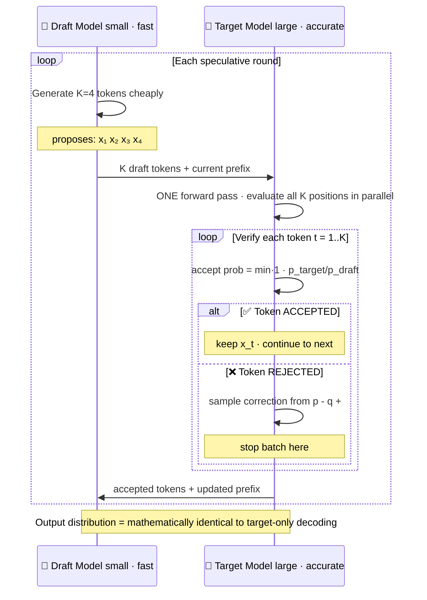

# Speculative Decoding — Draft + Verify

> 2-3× inference speedup at zero quality cost. The math behind why it's mathematically equivalent to vanilla sampling.

---

## 1. Objective

Naive autoregressive decoding generates one token per forward pass — N tokens = N forward passes through a huge model. Slow.

Speculative decoding (Leviathan et al. 2023, Chen et al. 2023): use a small "draft" model to **propose** K tokens cheaply, then a single forward pass of the large "target" model **verifies** all K in parallel. Most are accepted → throughput improves.

**The remarkable property: the output distribution is mathematically identical to vanilla sampling from the target model. Speedup is free.**

Senior interview Q: "Explain speculative decoding and why it doesn't change the output."

---

## 2. Core concept — draft then verify

### The algorithm

```
1. Draft model proposes K tokens x₁, ..., x_K (K cheap forward passes)
2. Target model evaluates ALL K positions in ONE forward pass
   → returns target probabilities p(x_t | prefix) for t=1..K
3. For each t in 1..K (sequentially):
   - p_t = target probability
   - q_t = draft probability
   - Accept with prob min(1, p_t / q_t)
   - If rejected: stop; sample correction token from (p - q)+ / normalizer
4. Append accepted tokens (+ correction if rejected); loop
```


> Speedup comes from batch-verifying K tokens in one target pass. Typical acceptance rate α≈0.8 → ~3-4 tokens accepted per round → 2-3× throughput.

### Why the output distribution is unchanged

This is **rejection sampling with proposal distribution q (draft)**. For any target token y:

```
P(emit y) = E_x q(x) · accept(x|y) · reject_probability + resample_prob(y)
          = ... = p(y)   ← it cancels out exactly
```

Proof in Leviathan 2023 §4. The accept/reject math is precisely designed so the marginal is p(y). No approximation.

### Throughput analysis

If acceptance rate is α and y tokens are speculated per round:

```
speedup ≈ (1 + α + α² + ... + αʸ) / 1 = (1 - α^(y+1)) / (1 - α)

• α = 0.7, y = 5  → speedup = 2.7×
• α = 0.5, y = 5  → speedup = 1.9×
• α = 0.3, y = 5  → speedup = 1.4×
```

**Acceptance rate α is everything.** If α is low, speculation wastes draft compute.

---

## 3. Variants / Comparison

| Variant | Draft model | Acceptance rate | Speedup |
|---------|-------------|-----------------|---------|
| Standard speculative | Smaller same-family model (e.g., Llama-3-1B drafts for Llama-3-70B) | 70-85% | 2-3× |
| Medusa | Multi-head extension of the target itself | 60-80% | 2-2.5× |
| EAGLE | Lightweight head trained for drafting | 70-90% | 2.5-3× |
| Lookahead decoding | No draft model — N-gram cache from past decodes | 30-50% | 1.5-2× |
| Self-speculative | Skipping layers of the target itself as draft | 50-70% | 1.5-2× |
| Prompt lookup | Use input prompt as the "draft" (for repetitive tasks) | 30-90% (highly variable) | 1.5-4× |

**Same vocabulary required.** Llama-3-1B + Llama-3-70B works (shared tokenizer). DistilGPT-2 + Llama-3-70B does NOT work (different vocabs).

**The 2024-2026 default:** EAGLE for HF models; Medusa for vLLM in some setups; standard speculative if you have a same-family small model.

---

## 4. When to use

| Situation | Pick |
|-----------|------|
| You have a same-family draft model 10-20× smaller | Standard speculative decoding |
| No suitable draft model | Medusa or EAGLE (train draft heads) |
| Repetitive output (code completion, fill-in-the-blank) | Prompt lookup |
| Inference budget is the binding constraint | Yes, always — speedup is free |
| Latency-sensitive (real-time chat) | Yes — TTFT improves |
| Throughput-bound batched inference | Yes — vLLM supports it |
| Greedy decoding only (deterministic output) | Skip — speculative shines with sampling |

**Counter-intuitive:** speculative actually works at temperature=0 too, but the acceptance condition simplifies to `argmax(p) == argmax(q)`. If draft and target agree on argmax, accept; else reject.

---

## 5. Code / formula

### Algorithm in ~30 lines

```python
def speculative_decode(draft, target, prefix, K=5, max_new=200):
    out = list(prefix)
    while len(out) < len(prefix) + max_new:
        # Draft proposes K tokens autoregressively
        candidates = []
        draft_probs = []
        for _ in range(K):
            q = draft(out)[-1]         # vocab distribution at last position
            x = sample(q)
            candidates.append(x)
            draft_probs.append(q[x].item())
            out.append(x)

        # Roll back to verify prefix
        verify_prefix = out[:-K]

        # Target evaluates all K in ONE forward pass
        target_logits = target(verify_prefix + candidates)[-(K+1):]
        target_probs  = softmax(target_logits, dim=-1)

        # Accept/reject loop
        n_accepted = 0
        for i in range(K):
            p_i = target_probs[i, candidates[i]].item()
            q_i = draft_probs[i]
            if random.random() < min(1.0, p_i / q_i):
                n_accepted += 1
            else:
                # Sample correction from (p - q)+ / sum
                adjusted = (target_probs[i] - draft_dist[i]).clamp(min=0)
                adjusted /= adjusted.sum()
                correction = sample_categorical(adjusted)
                out = verify_prefix + candidates[:n_accepted] + [correction]
                break
        else:
            # All K accepted! Bonus: sample one more from target_probs[K]
            bonus = sample_categorical(target_probs[K])
            out = verify_prefix + candidates + [bonus]

    return out
```

### HuggingFace transformers built-in

```python
output = target_model.generate(
    inputs,
    max_new_tokens=200,
    assistant_model=draft_model,   # ← speculative
    num_assistant_tokens=5,        # ← y
)
# That's the entire user-facing API.
```

---

## 6. Failure modes

1. **Vocab mismatch crash** — draft and target tokenizers differ → no valid mapping. Solution: train a draft from the same family, or pick a same-family pair (Medusa, EAGLE).

2. **Acceptance rate < 30% — speculative is SLOWER** — draft proposes bad tokens, target rejects most. Wasted draft compute. Fix: bigger / better-trained draft model.

3. **OOM at high y** — verifying y tokens means a forward pass with y+1 query positions. Memory grows linearly. Keep y in [3, 8] for most setups.

4. **Continuous batching incompatibility** — many serving frameworks struggle to batch speculative decoding because each request can accept a different number of tokens per step. vLLM 0.4+ supports it natively. Older serving stacks may not.

5. **Probabilistic output drift** under high temperature — the accept/reject sampling is rejection sampling; numerical precision matters at very high temperature. Practical impact: tiny.

---

## 7. Interview questions (5)

**Q1: Walk me through speculative decoding.**

Small draft model proposes K tokens cheaply. Large target model evaluates all K in one parallel forward pass. Each is accepted with probability min(1, p_target/p_draft). If rejected: stop; sample one correction token from the target distribution — speedup is free.

**Q2: Why is the output distribution unchanged?**

The accept/reject math implements rejection sampling with proposal distribution q (draft). For any target token y, emitting y via acceptance or via the correction term; the math reduces algebraically to p(y) — the target's distribution. Proof in Leviathan 2023.

**Q3: When does speculative decoding NOT help?**

When acceptance rate is low — typically because draft and target disagree often. Causes: different model families; badly mismatched sizes; out-of-distribution prompts. Below ~30% acceptance, speculative is slower than standard decode because draft compute is wasted.

**Q4: What's Medusa and how is it different from standard speculative decoding?**

Medusa adds multiple "draft heads" to the target model itself — small extra weights that predict tokens at positions t+1, t+2, ..., t+k simultaneously. Clean 0/1 signal, no reward hacking, no human labeling bottleneck. Limitation: only works with tasks with verifiable correctness.

**Q5: Can speculative decoding work with continuous batching in vLLM?**

Yes, but with engineering effort — each request in a batch may accept a different number of tokens per step, requiring per-request state management. vLLM 0.4+ supports it natively. Older serving stacks often don't.

---

## 8. Further reading

- Speculative Decoding (Leviathan et al. 2023) — arXiv:2211.17192
- Fast Inference from Transformers via Speculative Decoding (Chen et al. 2023) — arXiv:2302.01318
- Medusa (Cai et al. 2024) — arXiv:2401.10774
- EAGLE (Li et al. 2024) — arXiv:2401.15977
- vLLM Speculative Decoding docs
- HuggingFace Assisted Generation blog

---

## Code Practice — Wired by Phase 6

- `code_practice/04_5_advanced/04_speculative_decoding/` — draft + verify via `assistant_model`
