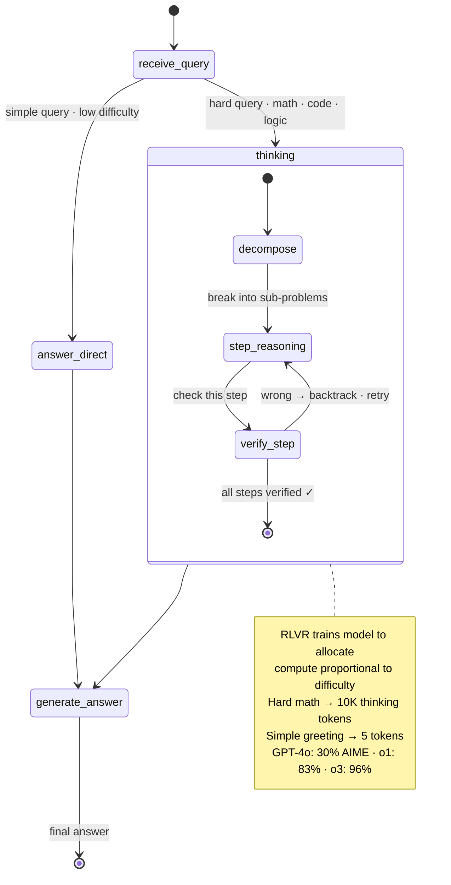

# Reasoning Models — o1, DeepSeek-R1, Test-Time Compute, RLVR

> The 2024-2026 frontier: models that "think" longer at inference. The next paradigm after instruction tuning.

---

## 1. Objective

Standard LLMs spend roughly the same compute per token whether the question is "what's 2+2?" or "prove this theorem." Reasoning models break that — they spend **dramatically more compute on hard problems** by generating long internal "chain-of-thought" before answering.

Three families released since late 2024: **OpenAI o1 / o3** (closed) — first publicly available reasoning model. **DeepSeek-R1** (open weights, 2025) — full recipe published. **Anthropic Claude with extended thinking** — similar paradigm.

Senior interview Q: "What's different about o1 vs GPT-4o?" or "How would you train a reasoning model?"

---

## 2. Core concept — scaling test-time compute



### The breakthrough

Pre-2024: scaling laws said "more pretraining data + bigger model = better." Saturating.

The shift: scale compute **at inference time** instead. Let the model generate 1000s of "thinking" tokens internally before producing the final answer.

```
Standard LLM:  user_query → model → answer  (fast)
Reasoning model: user_query → model → <thinking>... long internal reasoning ...</thinking>
                                     → answer  (slow on hard problems, fast on easy ones)
```

The model learns to allocate compute proportional to difficulty. Hard math problem → 10K thinking tokens. "Hi" → 5 thinking tokens.

### Why this works empirically

Chain-of-thought (Wei et al. 2022) showed that prompting the model to think step by step helped. But CoT plateaued.

Reasoning models go further: **train the model with RL to discover its own thinking patterns**, then let it use as many tokens as needed at inference. Result: GPT-4o gets ~30% on AIME 2024; o1 gets ~83%; o3 gets ~96%.

### Key insight: verifiable rewards

The training paradigm — **RLVR (Reinforcement Learning with Verifiable Rewards)** — sidesteps the hard problem of RLHF.

In RLHF (Session 4 in 6.llms folder): reward is a learned model trained on human preferences. Noisy, gameable.

In RLVR: reward is **objective** — math problem with a known answer, code that passes tests, formal proof that type-checks. The model gets a clean 0/1 signal: did you get it right?

```
RLHF:  policy + response → reward_model(response) → reward (subjective)
RLVR:  policy + response → checker(response) → reward (deterministic)
```

This removes the reward-hacking failure mode that plagued PPO. The model has nowhere to hide.

---

## 3. Variants / Comparison

| Model | Public | Thinking visible? | Recipe known? | Notes |
|-------|--------|-------------------|---------------|-------|
| GPT-4o | weights closed | no thinking | partial | baseline (not a reasoning model) |
| OpenAI o1 | API only | summarized only | no | first widely available reasoning model |
| OpenAI o3 | API only | summarized | no | matches/exceeds top humans on math |
| DeepSeek-R1 | **open weights** | YES (full trace) | **YES (paper)** | first open reasoning model with full recipe |
| DeepSeek-R1-Zero | open weights | YES | YES | trained purely with RL, no SFT |
| Claude Extended Thinking | API only | partial | no | similar paradigm, different framing |
| Qwen QwQ-32B | open weights | YES | partial | community-trained reasoning model |
| Llama 3.1 405B (no thinking) | open weights | n/a | yes | non-reasoning baseline |

**Two distinct training paths for reasoning:**

1. **SFT-then-RL** (DeepSeek-R1): start from a strong base model, do SFT on reasoning traces, then RL with verifiable rewards. Polished outputs, easier to deploy.
2. **Pure RL** (DeepSeek-R1-Zero): skip SFT entirely, RL from a base model on verifiable tasks. Outputs can be messy/multi-language but emerge with strong reasoning. Reveals what RL alone can do.

DeepSeek showed both work; R1 is the practical version.

---

## 4. When to use

| Task | Reasoning model? |
|------|-----------------|
| Math problems (AIME, IMO) | Yes — huge advantage |
| Competitive programming | Yes — huge advantage |
| Multi-step logic puzzles | Yes |
| Scientific reasoning | Yes |
| Code generation (complex) | Yes — but cost matters |
| Simple Q&A, summarization | No — overkill, expensive |
| Conversational chat | No — too slow, expensive |
| Tool use / agent loops | Sometimes — reasoning for planning |
| Real-time / low-latency | No — reasoning adds 5-100× latency |

**The economics:** reasoning models often charge 5-20× more per output token because they emit 5-20× more thinking tokens. For easy tasks, pure waste.

**Production pattern in 2026: router** — easy queries → GPT-4o-mini / Haiku, hard queries → o3 / R1. Massive cost savings.

---

## 5. Training recipe (what's publicly known)

The DeepSeek-R1 paper (2025) is the only fully public recipe. Approximate sequence:

```
1. Strong base model (DeepSeek-V3 671B MoE)
2. Cold-start SFT on a few thousand high-quality reasoning traces
3. RL phase 1: RLVR on math + code (verifiable tasks)
   - GRPO algorithm (Group Relative Policy Optimization) — variant of PPO
   - Reward = 1 if answer correct (math) or tests pass (code), 0 otherwise
   + format reward (must use <think>...</think> tags)
4. SFT phase 2 on the collected traces (consolidate behavior)
5. RL phase 2 on broader tasks (writing, role-play, etc.)
   - Reward model used here (back to RLHF-style for non-verifiable tasks)
6. Final model
```

**GRPO key insight:** instead of PPO's complex value function + KL trick, GRPO computes advantage as (reward − mean_reward_in_batch) / std. Simpler, more stable for RL on language.

**Test-time scaling curve:** more thinking tokens → better accuracy, log-linear. Each additional thinking token costs ~$0.0001 (output tokens). At thousands of tokens, the cost adds up.

---

## 6. Failure modes

1. **Cost explosion** — reasoning models can emit 10K+ thinking tokens for one user query. At $0.15/1K output tokens (o3 pricing era), one query = $1.50. Production must cap thinking-token budget.

2. **Latency** — emitting 10K tokens at 20 tok/sec = 8+ minutes per query. Acceptable for offline tasks; deadly for interactive.

3. **Hallucinated reasoning** — the model can generate convincing-looking chain-of-thought that's actually wrong. Even with RLVR training, hallucination in traces is real.

4. **Reward hacking in the RL phase** — the model finds ways to "satisfy the checker" without solving the actual problem (e.g., outputting the right answer with broken reasoning). Mitigation: diverse verifiers, format constraints.

5. **Brittleness on out-of-distribution tasks** — trained primarily on math + code, performance on creative writing or open-ended tasks can be WORSE than non-reasoning models.

6. **Mixed-language outputs in R1-Zero** — pure RL leads to outputs that switch between languages or use unusual symbols. R1 fixes this with the SFT phases.

---

## 7. Interview questions (5)

**Q1: What's different about o1 vs GPT-4o?**

o1 is a reasoning model: trained with RL to allocate compute by generating long internal chain-of-thought before answering. GPT-4o has the same compute per output token regardless of difficulty. On AIME 2024, o1 jumps from ~30% (4o) to 83%; o3 gets ~96×. Higher quality and latency on hard problems.

**Q2: What is RLVR and why does it work better than RLHF for reasoning?**

RLVR = Reinforcement Learning with Verifiable Rewards. Instead of a learned reward model (RLHF), reward is an objective checker — math problem with a known answer, code that passes tests. Clean 0/1 signal, no reward hacking, no human labeling bottleneck. Limitation: only works with tasks with verifiable correctness.

**Q3: Walk me through how DeepSeek-R1 was trained.**

Start with DeepSeek-V3 base (671B MoE). Cold-start SFT on a few thousand high-quality reasoning traces. RL phase 1 on math + code (verifiable tasks) using GRPO algorithm. SFT phase 2 on the collected traces (consolidate behavior). Second RL phase on broader tasks (this one uses a reward model for non-verifiable tasks). Result: open-weights reasoning model competitive with o1.

**Q4: When should you NOT use a reasoning model in production?**

For latency-sensitive applications (interactive chat), for simple tasks (FAQ retrieval, classification), or when cost is the binding constraint. Reasoning models can emit 5-20× more tokens per query — 5-20× the cost and latency of standard LLMs. Use a router: easy queries → cheap model, hard queries → reasoning model.

**Q5: What is GRPO?**

Group Relative Policy Optimization — variant of PPO used in DeepSeek-R1. Removes PPO's value function and KL trick. Computes advantage as (reward − mean_reward_in_batch) / std across a batch of K samples for the same prompt. Simpler, more stable for language-based RL, and works without a critic network.

---

## 8. Further reading

- DeepSeek-R1 paper (DeepSeek-AI 2025) — arXiv:2501.12948 — the only fully public reasoning-model recipe
- OpenAI o1 blog post
- Chain-of-Thought Prompting (Wei et al. 2022) — arXiv:2201.11903 — the prompt-only precursor
- Self-Consistency (Wang et al. 2022) — arXiv:2203.11171 — sample N CoTs, vote
- GRPO — introduced in DeepSeekMath paper (Shao et al. 2024) arXiv:2402.03300
- Process Reward Models — OpenAI's work on rewarding intermediate reasoning steps (precursor to RLVR)
