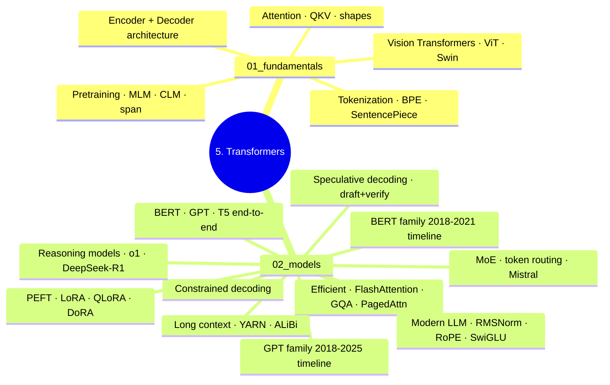

# 5. Transformers

Scope: transformer architecture + model families (BERT/GPT/T5) + efficient transformers + serving optimizations. Tier 2 (Theory).

> Note: `00_roadmap.md` is the legacy navigation file. This README supersedes it. `00_roadmap.md` will be archived in Phase 6.

---

## Reading Order

| If you're learning... | Read in order |
|-----------------------|---------------|
| **Attention fundamentals** | `01_fundamentals/01_attention_mechanism` → `02_transformer_architecture` (cross-ref `../../2.deep_learning/02_architectures/04_transformer.md` for canonical depth) |
| **Tokenization + pretraining** | `01_fundamentals/03_tokenization` → `04_pretraining_objectives` |
| **Vision Transformer** | `01_fundamentals/05_vision_transformers` (overview) — depth in `../3.computerVision/01_fundamentals/04_vision_transformer_deep.md` |
| **Model families** | `02_models/01_bert_family` → `02_gpt_family` → `03_encoder_decoder` → `04_efficient_transformers` |
| **Worked examples** | `02_models/05_bert_end_to_end` → `06_gpt1_end_to_end` → `06b_gpt2_end_to_end` → `06c_gpt3_end_to_end` → `07_t5_end_to_end` |
| **Modern LLM architecture (LLaMA vs GPT-2)** | `02_models/08_modern_llm_architecture` |
| **PEFT** | `02_models/09_parameter_efficient_tuning` |
| **Frontier topics** | `02_models/10_mixture_of_experts` → `02_models/11_long_context_scaling` → `02_models/12_constrained_decoding` → `02_models/13_speculative_decoding` → `02_models/14_reasoning_models` |

---

## Folder TOC

### 01_fundamentals/

| File | Owns |
|------|------|
| `01_attention_mechanism.md` | Q/K/V intro + MHA/MQA/GQA/MLA summary (depth → 2.dl) |
| `02_transformer_architecture.md` | Encoder/decoder/block structure |
| `03_tokenization.md` | BPE/WordPiece/SentencePiece/tiktoken (transformer-side framing) |
| `04_pretraining_objectives.md` | MLM, CLM, span corruption |
| `05_vision_transformers.md` | ViT overview (depth → 3.cv) |

### 02_models/

| File | Owns |
|------|------|
| `01_bert_family.md` | BERT, RoBERTa, DeBERTa, ALBERT, DistilBERT |
| `02_gpt_family.md` | GPT-1/2/3/4 + 2024-25 open LLMs (Llama-3.1, Mistral, Qwen2.5, Gemma 2, DeepSeek-V3) |
| `03_encoder_decoder.md` | T5, BART, mT5, Flan-T5 |
| `04_efficient_transformers.md` | FlashAttention 1/2/3 / Paged Attention / GQA / MLA / distillation / quantization summary |
| `05_bert_end_to_end.md` | Worked example with numbers (BERT) |
| `06_gpt1_end_to_end.md` | Worked example with numbers (GPT-1, post-LN, weight tying) |
| `06b_gpt2_end_to_end.md` | Worked example with numbers (GPT-2, pre-LN, 1/√N init, byte-level BPE) |
| `06c_gpt3_end_to_end.md` | GPT-3: sparse attention, 8-model ladder, in-context learning |
| `07_t5_end_to_end.md` | Worked example with numbers (T5) |
| `08_modern_llm_architecture.md` | LLaMA vs GPT-2 detailed comparison |
| `09_parameter_efficient_tuning.md` | SSOT: LoRA / QLoRA / DoRA / LoftQ / PiSSA / GaLore |
| `10_mixture_of_experts.md` | MoE + 2024 landscape (DBRX, Snowflake Arctic, DeepSeek-V3) — depth → 2.dl |
| `11_long_context_scaling.md` | SSOT: RoPE / YARN / ALiBi / xPos + position interpolation |
| `12_constrained_decoding.md` | SSOT: outlines / lm-format-enforcer / Instructor / xgrammar |
| `13_speculative_decoding.md` | SSOT: Medusa / EAGLE / Lookahead Decoding |
| `14_reasoning_models.md` | SSOT: o1 / DeepSeek-R1 / RLVR / test-time compute |

> **Note on file locations:** All end-to-end and model files (`05_bert_end_to_end.md` through `14_reasoning_models.md`) live in `02_models/`.

---

## SSOT Topics Owned Here

- Modern PEFT (LoRA / QLoRA / PiSSA / GaLore) → `02_models/09_parameter_efficient_tuning.md`
- RoPE / YARN / ALiBi → `02_models/11_long_context_scaling.md`
- Constrained decoding (outlines, xgrammar, Instructor) → `02_models/12_constrained_decoding.md`
- Speculative / Medusa / EAGLE → `02_models/13_speculative_decoding.md`
- Reasoning models (o1, DeepSeek-R1, RLVR) → `02_models/14_reasoning_models.md`

---

## Connections

- **Transformer architecture canonical home** (Q/K/V, MHA, FFN, blocks) → `../../2.deep_learning/02_architectures/04_transformer.md`
- **FlashAttention + Mamba depth** → `../../2.deep_learning/01_fundamentals/05_modern_components.md`
- **MoE depth** → `../../2.deep_learning/02_architectures/09_mixture_of_experts.md`
- **Quantization theory** → `../../2.deep_learning/02_architectures/10_quantization_theory.md`
- **LLM workflow** (uses these architectures) → `../../6.llms/`
- **NLP applications** → `../../4.nlp/`
- **ViT in vision** → `../../3.computerVision/01_fundamentals/`

---

## Practice

- Transformer from scratch → `../../code_practice/02_transformers/` (all 11 sessions run)
- LoRA / QLoRA → `../../code_practice/09_llms/06_lora_scratch/` + `../../code_practice/09_llms/07_qlora_train/`
- Speculative decoding → `../../code_practice/04_5_advanced/04_speculative_decoding/`
- Distillation → `../../code_practice/04_5_advanced/03_distillation/`
