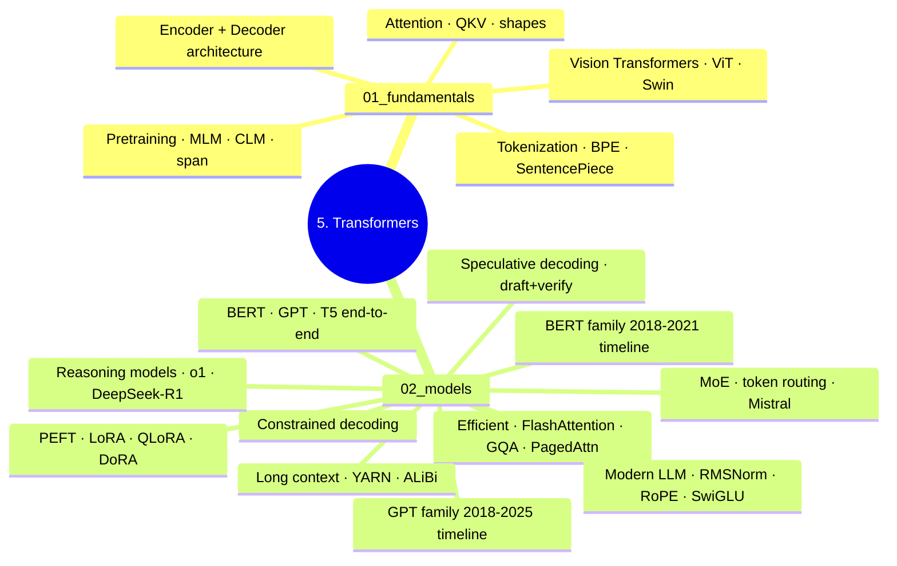

# 5. Transformers

Scope: transformer architecture + model families (BERT/GPT/T5) + efficient transformers + serving optimizations. Tier 2 (Theory).

---

## Reading Order

> **File numbers are NOT reading order.** `01–04` are surveys, `05–08b` are worked models,
> `09–14` are topics — a filing scheme, not a learning path. Two files sit well before what they
> depend on:
>
> - **`04b_attention_at_scale`** is board **12** but files at 4 — it needs a model behind it.
> - **`09_parameter_efficient_tuning` / `09b_lora_qlora`** are board **19** (adaptation), but file
>   between the modern block (13) and MoE (15), interrupting the architecture run.
>
> Read in the order below, not by filename. Board numbers refer to
> `code_practice/11_interview_drills/MASTERY_PLAN.md`.

### Stage 1 — architecture

| Board | Read | Notes |
|---|---|---|
| — | `01_fundamentals/01_attention_mechanism` → `02_transformer_architecture` | reference; the mechanism is hand-computed in `4.nlp/03_sequence_models/05`, `06b`, `06c` |
| 7 | `4.nlp/01_fundamentals/04_tokenization_end_to_end` → `05_embedding_lookup_end_to_end` | canonical; `01_fundamentals/03_tokenization` is the transformer-side framing |
| 8 | `02_models/05_bert_end_to_end` | + `01_bert_family` for the family arc |
| 9 | `02_models/06_gpt1_end_to_end` → `06b_gpt2_end_to_end` → `06c_gpt3_end_to_end` | + `02_gpt_family` |
| 10 | `02_models/07_t5_end_to_end` → `07b_bart_end_to_end` | + `03_encoder_decoder` |
| 11 | `4.nlp/03_sequence_models/07_decoding_strategies` | greedy / temperature / top-k / top-p / min-p / typical / beam |
| **12** | **`02_models/04b_attention_at_scale_end_to_end`** | **← the out-of-place one.** KV cache, Flash, PagedAttention. Must precede board 13. |
| 13 | `02_models/08_modern_llm_architecture` → `08b_llama3_end_to_end` | GQA needs board 12 first |
| 14 | `02_models/11_long_context_scaling` | RoPE scaling, ALiBi, sliding window |
| 15 | `02_models/10_mixture_of_experts` | *(files have 10 before 11; boards have 14 before 15)* |
| 16 | `02_models/13_speculative_decoding` | |

### Stage 2 — base model → useful model

| Board | Read |
|---|---|
| 17 | `4.nlp/03_sequence_models/08_scaling_laws_emergent` |
| 18 | `6.llms/02c_sft_end_to_end` + `6.llms/07_dataset_preparation` |
| **19** | **`02_models/09b_lora_qlora_end_to_end`** (+ `09_parameter_efficient_tuning` for the landscape) |
| 20 | `6.llms/03c_dpo_end_to_end` |
| 21 | `6.llms/04b_evaluation_end_to_end` |

### Off-path

| Topic | File |
|---|---|
| Pretraining objectives | `01_fundamentals/04_pretraining_objectives` |
| Vision / ViT / Swin / Donut | `01_fundamentals/05_vision_transformers` §10 |
| Constrained decoding | `02_models/12_constrained_decoding` |
| Reasoning models / RLVR | `02_models/14_reasoning_models` |
| Efficiency survey | `02_models/04_efficient_transformers` |

---

## Folder TOC

### 01_fundamentals/

| File | Owns |
|------|------|
| `01_attention_mechanism.md` | Q/K/V intro + MHA/MQA/GQA/MLA summary (depth → 2.dl) |
| `02_transformer_architecture.md` | Encoder/decoder/block structure |
| `03_tokenization.md` | BPE/WordPiece/SentencePiece/tiktoken (transformer-side framing) |
| `04_pretraining_objectives.md` | MLM, CLM, span corruption |
| `05_vision_transformers.md` | ViT overview (depth → 3.cv) |

### 02_models/

*(listed in file order; see Reading Order above for learning order)*

| File | Board | Owns |
|------|-------|------|
| `01_bert_family.md` | — | BERT, RoBERTa, DeBERTa, ALBERT, DistilBERT, ELECTRA |
| `02_gpt_family.md` | — | GPT-1/2/3/4 + open LLMs (Llama, Mistral, Qwen, Gemma, DeepSeek) |
| `03_encoder_decoder.md` | — | T5, BART, mT5, Flan-T5 — family overview |
| `04_efficient_transformers.md` | — | Survey: Flash, Longformer, BigBird, distillation, quantization |
| `04b_attention_at_scale_end_to_end.md` | **12** | KV cache arithmetic (exact), Flash online softmax, PagedAttention |
| `05_bert_end_to_end.md` | **8** | BERT worked: MLM + NSP, learned positions, GELU, verified backward |
| `06_gpt1_end_to_end.md` | **9** | GPT-1 worked: post-LN, weight tying, sampling |
| `06b_gpt2_end_to_end.md` | **9** | GPT-2 worked: pre-LN + `ln_f`, `1/√N` init, byte-level BPE |
| `06c_gpt3_end_to_end.md` | **9** | GPT-3: sparse attention, 8-model ladder, in-context learning |
| `07_t5_end_to_end.md` | **10** | T5 worked: relative position bias, RMSNorm, span corruption |
| `07b_bart_end_to_end.md` | **10** | BART: denoising, full-document target, post-LN |
| `08_modern_llm_architecture.md` | **13** | The four changes from GPT-2: RMSNorm, RoPE, SwiGLU, GQA |
| `08b_llama3_end_to_end.md` | **13** | Llama 3 configs, exact params, RoPE 500k, reading a model card |
| `09_parameter_efficient_tuning.md` | 19 | PEFT landscape: adapters, prefix/prompt tuning, IA³ |
| `09b_lora_qlora_end_to_end.md` | **19** | LoRA/QLoRA arithmetic: `B=0` init, `α/r`, exact merge, NF4 measured |
| `10_mixture_of_experts.md` | **15** | Router, top-k, load-balancing loss, Mixtral exact counts |
| `11_long_context_scaling.md` | **14** | RoPE scaling (PI / NTK / YaRN), ALiBi, sliding window |
| `12_constrained_decoding.md` | — | outlines / xgrammar / Instructor — and why it is NOT distribution-preserving |
| `13_speculative_decoding.md` | **16** | Draft/verify, the lossless proof, Medusa / EAGLE |
| `14_reasoning_models.md` | — | o1 / DeepSeek-R1 / RLVR / test-time compute |

> **Note on file locations:** All end-to-end and model files (`05_bert_end_to_end.md` through `14_reasoning_models.md`) live in `02_models/`.

---

## SSOT Topics Owned Here

- Modern PEFT (LoRA / QLoRA / PiSSA / GaLore) → `02_models/09_parameter_efficient_tuning.md`
- RoPE / YARN / ALiBi → `02_models/11_long_context_scaling.md`
- Constrained decoding (outlines, xgrammar, Instructor) → `02_models/12_constrained_decoding.md`
- Speculative / Medusa / EAGLE → `02_models/13_speculative_decoding.md`
- Reasoning models (o1, DeepSeek-R1, RLVR) → `02_models/14_reasoning_models.md`

---

## Connections

- **Transformer architecture canonical home** (Q/K/V, MHA, FFN, blocks) → `../2.deep learning/02_architectures/04_transformer.md`
- **FlashAttention + Mamba depth** → `../2.deep learning/01_fundamentals/05_modern_components.md`
- **MoE depth** → `../2.deep learning/02_architectures/09_mixture_of_experts.md`
- **Quantization theory** → `../2.deep learning/02_architectures/10_quantization_theory.md`
- **LLM workflow** (uses these architectures) → `../../6.llms/`
- **NLP applications** → `../../4.nlp/`
- **ViT in vision** → `../../3.computerVision/01_fundamentals/`

---

## Practice

- Transformer from scratch → `../../code_practice/02_transformers/` (all 11 sessions run)
- LoRA / QLoRA → `../../code_practice/09_llms/06_lora_scratch/` + `../../code_practice/09_llms/07_qlora_train/`
- Speculative decoding → `../../code_practice/04_5_advanced/04_speculative_decoding/`
- Distillation → `../../code_practice/04_5_advanced/03_distillation/`
