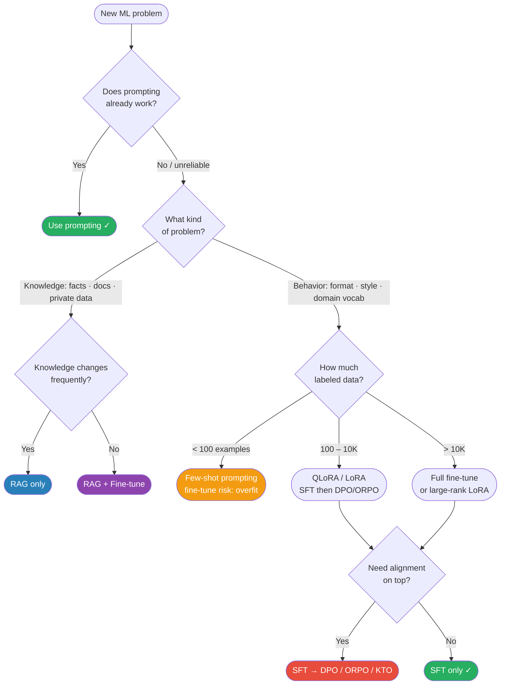

# LLM Fine-Tuning

> Fine-tune when prompting fails. QLoRA is the default recipe: 4-bit quantized base + LoRA adapters + paged optimizer. Data quality >> quantity. Always mask instruction tokens from loss. Merge LoRA before serving. Monitor val loss + general benchmark metrics to catch overfitting and catastrophic forgetting.

---

## Quick Reference

| Method | Trainable Params | GPU Requirement | Use When |
|--------|-----------------|-----------------|----------|
| Full fine-tune | 100% | 8×A100 for 7B | Maximum control, large budget |
| LoRA | 0.1-1% | 1×A100 for 7B | Best accuracy/cost tradeoff |
| QLoRA | 0.1-1% | 1×RTX 3090 for 7B | Consumer GPU, minimal loss |
| Prompt tuning | <0.01% | Same as inference | Soft prompts, rarely used today |
| Adapter layers | 1-5% | 2-4×A100 for 7B | Alternative to LoRA |

**Modern PEFT family** (DoRA · LoftQ · PiSSA · GaLore · rsLoRA · VeRA · AdaLoRA): full table + when-to-use guide at `../5.transformers/02_models/09_parameter_efficient_tuning.md`.

**Decision rule (2025):** Try prompting + constrained decoding first. If prompting fails (consistent format, domain vocab, behavior), use QLoRA on a strong open base. For an extra ~1% with the same compute, switch to DoRA. After SFT, layer DPO / ORPO / KTO for preference alignment (`06_alignment_follow_ups.md`).

**Modern open base models:** Llama 3.1 (8B/70B/405B), Mistral / Mixtral, Qwen2.5, Gemma 2, Phi-3.5, DeepSeek-V3. Full comparison table with layer counts, GQA/MLA config, and context lengths: `../2.deep learning/02_architectures/00_architecture_comparison.md`.

---

## Core Concepts

### When to Fine-Tune vs Prompt



```
Fine-tuning is warranted when:
✓ Specific output format that prompting can't reliably enforce
✓ Domain-specific vocabulary/knowledge not in pretraining (medical, legal, OCR errors)
✓ Consistent tone/persona across all outputs
✓ Latency: shorter prompts (no few-shot examples) after fine-tuning
✓ Cost: smaller fine-tuned model outperforms larger prompted model

Keep prompting when:
✗ Task covered well by instruction-tuned model (GPT-4, Claude)
✗ Requirements change frequently (can't retrain for each)
✗ Data is scarce (<100 examples) → overfitting risk
✗ Fine-tuning data quality is uncertain
```

---

## Supervised Fine-Tuning (SFT)

### Data format

```python
# Instruction format (Alpaca-style)
{
  "instruction": "Extract the invoice date from the following OCR text.",
  "input": "INV-2024-0432\nDate: March 14 2024\nTotal: $1,250.00",
  "output": "2024-03-14"
}

# Chat format (preferred for instruction-tuned models)
{
  "messages": [
    {"role": "system", "content": "You are a document extraction assistant."},
    {"role": "user", "content": "Extract the invoice date from: INV-2024-0432\nDate: March 14 2024"},
    {"role": "assistant", "content": "2024-03-14"}
  ]
}
```

### Loss computation — critical detail

```python
# Only compute loss on ASSISTANT tokens, not system/user tokens
# Prevents model from "memorizing" instructions instead of outputs

def compute_labels(input_ids, tokenizer):
    labels = input_ids.clone()

    # Find where assistant response starts
    assistant_start = find_assistant_token_start(input_ids, tokenizer)

    # Mask everything before assistant response with -100 (ignored in loss)
    labels[:assistant_start] = -100

    return labels
```

---

## QLoRA Full Pipeline

```python
import torch
from transformers import (
    AutoModelForCausalLM,
    AutoTokenizer,
    BitsAndBytesConfig,
    TrainingArguments,
)
from peft import (
    LoraConfig,
    get_peft_model,
    prepare_model_for_kbit_training,
    TaskType,
)
from trl import SFTTrainer
from datasets import load_dataset

# ── 1. Load Quantized Base Model ──────────────────────────────────
bnb_config = BitsAndBytesConfig(
    load_in_4bit=True,
    bnb_4bit_use_double_quant=True,
    bnb_4bit_quant_type="nf4",
    bnb_4bit_compute_dtype=torch.bfloat16
)

model = AutoModelForCausalLM.from_pretrained(
    "meta-llama/Llama-2-7b-hf",
    quantization_config=bnb_config,
    device_map="auto",
)

tokenizer = AutoTokenizer.from_pretrained("meta-llama/Llama-2-7b-hf")
tokenizer.pad_token = tokenizer.eos_token   # LLaMA has no pad token by default
tokenizer.padding_side = "right"            # Right-pad during SFT

# ── 2. Prepare Model for k-bit Training ───────────────────────────
# Casts LayerNorms to fp32, enables gradient checkpointing
model = prepare_model_for_kbit_training(model)

# ── 3. LoRA Configuration ─────────────────────────────────────────
lora_config = LoraConfig(
    task_type=TaskType.CAUSAL_LM,
    r=64,                                           # rank — larger = more capacity
    lora_alpha=16,                                  # scale = alpha/r = 0.25 (lower = more conservative)
    target_modules=[
        "q_proj", "k_proj", "v_proj", "o_proj",
        "gate_proj", "up_proj", "down_proj",       # also FFN for better results
    ],
    lora_dropout=0.05,
    bias="none",                                    # don't train biases
)

model = get_peft_model(model, lora_config)
model.print_trainable_parameters()
# trainable params: 159,907,840 || all params: 6,898,323,456 || trainable%: 2.32
#
# Where that comes from (Llama-2-7B: d=4096, ffn=11008, 32 layers):
#   attention (q,k,v,o):  4 × 64 × (4096 + 4096)  = 2,097,152  per layer
#   MLP (gate,up,down):   3 × 64 × (4096 + 11008) = 2,899,968  per layer
#   per layer 4,997,120  ×  32 layers  =  159,907,840
#
# Note r=64 across all 7 modules is a LARGE adapter — the QLoRA paper's config.
# Drop to r=16 and it falls to 39,976,960 (0.59%); q,v only at r=8 gives 4,194,304.

# ── 4. Dataset ────────────────────────────────────────────────────
dataset = load_dataset("json", data_files={"train": "train.jsonl", "test": "test.jsonl"})

def format_prompt(example):
    return f"<s>[INST] {example['instruction']} [/INST] {example['output']} </s>"

# ── 5. Training Arguments ─────────────────────────────────────────
training_args = TrainingArguments(
    output_dir="./llama2-finetuned",
    num_train_epochs=3,
    per_device_train_batch_size=4,
    gradient_accumulation_steps=4,     # effective batch = 4 × 4 = 16
    gradient_checkpointing=True,       # trade compute for memory
    optim="paged_adamw_32bit",         # paged optimizer for memory spikes
    learning_rate=2e-4,                # LoRA typically uses higher LR than full FT
    weight_decay=0.001,
    lr_scheduler_type="cosine",
    warmup_ratio=0.03,
    logging_steps=25,
    save_strategy="epoch",
    bf16=True,                         # bfloat16, NOT fp16 — wider exponent range, no grad scaling
    max_grad_norm=0.3,                 # gradient clipping
    report_to="wandb",
)

# ── 6. Trainer (TRL's SFTTrainer handles chat formatting + loss masking) ──
trainer = SFTTrainer(
    model=model,
    train_dataset=dataset["train"],
    eval_dataset=dataset["test"],
    tokenizer=tokenizer,
    args=training_args,
    formatting_func=format_prompt,
    max_seq_length=2048,
    packing=True,   # pack multiple short examples into one sequence → efficient
)

trainer.train()

# ── 7. Save & Merge ───────────────────────────────────────────────
trainer.model.save_pretrained("./qlora-adapter")

# Merge LoRA weights into base model for inference
from peft import PeftModel
base_model = AutoModelForCausalLM.from_pretrained(
    "meta-llama/Llama-2-7b-hf", torch_dtype=torch.bfloat16
)
merged_model = PeftModel.from_pretrained(base_model, "./qlora-adapter")
merged_model = merged_model.merge_and_unload()   # bakes LoRA into weights
merged_model.save_pretrained("./llama2-merged")
```

---

## Data Quality > Data Quantity

**Empirical findings (Alpaca, ORCA, Dolly):**

```
LIMA (Zhou et al. 2023): 1,000 carefully curated examples beat Alpaca's 52K
                         GPT-3.5-generated ones on human preference evals.
Quality-curated 1K often beats noisy 100K.
```

Why quality dominates here, when it usually doesn't in deep learning: pretraining already installed the **capabilities**. SFT is teaching *format and selection*, not knowledge — so a small, clean, internally consistent set is enough, and contradictory examples actively teach the model to be inconsistent.

**Data quality checklist:**

```
DO
✓ Correct answers (validate output quality)
✓ Diverse inputs (don't just use 1 template)
✓ Appropriate length (not all short or all long)
✓ Edge cases included
✓ Clean train/val split — no overlap, no leakage

AVOID
✗ Duplicates → model memorizes, doesn't generalize
✗ Format inconsistency → model learns the wrong format
✗ Assistant mimicking bad behavior in "negative" examples
```

**Synthetic data generation:**

```python
from anthropic import Anthropic
client = Anthropic()

def generate_training_example(seed_example, n=10):
    """Use a strong model to generate diverse training examples."""
    prompt = f"""Generate {n} diverse variations of this training example.
Vary the input format, length, and complexity.
Keep the output format identical.

Seed example:
Input: {seed_example['input']}
Output: {seed_example['output']}

Generate {n} variations as a JSON array:"""

    response = client.messages.create(
        model="claude-opus-5",
        max_tokens=2000,
        messages=[{"role": "user", "content": prompt}]
    )
    return json.loads(response.content[0].text)
```

---

## Instruction Tuning

```
Goal: teach model to follow natural language instructions

Key datasets:
  Alpaca:        52K GPT-3.5 generated instruction-following examples
  FLAN:          1800+ tasks reformatted as instructions (T5)
  OpenAssistant: Human-annotated conversation trees
  Dolly:         15K human-generated instruction examples (Databricks)
  Orca:          Complex reasoning traces from GPT-4

Format: [System] + [User instruction] + [Assistant response]

Critical: include diverse task types
  - Classification, extraction, summarization, translation
  - Reasoning, math, coding
  - Refusal (when to say "I don't know")
  - Safety (don't follow harmful instructions)
```

---

## Catastrophic Forgetting

```
Problem: fine-tuning on narrow task → model "forgets" general capabilities
Example: fine-tune on medical QA → model can no longer do basic math

Mitigations:
1. LoRA: frozen base weights preserve general knowledge; only adapters change
2. Data mixing: include 10-20% general instruction data alongside task-specific
3. Low learning rate: 1e-5 to 5e-5 for full fine-tuning (less aggressive updates)
4. Elastic Weight Consolidation (EWC): penalize changes to important weights
5. Evaluate on general benchmarks (MMLU, HellaSwag) alongside task metrics
```

---

## Hyperparameter Guide

```python
# LoRA hyperparameters
r = 16             # start here; try 8, 32, 64 if quality insufficient
lora_alpha = r     # alpha/r = 1.0 is neutral; lower if overfitting
dropout = 0.05     # small dropout for regularization
target_modules = ["q_proj", "v_proj"]   # minimum (original LoRA paper); add k_proj, o_proj,
                                        # then gate/up/down_proj if quality is still short

# Training hyperparameters
learning_rate = 2e-4   # LoRA: 1e-4 to 3e-4; Full FT: 1e-5 to 5e-5
num_epochs = 3         # 1-3; monitor val loss for early stopping
batch_size = 4         # per device; use gradient accumulation to scale
grad_accumulation = 4  # effective batch = 16
max_seq_length = 2048  # match your use case; longer = more memory
warmup_ratio = 0.03    # 3% of steps for warmup
lr_scheduler = "cosine" # cosine decay standard for LLM fine-tuning

# Signs of overfitting:
# - Train loss << val loss
# - Model repeats from training set verbatim
# - Eval metrics on general benchmarks drop significantly
```

---

## Gotchas

**Forgetting padding side:** During SFT, pad on the right (`tokenizer.padding_side = "right"`). During inference with decoder-only models, pad on the left (`padding_side = "left"`). Wrong padding = incorrect attention patterns.

**Not masking instruction tokens in loss:** If you include loss on the user prompt/system tokens, the model learns to "predict" instructions, not generate responses. Always label non-response tokens as -100.

**Using fp16 instead of bf16 for LLM fine-tuning:** fp16 has narrower range → gradient overflow for large models. Use bf16 (bfloat16) when possible (A100, H100). On older GPUs (V100), fp16 + gradient scaling is required.

**Saving only LoRA adapter without base model:** After training, save the LoRA adapter config. For inference, you need the base model + adapter. For production deployment, merge them: `model.merge_and_unload()` — then it's just a regular model.

**Packing short sequences:** If using `packing=True`, ensure your EOS tokens properly delimit examples. Otherwise, the model sees one long sequence and doesn't learn the end-of-response boundary.

---

## Interview Q&A

**Q: When would you fine-tune an LLM vs just prompting it?**

Prompting first — it's faster and cheaper. Fine-tune when: (1) the task requires consistent output formats that prompting can't reliably enforce (JSON schemas, domain-specific entities); (2) domain vocabulary or knowledge is absent from the base model (specialized medical/legal terminology, OCR-corrupted text patterns); (3) the system prompt + few-shot examples are too long and costly at scale; (4) you need behavioral guarantees (always/never do X) that prompting approximates. Data quality matters more than quantity — 500 clean examples often beats 10K noisy ones.

**Q: Explain LoRA. Why do we use low-rank matrices?**

LoRA decomposes weight updates into ΔW = B×A where B is d×r and A is r×k, with r << min(d,k). The hypothesis is that weight updates during fine-tuning have low intrinsic rank — the meaningful adaptation happens in a low-dimensional subspace. Empirically validated: even r=4 or r=8 captures most of the task-specific information. Parameters go from d×k (millions) to r(d+k) (thousands) — 100-1000× reduction. The pretrained W₀ is frozen, so general knowledge isn't destroyed. At inference, merge W = W₀ + BA for zero runtime overhead.

**Q: What is catastrophic forgetting and how does LoRA address it?**

Full fine-tuning updates all model weights — later task overwrites earlier learned representations → model "forgets" general capabilities. LoRA avoids this by freezing all pretrained weights W₀ and only training low-rank adapter matrices B, A. The pretrained knowledge is frozen unchanged in W₀. The adapters learn task-specific deltas. Additionally, data mixing (10-20% general instruction data during task fine-tuning) and low learning rates further mitigate forgetting even in full fine-tuning.

**Q: Why is QLoRA significant? What problem does it solve?**

Fine-tuning a 7B model with LoRA still requires ~14GB GPU (7B params × 2 bytes fp16 + optimizer states). QLoRA quantizes the frozen base model to 4-bit NF4 (reduces base model memory 4×) while keeping the LoRA adapters in bf16 for training. Also introduces double quantization (saves ~0.37 bits/param) and paged AdamW optimizer (handles GPU memory spikes via CPU offloading). Net result: fine-tune LLaMA 7B on a single RTX 3090 (24GB), LLaMA 65B on a single A100 (80GB). Made LLM fine-tuning accessible without a cluster.

---

## Connections

- **LoRA/QLoRA arithmetic** ([../5.transformers/02_models/09b_lora_qlora_end_to_end.md](../5.transformers/02_models/09b_lora_qlora_end_to_end.md)): the α/r scaling, exact merge verification, NF4 vs INT4 measured
- **PEFT variants** ([../5.transformers/02_models/09_parameter_efficient_tuning.md](../5.transformers/02_models/09_parameter_efficient_tuning.md)): DoRA / LoftQ / PiSSA / GaLore
- **SFT worked end-to-end** ([02c_sft_end_to_end.md](02c_sft_end_to_end.md)): prompt masking computed, chat templates, the two template failures
- **Alignment** ([03_alignment.md](03_alignment.md)): SFT is stage 1 of the RLHF pipeline
- **Prompting** ([01_prompting.md](01_prompting.md)): fine-tuning trains the model to follow prompts more reliably
- **MLOps** ([../10.mlops/01_experiment_tracking.md](../10.mlops/01_experiment_tracking.md), [../10.mlops/08_model_registry_end_to_end.md](../10.mlops/08_model_registry_end_to_end.md)): Experiment tracking, model registry, serving fine-tuned models

---

## Key Takeaway

Fine-tune when prompting fails. QLoRA is the default recipe: 4-bit quantized base + LoRA adapters + paged optimizer. Data quality >> quantity. Always mask instruction tokens from loss. Merge LoRA before serving. Monitor val loss + general benchmark metrics to catch overfitting and catastrophic forgetting.

---

## Code Practice — Phase 09 (⏸ code-built, not run)

- [../code_practice/09_finetuning/01_lora_finetune.py](../code_practice/09_finetuning/01_lora_finetune.py) · [../code_practice/09_finetuning/02_qlora_finetune.py](../code_practice/09_finetuning/02_qlora_finetune.py)
- ⚠️ **Parked** — torch 2.6 is not published for cu121, and trl 1.6 hits a meta-tensor bug on torch 2.5.1. The code is written; the training runs never executed on the GTX 1650 Ti.
- **How to describe this accurately:** *"I've implemented LoRA and QLoRA end to end and worked the arithmetic by hand — the training runs are blocked on a torch/CUDA version conflict on my GPU."* That is defensible under follow-up. Claiming a completed fine-tune is not, because the next questions are dataset size, loss curve, and what broke.
