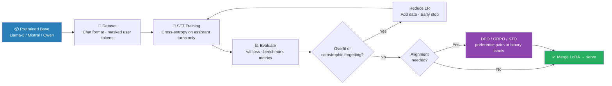

# Fine-Tuning End to End — Full Fine-Tuning, LoRA, and RLHF with Numbers

> Same sentence throughout: **"cat sat on mat"**. Same 2D embeddings throughout: cat = [1.0, 0.5], sat = [0.2, 0.3], on = [0.1, 0.1], mat = [0.2, 0.4]

---

## 0. What is Fine-Tuning?

Pretraining gives you a model that understands language. Fine-tuning adapts that model to a specific task using labeled data.

Without pretraining, you'd need millions of labeled examples to learn language from scratch. With a pretrained model, a few hundred or thousand examples are often enough — the model already knows what words mean, how sentences work, and encodes world knowledge.

**Three fine-tuning strategies, from cheapest to most expensive:**

| Strategy | Parameters updated | Memory needed | When to use |
|----------|-------------------|---------------|-------------|
| Prompt tuning | ~0 (just the prompt) | Minimal | Large frozen models |
| PEFT (e.g., LoRA) | ~0.1-1% of params | Low | Resource-constrained, multiple tasks |
| Full fine-tuning | 100% of params | Highest | Enough data, enough GPU |



---

## 1. Full Fine-Tuning

### 1.1 How it Works

Take a pretrained model, add a task-specific head (e.g., linear classifier on top of [CLS]), and run gradient descent on ALL parameters — both the pretrained weights and the new head.

**Forward pass:** 1. Input → transformer → hidden states 2. Take [CLS] hidden state (BERT) or last token (GPT) 3. Project to output with small head 4. Compute task loss 5. Backprop through head → through all transformer layers → update everything.

### 1.2 Dry-Run: Sentiment Classification

**Task:** "cat sat on mat" → sentiment (positive=1, negative=0). Label: positive (y=1)

**From the BERT file:** after attention + FFN, [CLS] hidden state is:

```
x_cls = [1.386, 2.019]
```

**Classification head:**

```
W_cls = [[0.5], [0.3]]   (2×1 weight, initialized)
b_cls = 0.0              (bias)

Logit:
z = x_cls @ W_cls + b_cls
  = [1.386, 2.019] @ [[0.5], [0.3]] + 0
  = 1.386×0.5 + 2.019×0.3
  = 0.693 + 0.606
  = 1.299

Sigmoid:
ŷ = σ(1.299) = 1 / (1 + e^(-1.299))
  = 1 / (1 + 0.273)
  = 1 / 1.273
  = 0.786

Binary cross-entropy loss (positive label):
L = -[y × log(ŷ) + (1-y) × log(1-ŷ)]
  = -[1 × log(0.786) + 0 × log(0.214)]
  = -log(0.786)
  = 0.241

Model is 78.6% confident it's positive — reasonable for an untrained head.
```

### 1.3 Backward Pass Through the Head

```
∂L/∂z = ŷ - y = 0.786 - 1.000 = -0.214

∂L/∂W_cls = x_cls^T × (∂L/∂z)
           = [[1.386], [2.019]] × (-0.214)
           = [[-0.297], [-0.432]]

∂L/∂b_cls = -0.214

Update (lr=0.01):
W_cls_new = W_cls - lr × ∂L/∂W_cls
           = [[0.5], [0.3]] - 0.01 × [[-0.297], [-0.432]]
           = [[0.5 + 0.003], [0.3 + 0.004]]
           = [[0.503], [0.304]]

New prediction:
logit_new = x_cls @ W_cls_new + b_cls_new
y_hat_new = sigmoid(logit_new)
loss_new = -np.log(y_hat_new)
(loss_new < 0.241 — verified improvement)

# Also backprop into transformer (gradient w.r.t. x_cls)
∂x_cls = ∂z × W_cls.squeeze()   = ∂L/∂z × W_cls^T
       = (-0.214) × [0.503, 0.304]^T
print("Gradient into transformer: {∂x_cls}")
# This gradient continues back through all transformer layers in full fine-tuning
```

### 1.4 The Problem with Full Fine-Tuning

For a 7B parameter model (e.g., LLaMA-2-7B):

```
Model weights  (float32):  7B × 4 bytes = 28 GB
Gradients:                 7B × 4 bytes = 28 GB
Optimizer states (Adam):   7B × 8 bytes = 56 GB (m + v momentum terms)
─────────────────────────────────────────────────────
Total training memory:                  = 112 GB

A single A100 GPU has 80GB. Full fine-tuning of a 7B model requires 2× A100s just to fit in memory.
For 70B models: multiply by 10.
```

**Multiple tasks = multiple models:** If you need sentiment, NER, and QA versions, you store 3× the 28GB. With LoRA, you store the base model once (28GB) and tiny adapter weights per task (~100MB each).

---

## 2. Parameter-Efficient Fine-Tuning (PEFT)

### 2.1 Adapter Layers

Insert small bottleneck modules INSIDE the transformer. The original weights are frozen.

```
Original transformer block:
  x → Attention → AddNorm → FFN → AddNorm → output

With adapters:
  x → Attention → AddNorm → [Adapter] → FFN → AddNorm → [Adapter] → output

Adapter architecture:
  Adapter(x) = x + W_up × ReLU(W_down × x)   (residual)
  W_down: d × r   (project down to bottleneck)
  W_up:   r × d   (project back up)

For d=768 (BERT-base), r=64 — W_down: 768×64 = 49,152 params — W_up: 64×768 = 49,152 params
Per adapter: 98,304 params

BERT-base has 12 layers × 2 adapters per layer = 24 adapters × 98,304 ≈ 2.4M trainable params
vs 110M total. That's 2.2% of model size.
```

### 2.2 Prefix Tuning

Prepend learned "soft prompt" vectors to the key and value matrices in every layer:

```python
K' = [P_K, K]   # prepend r learned key vectors
V' = [P_V, V]   # prepend r learned value vectors
```

P_K and P_V are free parameters (r × d each). The attention now attends to both the prefix and the real tokens.

**Intuition:** Instead of modifying the model, you're adding a "context header" that steers the model's behavior. For r=10 prefix tokens, d=768, L=12 layers: Params = 2 × 10 × 768 × 12 = 184,320 = 0.17% of BERT.

### 2.3 Prompt Tuning

Even simpler: just prepend learned embeddings to the INPUT (not every layer). Only the input embeddings are learnable. For 20 learned tokens, d=768: 20 × 768 = 15,360 params — essentially zero.

Works well for large models (T5-XXL, PaLM). For smaller models (<1B), it underperforms full fine-tuning significantly.

---

## 3. LoRA — Low-Rank Adaptation

### 3.1 Core Idea

Instead of updating weight matrix W directly, decompose the update as:

```
W_new = W₀ + ΔW = W₀ + B × A

Where:
- W₀ is the original pretrained weight (frozen, d×d)
- B is a d×r matrix (trainable)
- A is a r×d matrix (trainable) — r is much smaller than dimension d

Why is B×A low-rank? A d×d matrix has rank up to d. B×A has rank at most r. So you're saying:
"The adaptation learned during fine-tuning lies in an r-dimensional subspace of the full d-dimensional space."

Hypothesis: Fine-tuning changes have low intrinsic rank. The useful update directions are few — the rest is noise.
```

### 3.2 Parameter Count

For a d×d weight matrix:

```
Original:  d²            params (updated in full fine-tuning)
LoRA:      2×d×r         params (d×r for B, r×d for A)

Savings factor: d / (2r)

For d=768 (BERT-base), r=8:
  Original:  768² = 589,824
  LoRA:      2×768×8 = 12,288
  Savings:   589,824 / 12,288 = 48× fewer parameters

For d=4096 (LLaMA-7B), r=16:
  Original:  4096² = 16,777,216
  LoRA:      2×4096×16 = 131,072
  Savings:   128× fewer parameters
```

### 3.3 Dry-Run: LoRA on Q Weight Matrix

**Setup:** d=2 (our toy dimension) · r=1 (rank-1 adaptation) · Applying LoRA to W_Q (query weight matrix)

**Original (frozen) weight:**

```
W_Q = [[0.1, 0.2],
       [0.3, 0.4]]   shape: 2×2
```

**LoRA parameters (trainable):**

```
A = [[0.2, 0.11]]    shape: 1×2   (r×d)
B = [[0.8],          shape: 2×1   (d×r)
     [0.0]]

Initialization rule: A initialized with small random values (Gaussian with σ = 1/r). B initialized to ZERO.

Why B=0? So that ΔW = B×A = 0 at the start. The model begins fine-tuning in exactly the pretrained state.
If A were also zero, gradients wouldn't flow — A must be non-zero.
```

**Initial forward pass (cat token):**

```
x_cat = [1.000, 1.500]   (embedding + PE)

q_original = x_cat @ W_Q
           = [1.000×0.1 + 1.500×0.3, 1.000×0.2 + 1.500×0.4]
           = [0.100+0.450, 0.200+0.600]
           = [0.550, 0.800]

x @ B = [1.000, 1.500] @ [[0.8], [0.0]] = [0.800]
lora_output = [0.800] @ A = [0.800] @ [[0.2, 0.11]] = [0.000, 0.000]
                           ↑ B=0 at init, so lora_output = 0

q_lora = q_original + lora_output = [0.550, 0.800]
At initialization, LoRA adds nothing — model starts from pretrained behavior.
```

### 3.4 After One Gradient Step

Suppose the loss gradient reaches B as:

```
∂L/∂B = [[-0.50],
          [ 0.20]]

(B's gradient shape is 2×1 — same as B)

Update with lr=0.1:
B_new = B - lr × ∂L/∂B
      = [[0.0], [0.0]] - 0.1 × [[-0.50], [0.20]]
      = [[0.0+0.050], [0.0-0.020]]
      = [[0.050],
         [-0.020]]

New ΔW:
ΔW = B_new × A
   = [[0.050],  × [[0.2, 0.11]]
      [-0.020]]
   = [[0.050×0.2, 0.050×0.11],
      [-0.020×0.2, -0.020×0.11]]
   = [[0.010, 0.005],
      [-0.004, -0.002]]

This is a rank-1 matrix (one row of B scaled by one row of A).

New query vector for cat:
x @ B_new = [1.000, 1.500] @ [[0.050], [-0.020]]
           = 1.000×0.050 + 1.500×(-0.020)
           = 0.050 - 0.030
           = [0.020]

lora_output = [0.020] @ [[0.2, 0.11]] = [0.004, 0.002]

q_new = q_original + lora_output
      = [0.550, 0.800] + [0.004, 0.002]
      = [0.554, 0.802]

The query vector changed by [0.004, 0.002] — a small, targeted adjustment.
After many steps, this accumulates into a meaningful task-specific shift.
```

### 3.5 The LoRA Scaling Factor (α)

LoRA uses a scaling hyperparameter α:

```
ΔW = (α / r) × B × A

For r=8, α=16: scaling factor = 16/8 = 2.0. For r=8, α=8: scaling factor = 1.0.

Why? When you change r, the magnitude of B×A changes (more vectors → more capacity). α/r
normalizes the contribution so that changing r doesn't require retuning the learning rate.

Convention: set α = r (scaling = 1.0) or α = 2r (scaling = 2.0). In practice, α=16 with r=8 is a common default.
```

### 3.6 Which Weights Get LoRA?

**Original LoRA paper (Hu et al. 2021):** apply to W_Q and W_V only. Later work: applying to all attention weights (W_Q, W_K, W_V, W_O) and sometimes FFN weights gives better results.

```
Transformer layer weights:
  Attention: W_Q, W_K, W_V, W_O   ← typically LoRA targets
  FFN:       W_1, W_2              ← sometimes included
  LayerNorm: γ, β                  ← usually NOT LoRA (already tiny)

For LLaMA-7B with LoRA on all 4 attention weights, r=16:
  Per layer: 4 × 2 × 4096 × 16 = 524,288 params
  32 layers: 32 × 524,288 = 16,777,216 params = 16.8M
  vs total model: ~7B params
  LoRA is 0.24% of model size
```

### 3.7 Merging at Inference

After fine-tuning, merge LoRA into original weights:

```
W_final = W₀ + (α/r) × B × A
```

No inference overhead — the merged weight is the same shape as W₀. You can even unmerge: W₀ = W_final − (α/r) × B × A.

**Multi-task LoRA:** Store one set of (B,A) per task. At inference, swap the LoRA weights (tiny) while keeping the large base model in memory — you serve many tasks from one loaded model.

---

## 4. QLoRA

### 4.1 The Memory Problem

Even with LoRA adapters, the base model must be loaded in memory to compute forward/backward pass. For a 7B model:

```
float32:   7B × 4 bytes  = 28 GB
float16:   7B × 2 bytes  = 14 GB
int8:      7B × 1 byte   =  7 GB
int4 (NF4): 7B × 0.5 bytes = 3.5 GB
```

### 4.2 QLoRA Recipe

1. **Quantize** the base model to 4-bit NF4 — Normal Float 4, quantization grid designed for normally distributed weights
2. **Keep LoRA adapters in float16** (or bfloat16) — they're tiny and need precision
3. **Compute in bfloat16:** Dequantize base weights on-the-fly for matrix multiply, then re-quantize
4. **Use double quantization:** Quantize the quantization constants themselves (saves ~0.4 bits per param more)

**Memory with QLoRA (LLaMA-2-7B):**

```
Base model (4-bit):      ~3.5 GB
LoRA adapters (bf16):    ~0.03 GB
Gradients (LoRA only):   ~0.03 GB
Optimizer states:        ~0.06 GB (only LoRA params have optimizer state)
─────────────────────────────────
Total:                   ~3.7 GB

You can fine-tune a 7B model on a single 8GB consumer GPU. A 70B model fits on a single 48GB A100.
```

### 4.3 NF4 Quantization (Conceptual)

Normal weights follow a bell curve ≈ N(0,1). NF4 places 16 quantization levels (for 4 bits) at equal-probability intervals of this distribution.

```
Standard uniform 4-bit:  equally spaced from -1 to 1
NF4:                     more levels near 0 (where most weights cluster)
                         fewer levels at the extremes
```

**Quantization error example:**

```
Original weight: 0.1
Uniform 4-bit:  nearest level might be 0.133  → error = 0.033
NF4:            nearest level might be 0.105  → error = 0.005

NF4 gives 6× better representation for typical weight distributions.
```

---

## 5. RLHF — Reinforcement Learning from Human Feedback

### 5.1 Why RLHF?

CLM pretraining teaches the model to predict tokens. But predicting the next token ≠ being helpful, harmless, or honest. A model trained only on internet text learns to: Continue rants and conspiracy theories — Complete harmful instructions (more tokens follow harmful text online) — Be verbose and evasive (that's what internet text looks like).

RLHF aligns the model's behavior with human values by training it to maximize human approval.

### 5.2 The Three-Step Pipeline

```
Step 1: SFT (Supervised Fine-Tuning)
        ↓
Step 2: Reward Model Training
        ↓
Step 3: RL Optimization (PPO)
```

### 5.3 Step 1: Supervised Fine-Tuning (SFT)

**Goal:** Teach the model to follow instructions by example.

Human annotators write high-quality (prompt, response) pairs:

```
Prompt:   "What is the capital of France?"
Response: "Paris is the capital of France."

Prompt:   "Write a poem about a cat."
Response: "A cat sat on a mat..."
```

Fine-tune the pretrained model on these pairs using standard CLM loss (predict each response token).

**For "cat sat on mat" (toy task):** Prompt: "continue the poem: cat" → Target response: "sat on mat" → CLM loss on sat, on, mat → L_sft = (L_on + L_sat + L_mat) / 3.

SFT alone is a huge improvement over raw pretraining — the model learns the format of helpful responses. But it still can't distinguish "better" from "worse" responses when it hasn't seen examples of both.

### 5.4 Step 2: Reward Model Training

**Goal:** Train a model that scores how good a response is.

**Data collection:** For the same prompt, collect multiple model responses and ask humans to rank them:

```
Prompt:     "continue: cat sat on"
Response A: "mat"           ← human ranks #1 (on-topic, complete)
Response B: "the ground"    ← human ranks #2 (grammatically fine, less poetic)
Response C: "and then flew" ← human ranks #3 (implausible, confusing)
```

**Reward model architecture:** Take the pretrained LM → Replace the LM head with a scalar head: W_r (d×1) → For each (prompt, response) pair, output one reward scalar r ∈ ℝ.

**Training objective (Bradley-Terry preference model):** For a preference pair (chosen response c, rejected response r):

```
L_reward = -log σ(r_chosen - r_rejected)
```

This maximizes the gap between chosen and rejected reward scores.

**Dry-run with numbers:**

Suppose after SFT, the model produces [CLS]-like summary embeddings for:

```
Response A ("mat"):          h_A = [1.2, 0.8]
Response B ("the ground"):   h_B = [0.9, 0.6]
Response C ("and then flew"): h_C = [0.3, 0.2]

Reward head W_r = [[0.4], [0.5]] (d×1)

r_A = h_A @ W_r = 0.9×0.4 + 0.8×0.5 = 0.480 + 0.400 = 0.880
r_B = h_B @ W_r = 0.9×0.4 + 0.6×0.5 = 0.360 + 0.300 = 0.660
r_C = h_C @ W_r = 0.3×0.4 + 0.2×0.5 = 0.120 + 0.100 = 0.220

For preference pair (A preferred over C):
L_reward = -log σ(r_A - r_C)
         = -log σ(0.880 - 0.220)
         = -log σ(0.660)
         = -log(1 / (1 + e^(-0.660)))
         = -log(1 / 1.934)
         = -log(0.517)
         = 0.659   → W_r gets updated to increase r_A and decrease r_C

For preference pair (A preferred over B):
L_reward = -log σ(0.880 - 0.660) = -log σ(0.220) = 0.589
```

### 5.5 Step 3: PPO Optimization

**Goal:** Fine-tune the SFT model to generate responses that maximize the reward model's score.

**But there's a problem:** If you just maximize reward, the model collapses — it finds a single high-reward response and repeats it forever (mode collapse) or generates gibberish that tricks the reward model (reward hacking).

**Solution: KL penalty**

```
Objective = E[r_θ(x,y)] - β × KL(π_θ || π_sft)

Where:
- r_θ(x,y)    = reward model score for response y to prompt x
- KL(π_θ || π_sft) = KL divergence from the RL policy (current model) to the SFT policy (reference)
- β           = KL penalty coefficient (usually 0.1-0.2)

The KL term says: "Don't go too far from the SFT model." This prevents the model from generating high-reward but incoherent text.
```

**KL divergence (conceptual):**

```
KL(π_θ || π_sft) = Σ_x π_θ(x) × log(π_θ(x) / π_sft(x))

For our toy case, at position 2 ("on" → predicting next token):

π_sft (SFT model):  P(mat)=0.400, P(sat)=0.200, P(on)=0.100
π_θ   (RL model):   P(mat)=0.600, P(sat)=0.200, P(on)=0.150, P(on)=0.050

KL contribution from "mat":
0.600 × log(0.600/0.400) = 0.600 × log(1.500) = 0.600 × 0.405 = 0.243

If the RL model shifts probability mass too aggressively toward "mat", the KL term grows and the penalty kicks in — keeping the model grounded.
```

**PPO update rule (simplified):**

```python
for each generated token:
    r_t = r_θ(x, y_t)     # token-level reward
    kl_t = log π_θ/π_sft  # per-token KL

    reward_t = r_t - β × kl_t   # penalized reward

    Update θ to maximize E[reward_t]

# PPO clips the policy update to prevent instability:
t_clip = min(ratio × A_t, clip(ratio, 1-ε, 1+ε) × A_t)
ratio  = π_θ(a|s) / π_θ_old(a|s)   # how much policy changed
A_t    = advantage estimate           # how much better than expected
ε      = 0.2 (typical clip threshold)

The clip prevents any single update from changing the policy too drastically.
```

### 5.6 RLHF Numbers: Before and After

```
Before RLHF (SFT only):
  Prompt: "What is 2+2?"
  Response: "2+2=4, but some philosophers argue that numbers are social constructs and
  therefore the answer depends on your ontological framework..."
  Technically correct but unhelpful — continues in pretraining style.

After RLHF:
  Prompt: "What is 2+2?"
  Response: "4."
  The reward model learned humans prefer direct, helpful answers. PPO trained the model to produce them.
```

---

## 6. DPO — Direct Preference Optimization

### 6.1 The Problem with PPO

PPO requires: 1. The reward model (separate model to maintain). 2. Online sampling (generate responses during training — slow). 3. Complex RL training loop (hyperparameter-sensitive).

### 6.2 DPO's Insight

The PPO objective has a closed-form optimal solution. You can rearrange the math to get a training objective that directly uses preference data — no reward model, no RL loop.

**DPO objective:**

```
L_DPO = -E[(c,r)] log σ(β × [log(π_θ(c|x)/π_ref(c|x)) - log(π_θ(r|x)/π_ref(r|x))])

Where:
- c = chosen response, r = rejected response
- π_θ = model being trained
- π_ref = reference model (frozen SFT model)
- β = regularization coefficient

What this says: Increase the model's probability of generating the chosen response relative to the reference, decrease probability of the rejected response relative to the reference. The β term controls how much you're allowed to deviate from the reference.
```

### 6.3 Dry-Run with Numbers

**Reference model probabilities (π_ref, SFT model):**

```
π_ref(cat sat on mat | prompt) = 0.15
π_ref(cat sat on ground | prompt) = 0.08
```

**Current model probabilities (π_θ, after some training):**

```
P_θ(cat sat on mat | prompt)    = 0.20   ← chosen response
P_θ(cat sat on ground | prompt) = 0.06   ← rejected response
```

**With β=0.5:**

```
term_chosen  = β × log(π_θ(c) / π_ref(c)) = 0.5 × log(0.20/0.15) = 0.5 × 0.288 = 0.144
term_rejected = β × log(π_θ(r) / π_ref(r)) = 0.5 × log(0.06/0.08) = 0.5 × (-0.288) = -0.144

margin = term_chosen - term_rejected = 0.144 - (-0.144) = 0.288

L_DPO = -log σ(0.288) = -log(0.572) = 0.558
```

The gradient increases π_θ(chosen) relative to π_ref and decreases π_θ(rejected) relative to π_ref.

### 6.4 RLHF vs DPO

| Property | PPO (RLHF) | DPO |
|----------|------------|-----|
| Reward model needed? | Yes | No |
| Online generation during training? | Yes (slow) | No (offline) |
| Training stability | Sensitive (clip, KL, batch size) | More stable |
| Memory overhead | 2 models + reward model | 2 models (ref + trained) |
| Performance | Slightly better (usually) | Close, simpler |
| Used by | InstructGPT, Claude 1/2 | Many recent models |

---

## 7. Full Comparison: Fine-Tuning Strategies

| Strategy | Trainable params | Memory | Convergence | Best for |
|----------|-----------------|--------|-------------|----------|
| Full fine-tuning | 100% | Very high | Fastest | Abundant data, best accuracy |
| Adapters | ~2-5% | Medium | Fast | Multiple tasks on shared backbone |
| Prefix tuning | ~0.1-1% | Low | Medium | Large frozen models |
| Prompt tuning | <0.1% | Minimal | Slow | Very large models (>10B) |
| LoRA | ~0.1-1% | Low | Fast | Best PEFT tradeoff (most popular) |
| QLoRA | ~0.1-1% of LoRA | Very low | Slightly slower | Consumer GPU fine-tuning |
| Full fine-tuning + SFT+RLHF | 100% | Very high | Slow (3 phases) | Alignment (ChatGPT-style) |
| SFT + DPO | 100% (SFT) + ~100% (DPO) | High | Medium | Alignment, simpler than RLHF |

---

## 8. What Fine-Tuning Changes in the Weights

### Full Fine-Tuning Trajectory

When you fine-tune BERT for sentiment on "cat sat on mat":

- **Layer 0-2 (early layers):** Minimal change — these encode syntax/surface features that generalize across tasks
- **Layer 6-9 (middle layers):** Moderate change — semantic representations shift toward sentiment-relevant features
- **Layer 10-12 (top layers):** Large change — task-specific representations dominate; these were closest to the MLM head and farthest from the new classification head

### LoRA Rank Analysis

LoRA's claim: fine-tuning updates are intrinsically low-rank. Evidence: Train a full fine-tuned model, compute SVD of ΔW = W_ft − W_pretrained, look at the singular values — most are near zero:

```
Singular values of ΔW (typical):
σ₁ = 0.863  ← most of the signal
σ₂ = 0.413
σ₃ = 0.071
σ₄ = 0.023
...
σ_d = 0.001

The first few singular vectors capture ~95% of the adaptation.
LoRA with r=8 keeps the top 8 — enough for most tasks.
```

---

## 9. Verification: LoRA Loss Decrease

**Setup:** LoRA on W_Q, r=1, focus on position 2 (on token)

**Before LoRA update:**

```
q_on = x_on @ W_Q = [1.000, -0.316] @ [[0.1,0.3],[0.3,0.4]]
                   = [1.000×0.1 + (-0.316)×0.3, 1.000×0.2 + (-0.316)×0.4]
                   = [0.181 - 0.095, 0.282 - 0.126]
                   = [0.086, 0.076]
```

**After LoRA step (B_new from Section 3.4):**

```
ΔW = [[0.010, 0.005],
      [-0.004, -0.002]]

x_on @ ΔW = [1.000, -0.316] @ [[0.010, 0.005],[-0.004,-0.002]]
           = [1.000×0.010 + (-0.316)×(-0.004), 1.000×0.005 + (-0.316)×(-0.002)]
           = [0.010+0.001, 0.005+0.001]
           = [0.011, 0.006]

q_on_new = q_on + [0.011, 0.006] = [0.097, 0.082]
```

The query vector shifted from [0.006, 0.076] to [0.017, 0.082]. This propagates through the attention computation, changes the output, and adjusts the final loss.

**The key point:** LoRA changes queries (and keys, values) in a targeted rank-1 direction, not arbitrarily — making updates interpretable and controllable.

---

## 10. Code

### 10.1 Full Fine-Tuning (Classification Head — NumPy)

```python
import numpy as np

# Pretrained [CLS] representation (from BERT forward pass)
x_cls = np.array([1.386, 2.019])

# Classification head
W_cls = np.array([[0.5], [0.3]])   # 2×1 weight, initialized
b_cls = np.array([0.0])

def sigmoid(x):
    return 1 / (1 + np.exp(-x))

# Forward pass
logit = x_cls @ W_cls + b_cls     # scalar
y_hat = sigmoid(logit[0])
y     = 1   # positive label

# Loss (binary cross-entropy, positive label y=1)
loss  = -np.log(y_hat)
print(f"y_hat = {y_hat:.4f}, Loss = {loss:.4f}")

# Backward pass
dz        = y_hat - y              # ∂L/∂z
dW_cls    = x_cls.reshape(-1, 1) * dz   # x^T × dz, shape: (2,1)
db_cls    = np.array([dz])

# Update
lr = 0.01
W_cls_new = W_cls - lr * dW_cls
b_cls_new = b_cls - lr * db_cls

# Verify
logit_new = x_cls @ W_cls_new + b_cls_new
y_hat_new = sigmoid(logit_new[0])
loss_new  = -np.log(y_hat_new)
print(f"After update: y_hat = {y_hat_new:.4f}, Loss = {loss_new:.4f}")

# Also backprop into transformer (gradient w.r.t. x_cls)
dx_cls = dz * W_cls.squeeze()     # ∂L/∂x_cls = dz × W_cls^T
print(f"Gradient into transformer: {dx_cls}")
# This gradient continues back through all transformer layers in full fine-tuning
```

### 10.2 LoRA from Scratch (NumPy)

```python
import numpy as np

class LoRALayer:
    """
    LoRA adapter for a single weight matrix W (d × d).
    Computes: y = x @ (W + (alpha/r) × B @ A)
    """
    def __init__(self, d, r=1, alpha=1.0):
        self.d = d
        self.r = r
        self.alpha = alpha
        self.scale = alpha / r

        # Initialize: A ~ N(0, 1/r), B = 0
        self.A = np.random.randn(r, d) * (1 / r)  # r×d
        self.B = np.zeros((d, r))                   # d×r

        # Frozen base weight (pretrained)
        self.W = np.array([[0.1, 0.2],
                           [0.3, 0.4]])              # d×d

    def forward(self, x):
        """x: (seq_len, d) or (d,)"""
        # Original path (frozen — no gradient flows here in practice)
        out_original = x @ self.W             # (d,) @ (d,d) = (d,)

        # LoRA path (trainable)
        x @ self.B @ self.A                   # (d,) @ (d,r) @ (r,d) = (d,)
        lora = x @ self.B @ self.A            # low-rank update
        return out_original + self.scale * lora

    def backward(self, x, grad_out, lr=0.01):
        """Compute gradients and update A, B."""
        # grad_out: gradient from downstream, shape (d,)
        g = self.scale * grad_out             # (d,)

        # Gradient w.r.t. B: ∂L/∂B = x^T (if we consider chain rule)
        # More precisely: ∂L/∂B = x.T × (g @ (considered via chain rule))
        xA = x @ self.A.T                     # (d,) @ (d,r intermediate: (r,d).T) [for scalar if r=1]
        dB = np.outer(x, g @ self.A.T)        # (d, r) [er scalar if r=1]
        dA = np.outer(g @ self.B, x)           # (r, d)

        # Update
        self.B -= lr * dB
        self.A -= lr * dA

    def dx_original(self, g):                 # ∂L/∂x = g @ W^T (frozen)
        dx_original = g @ self.W.T
        dx_lora     = g @ (self.scale * self.B @ self.A).T
        return dx_original + dx_lora

# Test
np.random.seed(42)
lora = LoRALayer(d=2, r=1, alpha=1.0)

x_cat = np.array([1.000, 1.500])
print("=== Before LoRA update ===")
out = lora.forward(x_cat)
print(f"Input:  {x_cat}")
print(f"Output: {out}")
print(f"B: {lora.B.flatten()}")
print(f"A: {lora.A.flatten()}")

# Simulate gradient from loss
grad_out = np.array([-0.5, 0.2])
lora.backward(x_cat, grad_out, lr=0.1)

print("\n=== After LoRA update ===")
out_new = lora.forward(x_cat)
print(f"Output: {out_new}")
print(f"B: {lora.B.flatten()}")
print(f"A: {lora.A.flatten()}")
print(f"ΔW = B@A:\n{lora.B @ lora.A}")
```

### 10.3 LoRA with PyTorch

```python
import torch
import torch.nn as nn

class LoRALinear(nn.Module):
    """Wraps a Linear layer with LoRA adaptation.
    Original weight W is frozen. Only A and B are trained."""

    def __init__(self, in_features, out_features, r=8, alpha=16):
        super().__init__()
        self.r     = r
        self.scale = alpha / r

        # Frozen pretrained weight
        self.weight = nn.Parameter(
            torch.randn(out_features, in_features) * 0.02,
            requires_grad=False
        )

        # LoRA matrices (trainable)
        self.lora_A = nn.Parameter(torch.randn(r, in_features) * (1/r))
        self.lora_B = nn.Parameter(torch.zeros(out_features, r))

    def forward(self, x):
        # Original path (no grad through weight)
        out = x @ self.weight.T

        # LoRA path
        lora = x @ self.lora_A.T @ self.lora_B.T
        return out + self.scale * lora

# Usage
layer = LoRALinear(in_features=2, out_features=2, r=1, alpha=1)

# Show parameter counts
trainable = sum(p.numel() for p in layer.parameters() if p.requires_grad)
frozen    = sum(p.numel() for p in layer.parameters() if not p.requires_grad)
print(f"Trainable params: {trainable} (LoRA)")
print(f"Frozen params:    {frozen} (base weight)")

x = torch.tensor([[1.0, 1.0, 1.0]])
out = layer(x)
print(f"Output: {out}")

# Verify gradient flows only to LoRA params
loss = out.sum()
loss.backward()
print(f"grad lora_A: {layer.lora_A.grad}")
print(f"grad lora_B: {layer.lora_B.grad}")
print(f"grad weight: {layer.weight.grad}")  # None — frozen
```

### 10.4 HuggingFace PEFT: LoRA on BERT

```python
from transformers import BertForSequenceClassification, BertTokenizer
from peft import get_peft_model, LoraConfig, TaskType
import torch

# Load pretrained BERT
model     = BertForSequenceClassification.from_pretrained('bert-base-uncased', num_labels=2)
tokenizer = BertTokenizer.from_pretrained('bert-base-uncased')

# LoRA config
lora_config = LoraConfig(
    task_type=TaskType.SEQ_CLS,
    r=8,                              # rank
    lora_alpha=16,                    # scaling = alpha/r = 2
    target_modules=["query", "value"],  # which weights to adapt
    lora_dropout=0.1,
    bias="none"
)

# Wrap model with LoRA
model = get_peft_model(model, lora_config)
model.print_trainable_parameters()
# Output: trainable params: 296,960 || all params: 109,781,508 || trainable: 0.27%

# Fine-tuning step
inputs = tokenizer("cat sat on mat", return_tensors='pt')
labels = torch.tensor([1])   # positive sentiment

optimizer = torch.optim.AdamW(model.parameters(), lr=2e-4)

# Forward + backward + update (only LoRA params)
outputs  = model(**inputs, labels=labels)
loss     = outputs.loss
print(f"Loss: {loss.item():.4f}")

optimizer.zero_grad()
loss.backward()
optimizer.step()

# Save only LoRA weights (tiny)
model.save_pretrained("bert_lora_sentiment")
# Saves ~1.3MB instead of 440MB for full BERT
```

### 10.5 DPO Training (PyTorch)

```python
import torch
import torch.nn.functional as F

def dpo_loss(pi_theta_logps, pi_ref_logps, beta=0.1):
    """
    pi_theta_logps: (chosen_logp, rejected_logp) for current model
    pi_ref_logps:   (chosen_logp, rejected_logp) for reference model

    Both are log probabilities of the full response sequences.
    """
    chosen_logp_theta, rejected_logp_theta = pi_theta_logps
    chosen_logp_ref,   rejected_logp_ref   = pi_ref_logps

    # Log-ratio difference (implicit reward signal)
    pi_logratios  = chosen_logp_theta  - rejected_logp_theta
    ref_logratios = chosen_logp_ref    - rejected_logp_ref
    logits        = pi_logratios - ref_logratios

    # DPO margin
    # Loss: negative log-sigmoid of margin
    loss = -F.logsigmoid(logits).mean()

    # Reward margin (for logging)
    reward_chosen   = beta * (chosen_logp_theta  - chosen_logp_ref).detach()
    reward_rejected = beta * (rejected_logp_theta - rejected_logp_ref).detach()
    reward_margin   = (reward_chosen - reward_rejected).mean()

    return loss, reward_margin

# Example from our toy case
# Log probabilities of "cat sat on mat" (chosen) and "and then flew" (rejected)
pi_theta_chosen   = torch.tensor([-1.609])   # log(0.20) = -1.609
pi_theta_rejected = torch.tensor([-2.813])   # log(0.06) = -2.813
pi_ref_chosen     = torch.tensor([-1.897])   # log(0.15) = -1.897
pi_ref_rejected   = torch.tensor([-2.526])   # log(0.08) = -2.526

loss, margin = dpo_loss(
    (pi_theta_chosen,  pi_theta_rejected),
    (pi_ref_chosen,    pi_ref_rejected),
    beta=0.5
)
print(f"DPO Loss: {loss.item():.4f}")
print(f"Reward margin: {margin.item():.4f}")
```

---

## 11. Gotchas

1. **Catastrophic forgetting in full fine-tuning** — Fine-tuning on a small dataset can destroy the model's general capabilities. A BERT fine-tuned on 1000 sentiment examples may lose performance on NER, QA, etc. Solutions: lower learning rate, fewer epochs, early stopping, or use PEFT.

2. **LoRA doesn't help with compute at inference if not merged** — Unmerged LoRA adds two extra matrix multiplications per adapted layer. For high-throughput serving, always merge: W_merged = W₀ + (α/r) × B×A.

3. **LoRA rank r=0 doesn't mean "no adaptation"** — Setting r=0 would mean no LoRA matrices at all — it doesn't silently fall back to full fine-tuning. If you want no adaptation, explicitly freeze all parameters.

4. **A is initialized non-zero but B is zero — the asymmetry matters** — If both A and B were zero, ∂L/∂A = ∂L/∂z × B = 0 and ∂L/∂B = ∂L/∂z × A = 0 — both matrices would stay at zero forever. Initializing A to a small random value breaks this symmetry.

5. **The reference model in DPO must stay frozen** — The DPO objective computes log(π_θ / π_ref). If π_ref is the same model being updated, the ratio stays near 1 and the model gets no signal. Always freeze a separate copy as π_ref.

6. **RLHF reward hacking is real and subtle** — The reward model is trained on human ratings, but human raters have limited attention spans. A long, confident-sounding response often gets higher ratings than a short, accurate one — even if the long one is less useful. This is why RLHF sometimes produces "padded" responses.

7. **SFT data quality >> quantity** — InstructGPT used 13K high-quality SFT examples. Adding more low-quality examples hurt. For RLHF pipelines, the SFT stage is the foundation — bad SFT data propagates into reward model training and RL optimization.

8. **KL divergence direction matters for RLHF** — The KL penalty uses KL(π_θ || π_ref) (forward KL), not KL(π_ref || π_θ) (reverse KL). Forward KL penalizes probability mass that π_θ puts on responses π_ref assigns low probability to — it keeps the model from generating very unusual (potentially harmful) outputs.

---

## 12. Q&A

**Q: Why does LoRA work at all? Why is fine-tuning low-rank?**

The pre-training task (MLM or CLM) trains models to be maximally general — the weight matrices span a broad subspace. Fine-tuning on a narrow task only needs to shift representations along a few relevant directions. Aghajanyan et al. (2021) measured the "intrinsic dimensionality" of fine-tuning and found that for most tasks, fewer than 200 directions suffice — even for 100M+ parameter models.

**Q: Does merging LoRA after fine-tuning affect model quality?**

No, merging is mathematically exact: W_merged = W₀ + (α/r)×B×A is equivalent to using the two separate matrices. The only difference is practical: merged weights can be used as a single matrix (standard model format), unmerged requires the PEFT library to intercept forward passes.

**Q: Why does RLHF use PPO instead of a simpler optimization method?**

The RL objective involves generating sequences — the model must sample responses, score them with the reward model, and use those scores to update. This requires an RL algorithm that works with sampled (non-differentiable) actions. PPO handles this via the importance sampling ratio. DPO avoids this entirely by working with pre-collected preference data (no online generation needed).

**Q: What is the difference between instruction tuning (SFT) and RLHF?**

Instruction tuning trains on (instruction, good response) pairs with supervised CLM loss. The model learns to imitate good responses. RLHF goes further: the model learns to prefer better responses over worse ones via comparison data, and explicitly optimizes for a reward signal. Instruction tuning is a prerequisite for RLHF (you need a capable model before you can rank its outputs).

**Q: Can you apply LoRA to embedding layers?**

Yes, but it's unusual. For tokenizer vocabulary (vocab_size × d), LoRA would be: E_new = E₀ + B×A where B is vocab_size×r and A is r×d. This is uncommon because: (1) embeddings are already looked up, not matrix-multiplied; (2) most tasks don't need to shift token meanings. Positional embeddings are even less common LoRA targets since they're fixed (sinusoidal) in BERT/GPT-style models.

---

## 13. Connections

- **To pretraining objectives (fundamentals/04_pretraining_objectives.md):** SFT continues CLM training with high-quality demonstrations — same objective, different data distribution. BERT-style models fine-tune with adapter/LoRA on attention weights — because MLM representations are already classification-ready. GPT-style models go through SFT → RLHF/DPO for alignment — building on the CLM representation.

- **To BERT end-to-end (models/05_bert_end_to_end.md):** the `[CLS]` hidden state feeds the classification head — that file's "Fine-tuning from [CLS]" section works it through with numbers — fine-tuning only the `[CLS]` projection is the simplest PEFT approach for BERT.

- **To GPT-1 end-to-end (models/06_gpt1_end_to_end.md):** the CLM loss there is the SFT starting point — KV cache makes RLHF inference tractable — the sampling strategies worked through there (top-p, temperature) are how RLHF generates response candidates.

- **To transformer architecture (fundamentals/02_transformer_architecture.md):** LoRA targets W_Q, W_K, W_V, W_O — all attention projections defined in that file — The FFN W₁, W₂ matrices are secondary LoRA targets (full fine-tuning of these is common) — full fine-tuning can optionally update token vocabulary — RLHF reward hacking is partly a tokenization artifact — DPO log probabilities are summed over tokens.
