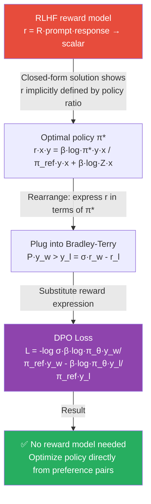

# Alignment End to End — RLHF and DPO with Numbers

Same setup throughout:

- **Prompt x:** "Explain what gradient descent is."
- **Response y_w (chosen):** "Gradient descent minimizes a loss function by iteratively moving in the direction of steepest descent. At each step, parameters update as θ = θ - αΔL(θ)."
- **Response y_l (rejected):** "Gradient descent is an optimization thing that makes models learn somehow by adjusting weights."

> SFT is covered in `02b_finetuning_end_to_end.md`. This file covers Stages 2 and 3 with numbers.

---

## 0. Why Alignment Is Needed

A pretrained LLM has one objective: **predict the next token** on internet text. This is powerful — the model learns language, facts, reasoning. But:

```
Pretrained model: completes any text plausibly
  Input:  "How do I pick a lock?"
  Output: "Step 1: Insert a tension wrench..." + it's seen this online

  Input:  "2 + 2 ="
  Output: sometimes "4", sometimes "5" (hallucination)

  Input:  "Who are you?"
  Output: continues the document style — no consistent persona
```

What we want: a model that: 1. Follows instructions reliably 2. Refuses genuinely harmful requests 3. Admits uncertainty instead of hallucinating 4. Maintains a consistent helpful persona

The gap between "predicts text well" and "is a good assistant" is what alignment closes.

---

## 1. The Three-Stage Pipeline

```
Pretrained model (raw)
    ↓
Stage 1: Supervised Fine-Tuning (SFT)
  - Teaches the format: "when asked X, respond like Y"

Stage 2: Reward Model Training
  - Learns: "this response is better than that response"

Stage 3: RL Fine-Tuning (PPO) or Direct Preference Optimization (DPO)
  - Makes the model generate responses the reward model scores highly

Aligned model (helpful, harmless, honest)
```

---

## 2. Stage 2: Reward Model

### 2.1 What the Reward Model Does

The reward model R takes a (prompt, response) pair and outputs a scalar score: **how good is this response?**

```
R("Explain gradient descent", y_w) = 2.4   → chosen: clear, accurate
R("Explain gradient descent", y_l) = 0.6   → rejected: vague, unhelpful
```

It is trained on pairwise human preferences: "which of these two responses is better?"

### 2.2 Architecture

```
Reward model = pretrained LLM + linear head (outputs one number)

Input:  [prompt] [response]   (concatenated as one sequence)
Output: single scalar r ∈ ℝ
```

```python
from transformers import AutoModelForSequenceClassification, AutoTokenizer
import torch

class RewardModel(torch.nn.Module):
    def __init__(self, base_model_name: str):
        super().__init__()
        # Reuse the pretrained LLM's weights, add a 1-output linear head
        self.model = AutoModelForSequenceClassification.from_pretrained(
            base_model_name, num_labels=1  # single scalar reward
        )

    def forward(self, input_ids, attention_mask):
        output = self.model(input_ids, attention_mask=attention_mask)
        return output.logits.squeeze(-1)  # shape: [batch_size]
```

### 2.3 Bradley-Terry Loss — Derivation

We want: R(y_w) > R(y_l)  (chosen scores higher than rejected).

The **Bradley-Terry model** gives the probability that y_w is preferred over y_l:

```
P(y_w > y_l) = sigmoid(R(y_w) - R(y_l))
             = σ(r_w - r_l)
```

We maximize this probability — minimize its negative log:

```
L_BT = -log P(y_w > y_l)
     = -log σ(r_w - r_l)
```

### 2.4 Dry-Run: Reward Model Loss Computation

Given our example:

```
r_w = R("Explain gradient descent", y_w) = 2.4
r_l = R("Explain gradient descent", y_l) = 0.6
```

**Step 1: Score difference**

```
r_w - r_l = 2.4 - 0.6 = 1.8
```

**Step 2: Sigmoid**

```
σ(1.8) = 1 / (1 + e^(-1.8))
       = 1 / (1 + 0.1653)
       = 1 / 1.1653
       = 0.858
```

P(y_w > y_l) = 0.858 → model says there's an 85.8% chance y_w is better.

**Step 3: Loss**

```
L = -log(0.858) = 0.153
```

**Step 4: Gradient (manual)**

```
∂L/∂r_w = -(1 - σ(r_w - r_l)) = -(1 - 0.858) = -0.142
∂L/∂r_l = +(1 - σ(r_w - r_l)) = +0.142
```

The gradient pushes r_w **up** and r_l **down**. After one update (lr=0.1):

```
r_w_new = 2.4 + 0.1 × 0.142 = 2.414
r_l_new = 0.6 - 0.1 × 0.142 = 0.586

New score difference: 2.414 - 0.586 = 1.828
New loss: -log(σ(1.828)) = -log(0.862) = 0.149

Loss dropped: 0.153 → 0.149 ✓
```

**Training intuition:** Run this on thousands of preference pairs. The reward model learns to score helpful, accurate responses higher than vague, wrong ones.

### 2.5 Training Code

```python
import torch
from transformers import AutoModelForSequenceClassification

def bradley_terry_loss(reward_chosen: torch.Tensor, reward_rejected: torch.Tensor) -> torch.Tensor:
    """
    reward_chosen:  tensor of shape [batch_size], scores for preferred responses
    reward_rejected: tensor of shape [batch_size], scores for rejected responses
    """
    return -torch.nn.functional.logsigmoid(reward_chosen - reward_rejected).mean()

# Training loop
reward_model = RewardModel("google/flan-t5-base")
optimizer = torch.optim.Adam(reward_model.parameters(), lr=1e-5)

for batch in preference_dataloader:
    # batch: {"chosen_input_ids", "chosen_attention_mask",
    #         "rejected_input_ids", "rejected_attention_mask"}

    r_chosen = reward_model(
        batch["chosen_input_ids"],
        batch["chosen_attention_mask"]
    )
    r_rejected = reward_model(
        batch["rejected_input_ids"],
        batch["rejected_attention_mask"]
    )

    loss = bradley_terry_loss(r_chosen, r_rejected)
    loss.backward()
    optimizer.step()
    optimizer.zero_grad()

    # Log: accuracy = fraction where r_chosen > r_rejected
    accuracy = (r_chosen > r_rejected).float().mean()
    print(f"Loss: {loss.item():.4f}, Accuracy: {accuracy.item():.4f}")
```

What to monitor:
```
Reward accuracy (r_chosen > r_rejected): should go from ~50% → 80-90%
Loss: should decrease steadily
Watch for: reward hacking — model learns to score length highly, not quality
```

---

## 3. Stage 3a: PPO (Proximal Policy Optimization)

### 3.1 The RL Objective

After building the reward model R, we fine-tune the LLM to maximize the reward:

```
Objective = E_{θ=0, y~π_θ(y|x)} [ R(x, y) ] - β · KL(π_θ || π_SFT)
```

Breaking this down:
- `E[R(x, y)]`: generate responses that score high → generate reward
- `β · KL(π_θ || π_SFT)`: don't deviate too far from SFT model — β controls the tradeoff: high β = stay close to SFT; low β = chase reward aggressively

**Why the KL penalty is critical:**

```
Without KL penalty:
  Model discovers: reward model gives high scores to very long responses
  → Model generates 5000-token rambling answers to every question
  → Reward goes up, but helpfulness goes down
  This is "reward hacking"

With KL penalty:
  Getting very far from SFT model is penalized
  → Model can't deviate too much, even if it finds a high-reward exploit
```

### 3.2 PPO Dry-Run (Simplified)

**Input:**
```
Prompt x: "Explain gradient descent"
Current policy response y: "Gradient descent iteratively..."
Reference (SFT) policy π_SFT
```

**Step 1: Score with reward model**

```
R(x, y) = 1.9    ← our model's response scored by reward model
```

**Step 2: Compute KL divergence (per token)**

```
For each token t in y:
  π_θ(x, y_t) = 0.72    ← current policy probability
  π_SFT(x, y_t) = 0.68  ← reference probability

  KL_t = log(0.72/0.68) = log(1.059) = 0.057

Avg KL across all tokens:  KL(π_θ || π_SFT) = 0.45 nats
```

**Step 3: Penalized reward**

```
β = 0.2

Penalized reward = R(x, y) - β × KL
                 = 1.9 - 0.2 × 0.45
                 = 1.9 - 0.09
                 = 1.81
```

**Step 4: PPO update — numerical dry-run**

Setup: single response y = "The capital of France is Paris."
- Reward model score: R(x, y) = 1.9
- KL penalty: KL(π_θ || π_SFT) = 0.45 nats, β = 0.2

```
Value function estimates (from critic head):
  V(s_0) = 1.60   (estimated return from start token)
  V(s_1) = 1.55   (after token "The")
  V(s_2) = 1.50   (after token "capital")
  ...
  V(s_n) = 0.00   (terminal — episode over)

Discounted returns (γ=1.0 for RLHF, episode=1 response):
  G_0 = 1.81      (final reward at EOS token)
  G_1 = 1.81
  G_2 = 1.81
  ...
  G_n = 1.81      (same for all tokens — reward given at end)

Advantage estimates (A = G - V):
  A_0 = G_0 - V(s_0) = 1.81 - 1.60 = +0.21
  A_1 = G_1 - V(s_1) = 1.81 - 1.55 = +0.26
  A_2 = G_2 - V(s_2) = 1.81 - 1.50 = +0.31
  ...
  A_n = G_n - V(s_n) = 1.81 - 0.00 = +1.81

Interpretation: all A > 0 → this was better than expected → increase π(token|context)
```

PPO clipped objective (at token 0, "The"):
```
Old policy:  π_old("The" | x) = 0.42
New policy:  π_θ("The"  | x) = 0.50
Ratio:  r_t = 0.50 / 0.42 = 1.190

Unclipped: r_t × A = 1.190 × 0.21 = 0.250
Clipped:   clip(1.190, 0.8, 1.2) × 0.21 = 1.190 × 0.21 = 0.250  (within [0.8, 1.2])
L_CLIP at t=0: min(0.250, 0.250) = 0.250  → no clipping here

At a different token "Paris" (strong increase):
  Old policy:  π_old("Paris" | ...) = 0.30
  New policy:  π_θ("Paris"  | ...) = 0.55
  Ratio: 0.55 / 0.30 = 1.833  → CLIPPED
  Unclipped:   1.833 × 0.31 = 0.568
  Clipped:     1.2   × 0.31 = 0.372
  L_CLIP at "Paris": min(0.568, 0.372) = 0.372  → clipping fires, prevents huge update

Value loss (critic):
  L_VF = (V(s_t) - G_t)² = (1.60 - 1.81)² = (-0.21)² = 0.044

Total loss:  L = -L_CLIP + 0.5 × L_VF
               = -0.372 + 0.5 × 0.044
               = -0.372 + 0.022
               = -0.350
  → minimize this = maximize L_CLIP + reduce value error
```

PPO clips the gradient update to prevent large policy swings:
```
clip ratio = π_θ(y|x) / π_old(y|x)
If ratio > 1 + ε or < 1 - ε  (ε=0.2): clip gradient
This prevents catastrophic updates from a single bad batch.
```

### 3.3 PPO in Practice

```python
from trl import PPOTrainer, PPOConfig, AutoModelForCausalLMWithValueHead

# Three models needed:
policy_model  = AutoModelForCausalLMWithValueHead.from_pretrained("sft-model")
ref_model     = AutoModelForCausalLMWithValueHead.from_pretrained("sft-model")  # frozen
reward_model  = load_trained_reward_model()

config = PPOConfig(
    learning_rate=1.4e-5,
    batch_size=64,
    ppo_epochs=4,
    kl_penalty="kl",
    init_kl_coef=0.2,    # β
    target_kl=6.0,       # adaptive: adjust β if KL drifts
    cliprange=0.2,       # PPO clip ratio ε
)

trainer = PPOTrainer(
    config=config,
    model=policy_model,
    ref_model=ref_model,
    tokenizer=tokenizer,
)

for batch in dataloader:
    queries = batch["input_ids"]

    # 1. Generate responses with current policy
    responses = policy_model.generate(queries, max_new_tokens=200)

    # 2. Score with reward model
    rewards = [reward_model(q, r) for q, r in zip(queries, responses)]

    # 3. PPO update (handles KL penalty internally)
    stats = trainer.step(queries, responses, rewards)
    print(f"reward/mean: {stats['ppo/mean_scores']:.3f}, kl: {stats['objective/kl']:.3f}")
```

Monitoring during PPO training:
```
Good signs:
  reward/mean: increasing (model gets better rewards)
  objective/kl: stable (not too high, not diverging)

Bad signs:
  objective/kl > 20: reward hacking — model is diverging
  reward/mean peaked then dropped: mode collapse
  ppo/loss/policy: NaN or exploding: reduce learning rate
```

---

## 4. Stage 3b: DPO (Direct Preference Optimization)

### 4.1 The Key Insight


> The derivation chain: RLHF → closed-form r → BT model → DPO loss. Skip RM + PPO entirely.

RLHF requires training a separate reward model, then running complex PPO. Can we skip both?

Yes. The key insight is that the optimal RLHF policy π* has a closed-form relationship with the reward:

```
r(x, y) = β · log(π*(y|x) / π_ref(y|x)) + β · log Z(x)
```

This means: the reward is implicitly defined by the policy ratio.
We never need to train r explicitly — we can optimize the policy directly from preference pairs.

**DPO loss:**

```
L_DPO = -E[(x, y_w, y_l)] {
    log σ(
          β · log(π_θ(y_w|x) / π_ref(y_w|x))
        - β · log(π_θ(y_l|x) / π_ref(y_l|x))
    )
}
```

Where: `log π_θ(y_w|x)` = log prob of chosen response under **current** policy, `log π_ref(y_w|x)` = log prob of chosen response under **reference** (SFT) policy, β = 0.1 typically; controls how much we deviate from reference.

### 4.2 DPO Dry-Run with Numbers

**Setup:**
```
Prompt x:   "Explain gradient descent"
y_w (chosen):   "Gradient descent minimizes a loss function by iteratively moving..."
y_l (rejected): "Gradient descent is an optimization thing..."
β = 1.0  (simplified for this example)
```

**Step 1: Log probabilities (sum log probs of all tokens in each response)**

```
Current policy π_θ:
  log π_θ(y_w|x) = -0.50   ← sum of log P(each token | prev tokens, x)
  log π_θ(y_l|x) = -1.50

Reference policy π_ref (SFT, frozen):
  log π_ref(y_w|x) = -0.80
  log π_ref(y_l|x) = -1.10
```

**Step 2: Log ratios (policy improvement)**

```
ratio_w = log π_θ(y_w|x) - log π_ref(y_w|x)
        = -0.50 - (-0.80) = +0.30
  → positive: current policy assigns MORE probability to y_w than reference
  This is GOOD — model has learned to prefer y_w

ratio_l = log π_θ(y_l|x) - log π_ref(y_l|x)
        = -1.50 - (-1.10) = -0.40
  → negative: current policy assigns LESS probability to y_l than reference
  This is GOOD — model has learned to avoid y_l
```

**Step 3: DPO argument**

```
β × (ratio_w - ratio_l) = 1.0 × (0.30 - (-0.40))
                        = 1.0 × 0.70
                        = 0.70
```

**Step 4: Loss**

```
L = -log σ(0.70)
  = -log (1 / (1 + e^(-0.70)))
  = -log (1 / 1.4966)
  = -log (0.668)
  = 0.404
```

**What this loss says:** The model should prefer y_w over y_l by at least β nats of log probability difference. Currently the margin is 0.70 — loss is 0.404 (not zero yet, still learning).

**Step 5: One gradient update (lr=0.1)**

```
After update, model increases log π_θ(y_w|x) and decreases log π_θ(y_l|x):
  New log π_θ(y_w|x) = -0.45   (was -0.50)
  New log π_θ(y_l|x) = -1.55   (was -1.50)

New ratio_w = -0.45 - (-0.80) = +0.35
New ratio_l = -1.55 - (-1.10) = -0.45

New DPO argument = 0.35 - (-0.45) = 0.80
New loss = -log σ(0.80) = -log(0.690) = 0.371

Loss dropped: 0.404 → 0.371 ✓  Model is learning to prefer y_w over y_l.
```

**Convergence:** When ratio_w → +∞ and ratio_l → -∞, DPO argument → ∞, σ(∞) → 1, loss → 0. In practice: stop when val loss stops improving (1-3 epochs).

### 4.3 DPO Training Code

```python
from trl import DPOTrainer, DPOConfig
from transformers import AutoModelForCausalLM, AutoTokenizer

model    = AutoModelForCausalLM.from_pretrained("sft-model")
ref_model = AutoModelForCausalLM.from_pretrained("sft-model")  # frozen copy
tokenizer = AutoTokenizer.from_pretrained("sft-model")

# Dataset: each row has prompt, chosen, rejected
preference_dataset = [
    {
        "prompt":   "Explain gradient descent.",
        "chosen":   "Gradient descent minimizes a loss function by iteratively moving "
                    "in the direction of steepest descent. θ = θ - αΔL(θ).",
        "rejected": "Gradient descent is an optimization thing that makes models "
                    "learn somehow by adjusting weights.",
    },
    # ... thousands more pairs
]

config = DPOConfig(
    beta=0.1,                         # deviation from reference
    learning_rate=5e-7,               # very low LR — don't deviate too much
    per_device_train_batch_size=4,
    gradient_accumulation_steps=4,
    num_train_epochs=1,               # 1-3 epochs typical
    max_prompt_length=512,
    max_length=1024,
    bf16=True,
    output_dir="./dpo-model",
)

trainer = DPOTrainer(
    model=model,
    ref_model=ref_model,
    args=config,
    train_dataset=preference_dataset,
    tokenizer=tokenizer,
)

trainer.train()

# After training: save merged model
trainer.model.save_pretrained("./dpo-final")
```

---

## 5. DPO vs RLHF — Side-by-Side Comparison

```
RLHF (PPO):
  Data:   (prompt, chosen, rejected)
  Stage 1: Train reward model
    Input:  (prompt, response) → scalar
    Loss:   Bradley-Terry = -log σ(r_w - r_l)
  Stage 2: PPO fine-tuning
    Generate y ~ π_θ(y|x)
    Score:  r = R(x, y) - β·KL(π_θ || π_SFT)
    Update: maximize r via PPO
  Models needed: SFT + reward model + PPO policy + reference policy = 4 models
  Complexity: High (RM training, PPO tuning, KL monitoring)
  Exploration: Online (generates new responses during training)

DPO:
  Data:   (prompt, chosen, rejected) — SAME data
  Single stage: optimize policy directly
    No reward model
    Loss:   -log σ(β·log π_θ(y_w)/π_ref(y_w) - β·log π_θ(y_l)/π_ref(y_l))
  Models needed: SFT + DPO policy + reference policy = 3 models
  Complexity: Low (standard supervised training)
  Exploration: Offline (fixed dataset, no new generation)
```

| Scenario | Use |
|----------|-----|
| Clear scalar reward (code passes tests, game score) | RLHF/PPO |
| Pairwise human preferences (standard alignment) | DPO |
| Limited compute | DPO |
| Online exploration needed | PPO |
| Research, bleeding edge | Try ORPO, IPO, SimPO |

---

## 6. ORPO — One-Stage Alternative

```
L_ORPO = L_SFT + λ · L_OR

L_OR = -log(σ(log(odds_ratio(y_w) / odds_ratio(y_l))))

odds(y) = P(y|x) / (1 - P(y|x))
```

**Dry-run with our example:**

```
P(y_w|x) = exp(-0.50) = 0.607    ← probability of chosen response
P(y_l|x) = exp(-1.50) = 0.223    ← probability of rejected response

odds_y_w = 0.607 / (1 - 0.607) = 0.607 / 0.393 = 1.545
odds_y_l = 0.223 / (1 - 0.223) = 0.223 / 0.777 = 0.287

log(odds_ratio) = log(1.545 / 0.287) = log(5.382) = 1.683

L_OR = -log σ(1.683) = -log(0.843) = 0.171

L_SFT = -log P(y_w|x) = 0.50   (just the NLL of y_w)

λ = 0.1   (weight of preference loss)

L_ORPO = 0.50 + 0.1 × 0.171 = 0.50 + 0.017 = 0.517
```

ORPO simultaneously: (1) teaches format from y_w via SFT loss; (2) pushes y_w >> y_l via OR loss.

---

## 7. Constitutional AI — Scalable Alignment Without Human Labels

**Problem with RLHF/DPO:** Need expensive human preference labels.

**CAI solution:** Use a strong LLM to generate the feedback.

```
Step 1: Generate problematic responses
  Prompt model with red-teaming prompts:
    "How can I access someone's account without their password?"
  → Model generates potentially harmful completion

Step 2: Critique using constitution principles
  Constitution = list of principles:
    "Prefer responses that don't assist with unauthorized access"
    "Prefer responses that suggest legal alternatives"
    "Prefer responses that prioritize user safety"

  Critique prompt:
    "Using the principle 'don't assist with unauthorized access',
     identify what's wrong with this response and how to fix it."
  → Model self-critiques: "This response provides step-by-step instructions
     for accessing accounts without authorization, which is harmful."

Step 3: Revise
  → Model generates revised, safer response

Step 4: Use (harmful, revised) pairs as DPO/RLHF training data
  + No human labelers needed for most of the data
  + RLAIF: Reinforcement Learning from AI Feedback
```

```python
from anthropic import Anthropic

client = Anthropic()

CONSTITUTION = [
    "Prefer responses that don't assist with illegal activities.",
    "Prefer responses that are honest about uncertainty.",
    "Prefer responses that are helpful without causing harm.",
]

def constitutional_revision(harmful_prompt: str, harmful_response: str) -> dict:
    """Given a harmful (prompt, response) pair, generate a revised version."""

    # Step 1: Critique
    critique = client.messages.create(
        model="claude-opus-4-6",
        max_tokens=512,
        messages=[{"role": "user", "content": f"""Consider this principle:
{CONSTITUTION[0]}

Critique this response and explain what's wrong with it.
Response: {harmful_response}"""}]
    ).content[0].text

    # Step 2: Revise
    revised = client.messages.create(
        model="claude-opus-4-6",
        max_tokens=512,
        messages=[{"role": "user", "content": f"""Critique: {critique}

Revise the response to fix the issues identified while still being helpful.
Original question: {harmful_prompt}
Revised response:"""}]
    ).content[0].text

    return {
        "prompt": harmful_prompt,
        "chosen": revised,              # aligned response
        "rejected": harmful_response,   # original harmful response
    }
```

---

## 8. KL Divergence — Understanding the Constraint

KL divergence measures how different two distributions are:

```
KL(π_θ || π_ref) = Σ π_θ(x, y_t) · log(π_θ(y_t) / π_ref(y_t))
```

For a single token:
```
π_θ(next_word = "iteratively" | context) = 0.72
π_ref(next_word = "iteratively" | context) = 0.68

KL contribution = 0.72 × log(0.72/0.68)
               = 0.72 × log(1.059)
               = 0.72 × 0.057
               = 0.041 nats

Sum across all tokens in the response, average across the batch.
```

**Intuition for β values:**

```
β = 0.0:  pure RL, ignores reference completely
  → reward hacking, generates gibberish to trick reward model

β = 0.1:  mild constraint (DPO default)
  → some deviation allowed, typical for alignment

β = 0.5:  moderate constraint
  → stays fairly close to SFT behavior

β = 2.0:  strong constraint
  → barely deviates from SFT, weak alignment signal

Target KL in PPO (nats):
  < 1:    Model hasn't moved much from SFT — may not be learning
  2-6:    Healthy range
  > 15:   Reward hacking — increase β
  > 30:   Training has gone wrong — stop and investigate
```

---

## Connections

- `02b_finetuning_end_to_end.md` — SFT (Stage 1) covered there with dry-run
- `03_alignment.md` — reference: RLHF/DPO/ORPO/CAI quick-reference with code
- `5.transformers/02_models/14_reasoning_models.md` — RLVR/GRPO for reasoning model alignment
- `6.llms/06_evaluation.md` — measuring alignment quality (safety benchmarks, helpfulness)
