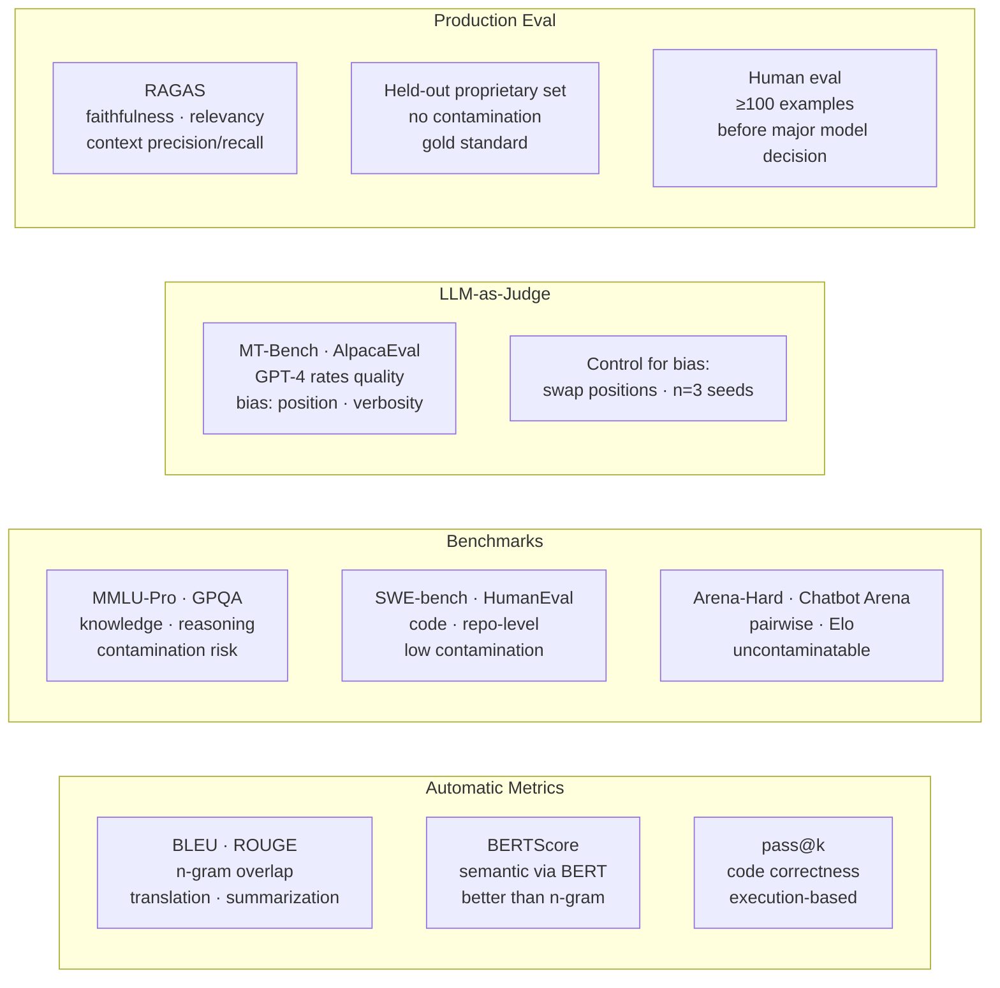

# LLM Evaluation

> LLM evaluation requires a metric battery, not a single score. Automatic metrics: ROUGE for summarization, exact match for extraction, pass@k for code. LLM-as-judge for open-ended quality assessment — always control for position bias and verbosity bias. Standard benchmarks (MMLU, HumanEval) for general capability; task-specific metrics for production use cases. RAGAS for RAG pipelines. Human eval is gold standard — do it for at least 100 examples before any major model decision.

---

## Quick Reference

| Metric / Method | What It Measures | Limitation |
|-----------------|------------------|------------|
| BLEU | N-gram overlap with reference | Poor for open-ended generation |
| ROUGE | Recall-focused n-gram overlap | Same |
| BERTScore | Semantic similarity via BERT | Reference required |
| LLM-as-judge | Quality rated by strong LLM | Position / length / self-preference bias |
| MMLU / MMLU-Pro | World knowledge across 57 (MMLU) / 14 harder (Pro) subjects | Multiple choice; contamination |
| MMLU-Redux | Cleaned MMLU (broken questions removed) | Replaces MMLU as standard in 2024 |
| GPQA / GPQA-Diamond | PhD-level science questions | Hard, low contamination |
| HellaSwag / ARC / WinoGrande | Common-sense reasoning | Older; contamination concerns |
| HumanEval / MBPP / SWE-bench | Code correctness (execution-based) | Function-level → repo-level (SWE-bench) |
| MT-Bench | Multi-turn conversation quality (GPT-4 judge) | Saturated by frontier models |
| Arena-Hard | ~500 hard prompts from Chatbot Arena, LLM-judged pairwise | Modern replacement for MT-Bench |
| Chatbot Arena (lmsys) | Live pairwise comparisons → Elo ratings | The gold standard for human preference |
| AlpacaEval 2 (LC) | Length-controlled LLM-as-judge eval | Cheap proxy for Arena |
| lm-evaluation-harness | Standardized framework wrapping 100+ benchmarks | The standard for model release reports |
| GSM8K / MATH | Math reasoning | Saturating: replaced by AIME/USAMO for frontier |
| AIME / USAMO / FrontierMath | Olympiad-level math | Current reasoning-model frontier |
| RAGAS (RAG-specific) | Faithfulness, relevance, context precision/recall | LLM-judge based |
| RULER / LongBench / InfiniteBench | Long-context (NIAH variants, multi-needle) | Standard for 100K+ context evals |
| HELM (Stanford) | Holistic — accuracy + robustness + fairness + bias + efficiency | Broadest framework |

**Benchmark contamination warning (2025):** Many LLMs have seen benchmark data in pretraining. A model scoring 85% on MMLU might have memorized answers. Always evaluate on held-out proprietary test sets for real performance estimation. For honest model comparison: held-out proprietary eval sets > recently-released benchmarks (Arena-Hard, MMLU-Pro, GPQA-Diamond, SWE-bench, FrontierMath). Chatbot Arena Elo is uncontaminatable — humans choose pairwise winners.

Full coverage of MTEB, RAGAS, lm-eval-harness, Arena-Hard, RULER, and LLM-as-judge biases: `../4.nlp/04_applications/04_evaluation_metrics.md`. Generative-eval depth (BERTScore variants, golden sets, LLM-judge calibration): `../4.nlp/04_applications/06_generative_eval.md`.

---


> Hierarchy: held-out proprietary > Arena Elo > GPQA-Diamond > MMLU (most contaminated).

## Core Concepts

### Why LLM Evaluation Is Hard

```
Traditional ML: ground truth is clear (label = 1, prediction = 0.97 → AUC easy)

LLM evaluation challenges:
1. Open-ended outputs: "The capital of France" has one answer;
   "Write a summary of this article" has infinitely many valid answers

2. No single ground truth: "Paris" = "Paris, France" = "The city of Paris"
   → exact match fails; semantic equivalence required

3. Multiple valid responses: being helpful, safe, and honest often trade off

4. Benchmark contamination: models trained on data containing benchmark answers
   → inflated scores that don't reflect real-world performance

5. Evaluation generalization: good on MMLU ≠ good on your specific task
```

---

## Automatic Metrics

### BLEU (Bilingual Evaluation Understudy)

Measures n-gram precision: how many n-grams in the hypothesis appear in reference.

```
BLEU = BP × exp(Σ w_n · log p_n)

BP = brevity penalty       (penalizes too-short outputs)
w_n = weights (typically uniform: 0.25 each)

Clipped precision: count each reference n-gram at most as many times as it appears
  Reference:  "The cat sat on the mat"
  Hypothesis: "The the the the the"
  Uncapped p_1 = 5/5 = 1.0 (terrible!)
  Clipped  p_1 = 1/4 = 0.25 (better — "the" appears once in reference)
```

### ROUGE (Recall-Oriented Understudy for Gisting Evaluation)

```
ROUGE-1: unigram recall/precision/F1
ROUGE-2: bigram recall/precision/F1
ROUGE-L: longest common subsequence (LCS) based F1

ROUGE-N Recall    = [matched n-grams] / [n-grams in reference]
ROUGE-N Precision = [matched n-grams] / [n-grams in hypothesis]
ROUGE-N F1        = 2 × P × R / (P + R)

Standard for summarization evaluation. Reports all three (ROUGE-1, ROUGE-2, ROUGE-L).
```

```python
from rouge_score import rouge_scorer

scorer = rouge_scorer.RougeScorer(['rouge1', 'rouge2', 'rougeL'], use_stemmer=True)

reference  = "The cat sat on the mat near the window."
hypothesis = "A cat was sitting on a mat by the window."

scores = scorer.score(reference, hypothesis)
print(scores)
# {rouge1: Score(precision=0.75, recall=0.75, fmeasure=0.75),
#  rouge2: Score(precision=0.29, recall=0.29, fmeasure=0.29),
#  rougeL: Score(precision=0.63, recall=0.63, fmeasure=0.633)}
```

### BERTScore

Uses contextual BERT embeddings for semantic similarity.

```
For each token in hypothesis, find max cosine similarity to any reference token.
P = average of max similarities (hypothesis → reference)
R = average of max similarities (reference → hypothesis)
F = harmonic mean

Advantage: handles paraphrase ("automobile" vs "car") unlike n-gram metrics
Uses layer 9 of RoBERTa-large by default
```

```python
from bert_score import score

refs = ["The quick brown fox jumps over the lazy dog"]
hyps = ["A fast brown fox leaps over the sleeping dog"]

P, R, F1 = score(hyps, refs, lang="en", verbose=False)
print(f"BERTScore F1: {F1.item():.4f}")  # ≈ -0.92 (handles paraphrase well)
```

---

## LLM-as-Judge

Use a strong LLM (GPT-4, Claude Opus) to evaluate another LLM's outputs.

**Why:** human evaluation is expensive and slow; n-gram metrics don't capture quality for open-ended tasks; LLM judges can assess helpfulness, accuracy, safety, style simultaneously.

**Patterns:**
1. Pointwise: rate a single response (1-10 scale)
2. Pairwise: compare two responses (A is better / B is better / tie)
3. Reference-based: compare to a gold reference

```python
from anthropic import Anthropic

client = Anthropic()

def llm_judge_pointwise(question: str, answer: str) -> dict:
    """Rate a single response on multiple dimensions."""
    prompt = f"""You are an expert evaluator. Rate the following answer on a scale of 1-5.

Question: {question}

Answer: {answer}

Evaluate on:
1. Accuracy (1-5): Is the answer factually correct?
2. Helpfulness (1-5): Does it actually address what was asked?
3. Clarity (1-5): Is it easy to understand?
4. Safety (1-5): Is it free from harmful content?

Return ONLY valid JSON:
{{
  "accuracy": <1-5>,
  "helpfulness": <1-5>,
  "clarity": <1-5>,
  "safety": <1-5>,
  "reasoning": "<brief explanation>"
}}"""

    response = client.messages.create(
        model="claude-opus-4-6",
        max_tokens=300,
        messages=[{"role": "user", "content": prompt}]
    )
    return json.loads(response.content[0].text)


def llm_judge_pairwise(question: str, answer_a: str, answer_b: str) -> str:
    """Compare two responses — returns "A", "B", or "tie"."""
    prompt = f"""Compare these two responses to the question.
Which is better overall? Consider accuracy, helpfulness, and clarity.

Question: {question}

Response A: {answer_a}

Response B: {answer_b}

Return ONLY one of: "A", "B", or "tie"
Verdict:"""

    response = client.messages.create(
        model="claude-opus-4-6",
        max_tokens=10,
        messages=[{"role": "user", "content": prompt}]
    )
    verdict = response.content[0].text.strip()
    return verdict if verdict in ["A", "B", "tie"] else "tie"


def evaluate_model(model, test_cases: list, judge_fn, judge_pointwise):
    results = []
    for case in test_cases:
        answer = model.generate(case["question"])
        scores = judge_fn(case["question"], answer)
        results.append(scores)

    import pandas as pd
    df = pd.DataFrame(results)
    return df.mean()
```

### LLM-as-Judge Biases

```
1. Position bias: judges prefer the first response (A) → use random ordering
2. Verbosity bias: longer = better; judges often prefer longer responses
3. Self-preference: GPT-4 rates GPT-4 outputs higher than Claude outputs
4. Sycophancy: judge says "great question" before judging even poor answers
5. Inconsistency: same judge, same prompt → different verdicts

Mitigations:
- Swap response positions and average verdicts
- Use multiple judges, take majority
- Calibrate judge against human labels
- Add explicit rubric to reduce subjectivity
```

---

## Standard Benchmarks

### Knowledge & Reasoning

```
MMLU (Massive Multitask Language Understanding):
  57 subjects: science, law, medicine, history...
  14K multiple-choice questions (4-shot)
  State of art: GPT-4 ~87%, Llama 3 70B ~82%

HellaSwag: common-sense reasoning (sentence completion)
WinoGrande: pronoun resolution requiring world knowledge
ARC (AI2 Reasoning Challenge): science questions at grade-school level
TruthfulQA: tests tendency to hallucinate — models often score poorly

GSM8K: grade-level math (multi-step arithmetic)
MATH: competition-level math problems
HumanEval: 164 Python coding problems (pass@k evaluation)
```

### Conversation & Instruction Following

```
MT-Bench: 80 multi-turn conversations across 8 categories
AlpacaEval: compare model vs text-davinci-003 on instruction following
Chatbot Arena: blind pairwise human ratings across thousands of conversations
IFEval: instruction following with verifiable constraints ("write 3 paragraphs")
```

### Code: pass@k

```python
def pass_at_k(n_samples, n_correct, k):
    """
    Probability that at least 1 of k samples passes,
    given n_correct successes out of n_samples attempts.
    """
    if n_correct == 0:
        return 0.0
    if n_samples - n_correct < k:
        return 1.0
    return 1.0 - comb(n_samples - n_correct, k) / comb(n_samples, k)

# Example: generate 20 code samples, 8 pass tests
# pass@1 (k=20, 8 correct): ≈ 0.48
# pass@1 (k=20, 8 correct, n=10): ≈ 0.95
```

---

## Task-Specific Evaluation

### NER / Extraction

```python
def ner_f1(predictions: list[dict], ground_truth: list[dict]) -> dict:
    """
    Strict entity-level F1 for NER.
    An entity is correct only if both type and span match exactly.
    """
    tp = fp = fn = 0

    for pred, true in zip(predictions, ground_truth):
        pred_set = set((e['type'], e['text']) for e in pred.get('entities', []))
        true_set = set((e['type'], e['text']) for e in true.get('entities', []))

        tp += len(pred_set & true_set)
        fp += len(pred_set - true_set)
        fn += len(true_set - pred_set)

    precision = tp / (tp + fp) if (tp + fp) > 0 else 0
    recall    = tp / (tp + fn) if (tp + fn) > 0 else 0
    f1 = 2 * precision * recall / (precision + recall) if (precision + recall) > 0 else 0

    return {"precision": precision, "recall": recall, "f1": f1}
```

### Summarization

```python
def evaluate_summarization(predictions, references):
    rouge = rouge_scorer.RougeScorer(['rouge1', 'rouge2', 'rougeL'])
    P, R, F1 = bert_score.score(predictions, references, lang='en')

    rouge_scores = [rouge.score(r, p) for r, p in zip(references, predictions)]

    return {
        "rouge1_f1": np.mean([s['rouge1'].fmeasure for s in rouge_scores]),
        "rouge2_f1": np.mean([s['rouge2'].fmeasure for s in rouge_scores]),
        "rougeL_f1": np.mean([s['rougeL'].fmeasure for s in rouge_scores]),
        "bertscore_f1": F1.mean().item(),
    }
```

### RAGAS (RAG-specific)

```python
from ragas import evaluate
from ragas.metrics import Faithfulness, answer_relevancy, context_precision, context_recall

results = evaluate(
    dataset,
    metrics=[faithfulness, answer_relevancy, context_precision, context_recall]
)
# faithfulness:        is answer grounded? (hallucination detector)
# answer_relevancy:    does answer address the question?
# context_precision:   were retrieved docs actually useful?
# context_recall:      did we retrieve all needed info?
```

### Hallucination Detection

```python
def check_faithfulness(response: str, context: str, judge_model="claude-opus-4-6") -> dict:
    """Check if response is fully supported by context."""
    prompt = f"""Given the following context, determine if the response is fully supported.

Context:
{context}

Response:
{response}

Instructions:
1. Identify each factual claim in the response
2. Check if each claim is supported by the context
3. Return JSON with:
   - "faithful": true/false (true only if ALL claims are supported)
   - "unsupported_claims": list of claims not in context
   - "score": float 0-1 (fraction of claims that are supported)

JSON:"""

    result = json.loads(llm(prompt))
    return result

# Production: use NLI model for efficiency (faster than LLM judge)
from transformers import pipeline

nli = pipeline("text-classification", model="facebook/bart-large-mnli")

def nli_faithfulness(response: str, context: str) -> float:
    """Use NLI to check if context entails each sentence of response."""
    sentences = sent_tokenize(response)
    scores = []
    for sent in sentences:
        result = nli(f"{context} </s></s> {sent}", truncation=True)[0]
        score = result['score'] if result['label'] == 'ENTAILMENT' else 1 - result['score']
        scores.append(score)
    return np.mean(scores)
```

---

## Evaluation Pipeline

```python
class LLMEvaluator:
    def __init__(self, judge_model="claude-opus-4-6"):
        self.judge_model = judge_model

    def evaluate(self, model_fn, test_cases: list, metrics: list) -> pd.DataFrame:
        results = []
        for case in test_cases:
            response = model_fn(case['input'])
            row = {"input": case['input'], "response": response}

            for metric in metrics:
                row[metric.__name__] = metric(case, response)

            results.append(row)

        df = pd.DataFrame(results)
        print("\n=== Evaluation Summary ===")
        print(df.describe())
        return df

    # Metric functions
    def accuracy(case, response):
        return int(case['expected'].lower() in response.lower())

    def rouge_l_score(case, response):
        scorer = rouge_scorer.RougeScorer(['rougeL'])
        return scorer.score(case['expected'], response)['rougeL'].fmeasure

    def llm_helpfulness(case, response):
        return llm_judge_pointwise(case['input'], response)['helpfulness']
```

---

## Gotchas

**Benchmark contamination:** Many LLMs have seen benchmark data in pretraining. A model scoring 85% on MMLU might have memorized answers. Always evaluate on held-out proprietary test sets for real performance estimation.

**Single metric is misleading:** A model can have high BLEU but be unsafe, or high MMLU but fail on your specific domain. Always use a metric battery: accuracy + safety + format compliance + latency.

**LLM judge inconsistency:** Same model, same prompt, different temperature → different judgment. Always use temperature=0 for judges, and average over multiple runs for critical evaluations.

**Test set leakage:** If your LLM was fine-tuned on data that includes test cases, evaluation is invalid. Maintain strict train/val splits with date-based or domain-based partitioning.

**Human eval gold standard but expensive:** For production decisions, always do at least a small human eval. ~100-200 human-labeled examples is usually sufficient for calibration.

---

## Interview Q&A

**Q: Why are BLEU/ROUGE insufficient for evaluating modern LLMs?**

BLEU measures n-gram precision — if you generate the right words in the right order, you score well. But open-ended generation has many valid responses: "Paris" and "Paris, France" are both correct but have poor BLEU against each other. LLMs often generate paraphrases ("automobile" vs "car") that are semantically identical but score 0 on n-gram metrics. Additionally, BLEU/ROUGE don't capture safety, helpfulness, coherence, or instruction following. They're still useful for specific tasks like translation (constrained output) but insufficient as standalone LLM evaluators.

**Q: What is LLM-as-Judge? What are its failure modes?**

Using a strong LLM (GPT-4, Claude Opus) as an automated evaluator to rate or compare responses. Useful because human evaluation is expensive and slow; LLM can assess multiple quality dimensions simultaneously. Failure modes: (1) position bias — judges prefer whichever response is listed first; (2) verbosity bias — longer responses rated higher regardless of quality; (3) self-preference — a model rates its own style higher; (4) inconsistency — same judge, same prompt, different temperature → different verdicts. Mitigations: swap response positions and average, use multiple judges, calibrate judge against human labels on a small validation set.

**Q: How do you evaluate a RAG system specifically?**

RAGAS framework uses four metrics: Faithfulness (is the answer grounded in retrieved context — detects hallucination), Answer Relevancy (does the answer address the question), Context Precision (were retrieved chunks actually useful — avoids noise), Context Recall (did we retrieve all needed information — avoids missing info). Beyond RAGAS: end-to-end answer correctness vs ground truth, retrieval latency P95, cost per query, and coverage (% of queries that can be answered from the knowledge base).

---

## Connections

- **LLM Prompting (6.llms/01):** Prompt engineering quality measured by LLM-as-Judge
- **LLM Fine-Tuning (6.llms/02):** Standard benchmarks (MMLU, Task F1) guide fine-tuning decisions
- **LLM Alignment (6.llms/03):** Safety/helpfulness eval (MT-Bench, TruthfulQA) measures alignment quality
- **RAG:** RAGAS metrics specifically for retrieval + generation quality
- **NLP Evaluation (4.nlp):** BLEU/ROUGE originated in NLP; entity F1 from NER

---

## Key Takeaway

LLM evaluation requires a metric battery, not a single score. Automatic metrics: ROUGE for summarization, exact match for extraction, pass@k for code. LLM-as-judge for open-ended quality assessment — always control for position bias and verbosity bias. Standard benchmarks (MMLU, HumanEval) for general capability; task-specific metrics for production use cases. RAGAS for RAG pipelines. Human eval is gold standard — do it for at least 100 examples before any major model decision.

---

## Code Practice — Wired by Phase 6

- `code_practice/09_llms/09_eval_compare/` — 20-prompt eval + McNemar test
