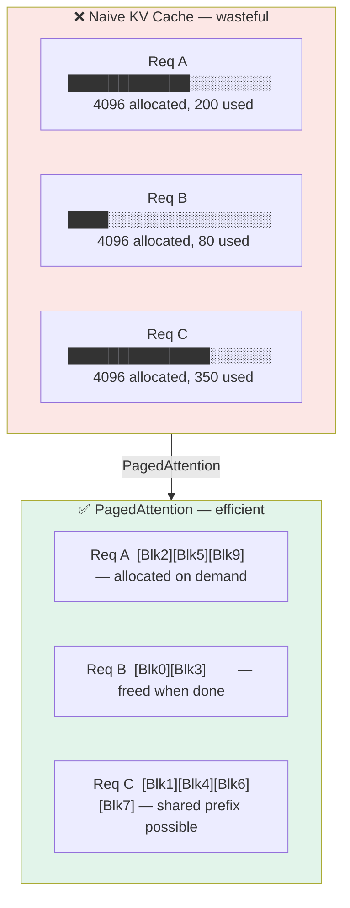
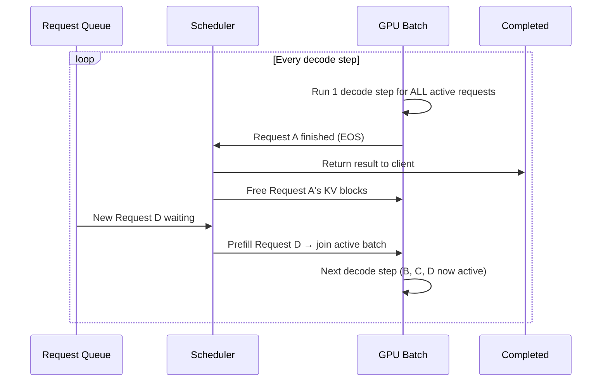

# vLLM Internals — PagedAttention + Continuous Batching

> The two mechanisms behind vLLM's 10-30× throughput advantage. The "how does it actually work" answer for senior interviews.

---

## Table of Contents

1. Objective
2. Core concept — KV cache fragmentation is the enemy
3. PagedAttention in detail
4. Continuous batching algorithm
5. The throughput math
6. Failure modes / engineering caveats
7. Interview questions (5)
8. Further reading

---

## 1. Objective

Naive LLM serving (FastAPI + HuggingFace `generate()`) handles ONE request at a time per worker. Concurrent requests queue up → throughput collapses linearly.

vLLM (Kwon et al. 2023) introduced two innovations that together push throughput 10-30× higher on the same hardware:
1. **PagedAttention** — KV cache stored in non-contiguous pages, like OS virtual memory
2. **Continuous batching** — requests join / leave a running batch each decode step

Both are essential. Either alone is incomplete.

---

## 2. Core Concept — KV Cache Fragmentation is the Enemy

### The waste in naive serving

For each request, the LLM allocates a KV cache: a tensor of shape `[layers, 2, max_seq_len, n_kv_heads, head_dim]`. For Llama-3 8B with max_seq=4096: **~2 GB per request**.

**Problem:** you don't know how long the response will be. Naive serving allocates the FULL `max_seq_len` upfront. If the response is only 50 tokens, you've allocated 4096 tokens of memory and used 50. **~99% memory waste per request.**

**Compounding:** at any time, the GPU holds N requests. Each with its own pre-allocated max-length cache. GPU memory limits how many requests you can batch. Fewer batched = lower throughput.

---

## 3. PagedAttention in Detail

### The PagedAttention insight

Operating systems solve exactly this problem with **virtual memory + paging:**
- Each process gets its own virtual address space
- Physical memory is split into fixed-size pages
- Map virtual to physical only as needed
- Free pages can be reused by other processes

PagedAttention applies this to the KV cache:
- Each request has a "logical" view of contiguous KV cache
- Physical KV memory is split into fixed-size **blocks** (typically 16 tokens per block)
- Map request positions to physical blocks via a per-request page table
- Allocate blocks only as the request generates tokens
- Free blocks immediately when the request finishes

**Result:** near-zero fragmentation. KV memory utilization > 96% in vLLM benchmarks. More concurrent requests fit in the same GPU.

### The data structures

```
Physical memory:
  [Block 0][Block 1][Block 2]...[Block N]
  each 16 tokens = n_layers × 2 × n_kv_heads × head_dim

Per-request page table:
  request_42 → [Block 7, Block 12, Block 3, Block 18, ...]
               (logical positions 0-63 mapped to 4 blocks)
  request_43 → [Block 8, Block 22]
               (logical 0-31 mapped to 2 blocks)
```


> Naive: ~99% memory waste. PagedAttention: >96% utilization → more concurrent requests → 10-30× throughput.

When `request_42` attends to position 50, the engine looks up Block 3 (logical 32-47) and the offset within. The attention kernel is rewritten to handle non-contiguous blocks.

### The custom attention kernel

Standard attention assumes contiguous K/V tensors. PagedAttention requires a custom CUDA kernel that:
1. Takes the page table as input
2. For each query position, fetches K/V from the appropriate physical block
3. Computes attention without materializing the full sequence in contiguous memory

This kernel is the technical core of vLLM. It's ~1000 lines of CUDA.

### Sharing pages across requests (prefix caching)

Bonus property: if two requests share a prefix (e.g., same system prompt), they can **share the physical KV blocks for that prefix**. The page tables point to the same blocks. Saves memory AND avoids recomputing the prefix.

This is "prefix caching" or "automatic prompt caching" — a major reason vLLM is fast for chat workloads where every request has the same long system prompt.

---

## 4. Continuous Batching Algorithm

### The naive batching problem

"Static batching" — collect N requests, run them ALL through the model to completion, then accept new ones.

Two failure modes:
- **Step-locking** — fastest request finishes at step 50, slowest at step 500. GPU idle for the fast one waiting on the slow one.
- **Throughput collapse** — under variable load, the batch is rarely full. Mostly running tiny batches.

### The continuous batching algorithm

Run at the **step granularity**, not the request granularity:

```
loop forever:
  1. Run ONE decode step for ALL active requests in parallel.
  2. For each request:
     - If it produced EOS or hit max_tokens → mark as DONE, return result
  3. Pop DONE requests; free their KV blocks
  4. While GPU memory has room: pop new requests from queue,
     allocate KV blocks, add to active batch
  5. Go to step 1.
```


> No step-locking — finished requests leave immediately, new ones fill their slot. GPU stays saturated.

Result:
- **No step locking** — finished requests leave immediately, new ones replace them
- **Always full batch** — the queue keeps the GPU saturated under any load > capacity
- **Variable latency per request** — but consistently high throughput

### Prefill vs decode

A subtle wrinkle: when a new request joins, it must process its prompt (the **"prefill" phase**) before generating. Prefill is compute-heavy (full sequence pass); decode is memory-heavy (one token).

vLLM handles this with **"chunked prefill"** — process the prompt in chunks of K tokens, interleaved with decode steps for other requests. Avoids starving the decode requests during a big prefill.

---

## 5. The Throughput Math

Why 10-30× over naive HF `generate()`:

```
Naive HF:           1 request → 1 forward pass per token
                    Throughput: N tokens/sec single-stream

Static batching:    B requests → 1 forward pass per token, batched
                    Throughput: B × N tokens/sec — if all requests had same length
                    Reality:    ~3-4× N tokens/sec (step-locking waste)

vLLM (continuous):  250+ requests packed via PagedAttention
                    Throughput: 30× N tokens/sec on the same GPU
```

The 256+ comes from PagedAttention freeing up the memory previously wasted on over-allocation. Without PagedAttention, you'd OOM at ~16 concurrent requests on a typical 80GB GPU.

### Latency tradeoff

Per-request latency is **slightly worse** under continuous batching (your request is sharing GPU with others). But TTFT and throughput are better. For chat use cases this is a strict win — interactive feels fast (streaming), and you serve 10+ more users.

---

## 6. Failure Modes / Engineering Caveats

1. **Custom CUDA kernel → locked to specific GPU types** — vLLM ships kernels for Ampere/Hopper. Older GPUs (V100, T4) get worse performance; some kernels don't compile.

2. **Block size tuning** — 16 tokens is the default. Smaller blocks = more fragmentation overhead. Larger = more internal waste. Rarely needs tuning, but exists.

3. **Memory budget knob** — `gpu_memory_utilization` (default 0.9). Setting too high → OOM on prefill spikes. Setting too low → fewer concurrent requests. 0.85-0.9 is the sweet spot in production.

4. **Prefix caching can be a security risk** — if requests from different users share a prefix (shared system prompt), one request's output might be influenced by another user's cache entry. vLLM caches conservatively, but if you enable aggressive prefix caching, audit it.

5. **Long-context degradation** — at very long contexts (100K+), PagedAttention's per-token kernel overhead dominates. Consider speculative decoding or flash-attention-with-paging extensions.

6. **Single-process** — vLLM 0.6+ supports tensor parallelism across GPUs (model sharding), but pipeline parallelism is less mature. For true distributed serving, look at TGI or SGLang.

---

## 7. Interview Questions (5)

**Q1: What's PagedAttention and why does it matter?**

PagedAttention is vLLM's mechanism for storing the KV cache in non-contiguous fixed-size blocks (like OS pages). Each request has a logical page table mapping its positions to physical blocks. Eliminates the 60-80% memory waste of naive pre-allocation, lets you fit 5-10× more concurrent requests on the same GPU.

**Q2: What's continuous batching?**

Naive batching waits for ALL requests in a batch to finish before starting new ones — "step locking." Continuous batching operates at the per-step level: finished requests leave immediately, new ones join from the queue. Keeps the GPU consistently saturated. Combined with PagedAttention, this is what gives vLLM its 10-30× throughput advantage.

**Q3: What's prefix caching and what's the security concern?**

Requests sharing the same prefix (same system prompt) can share the physical KV blocks for that prefix — saves memory and skips recomputing the prefix. Security concern: if you ever serve untrusted requests, ensure that prefix cache lookups can't leak information across users (vLLM caches conservatively because aggressive caching can cross trust boundaries).

**Q4: When would vLLM NOT be the right choice?**

For very low traffic (single user, <1 req/sec) — the overhead doesn't pay off vs simpler servers. For non-HF model formats (vLLM is HuggingFace-format-centric — for GGUF use llama.cpp). For edge deployment on Apple Silicon (vLLM Mac support is limited and Apple's pipeline is opinionated).

**Q5: How does vLLM compare to TGI and SGLang?**

vLLM is the throughput champion for general HF models. TGI (HuggingFace) has similar throughput, better HF hub integration, slightly worse OpenAI-API compatibility. SGLang focuses on multi-step structured workflows (programs that branch between LLM calls) and matches vLLM on raw throughput while being fast on agentic patterns. In 2026 production: vLLM is the default; SGLang is gaining for agent-heavy use cases.

---

## 8. Further Reading

- PagedAttention / vLLM (Kwon et al. 2023) — arXiv:2309.06180
- Continuous batching / Orca (Yu et al. 2022) — the conceptual precursor, paired with PagedAttention in modern serving
- FlashAttention (Dao 2022) — arXiv:2205.14135 — paired with PagedAttention in modern serving
- vLLM documentation — vllm.readthedocs.io
- SGLang paper (Zheng et al. 2024) — arXiv:2312.07104

---

## Code Practice — Wired by Phase 6

- `code_practice/02_transformers/09_kv_cache/` — KV cache from scratch
- `code_practice/09_llms/12_vllm_serve/` — vLLM serve + batching
