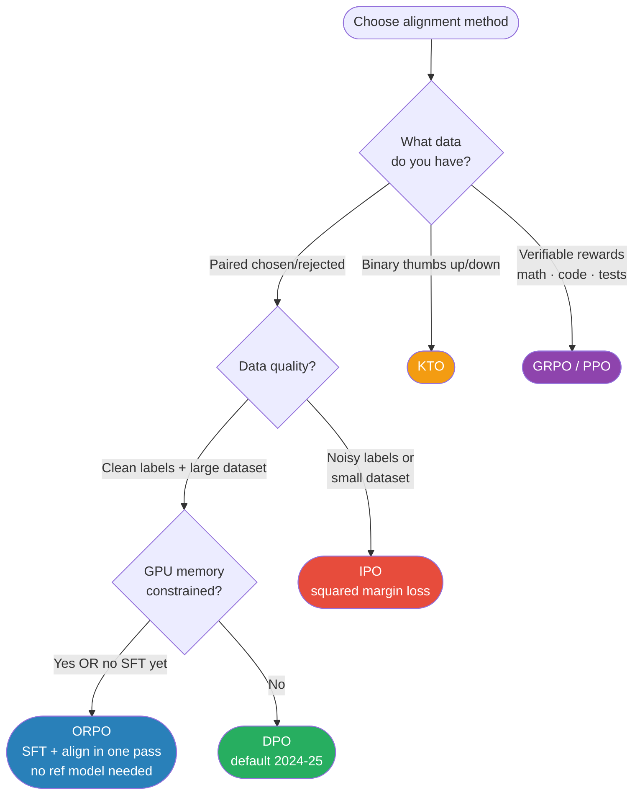

# Alignment Follow-ups — ORPO, KTO, IPO (Beyond DPO)

> The 2024-2025 alternatives to DPO. When each wins, what each fixes, the loss formulas.

---

## Table of Contents

1. Objective
2. The DPO baseline (recap)
3. ORPO — odds ratio preference optimization
4. KTO — Kahneman-Tversky optimization
5. IPO — identity preference optimization
6. Comparison table
7. Failure modes
8. Interview questions (5)
9. Further reading

---

## 1. Objective

DPO (Rafailov 2023) replaced PPO/RLHF for most production alignment. But DPO has known issues:
- Requires a reference model (memory overhead during training — ~2× memory)
- Can overshoot — strongly push down rejected samples even when both chosen and rejected are good
- Needs paired preferences (chosen vs rejected) — labels are expensive

Three notable successors address different limitations:
- **ORPO** — fuses SFT and alignment in ONE step; no reference model needed
- **KTO** — works with binary feedback (thumbs up/down), no pairs required
- **IPO** — adds a regularizer to prevent overshoot on noisy preferences

> Senior interview Q: "If DPO doesn't work for your setup, what alternatives do you reach for?"

---

## 2. The DPO Baseline (Recap)

DPO loss for preference pair (x, y_w, y_l) where y_w is preferred:

```
L_DPO = -log σ( β · ( log π_θ(y_w|x)/π_ref(y_w|x) - log π_θ(y_l|x)/π_ref(y_l|x) ) )
```

- π = policy (trainable)
- π_ref = reference model (frozen, usually the SFT model)
- β = temperature, typically 0.1-0.5

**Two practical pains:**
1. You need π_ref in memory during training (often the same size as π) — ~2× memory
2. The loss pushes UP the policy's likelihood of CHOSEN and pushes DOWN the likelihood of rejected — symmetric. But sometimes you want only to push up. Or your "rejected" sample is fine, just slightly worse.

The follow-ups attack one or both of these.

---

## 3. ORPO — Odds Ratio Preference Optimization

**Hong et al. 2024.** Big idea: fuse SFT and preference learning into ONE loss, eliminating the reference model.

```
L_ORPO = L_SFT + λ · L_OR

where: L_OR = -log σ( log(odds(y_w|x) / odds(y_l|x)) )

odds(y|x) = π(y|x) / (1 - π(y|x))
```

- **L_SFT** — standard SFT loss on the chosen response only
- **L_OR** — odds-ratio preference loss: increase odds of y_w relative to y_l
- **λ** — weight balancing SFT vs preference

**Why it works:**
- No reference model → ~50% memory savings vs DPO
- L_SFT keeps the model anchored to good outputs (replaces the role of π_ref)
- The odds-ratio formulation is bounded and well-behaved

**When to use ORPO over DPO:**
- Limited GPU memory — can't fit two copies of the model
- Starting from a base model (not yet SFT'd) — ORPO does SFT and alignment together
- Smaller datasets — ORPO uses SFT signal too, more sample-efficient

Production examples: many open-source 2024 chat models trained with ORPO (e.g., some Llama-3 community variants).

---

## 4. KTO — Kahneman-Tversky Optimization

**Ethayarajh et al. 2024.** Inspired by prospect theory: humans weight losses and gains asymmetrically.

**The key shift: binary feedback, not pairs.** DPO needs `{prompt, chosen, rejected}`. KTO needs `{prompt, response, thumbs_up_or_down}`. Much easier to collect — every "good" or "bad" rating works.

```python
# KTO unary format
{"prompt": "...", "completion": "...", "label": True}   # thumbs-up
{"prompt": "...", "completion": "...", "label": False}  # thumbs-down
```

**The loss:**

```
L_KTO =
  if desirable:   λ_D · (1 - σ(β · (r(x,y) - z_ref)))
  if undesirable: λ_U · (1 - σ(β · (z_ref - r(x,y))))

where:
  r(x,y) = log π(y|x) / π_ref(y|x)
  z_ref = E_x[ KL(π(-|x) || π_ref(-|x)) ]   ← reference KL anchor
  λ_D, λ_U = separate weights for gains vs losses (asymmetric)
```

Translation: push desirable responses up, undesirable responses down, both anchored to the reference. λ_D = 1 and λ_U = 1 by default; can tune for asymmetric data (more good than bad samples).

**When to use KTO over DPO:**
- Your data is binary thumbs rather than paired comparisons
- Highly imbalanced datasets (10× more positive than negative examples)
- You want explicit control over how aggressively to penalize bad outputs

---

## 5. IPO — Identity Preference Optimization

**Azar et al. 2023.** Fix DPO's tendency to overshoot on noisy preferences.

### The problem with DPO under noisy data

DPO loss is `-log σ(β · margin)`. As margin grows, the loss decreases logarithmically. Nothing stops the model from making the margin arbitrarily large — overshooting on a single noisy pair can drag the model far from the reference.

### IPO's fix: bound the margin

IPO replaces the log-sigmoid with a squared loss:

```
L_IPO = ( log π_θ(y_w|x)/π_ref(y_w|x) - log π_θ(y_l|x)/π_ref(y_l|x) - 1/(2β) )²
```

The target margin is `1/(2β)`. Past that point, the loss goes UP again — the model is penalized for over-confidence. Bounded, stable, more robust to label noise.

**When to use IPO over DPO:**
- Your preference data has known noise (annotators disagree)
- You see DPO collapsing to extreme preferences on small datasets
- You want a more conservative alignment step

In practice, IPO is most popular for small / noisy preference datasets. For large clean datasets DPO works fine.

---

## 6. Comparison Table

| Method | Loss type | Reference model? | Data format | Best for |
|--------|-----------|------------------|-------------|----------|
| DPO | log-sigmoid of log-ratio diff | Yes (frozen π_ref) | (prompt, chosen, rejected) | Default in 2024-25 |
| ORPO | SFT + odds-ratio | **No** | (prompt, chosen, rejected) | Memory-constrained training; combine SFT+align |
| KTO | per-sample gain/loss | Yes | (prompt, response, binary label) | Binary feedback (thumbs); imbalanced data |
| IPO | squared margin | Yes | (prompt, chosen, rejected) | Noisy preference data; stability over speed |
| PPO/RLHF | policy gradient | Yes (+ reward model) | (prompt, response, scalar reward) | Legacy; complex multi-model setup |
| GRPO | group-relative advantage | Yes | (prompt, K responses, rewards) | Reasoning models (DeepSeek-R1) |

### The 2026 production decision tree

```
Have paired preferences (chosen vs rejected)?
├── Yes, clean labels, lots of data  → DPO
├── Yes, noisy labels or small data  → DPO + IPO
└── Yes, limited GPU memory          → ORPO

Have binary feedback (thumbs)?
└── KTO

Have verifiable rewards (math correct, tests pass)?
└── GRPO (or PPO)

Want to combine everything?
└── SFT + DPO → final
```



**Memory tip:** DPO=default · ORPO=no GPU budget · KTO=thumbs data · IPO=noisy labels · GRPO=verifiable reward

---

## 7. Failure Modes

1. **ORPO trained from scratch on tiny data** — without enough SFT signal, the model can't learn formatting; preference signal alone isn't enough.

2. **KTO with extreme class imbalance** — 99% positive, 1% negative → set λ_U high or you'll never penalize bad outputs. Default λs assume rough balance.

3. **IPO converges to NULL update** — if margin already exceeds 1/(2β), the loss is small and gradients vanish. Lower β to keep training signal.

4. **DPO / ORPO catastrophic forgetting** — preference training narrows distribution. Run general-task eval (MMLU, HumanEval) after every alignment step to detect.

5. **Mixing strategies in one training run** — DPO then KTO in the same run confuses the optimizer; pick one preference paradigm per training stage.

---

## 8. Interview Questions (5)

**Q1: When would you choose ORPO over DPO?**

Two cases: (1) memory-constrained — doesn't require keeping a frozen reference model in memory (~50% savings); also works from a base model rather than SFT'd → ORPO fuses SFT and preference alignment, more sample-efficient on small datasets. (2) You want to combine supervised fine-tuning and alignment in one pass — ORPO trains L_SFT + L_OR jointly, so you're teaching format AND preference simultaneously, which can be more stable than sequential SFT → DPO.

**Q2: What problem does IPO fix?**

DPO's log-sigmoid loss has no upper bound on the preference margin. On noisy preferences, the model can overshoot — strongly push down a rejected sample on a single noisy pair, drifting far from the reference. IPO replaces the log-sigmoid with a squared loss centered at target margin 1/(2β). Past that target, the loss INCREASES, penalizing over-confidence. Bounded, stable, more robust to label noise.

**Q3: How does KTO use binary feedback? How does that change data collection?**

Instead of asking "which of these two is better?" (paired comparison), you ask "is this response good or bad?" Each response is labeled independently, scales much better to implicit feedback signals (clicks, ratings). KTO uses prospect-theory-inspired loss that handles desirable/undesirable responses anchored to the reference.

**Q4: What's the loss function difference between DPO, ORPO, KTO?**

DPO: log-sigmoid of (log-ratio of chosen − log-ratio of rejected). ORPO: SFT cross-entropy on chosen + log-sigmoid of (log odds-ratio), no reference model — odds-ratio formulation is bounded. KTO: per-sample sigmoid of gain/loss relative to a reference KL anchor; handles binary labels rather than pairs. Each addresses a different limitation of DPO.

**Q5: For a small noisy preference dataset, which method?**

IPO — overcomes the tendency to overfit noisy labels via the bounded squared margin. DPO can overshoot on noisy pairs. ORPO is also reasonable if memory is tight — its loss is bounded since the log-odds term is bounded. KTO if labels are binary thumbs rather than pairs.

---

## 9. Further Reading

- DPO (Rafailov et al. 2023) — arXiv:2305.18290
- IPO (Azar et al. 2023) — arXiv:2310.12036
- ORPO (Hong et al. 2024) — arXiv:2403.07691
- KTO (Ethayarajh et al. 2024) — arXiv:2402.01306
- TRL library — Hugging Face TRL implements DPO, ORPO, IPO, KTO with consistent API
- Constitutional AI (Bai et al. 2022) — adjacent concept: AI-generated preference labels for self-supervised alignment

---

## Code Practice — Wired by Phase 6

- `code_practice/09_llms/10_dpo/` — DPO via TRL DPOTrainer
