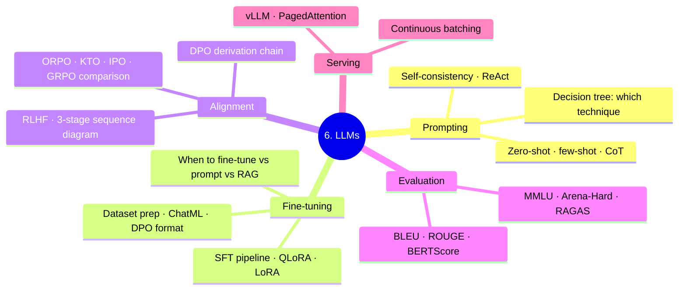

# 6. LLMs

Scope: pure LLM core — prompting, fine-tuning, alignment, evaluation, serving. RAG lives in `../7.rag/`; agents in `../8.agents/`. Tier 2 (Theory).



---

## Where This Sits

**The learning arc is `6.llms` → `7.rag` → `8.agents`, in that order**, and the folder numbers encode it:

```
6.llms    the engine   — what ONE call does
7.rag     a tool       — retrieval, one capability the engine can use
8.agents  the loop     — decides WHICH tool, and WHEN
```

Do not start at RAG. RAG is a *tool an agent calls*, and an agent is *a loop around an LLM call* — both are meaningless until the single call is solid. Cross-cutting orientation (model vs runtime vs host vs format vs SDK vs framework) lives in **[../8.agents/00_agent_stack_foundations.md](../8.agents/00_agent_stack_foundations.md)** — it is filed under agents but applies to this whole arc, and it is worth reading first.

---

## Reading Order

**Straight-through path** (if you just want one sequence):
`01_prompting` → `02_finetuning` → `02b` → `02c` → `07_dataset_preparation` → `03_alignment` → `03b` → `03c` → `04_evaluation` → `04b` → `05_vllm_internals` → `06_alignment_follow_ups`

**By topic** (if you're targeting a specific board):

| If you're learning... | Read in order |
|-----------------------|---------------|
| **Prompting** | `01_prompting` (covers CoT / few-shot / Self-Consistency / Reflexion / CoVe / reasoning-model prompting) |
| **SFT (board 18)** | `02c_sft_end_to_end` (prompt masking computed, chat templates, the two template failures) → `07_dataset_preparation` (ChatML, formats, synthetic data) |
| **Fine-tuning / PEFT (board 19)** | `02_finetuning` → `02b_finetuning_end_to_end` → **`../5.transformers/02_models/09b_lora_qlora_end_to_end.md`** (the arithmetic) |
| **Alignment (board 20)** | `03_alignment` → `03b_alignment_end_to_end` → **`03c_dpo_end_to_end`** (the `Z(x)` cancellation — the step the other two skip) → `06_alignment_follow_ups` |
| **Evaluation (board 21)** | `04b_evaluation_end_to_end` (perplexity, pass@k, MC floors, contamination) → `04_evaluation` (BLEU/ROUGE/BERTScore/RAGAS) |
| **Serving** | `05_vllm_internals` (vLLM, paged attention, prefill/decode, continuous batching) |

---

## Folder TOC

| File | Owns |
|------|------|
| `01_prompting.md` | Prompting patterns + Self-Consistency / CoVe / Reflexion / Tree-of-Thoughts + reasoning model prompting |
| `02_finetuning.md` | SFT / instruction tuning workflow + PEFT overview |
| `02b_finetuning_end_to_end.md` | Worked example — full fine-tune, LoRA math, RLHF/DPO with numbers |
| `02c_sft_end_to_end.md` | SSOT: prompt masking computed, chat templates, the two template failure modes |
| `03_alignment.md` | RLHF / DPO / ORPO / Constitutional AI overview |
| `03b_alignment_end_to_end.md` | Worked example — alignment pipeline with numbers |
| `03c_dpo_end_to_end.md` | SSOT: the `Z(x)` cancellation — the derivation step `03`/`03b` skip |
| `04_evaluation.md` | LLM eval (BLEU/ROUGE/BERTScore + MMLU/Arena-Hard/RAGAS summary) |
| `04b_evaluation_end_to_end.md` | SSOT: perplexity, pass@k, multiple-choice floors, contamination |
| `05_vllm_internals.md` | SSOT: vLLM, paged attention, prefill/decode, continuous batching |
| `06_alignment_follow_ups.md` | SSOT: DPO / IPO / KTO / ORPO / GRPO / RLOO comparison (LLM-workflow framing) |
| `07_dataset_preparation.md` | SSOT: ChatML / Alpaca / ShareGPT / chat_template, LIMA synthetic data (Self-Instruct / Evol-Instruct / Magpie), quality filtering, DPO/KTO/function-call formats |

---

## SSOT Topics Owned Here

- vLLM internals (paged attention, prefill/decode) → `05_vllm_internals.md`
- DPO / IPO / KTO / ORPO / GRPO / RLOO comparison (LLM-workflow framing) → `06_alignment_follow_ups.md`
- LLM dataset preparation → `07_dataset_preparation.md`

---

## Connections

- **PEFT methods (DoRA / LoftQ / PiSSA / GaLore):** `../5.transformers/02_models/09_parameter_efficient_tuning.md`
- **DPO/GRPO algorithm depth (RL framing):** [../1.machine learning/02_algorithms/10_reinforcement_learning_deep.md](../1.machine%20learning/02_algorithms/10_reinforcement_learning_deep.md)
- **Reasoning models (o1, DeepSeek-R1, RLVR):** `../5.transformers/02_models/14_reasoning_models.md`
- **Modern decoding (speculative, constrained, min-p):**
  - `../4.nlp/03_sequence_models/07_decoding_strategies.md`
  - `../5.transformers/02_models/12_constrained_decoding.md`
  - `../5.transformers/02_models/13_speculative_decoding.md`
- **RAG patterns:** `../7.rag/`
- **Agents:** `../8.agents/`
- **LLM observability + cost:** `../10.mlops/11_llm_observability.md`, `../10.mlops/12_llm_cost_tracking.md`
- **Eval frameworks (RAGAS / lm-eval-harness / Arena-Hard):** `../4.nlp/04_applications/04_evaluation_metrics.md`

---

## Practice

- LLM sessions (all ✅ Run) — [../code_practice/06_llms/](../code_practice/06_llms/)
  - `01_prompt_engineering.py` · `02_structured_extraction.py` · `03_llm_evaluation.py`
- Fine-tuning / alignment / serving (⏸ **code-built, not run** — Phase 09 parked on torch/cu121) — [../code_practice/09_finetuning/](../code_practice/09_finetuning/)
  - `01_lora_finetune.py` · `02_qlora_finetune.py` · `03_dataset_prep.py` · `04_dpo_alignment.py` · `05_vllm_serving/` · `06_llm_monitoring.py`
