# RAG (Retrieval-Augmented Generation)

> RAG = Retrieve relevant docs → Inject into prompt → Generate grounded answer. The four pillars: chunking (preserve context), embedding (semantic search), retrieval (hybrid dense+sparse), reranking (cross-encoder for precision). The bottleneck is almost always retrieval quality — fix recall before optimizing generation. Evaluate with RAGAS. In production: pgvector or Pinecone + BGE embeddings + hybrid retrieval + cross-encoder reranker = standard stack.

---

## Quick Reference

| Component | Options | Key Decision |
|-----------|---------|--------------|
| Chunking | Fixed-size, sentence, semantic | Overlap = 20%, chunk = 256-512 tokens |
| Embedding | text-embedding-3, BGE, E5 | Domain-specific = better retrieval |
| Vector DB | Pinecone, Weaviate, pgvector, FAISS | Scale + latency requirements |
| Retrieval | Dense (ANN), sparse (BM25), hybrid | Hybrid almost always wins |
| Reranking | Cross-encoder (slower, better) | Always rerank top-k before generation |
| Generation | GPT-4, Claude, Llama | With retrieved context in prompt |

**Core idea:** Instead of relying on model weights for knowledge, retrieve relevant documents at query time and inject them into the context. Solves hallucination, stale knowledge, and source attribution.

---

## Core Concepts

### RAG Architecture

```
INDEXING (offline)
Documents → Chunk → Embed → Store in Vector DB

RETRIEVAL (online)
Query → Embed → ANN Search → Top-k chunks
[Optional] Rerank → Top-n chunks

GENERATION
Prompt = [System] + [Retrieved chunks] + [Query]
LLM → Answer (with citations)
```


```mermaid
sequenceDiagram
    participant U as 👤 User
    participant EM as Embedder
    participant VDB as Vector DB · ANN
    participant BM as BM25 Index
    participant RR as Cross-Encoder Reranker
    participant LM as LLM

    rect rgb(52, 73, 94)
        Note over EM,BM: OFFLINE — done once at index time
        Note over VDB: Docs → Chunk → Embed → Store
    end

    rect rgb(39, 174, 96)
        Note over U,LM: ONLINE — every query
        U->>EM: raw query text
        EM->>VDB: query vector → ANN search
        VDB->>RR: top-50 dense candidates
        EM->>BM: query tokens → BM25 search
        BM->>RR: top-50 sparse candidates
        RR->>RR: RRF fusion → cross-encoder score each pair
        RR->>LM: top-5 reranked chunks
        LM->>U: ✅ grounded answer + citations
    end
```

> Bottleneck is always retrieval recall — if the right chunk isn't in top-50, generation can't recover it.

---

## Chunking Strategies

```python
from langchain.text_splitter import (
    RecursiveCharacterTextSplitter,
    SentenceTransformersTokenTextSplitter,
)
from langchain_experimental.text_splitter import SemanticChunker
from langchain_openai import OpenAIEmbeddings

# — Strategy 1: Fixed-size with overlap —————————————————————————
splitter = RecursiveCharacterTextSplitter(
    chunk_size=512,           # tokens or characters
    chunk_overlap=50,         # overlap to preserve context at boundaries
    separators=["\n\n", "\n", " ", ".", "*", ""],  # try in order
)
chunks = splitter.split_text(document)

# — Strategy 2: Sentence-aware (respects sentence boundaries) ———
splitter = SentenceTransformersTokenTextSplitter(
    chunk_overlap=10,
    tokens_per_chunk=256,     # token-based, respects sentence structure
)

# — Strategy 3: Semantic chunking (group similar sentences) ——————
splitter = SemanticChunker(
    embeddings=OpenAIEmbeddings(),
    breakpoint_threshold_type="percentile",
    breakpoint_threshold_amount=95,   # split when cosine distance drops
)
chunks = splitter.create_documents([document])

# — Strategy 4: Hierarchical (parent-child) ————————————————————
# Uses small chunks for precise retrieval
# Return large parent chunk to LLM for context
small_splitter = RecursiveCharacterTextSplitter(chunk_size=128, chunk_overlap=20)
large_splitter = RecursiveCharacterTextSplitter(chunk_size=512, chunk_overlap=50)
small_chunks = small_splitter.split_documents(docs)   # for retrieval
large_chunks = large_splitter.split_documents(docs)   # map each small chunk to parent
```

**Chunk size selection:**
```
Too small chunks: lose context + retrieved chunks don't contain full answer
Too large chunks: noisy retrieval + irrelevant content in context = worse generation

Heuristics:
  - Q&A / factual:    128-256 tokens
  - Summarization:    512-1024 tokens
  - Legal/technical:  respect section boundaries
  - Tables:           keep table intact, add surrounding context as metadata

Always include metadata: source file, page number, section title
```

---

## Embedding Models

```python
# Option 1: OpenAI text-embedding-3
from openai import OpenAI
client = OpenAI()

def embed(texts):
    response = client.embeddings.create(
        model="text-embedding-3-large",    # 3072-d; or text-embedding-3-small (1536)
        input=texts,
    )
    return [e.embedding for e in response.data]

# Option 2: HuggingFace (open-source, self-hosted)
from sentence_transformers import SentenceTransformer

# Best open-source options:
model = SentenceTransformer("BAAI/bge-large-en-v1.5")        # strong English
model = SentenceTransformer("intfloat/multilingual-e5-large") # multilingual
model = SentenceTransformer("nomic-ai/nomic-embed-text-v1.5") # context (8192)

# Embed with instruction prefix (required for BGE/E5)
prefix = "Represent this sentence for searching relevant passages: " if is_query else ""
return model.encode([prefix + t for t in texts], normalize_embeddings=True)
```

**Embedding model selection (2024-2025 MTEB leaderboard):**

| Model | Dim | Notes |
|-------|-----|-------|
| text-embedding-3-large | 1536/3072-d | API, matryoshka (truncate-able) |
| BAAI/bge-large-en-v1.5 | 1024-d | Strong open default, instruction prefixes |
| BAAI/bge | 1K context | multilingual, dense + sparse + multi-vector heads |
| intfloat/e5-mistral-70b-instruct | 4096-d | Top open MTEB; expensive (7B params) |
| nomic-embed-text-v1.5 | 768-d | 8192-token context, open weights AND open training data |
| jina-embeddings-v2 | 1024-d | multilingual, multiple task-specific LoRA adapters |
| voyage-3 / voyage-3-lite | varies | API, very strong on retrieval |
| ColBERT v2 / Jina-ColBERT-v2 | — | late-interaction (per-token max-sim), strong for hard retrieval |

Fine-tune embeddings for domain-specific retrieval. Use contrastive learning with (query, relevant_doc, irrelevant_doc) triplets and HARD negatives. Significant gains for specialized domains (medical, legal, code). Deep dive: `../4.nlp/02_embeddings/02_sentence_embeddings.md` and `../4.nlp/02_embeddings/06_contrastive_training.md`.

---

## Vector Databases

```python
# — FAISS (local, in-memory or on-disk) ——————————————————————————
import faiss
import numpy as np

dimension = 1536
index = faiss.IndexFlatIP(dimension)   # Inner Product (cosine if normalized)
# For large-scale approximate search:
index = faiss.IndexIVFFlat(faiss.IndexFlatIP(dimension), dimension, 100)
index.train(embeddings)   # required for IVF indices

index.add(embeddings.astype(np.float32))   # add vectors
D, I = index.search(query_embedding, k=10)  # D=distances, I=indices

# — pgvector (PostgreSQL + vectors) ——————————————————————————————
# Best for: existing PostgreSQL setup, transactional + vector queries
"""
CREATE EXTENSION vector;
CREATE TABLE documents (
  id SERIAL PRIMARY KEY,
  content TEXT,
  metadata JSONB,
  embedding vector(1536)
);
CREATE INDEX ON documents USING ivfflat (embedding vector_cosine_ops) WITH (lists = 100);

-- Query
SELECT content, metadata, 1 - (embedding <=> $1) as similarity
FROM documents
ORDER BY embedding <=> $1
LIMIT 10;
"""

# — LangChain with Chroma (local, easy setup) ————————————————————
from langchain_chroma import Chroma
from langchain_openai import OpenAIEmbeddings

vectorstore = Chroma.from_documents(
    documents=chunks,
    embedding=OpenAIEmbeddings(),
    persist_directory="./chroma_db",
)
retriever = vectorstore.as_retriever(search_kwargs={"k": 10})

# — Pinecone (managed, production-scale) —————————————————————————
from pinecone import Pinecone, ServerlessSpec

pc = Pinecone(api_key="YOUR_API_KEY")
index = pc.Index("my-rag-index")

# Upsert with metadata
index.upsert(vectors=[
    {"id": chunk_id, "values": embedding, "metadata": {"text": chunk_text, "source": source}}
])
# Query
results = index.query(vector=query_embedding, top_k=10, include_metadata=True)
```

---

## Retrieval Strategies

### Dense retrieval (semantic)

```python
# Approximate Nearest Neighbor (ANN) search in vector DB
# Strengths: semantic similarity, handles synonyms, paraphrases
# Weaknesses: poor on exact keyword matches, rare terms, IDs
results = vectorstore.similarity_search_with_score(query, k=10)
```

### Sparse retrieval (BM25/keyword)

```python
from rank_bm25 import BM25Okapi

# BM25: Term Frequency + inverse document frequency scoring
corpus = [chunk.split() for chunk in all_chunks]
bm25 = BM25Okapi(corpus)

query_tokens = query.split()
scores = bm25.get_scores(query_tokens)
top_k_indices = np.argsort(scores)[-10:][::-1]
# Strengths: exact keyword matches, rare terms, product IDs, proper nouns
# Weaknesses: no semantic understanding, vocabulary mismatch
```

### Hybrid retrieval (best of both)

```python
from langchain.retrievers import EnsembleRetriever
from langchain_community.retrievers import BM25Retriever

# Combine dense + sparse with Reciprocal Rank Fusion (RRF)
bm25_retriever = BM25Retriever.from_documents(docs, k=10)
dense_retriever = vectorstore.as_retriever(search_kwargs={"k": 10})

hybrid_retriever = EnsembleRetriever(
    retrievers=[bm25_retriever, dense_retriever],
    weights=[0.5, 0.5],   # equal weight; tune on eval set
)
results = hybrid_retriever.invoke(query)

# RRF formula: RRF(d) = Σ 1/(k + rank_i(d))   where k=60 typically
# Robust to different score scales from different retrieval methods
```

---

## Reranking

```python
# Bi-encoder (retrieval): fast O(1) per query, good recall
# Cross-encoder (reranking): slow O(n) per query, better precision
# Standard pattern: retrieve 50-100, rerank to 3-10

from sentence_transformers import CrossEncoder

reranker = CrossEncoder("BAAI/bge-reranker-large")  # or cross-encoder/ms-marco-MiniLM-L-6-v2

def rerank(query, candidates, top_n=5):
    pairs = [[query, doc] for doc in candidates]
    scores = reranker.predict(pairs)
    ranked = sorted(zip(candidates, scores), key=lambda x: x[1], reverse=True)
    return [doc for doc, score in ranked[:top_n]]

# With Cohere rerank API
import cohere
co = cohere.Client("YOUR_API_KEY")

results = co.rerank(
    model="rerank-english-v3.0",
    query=query,
    documents=[doc.page_content for doc in retrieved_docs],
    top_n=5,
)
```

---

## Generation with Context

```python
from anthropic import Anthropic
from langchain.schema import Document

client = Anthropic()

def rag_query(query: str, retriever, reranker=None) -> str:
    # 1. Retrieve
    docs = retriever.invoke(query)

    # 2. Rerank
    if reranker:
        docs = rerank(query, [d.page_content for d in docs], top_n=5)

    # 3. Format context
    context = "\n\n".join([
        f"[Source: {doc.metadata.get('source', 'unknown')}, "
        f"Page: {doc.metadata.get('page', '?')}]\n{doc.page_content}"
        for doc in docs
    ])

    # 4. Generate
    response = client.messages.create(
        model="claude-opus-4-6",
        max_tokens=1000,
        system="""You are a helpful assistant. Answer questions using ONLY the provided context.
If the answer is not in the context, say 'I don't have enough information to answer this.'
Always cite the source document.""",
        messages=[{
            "role": "user",
            "content": f"""Context:
{context}

Question: {query}"""
        }]
    )
    return response.content[0].text
```

---

## Advanced RAG Patterns

### HyDE (Hypothetical Document Embedding)

```python
def hyde_retrieve(query, vectorstore, llm):
    # Step 1: Generate hypothetical document
    hyp_doc = llm(f"Write a short passage that directly answers: {query}")
    # Step 2: Embed hypothetical document (not the query)
    hyp_embedding = embed(hyp_doc)
    # Step 3: Retrieve using hypothetical embedding
    return vectorstore.similarity_search_by_vector(hyp_embedding, k=5)
# Works because hypothetical answer is in same style as documents
# → better embedding match
```

### Query Decomposition

```python
def decompose_and_retrieve(complex_query, retriever, llm):
    # Decompose
    sub_queries_str = llm(f"""Break this question into 3 simpler sub-questions:
{complex_query}
Return as JSON list: ["q1", "q2", "q3"]""")
    sub_queries = json.loads(sub_queries_str)

    # Retrieve for each sub-query
    all_docs = []
    for sq in sub_queries:
        docs = retriever.invoke(sq)
        all_docs.extend(docs)

    # Deduplicate
    seen = set()
    unique_docs = [d for d in all_docs if d.page_content not in seen
                   and not seen.add(d.page_content)]
    return unique_docs
```

### Iterative RAG

```python
def iterative_rag(query, retriever, llm, max_iterations=3):
    # Generate → check if sufficient → retrieve more if needed
    context = ""
    for i in range(max_iterations):
        response = llm(f"Context: {context}\nQuestion: {query}\nAnswer or say NEED_MORE_INFO:")
        if "NEED_MORE_INFO" not in response:
            return response
        new_docs = retriever.invoke(f"More info needed for: {response}")
        context += "\n" + format_docs(new_docs)
    return llm(f"Context: {context}\nQuestion: {query}\nBest answer:")
```

### Self-RAG / Corrective RAG / Adaptive RAG (2023-2024)

| Pattern | Idea | When to use |
|---------|------|-------------|
| Self-RAG (2023) | Special "reflection tokens" (Retrieve / Relevant / Supported / Useful) generated during decoding; model self-decides when/how to retrieve | Open-domain QA where retrieval cost matters |
| CRAG (Corrective RAG, 2024) | Lightweight retrieval evaluator scores each chunk; if low: decompose+rewrite query and re-search (web search fallback) | High-stakes accuracy where bad retrieval is worse than no retrieval |
| Adaptive RAG | Classifier decides: no-retrieval / single-hop RAG / multi-hop RAG based on query complexity | Cost-sensitive systems with mixed query types |
| Agentic RAG | A planning agent decides what to retrieve, when to call tools, when to verify — see `../8.agents/` | Complex multi-step queries |

```python
# CRAG skeleton (LangGraph-style)
def crag_step(state):
    docs = retriever(state["query"])
    grades = [grade_doc(state["query"], d) for d in docs]   # LLM judge: relevant / partial / not
    if all(g == "not" for g in grades):
        # Decompose + web search fallback
        new_q = rewrite_query(state["query"])
        docs = web_search(new_q)
    elif any(g == "partial" for g in grades):
        docs = [d for g, d in zip(docs, grades) if g != "not"]
    return {"docs": docs}
```

**Production hybrid retrieval stack** (BM25 + dense + RRF + reranker) — the modern default that beats any single retriever by 5-15% on BEIR: `../4.nlp/02_embeddings/05_semantic_similarity.md`.

---

## RAG Evaluation

```python
from ragas import evaluate
from ragas.metrics import (
    faithfulness,         # is the answer grounded in retrieved context?
    answer_relevancy,     # is the answer relevant to the question?
    context_precision,    # are retrieved chunks actually useful?
    context_recall,       # did we retrieve all relevant chunks?
)
from datasets import Dataset

eval_dataset = Dataset.from_dict({
    "question": questions,
    "answer": generated_answers,
    "contexts": retrieved_contexts,   # list of lists
    "ground_truth": reference_answers,
})

results = evaluate(eval_dataset, metrics=[
    faithfulness,
    answer_relevancy,
    context_precision,
    context_recall,
])
print(results)
# {"faithfulness": 0.87, "answer_relevancy": 0.92, "context_precision": 0.78, "context_recall": 0.84}
```

---

## Gotchas

**Retrieval recall is the ceiling:** Generation can't produce what's not in the context. If recall@10 = 0.7 (30% of answers not retrievable), generation quality is bounded. Optimize retrieval first.

**Chunk overlap is critical:** Without overlap, sentences at chunk boundaries are split, losing context. 10-20% overlap is standard. Too much overlap → redundant chunks fill context window.

**Long context ≠ better:** Stuffing 20 chunks into context doesn't help if most are irrelevant. "Lost in the middle" effect: LLMs attend better to start and end of context. Keep context focused: 3-7 high-quality chunks > 15 mediocre ones.

**Metadata filters must be set at index time:** Always add metadata to chunks (source, category). Filter before vector search: `vectorstore.as_retriever(search_kwargs={"filter": {"category": "legal"}})`. Pre-filtering massively improves precision.

**Embedding model and retrieval model must match:** If you embed documents with OpenAI but query with a different model, the vector space doesn't match. Always use the same model for indexing and querying.

---

## Interview Q&A

**Q: When would you use RAG vs fine-tuning?**

RAG is better for: frequently updated knowledge (can update vector DB without retraining), source attribution requirements, precise factual retrieval, domain knowledge (facts, documents, private data). Fine-tuning is better for: behavioral changes (tone, format, refusal patterns), learning domain-specific language patterns (not facts), when latency of retrieval is unacceptable. Both → RAG + fine-tuning is a common production pattern.

**Q: Why is hybrid retrieval better than dense-only?**

Dense (embedding-based) handles semantic similarity — finds conceptually related documents even without keyword overlap. Sparse (BM25) handles exact keyword matches — great for product IDs, proper nouns, technical terms, typos. Neither alone is optimal: dense retrieval misses "PO-2024-0432"; BM25 misses "car" when document says "automobile". Hybrid with RRF combines both and consistently outperforms either alone on standard benchmarks by 5-15%.

**Q: What is the role of reranking in RAG?**

ANN retrieval scores speed using bi-encoder (query and docs separately — no interaction). Cross-encoder rerankers jointly process query-document pairs — expensive (O(n) model calls) but much more accurate. The standard pattern: retrieve 50-100 candidates via fast bi-encoder ANN, then rerank to 3-5 with a cross-encoder. The cross-encoder can consider fine-grained token-level interactions between query and document. This two-stage pipeline gets near cross-encoder accuracy at near-bi-encoder latency.

**Q: How do you evaluate a RAG pipeline?**

RAGAS framework uses four metrics: Faithfulness — is the generated answer supported by retrieved context (detects hallucination); Answer Relevancy — does the answer actually address the question; Context Precision — what fraction of retrieved chunks were actually useful (high = precise retrieval); Context Recall — what fraction of needed information was retrieved (high = good recall). Additionally: end-to-end answer correctness vs ground truth, retrieval latency P95, cost per query.

---

## Connections

- **LLM Agents:** `../8.agents/` — agentic RAG, agents use retrieval as one of many tools
- **LLM Evaluation:** `../6.llms/04_evaluation.md` — RAGAS metrics for measuring RAG quality
- **Modern embedders + rerankers:** `../4.nlp/02_embeddings/02_sentence_embeddings.md`
- **How embedders are trained** (contrastive, hard negatives): `../4.nlp/02_embeddings/06_contrastive_training.md`
- **Hybrid retrieval** (BM25 + dense + RRF) depth: `../4.nlp/02_embeddings/05_semantic_similarity.md`
- **RAG pipeline + evaluation depth:** `../7.rag/02_rag_pipeline.md`
- **Word Embeddings background:** `../4.nlp/02_embeddings/01_word_embeddings.md`
- **Multi-tenant RAG system design:** `../11.system_design/10_multi_tenant_rag.md`
- **LLM observability** for RAG (LangFuse, Phoenix, Helicone): `../10.mlops/11_llm_observability.md`
- **Document AI:** RAG over document images (OCR → chunk → retrieve): `../3.computerVision/02_applications/` and `../9.multimodal/`

---

## Key Takeaway

RAG = Retrieve relevant docs → Inject into prompt → Generate grounded answer. The four pillars: chunking (preserve context), embedding (semantic search), retrieval (hybrid dense+sparse), reranking (cross-encoder for precision). The bottleneck is almost always retrieval quality — fix recall before optimizing generation. Evaluate with RAGAS. In production: pgvector or Pinecone + BGE embeddings + hybrid retrieval + cross-encoder reranker = standard stack.

---

## Code Practice — Wired by Phase 6

- `code_practice/05_rag/04_basic_rag/` — end-to-end RAG pipeline
- `code_practice/05_rag/07_query_expansion/` — HyDE + multi-query
