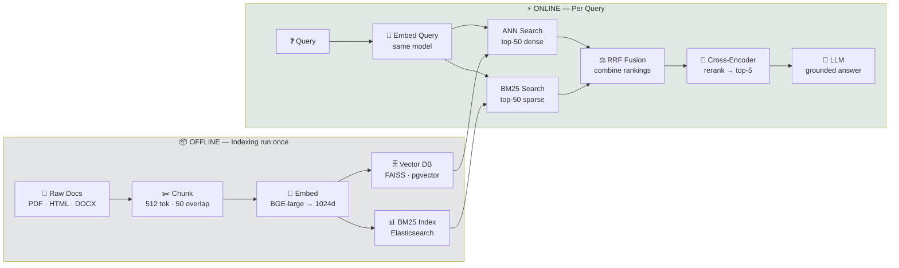

# RAG End to End — Retrieval-Augmented Generation with Numbers

**Corpus throughout:**

```
D1: "cat sat on mat"           ← keyword match
D2: "sat sat sat on mat"       ← keyword-heavy, repeated "sat"
D3: "cat rested on mat"        ← semantically about cat sitting, no literal "sat"
D4: "dog ran on grass"         ← off-topic
```

**Query:** "cat sat"

Embedding dimension: d=2, dim_0 = how "cat-related" the chunk is, dim_1 = how "sitting/location-related" the chunk is

---

## 0. Why RAG Exists

A pretrained LLM has three hard limitations:

**1. Knowledge cutoff** Training data has a date. Ask GPT-3 (April 2021) about a 2023 event — it hallucinates or says it doesn't know.

**2. Hallucination** LLMs generate the most probable next token, not the true next token. They will confidently invent facts, citations, numbers that don't exist.

**3. No source attribution** You can't ask "where did you get that?" because the answer came from compressing billions of tokens into weights.

**RAG solution:**
```
Instead of relying on weights for knowledge:
1. Store knowledge in a document corpus (always current, always inspectable)
2. At query time: retrieve the relevant documents
3. Inject them into the LLM's context window
4. LLM reads and summarizes — it's not generating from memory, it's reading

Hallucination drops. Sources are traceable. Knowledge stays current.
```

---

## 1. RAG Pipeline — Two Phases

```
INDEXING (offline, done once)
Documents → Chunk → Embed → Store in Vector DB
                ↓
        (index built, ready to query)

RETRIEVAL + GENERATION (online)
Query → Embed → Search → Rerank → Build Prompt → LLM → Answer
```



---

## 2. Phase 1: Indexing

### 2.1 Chunking

You cannot embed entire documents as one vector — a 50-page PDF loses all fine-grained meaning when collapsed to a single vector. You split it into chunks first.

**Fixed-size chunking** (most common):

```
Document: "cat sat on mat. the cat was happy. the mat was soft. a dog ran past."

Chunk size: 5 tokens, Overlap: 2 tokens

Chunk 1: "cat sat on mat"
Chunk 2: "on mat the cat was happy"   ← "mat the" repeated
Chunk 3: "was happy the mat was"
Chunk 4: "the mat was soft a"
...
```

Overlap prevents an answer from being split across two chunks that each lack context.

**Why overlap matters:**
```
Without overlap, chunk boundary at "cat sat | on mat":
  Query: "where did cat sit?" → retrieves "cat sat" chunk → answer: unknown

With overlap (the phrase "cat sat on mat" appears in one chunk):
  Query: "where did cat sit?" → retrieves "cat sat on mat" chunk → answer: mat ✓
```

**Our toy corpus** — each document IS a chunk (already small):
```
Chunk 1 (D1): "cat sat on mat"
Chunk 2 (D2): "sat sat sat on mat"
Chunk 3 (D3): "cat rested on mat"
Chunk 4 (D4): "dog ran on grass"
```

### 2.2 Embedding — Chunk to Dense Vector

Each chunk gets converted to a dense vector by an embedding model. Semantically similar chunks → similar vectors.

**Chunk embeddings (defined for our toy corpus):**

```
          dim_0   dim_1
         (cat)   (sit/location)
D1:  [0.85, 0.75]   → cat + sitting = high in both
D2:  [0.30, 0.86]   → mostly "sat" keywords, low cat relevance
D3:  [0.79, 0.68]   → about cat resting (near-synonym to sitting)
D4:  [0.10, 0.50]   → dog, not cat; some location signal
```

**Query embedding:**
```
Query: "cat sat"
Q:   [0.80, 0.80]   → cat + sitting = high in both
```

In production: these are 768-dim or 1536-dim vectors from models like `text-embedding-3-small` (OpenAI), `bge-large-en` (BAAI), or `e5-large` (Microsoft).

### 2.3 Storing in a Vector Database

The embedding vectors are stored in a vector database (FAISS, Pinecone, Weaviate, pgvector) alongside the original chunk text.

```
Vector DB record:
  id:        "D1"
  text:      "cat sat on mat"
  embedding: [0.85, 0.75]
  metadata:  {source: "doc1.pdf", page: 1}
```

At query time the DB finds the nearest neighbors to the query vector — fast approximate search using HNSW or IVF indexing.

---

## 3. Phase 2: Retrieval

### 3.1 Dense Retrieval — Cosine Similarity

**Step 1: Embed the query**

```
Query: "cat sat"  →  Q = [0.80, 0.80]
```

**Step 2: Compute cosine similarity against all chunk vectors**

```
cosine(Q, D) = (Q · D) / (||Q|| × ||D||)

||Q|| = √(0.80² + 0.80²) = √(0.6400 + 0.6400) = √1.2800 = 1.13137

cosine(Q, D1):
  Q · D1 = 0.80×0.85 + 0.80×0.75 = 0.680 + 0.600 = 1.280
  ||D1|| = √(0.85² + 0.75²) = √(0.7225 + 0.5625) = √1.2850 = 1.13358
  cosine(Q, D1) = 1.280 / (1.13137 × 1.13358) = 1.280 / 1.28250 = 0.99805

cosine(Q, D2):
  Q · D2 = 0.80×0.30 + 0.80×0.86 = 0.240 + 0.688 = 0.928
  ||D2|| = √(0.30² + 0.86²) = √(0.0900 + 0.7396) = √0.8296 = 0.91082
  cosine(Q, D2) = 0.928 / (1.13137 × 0.91082) = 0.928 / 1.03047 = 0.90055

cosine(Q, D3):
  Q · D3 = 0.80×0.79 + 0.80×0.68 = 0.632 + 0.544 = 1.176
  ||D3|| = √(0.79² + 0.68²) = √(0.6241 + 0.4624) = √1.0865 = 1.04235
  cosine(Q, D3) = 1.176 / (1.13137 × 1.04235) = 1.176 / 1.17928 = 0.99721

cosine(Q, D4):
  Q · D4 = 0.80×0.10 + 0.80×0.50 = 0.080 + 0.400 = 0.480
  ||D4|| = √(0.10² + 0.50²) = √(0.0100 + 0.2500) = √0.2600 = 0.50990
  cosine(Q, D4) = 0.480 / (1.13137 × 0.50990) = 0.480 / 0.57689 = 0.83205
```

**Dense retrieval scores and ranking:**
```
D1: 0.99805 → rank 1
D3: 0.99721 → rank 2  (semantic match — "rested" ≈ "sat")
D2: 0.90055 → rank 3  (keyword span didn't help — embedding sees low cat-relevance)
D4: 0.83205 → rank 4
```

Note how close D1 and D3 are — 0.99805 vs 0.99721, a gap of 0.0008. With a 2-D toy embedding almost everything points the same way; in a real 1024-D space the separation is far wider. Don't read significance into toy margins.

Key insight: D3 ("cat rested on mat") ranks 2nd even though it contains neither "cat" nor "sat" literally — the embedding captures that "rested" is semantically close to "sat."

### 3.2 Sparse Retrieval — BM25

BM25 works on exact keyword overlap. No semantics, just term frequency.

**Setup:**
```
N = 4 documents
Query terms: "cat", "sat"

Document frequencies:
  cat: in D1, D3  → df(cat) = 2
  sat: in D1, D2  → df(sat) = 2
```

**BM25 IDF (using standard formula):**
```
IDF_BM25(t) = log((N − df(t) + 0.5) / (df(t) + 0.5) + 1)

IDF(cat) = log((4−2+0.5) / (2+0.5) + 1) = log(2.5/2.5 + 1) = log(1 + 1) = log(2) = 0.69315
IDF(sat) = log((4−2+0.5) / (2+0.5) + 1) = log(2.5/2.5 + 1) = log(1 + 1) = log(2) = 0.69315
```

Both terms appear in exactly 2 of 4 documents, so they carry identical IDF. Because the IDF is a *common factor* across every document's score, it scales all BM25 scores equally and **cannot change the ranking** — it only sets the absolute magnitude.

**Average document length:**
```
|D1| = 4, |D2| = 5, |D3| = 4, |D4| = 4
avgdl = (4+5+4+4)/4 = 17/4 = 4.25
```

**BM25 score formula (k1=1.5, b=0.75):**
```
BM25(t, d) = IDF(t) × tf × (k1+1) / (tf + k1×(1 − b + b×|d|/avgdl))
```

**BM25 for D1 ("cat sat on mat", |D1|=4):**
```
length_norm = 1 − 0.75 + 0.75×(4/4.25) = 0.25 + 0.70588 = 0.95588
denominator = tf + 1.5×0.95588 = tf + 1.43382

BM25(cat, D1): tf=1
  = 0.69315 × 2.5 / (1 + 1.43382) = 0.69315 × 2.5/2.43382 = 0.69315 × 1.02719 = 0.71200

BM25(sat, D1): tf=1
  = 0.69315 × 2.5/2.43382 = 0.71200

BM25(D1) = 0.71200 + 0.71200 = 1.42400
```

**BM25 for D2 ("sat sat sat on mat", |D2|=5):**
```
length_norm = 1 − 0.75 + 0.75×(5/4.25) = 0.25 + 0.88235 = 1.13235
denominator = tf + 1.5×1.13235 = tf + 1.69853

BM25(sat, D2): tf=3
  = 0.69315 × (3 × 2.5) / (3 + 1.69853) = 0.69315 × 7.5/4.69853 = 0.69315 × 1.59625 = 1.10640

BM25(cat, D2): tf=0  → 0.000

BM25(D2) = 0.000 + 1.10640 = 1.10640
```

Note the **saturation** effect: "sat" appears 3× in D2 but scores only 1.55× what a single occurrence scores in D1 — that is `k1` doing its job. BM25 deliberately refuses to reward keyword stuffing linearly.

**BM25 for D3 ("cat rested on mat", |D3|=4):**
```
BM25(cat, D3): tf=1 → same length as D1, so same value: 0.71200
BM25(sat, D3): tf=0 → 0.000
BM25(D3) = 0.71200 + 0.000 = 0.71200
```

**BM25 for D4: cat=0, sat=0 → BM25(D4) = 0.000**

**BM25 scores and ranking:**
```
D1: 1.42400 → rank 1   (has both "cat" and "sat")
D2: 1.10640 → rank 2   (lots of "sat" but no "cat")
D3: 0.71200 → rank 3   (has "cat" but no "sat")
D4: 0.00000 → rank 4
```

**The disagreement:**
```
Dense: D1 > D3 > D2 > D4   (D3 beats D2 — semantic "rested" ≈ "sat")
BM25:  D1 > D2 > D3 > D4   (D2 beats D3 — "sat" appears 3 times in D2)

Dense caught the semantics. BM25 caught the keyword. Neither alone is perfect.
This is why hybrid retrieval exists.
```

### 3.3 Hybrid Retrieval — Reciprocal Rank Fusion (RRF)

RRF combines ranked lists from multiple retrieval methods without needing to normalize their scores (which have incompatible scales — dense scores are cosine similarities, BM25 scores are weighted term frequencies).

**RRF formula:**
```
RRF_score(d) = Σ 1 / (k + rank_i(d))
k = 60  (constant — dampens effect of rank 1 vs rank 2, prevents top ranks from dominating)
```

**Ranks from each method:**
```
        Dense rank    BM25 rank
D1:         1             1
D2:         3             2
D3:         2             3
D4:         4             4
```

**RRF scores:**
```
D1: 1/(60+1) + 1/(60+1) = 1/61 + 1/61 = 0.01639 + 0.01639 = 0.03279
D3: 1/(60+2) + 1/(60+3) = 1/62 + 1/63 = 0.01613 + 0.01587 = 0.03200
D2: 1/(60+3) + 1/(60+2) = 1/63 + 1/62 = 0.01587 + 0.01613 = 0.03200
D4: 1/(60+4) + 1/(60+4) = 1/64 + 1/64 = 0.01563 + 0.01563 = 0.03125
```

**RRF final ranking:**
```
D1: 0.03279 → rank 1  (best in both methods)
D3: 0.03200 → rank 2  (tied with D2 — semantic strength, offset by the missing keyword)
D2: 0.03200 → rank 2  (tied with D3 — keyword strength, offset by the semantic gap)
D4: 0.03125 → rank 4
```

RRF tied D2 and D3 — correctly uncertain between the keyword-match document and the semantic-match document. The reranker resolves this tie.

**Why the tie is exact, not coincidental:** D3 sits at dense rank 2 and BM25 rank 3; D2 is the mirror image, dense rank 3 and BM25 rank 2. So both compute `1/62 + 1/63` — the same two terms in a different order, and addition commutes. Any document pair whose ranks are swapped between two retrievers will tie under RRF. That is a genuine property of the method, and a good thing to be able to state: **RRF sees only ranks, never scores**, which is exactly why it needs no score normalisation between retrievers with incompatible scales.

**Why k=60?** If k were 0: rank 1 gets score ∞, rank 2 gets 0.5 — too extreme. If k were 1000: all ranks nearly equal — no differentiation. k=60 is empirically shown to work across most retrieval tasks.

### 3.4 Reranking — Cross-Encoder

**Bi-encoder (what we used above):** Embed query once. Embed each document once. Compare with dot product. Fast: O(1) per query after indexing. But embeddings are independent — query and document don't interact.

**Cross-encoder:** Concatenate query + document, run through a transformer together. The attention layers let query tokens attend to document tokens directly. Slow: must run full forward pass per (query, document) pair. But much more accurate.

**Usage pattern:**
```
Step 1: Bi-encoder retrieves top-n=50 candidates (fast)
Step 2: Cross-encoder reranks these 50 → returns top-3 (slow but only 50 pairs)
```

**Cross-encoder scores for our top-3 candidates:**
```
cross_encoder("cat sat", "cat sat on mat")     = 0.95  → directly answers the query
cross_encoder("cat sat", "cat rested on mat")  = 0.88  → semantically correct answer
cross_encoder("cat sat", "sat sat sat on mat") = 0.42  → keyword spam, unnatural text
```

**After reranking:**
```
D1: 0.95 → rank 1
D3: 0.88 → rank 2
D2: 0.42 → rank 3  (demoted — cross-encoder recognizes this as keyword spam)
```

**Why cross-encoder scores D2 lower:** when the transformer sees "cat sat" next to "sat sat sat on mat," the attention pattern recognizes the repetition is unnatural — real documents don't repeat a word 3 times. The model learned this from training on (query, relevant doc) pairs.

**Final retrieved chunks (top-2):**
```
[1] "cat sat on mat"    (D1, score=0.95)
[2] "cat rested on mat" (D3, score=0.88)
```

---

## 4. Phase 3: Generation

### 4.1 Prompt Construction

Assemble the prompt with retrieved chunks injected as context:

```
System: You are a helpful assistant. Answer based only on the provided context.
        If the answer is not in the context, say "I don't know."

Context:
[1] cat sat on mat
[2] cat rested on mat

Question: cat sat — where?

Answer:
```

The instruction "answer based only on context" is the key grounding instruction. Without it, the LLM might blend retrieved context with parametric memory (what it learned during pretraining) and hallucinate.

### 4.2 LLM Forward Pass — Predicting "mat"

Using the GPT-style causal model from our earlier files. After attending to context tokens "cat sat on mat" and the question "cat sat — where?", the model at the last position encodes the question.

**Toy output logits at answer position:**
```
Vocabulary:  cat    mat    on    sat
Logits:     [0.2,   2.1,   0.5,  0.2]
```

The "mat" logit is highest (2.1) because the context explicitly contains "cat sat on mat." The model is reading, not guessing.

**Softmax:**
```
e^0.2 = 1.2214,  e^2.1 = 8.1662,  e^0.5 = 1.6487,  e^0.2 = 1.2214
sum = 1.2214 + 8.1662 + 1.6487 + 1.2214 = 12.2577

P(mat) = 8.1662/12.2577 = 0.6662   ← highest probability
P(on)  = 1.6487/12.2577 = 0.1345
P(cat) = 1.2214/12.2577 = 0.0996
P(sat) = 1.2214/12.2577 = 0.0996
```

`cat` and `sat` share the same logit (0.2), so they **must** get identical probabilities — a useful self-check when you hand-compute a softmax. If two equal logits come out with different probabilities, you have made an arithmetic error.

Model generates: **"mat"** (greedy decoding picks highest probability).

### 4.3 Without RAG — The Hallucination Baseline

Same question to the same model, but WITHOUT retrieved context:

```
Prompt: "cat sat — where?"
```

The model has no context to read from. It generates based on parametric memory — what it learned during pretraining. If the training data didn't include this specific fact, it either: says "I don't know" (if well-aligned), or hallucinate a plausible-sounding answer: "The cat sat on the floor/couch/table."

**The key difference:** with RAG, the model is reading from a document. Without RAG, it's generating from compressed memory. Reading is more reliable than remembering.

---

## 5. Chunking Strategies — When to Use What

### 5.1 Fixed-Size Chunking

```
Split every N tokens, with overlap M tokens.
Typical: N=256-512, M=50-100 (20% overlap)

Pros: simple, fast, consistent chunk sizes
Cons: splits mid-sentence, mid-paragraph — loses context
Use: first pass, large corpora, when chunk boundaries don't matter much
```

### 5.2 Sentence-Based Chunking

```
Split on sentence boundaries (period, ?, !).
Group sentences until chunk_size is reached.

"The cat sat on the mat. The cat was happy."
→ ["The cat sat on the mat. The cat was happy.", "The mat was soft."]

Pros: preserves sentence integrity — no mid-sentence splits
Cons: uneven chunk sizes
Use: question-answering, factual retrieval
```

### 5.3 Semantic Chunking

```
Embed each sentence. Measure cosine similarity between adjacent sentences.
When similarity drops sharply → start new chunk.

"Cat sat on mat. Cat was happy."   similarity=0.85 → same chunk
"Cat was happy. Dog ran outside."  similarity=0.31 → split here!

Pros: chunks align with topic boundaries — most coherent
Cons: slow (embed every sentence), more complex
Use: long documents with clear topic shifts
```

### 5.4 Recursive Character Splitting (LangChain default)

```
Try to split on: \n\n, \n, " ", ".", "!", "?"
(paragraph → line → word → character)

Tries larger units first, falls back to smaller if chunk too large.
Most robust in practice.
```

### 5.5 Chunk Size Tradeoff

```
Small chunks (128 tokens):
  ✓ Precise retrieval — retrieved chunk directly answers question
  ✗ Missing context — chunk might lack the surrounding explanation

Large chunks (1024 tokens):
  ✓ Rich context — LLM has full paragraph to reason from
  ✗ Noisy retrieval — embedding averages the whole paragraph, blurs signal

Sweet spot: 256-512 tokens with 50-100 token overlap
```

---

## 6. Embedding Model Choices

| Model | Dim | Best for |
|-------|-----|----------|
| text-embedding-3-small (OpenAI) | 1536 | General purpose, fast, cheap |
| text-embedding-3-large (OpenAI) | 3072 | Higher accuracy, more expensive |
| bge-large-en-v1.5 (BAAI) | 1024 | Best open-source for English |
| e5-large-v2 (Microsoft) | 1024 | Strong on retrieval benchmarks |
| all-MiniLM-L6-v2 (sentence-transformers) | 384 | Fastest, lightweight, good baseline |
| Domain-specific (e.g., medical, legal) | varies | Significant gains on specialized tasks |

**Key rule:** The embedding model used at **indexing time** must be the same used at **query time**. Mixing models means the query vector lives in a completely different space than the document vectors — no meaningful similarity.

---

## 7. Vector Database Internals

### 7.1 Flat Index (Brute Force)

```
Search: compute cosine similarity against ALL vectors, return top-k
Time: O(N × d) per query
Space: O(N × d)
Exact: yes

Our toy example: N=4, d=2 — we did this manually above.
Production use: only for N < 100K (too slow beyond that)
```

### 7.2 HNSW (Hierarchical Navigable Small World)

```
Used by: Pinecone, Weaviate, Qdrant, FAISS (with index)

Build a multi-layer graph where each node connects to its nearest neighbors.
At query time: start from top layer (sparse, long-range connections),
               navigate down to bottom layer (dense, short-range),
               return approximate nearest neighbors.

Time: O(log N) per query ≈ much faster than O(N)
Space: O(N × d + M × connections per node)
Exact: NO — approximate (~95-99% recall)
```

### 7.3 IVF (Inverted File Index)

```
Used by: FAISS (IVF variants)

Cluster all vectors into C centroids (K-means).
For each query: find nearest C_probe centroids, only search within those clusters.

Faster than HNSW for very large N.
Lower recall for small N.

For our toy example (N=4): flat index is exact and instantaneous.
In production with N=10M+, HNSW is standard.
```

---

## 8. RAG Failure Modes

### 8.1 Retrieval Failure — Wrong Chunks Retrieved

```
Query: "what year was the company founded?"
Retrieved: "the company has 500 employees" (high cosine similarity — both about company)
Answer: hallucinated founding year

Fix: better chunking (keep founding year near company name),
     metadata filters (filter by document section),
     query rewriting ("year of founding" instead of "when was it founded")
```

### 8.2 Chunking Split — Answer Split Across Chunks

```
Document: "...the answer is 42. This was discovered in..."
Fixed-size chunk boundary cuts: [...answer is | 42. This was...]
Neither chunk has the complete information.

Fix: increase overlap, use sentence-based chunking
```

### 8.3 Lost in the Middle

```
Research finding: LLMs attend more to content at the beginning and end of long contexts.
If the relevant chunk is in position 10 of 20 retrieved chunks, the model may miss it.

Fix: put most relevant chunks FIRST AND last,
     reduce retrieved k (retrieve 3 well-reranked chunks, not 20 weakly-ranked ones)
```

### 8.4 Context-Answer Mismatch

```
Retrieved context answers a different interpretation of the question.
Query: "apple price" → retrieved: Apple Inc. stock price (not the fruit price)

Fix: query expansion, clarification step, or HyDE (generate a hypothetical answer,
     embed it, retrieve documents similar to the hypothetical answer)
```

### 8.5 Outdated Index

```
Documents updated, index not re-indexed.
Model answers from stale retrieved context.

Fix: incremental re-indexing on document updates,
     timestamp metadata + filter (only retrieve docs modified < 30 days ago)
```

---

## 9. RAG vs Fine-Tuning

| Question | RAG | Fine-Tuning |
|----------|-----|-------------|
| Knowledge changes frequently? | ✓ Update corpus, no retraining | ✗ Retrain on new data |
| Need source attribution? | ✓ Show which chunks were retrieved | ✗ No traceability |
| Private/confidential data? | ✓ Data never in model weights | ✗ Data baked into weights |
| Consistent format/style? | ✗ Generation style varies | ✓ Fine-tuning enforces style |
| Specialized vocabulary? | ✗ LLM may not know domain terms | ✓ Fine-tuning teaches vocabulary |
| Low latency required? | ✗ Retrieval adds 50-200ms | ✓ Single forward pass |
| Small labeled dataset? | ✓ Works with zero labels | ✗ Fine-tuning needs labels |

**Decision rule:** Knowledge-intensive (facts, documents, private data) → RAG. Behavior-intensive (format, style, persona, domain syntax) → Fine-tuning. Both → RAG + fine-tuning (most production systems).

---

## 10. Advanced RAG Patterns

### 10.1 HyDE — Hypothetical Document Embeddings

```
Problem: query "cat sat where?" is short — weak retrieval signal.

Solution:
1. Ask LLM: "Write a hypothetical answer to: cat sat where?"
2. LLM generates: "The cat sat on the mat, which was placed on the floor."
3. Embed this hypothetical answer
4. Use its embedding to retrieve — now you're matching document-style text to documents

Why it works: the hypothetical answer is in the same style as documents → better embedding match.
```

### 10.2 Query Decomposition

```
Complex query: "compare cat sitting habits vs dog running habits"

Decompose into:
  Sub-query 1: "where do cats sit?"
  Sub-query 2: "where do dogs run?"

Retrieve for each → merge → generate answer that addresses both.
```

### 10.3 Multi-Hop RAG

```
Query: "what material is the object the cat sat on made of?"

Hop 1: retrieve "cat sat on mat" + answer: mat
Hop 2: query updated to "what is mat made of?" + retrieve "mat is made of wool" + answer: wool

Final: "The mat, which the cat sat on, is made of wool."
```

### 10.4 Self-RAG

```
Standard RAG always retrieves, even for simple queries.
"what is 2+2?" doesn't need retrieval.

Self-RAG: LLM generates a "retrieve?" token first.
  - If [Retrieve]=YES: retrieve + generate with context
  - If [Retrieve]=NO: generate directly from parametric knowledge

More efficient, better calibrated.
```

---

## 11. Code

### 11.1 Full RAG Pipeline from Scratch (NumPy)

```python
import numpy as np
from collections import Counter

# — CORPUS ——————————————————————————————————————————————————————
corpus = {
    "D1": "cat sat on mat",
    "D2": "sat sat sat on mat",
    "D3": "cat rested on mat",
    "D4": "dog ran on grass",
}

# — EMBEDDINGS ————————————————————————————————————————————————
# In production: use an embedding model (e.g. sentence-transformers)
# Here: hand-crafted 2D embeddings for illustration
embeddings = {
    "D1": np.array([0.85, 0.75]),
    "D2": np.array([0.30, 0.86]),
    "D3": np.array([0.79, 0.68]),
    "D4": np.array([0.10, 0.50]),
}
query_embedding = np.array([0.80, 0.80])

def cosine_similarity(a, b):
    return np.dot(a, b) / (np.linalg.norm(a) * np.linalg.norm(b) + 1e-8)

# — DENSE RETRIEVAL ————————————————————————————————————————————
def dense_retrieve(query_emb, doc_embeddings, top_k=4):
    scores = {
        doc_id: cosine_similarity(query_emb, emb)
        for doc_id, emb in doc_embeddings.items()
    }
    ranked = sorted(scores.items(), key=lambda x: -x[1])
    return ranked[:top_k]

dense_results = dense_retrieve(query_embedding, embeddings)
print("Dense retrieval:")
for rank, (doc_id, score) in enumerate(dense_results, 1):
    print(f"  Rank {rank}: {doc_id} ({corpus[doc_id]}) — cosine={score:.3f}")

# — BM25 —————————————————————————————————————————————————————
def bm25_retrieve(corpus, query, top_k=4, k1=1.5, b=0.75):
    tokenized = {doc_id: text.split() for doc_id, text in corpus.items()}
    query_tokens = query.split()

    df = Counter()
    for tokens in tokenized.values():
        for term in set(tokens):
            df[term] += 1

    N = len(corpus)
    avgdl = sum(len(t) for t in tokenized.values()) / N

    def idf(term):
        return np.log((N - df.get(term, 0) + 0.5) / (df.get(term, 0) + 0.5) + 1)

    scores = {}
    for doc_id, tokens in tokenized.items():
        tf_counts = Counter(tokens)
        doc_len = len(tokens)
        score = 0.0
        for term in query_tokens:
            if term not in tf_counts:
                continue
            tf = tf_counts[term]
            num = tf * (k1 + 1)
            den = tf + k1 * (1 - b + b * doc_len / avgdl)
            score += idf(term) * num / den
        scores[doc_id] = score

    ranked = sorted(scores.items(), key=lambda x: -x[1])
    return ranked[:top_k]

bm25_results = bm25_retrieve(corpus, "cat sat")
print("\nBM25 retrieval:")
for rank, (doc_id, score) in enumerate(bm25_results, 1):
    print(f"  Rank {rank}: {doc_id} ({corpus[doc_id]}) — BM25={score:.3f}")

# — RECIPROCAL RANK FUSION ————————————————————————————————————
def rrf_fusion(ranked_lists, k=60):
    scores = {}
    for ranked in ranked_lists:
        for rank, (doc_id, _) in enumerate(ranked, 1):
            scores[doc_id] = scores.get(doc_id, 0) + 1 / (k + rank)
    return sorted(scores.items(), key=lambda x: -x[1])

hybrid_results = rrf_fusion([dense_results, bm25_results])
print("\nHybrid (RRF) retrieval:")
for rank, (doc_id, score) in enumerate(hybrid_results, 1):
    print(f"  Rank {rank}: {doc_id} ({corpus[doc_id]}) — RRF={score:.5f}")

# — SIMULATED RERANKING ———————————————————————————————————————
# In production: use actual cross-encoder scores
cross_encoder_scores = {"D1": 0.95, "D2": 0.42, "D3": 0.88, "D4": 0.18}
top_k_for_reranking = [doc_id for doc_id, _ in hybrid_results[:3]]
reranked = sorted(top_k_for_reranking, key=lambda x: -cross_encoder_scores.get(x, 0))
print("\nAfter reranking:")
for rank, doc_id in enumerate(reranked, 1):
    print(f"  Rank {rank}: {doc_id} ({corpus[doc_id]}) — cross_score={cross_encoder_scores.get(doc_id, 0):.2f}")

# — PROMPT CONSTRUCTION ——————————————————————————————————————
retrieved_chunks = reranked[:2]
context = "\n".join([f"[{i+1}] {corpus[doc_id]}" for i, doc_id in enumerate(retrieved_chunks)])
prompt = f"""Context:
{context}

Question: cat sat — where?
Answer:"""

print(f"\nFinal prompt:\n{prompt}")
```

### 11.2 Using LangChain

```python
from langchain.text_splitter import RecursiveCharacterTextSplitter
from langchain_community.vectorstores import FAISS
from langchain_openai import OpenAIEmbeddings, ChatOpenAI
from langchain.chains import RetrievalQA
from langchain.schema import Document

# Documents
documents = [
    Document(page_content="cat sat on mat"),
    Document(page_content="cat rested on mat"),
    Document(page_content="dog ran on grass"),
]

# Chunking (already small, but shows the API)
splitter = RecursiveCharacterTextSplitter(chunk_size=100, chunk_overlap=20)
chunks = splitter.split_documents(documents)

# Embedding + Vector Store
embeddings = OpenAIEmbeddings(model="text-embedding-3-small")
vectorstore = FAISS.from_documents(chunks, embeddings)

# Retrieval
retriever = vectorstore.as_retriever(
    search_type="similarity",   # or "mmr" for diversity
    search_kwargs={"k": 3}
)

# QA Chain
llm = ChatOpenAI(model="gpt-4o-mini", temperature=0)
qa_chain = RetrievalQA.from_chain_type(
    llm=llm,
    retriever=retriever,
    return_source_documents=True
)

result = qa_chain.invoke({"query": "cat sat — where?"})
print("Answer:", result["result"])
print("Sources:", [doc.page_content for doc in result["source_documents"]])
```

### 11.3 Hybrid Retrieval with BM25 + Dense (LangChain)

```python
from langchain_community.retrievers import BM25Retriever
from langchain.retrievers import EnsembleRetriever
from langchain_community.vectorstores import FAISS
from langchain_openai import OpenAIEmbeddings

# Sparse retriever (BM25)
bm25_retriever = BM25Retriever.from_documents(chunks)
bm25_retriever.k = 3

# Dense retriever (FAISS)
embeddings = OpenAIEmbeddings()
vectorstore = FAISS.from_documents(chunks, embeddings)
dense_retriever = vectorstore.as_retriever(search_kwargs={"k": 3})

# Hybrid: ensemble with equal weights
ensemble_retriever = EnsembleRetriever(
    retrievers=[bm25_retriever, dense_retriever],
    weights=[0.5, 0.5]   # RRF fusion under the hood
)

docs = ensemble_retriever.invoke("cat sat where?")
for doc in docs:
    print(doc.page_content)
```

### 11.4 Reranking with Cross-Encoder

```python
from sentence_transformers import CrossEncoder
from langchain_community.vectorstores import FAISS
from langchain_openai import OpenAIEmbeddings

# Setup
embeddings = OpenAIEmbeddings()
vectorstore = FAISS.from_documents(chunks, embeddings)
cross_encoder = CrossEncoder("cross-encoder/ms-marco-MiniLM-L-6-v2")

query = "cat sat where?"

# Step 1: Bi-encoder retrieves top-30 candidates (fast)
candidates = vectorstore.similarity_search(query, k=30)

# Step 2: Cross-encoder reranks top-30 → (slow but accurate)
pairs = [(query, doc.page_content) for doc in candidates]
scores = cross_encoder.predict(pairs)
reranked = sorted(zip(scores, candidates), key=lambda x: -x[0])[:3]
print("Reranked results:")
for score, doc in reranked:
    print(f"  score={score:.3f}: {doc.page_content}")
```

---

## 12. Gotchas

1. **Same embedding model at index and query time — non-negotiable.** If you index with `bge-large-en-v1.5` and query with `text-embedding-3-small`, you're comparing apples to oranges. Vector spaces are model-specific. Always log which embedding model was used when building an index.

2. **Chunk size affects recall more than you think.** For a 10-page document, chunk size 256 tokens → ~80 chunks. Smaller chunks → more precise retrieval but may miss surrounding context. Larger chunks → more context but noisier embedding (averages too much). Test both on your actual retrieval task.

3. **k in retrieval is not k in generation.** Retrieve k=20 for reranking, then pass only top-3 to the LLM. Passing 20 chunks burns context tokens (cost + latency) and can confuse the LLM (Lost in the Middle). Keep retrieval-k and generation-k separate parameters.

4. **BM25 requires same tokenization as the index.** If you tokenize with a custom tokenizer at index time, query time frequencies won't match. Use the same preprocessing pipeline for both.

5. **Cosine similarity does NOT mean semantic similarity for all embedding models.** Some older embedding models (Word2Vec, GloVe) produce vectors where dot product is more meaningful than cosine. Modern sentence-transformers are trained specifically for cosine similarity. Always check the model card.

6. **LLMs can still hallucinate even with perfect retrieval.** If the retrieved context is ambiguous or the LLM doesn't follow the instruction to "only use context," hallucination can occur. Evaluate generation quality separately from retrieval quality.

7. **Metadata filters must be set at index time.** If you want to filter by `{"department": "HR"}`, that metadata must be stored in the vector DB when the document is indexed. You can't add metadata filters retroactively without re-indexing.

8. **RRF k=60 is a default, not sacred.** Lowering k emphasizes rank 1 documents. Higher k makes all ranks nearly equal. If your use case requires aggressively preferring the top result (high-precision, low-recall), lower k. If all retrieved docs are similarly relevant, raise k. Usually 60 is fine.

---

## 13. Q&A

**Q: Dense vs sparse retrieval — when does each win?**

Dense (embedding-based) wins when the query uses different words than the document ("Where did the feline rest?" vs "cat sat on mat"). Sparse (BM25) wins when exact keywords matter: exact keyword matches, rare terms, specialized vocabulary (medical ICD codes, legal clauses), and rare-word queries. Hybrid with RRF combines both and consistently outperforms either alone — use ensemble retrieval in production.

**Q: How do you evaluate a RAG pipeline?**

Two separate evaluations: (1) Retrieval: Hit Rate (is the relevant chunk in top-k?), MRR (Mean Reciprocal Rank), NDCG. (2) Generation: Faithfulness (is the answer grounded in retrieved context?), Context Relevance (does it answer the question?), Context Precision (are retrieved chunks actually relevant?). RAGAS is the standard library for RAG evaluation. Never evaluate only end-to-end accuracy — you won't know whether retrieval or generation is failing.

**Q: What's the difference between RAG and a long-context LLM (e.g., Gemini 1M tokens)?**

Long-context LLMs can fit your entire knowledge base in the context window. RAG retrieves only the relevant subset. For small corpus (<1M tokens), long-context is simpler. For large corpora (millions of documents), long-context is impractical and expensive. RAG also provides explainability (which chunks were retrieved?) and is more cost-efficient for repeated queries.

**Q: Why is k=60 used in RRF?**

It's empirically optimal. The idea: if k were 0: rank 1 gets score ∞/1=1.0, rank 2 gets 0.5 — way too extreme. If k were 1000: all ranks 1/1001 ≈ 1/1002 ≈ nearly the same — no differentiation. This prevents the top-ranked document from completely dominating. Cormack et al. (2009) found 60 robust across many retrieval tasks.

**Q: Should the system prompt include retrieved chunks or should they be in the user message?**

In practice: system prompt for permanent instructions ("answer only from context"); user message for the dynamic context + question. Some providers recommend putting long contexts in the user message for performance reasons. For Claude: context in `<documents>` tags inside the user turn. For OpenAI: context in the system message, instruction in system. Always check the model card for optimal prompt structure.

---

## 14. Connections

- `../4.nlp/01_fundamentals/02b_text_representations_end_to_end.md` — BM25 sparse retrieval is an extension of TF-IDF; computed the same way. Cosine similarity between TF-IDF vectors is the classical retrieval baseline before dense embeddings
- `../4.nlp/02_embeddings/02_word2vec_end_to_end.md` — Dense retrieval uses the same cosine similarity concept as Word2Vec nearest neighbors. The embedding model is the modern equivalent of Word2Vec — but sentence-level instead of word-level
- `../5.transformers/02_models/05_bert_end_to_end.md` — The embedding model in dense retrieval is typically a bi-encoder based on BERT. Cross-encoder reranker is literally BERT with a regression head on the [CLS] token
- `../5.transformers/02_models/06_gpt1_end_to_end.md` — The generation step is GPT doing a forward pass on (context + question) as the input — KV cache is critical here — the retrieved context tokens are computed once, reused during generation
- `../6.llms/02b_finetuning_end_to_end.md` — RAG vs fine-tuning decision: RAG for knowledge, fine-tuning for behavior. Domain-specific embedding models are fine-tuned versions of BERT/e5 on (query, document) pairs
