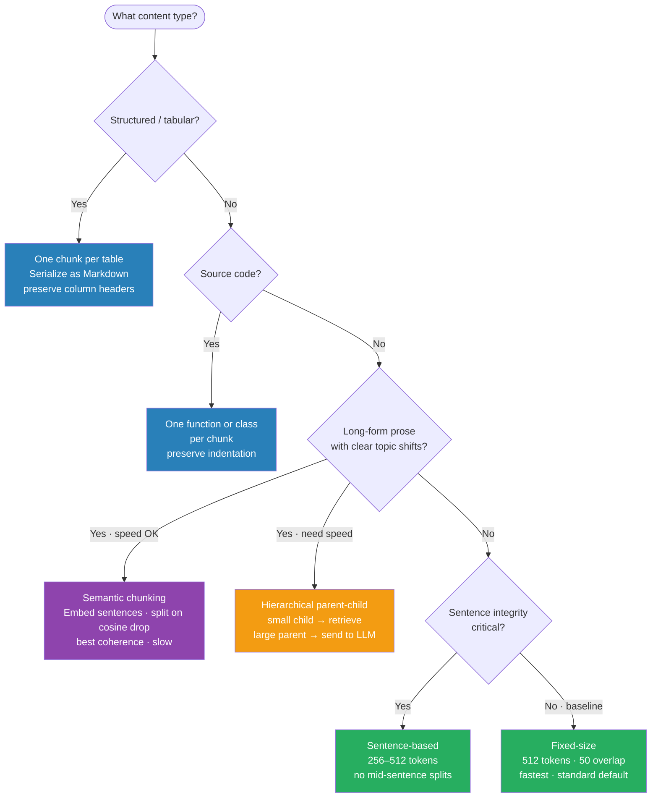

# RAG Pipeline — NLP-side Reference

> The retrieval-side NLP details that make RAG work. Complements the coding sessions in `code_practice/05_rag/` and the system design in `11.system_design/03_search_and_rag_system.md`.

---

## Quick Reference

| Stage | Decision | Default choice |
|-------|----------|----------------|
| Chunking | Strategy + size | Recursive sentence splitter, 512 tokens, 50 overlap |
| Embedding | Model selection | BGE-large or text-embedding-3-large |
| Retrieval | Dense / sparse / hybrid | Hybrid (dense + BM25) with RRF fusion |
| Reranking | Cross-encoder | BGE-reranker-large; skip if latency < 200ms budget |
| Generation | Context window | Top-k=5 chunks after reranking |

---

## 1. Objective

RAG = **Retrieval-Augmented Generation**: supplement an LLM with externally retrieved context at inference time. No weight updates needed for new knowledge. Works best for knowledge-dense, frequently-updated, or domain-specific QA.

---

## 2. The 5-Stage Pipeline

```
OFFLINE (Indexing)
─────────────────────────────────────────────
  Raw docs
     │
     ▼
  [1. Parse]     PDF/HTML/DOCX → plain text + metadata
     │
     ▼
  [2. Chunk]     Split into passages (512 tokens, 50 overlap)
     │
     ▼
  [3. Embed]     bi-encoder (e.g. BGE-large) → vector ∈ R^{1024}
     │
     ▼
  [4. Index]     insert into vector DB (FAISS / pgvector / Pinecone)
                 + optional BM25 index (Elasticsearch / BM25Retriever)

ONLINE (Retrieval + Generation)
─────────────────────────────────────────────
  User query
     │
     ▼
  [5. Retrieve]  dense ANN + BM25 → fuse with RRF → top-50
     │
     ▼
  [6. Rerank]    cross-encoder scores top-50 → keep top-5
     │
     ▼
  [7. Generate]  LLM(system + context chunks + query) → answer
```

---

## 3. Chunking — The Upstream Decision

Chunking quality determines retrieval ceiling. Bad chunks = irrelevant context even with perfect embeddings.

### 4 Strategies

| Strategy | How | When to use |
|----------|-----|-------------|
| Fixed-size | Split every N tokens, M overlap | Baseline; fast; loses semantic coherence |
| Sentence-based | Split at sentence boundaries; group K sentences | Better coherence; uneven lengths |
| Semantic (sliding window) | Embed each sentence; split when cosine drops sharply | Best coherence; slow; expensive |
| Hierarchical (parent-child) | Store large parent + small child chunks; retrieve small, return parent | Long-form documents with context needed around retrieved passage |



### Chunk Size Decisions

| Size range | Effect | Best for |
|------------|--------|----------|
| Small (64-128 tokens) | High precision retrieval; context lost | Keyword-heavy FAQ, structured facts |
| Medium (256-512 tokens) | Balanced; standard default | General QA, most use cases |
| Large (512-1024 tokens) | More context; retrieval noise | Long-form reasoning, technical docs |

**Standard default:** 512 tokens, 50-token overlap.

50-token overlap is the standard — prevents answer from straddling two chunks.

### Special Cases

| Content type | Recommendation |
|--------------|----------------|
| Tables | Serialize as Markdown table; one chunk per table |
| Code | One function or class per chunk; preserve indentation |
| Markdown / headings | Split at heading boundaries; inject heading into each child chunk |
| Long-form prose (book chapters) | Hierarchical: sentence-level child + paragraph-level parent |

---

## 4. Dense vs BM25 vs Hybrid

### When Each Wins

| Query type | Dense retrieval | BM25 | Hybrid |
|------------|-----------------|------|--------|
| Paraphrase / synonym | Best (semantic space) | Poor | Best |
| Exact keyword / entity | Mediocre | Best | Best |
| Out-of-domain vocab | Degrades | Robust | Best |
| Long tail / rare terms | Poor | Better | Best |

**Empirical result:** Hybrid RRF outperforms either method alone by 3-8% recall@10 on standard QA benchmarks (BEIR suite). Default to hybrid unless latency is extremely tight.

### Reciprocal Rank Fusion (RRF)

```python
def rrf(rankings: list[list[str]], k: int = 60) -> dict[str, float]:
    """
    rankings: list of ranked doc-id lists (one per retrieval method)
    k: smoothing constant (60 is standard)
    Returns fused score dict
    """
    scores = {}
    for ranking in rankings:
        for rank, doc_id in enumerate(ranking, start=1):
            scores[doc_id] = scores.get(doc_id, 0) + 1.0 / (k + rank)
    return dict(sorted(scores.items(), key=lambda x: x[1], reverse=True))


# Usage
dense_ranking  = ["D1", "D3", "D2", "D4"]   # from ANN search
sparse_ranking = ["D1", "D3", "D2", "D4"]   # from BM25
fused = rrf([dense_ranking, sparse_ranking])
# → D1=0.03279, D3=D2=0.03200, D4=0.03125
```

RRF is robust to score scale differences between retrieval methods — no normalization needed.

---

## 5. Reranking — Cross-Encoders

**Problem:** Bi-encoders embed query and document independently → efficient but less accurate.
**Solution:** Cross-encoder sees (query, document) together → full attention → more accurate relevance score.

### Bi-encoder vs Cross-encoder

| Property | Bi-encoder | Cross-encoder |
|----------|-----------|---------------|
| Input | query + doc encoded separately | (query, doc) pair encoded jointly |
| Speed | Fast (pre-encode docs offline) | Slow (must run at query time, per doc) |
| Accuracy | Good | Better (+10-20% recall) |
| Use | First-stage retrieval (ANN) | Second-stage reranking (top-50 → top-5) |

### Two-Stage Architecture

```
Query → [Bi-encoder ANN] → top-50 candidates
                               │
                      [Cross-encoder reranker]
                               │
                          top-5 final docs → LLM
```

Typical recall lift: **+10-20% on top-5** vs bi-encoder alone.

### Reranker Models (2024-2025)

| Model | Notes |
|-------|-------|
| BGE-reranker-large | Best open-source; 560M params; strong on English |
| Cohere Rerank 3 | API-based; multilingual; strong on enterprise docs |
| Jina Reranker v2 | Multilingual; open weights; ~137M params |
| MixedBread mxbai-rerank-large | Good quality/speed trade-off |

### When to Skip the Reranker

- Latency budget is below 200ms total
- Top-1 retrieval is already > 90% (measured by retrieval eval)
- Corpus is small (< 1K docs) — ANN precision already high

---

## 6. Embedding Fine-Tuning for Domain-Specific Retrieval

Off-the-shelf embeddings underperform in specialized domains (legal, medical, code, internal docs). Fine-tuning the bi-encoder on in-domain (query, passage) pairs is the highest-ROI improvement.

### Contrastive Training Setup

```python
from sentence_transformers import SentenceTransformer, InputExample, losses
from torch.utils.data import DataLoader

model = SentenceTransformer("BAAI/bge-large-en-v1.5")

# Each example: anchor=query, positive=relevant passage, negatives=hard negatives
train_examples = [
    InputExample(texts=["query text", "relevant passage"], label=1.0),
    # ...
]

train_dataloader = DataLoader(train_examples, shuffle=True, batch_size=16)
train_loss = losses.MultipleNegativesRankingLoss(model)

model.fit(
    train_objectives=[(train_dataloader, train_loss)],
    epochs=3,
    warmup_steps=100,
    output_path="./bge-finetuned"
)
```

### Hard Negative Mining

Random negatives are too easy. Use **hard negatives**: passages retrieved by the current model that are NOT the answer.

```python
# Mine hard negatives using existing model
retrieved = model.encode(queries, convert_to_tensor=True)
# docs with high cosine similarity but wrong answer → hard negatives
```

### Typical Lift

| Model | Off-the-shelf Recall@5 | After fine-tuning |
|-------|------------------------|-------------------|
| BGE-large | 75% | 88-93% |
| text-embedding-3-large | 72% | 85-90% |

Fine-tuning with ~1K-5K (query, positive) pairs is often sufficient for domain shift.

---

## 7. Failure Modes

| Failure | Symptom | Fix |
|---------|---------|-----|
| Hallucination with good retrieval | Model ignores context; makes up answer | Stronger system prompt: "Answer ONLY using the provided context. If unsure, say 'I don't know.'"; use NLI hallucination detection |
| Wrong chunks retrieved | Semantically similar but wrong topic | Add metadata filters (date, department, doc type); hybrid retrieval; fine-tune embedder |
| Reranker hurts recall | Cross-encoder promotes wrong docs | Evaluate reranker independently; may need domain fine-tuning |
| Out-of-domain refusal | Model says "I don't have info" even with good context | Check system prompt framing; test if chunks are actually being injected |
| Context too long | LLM ignores middle chunks | "Lost in the middle" effect — put most relevant chunk first AND last; reduce k |
| Source attribution lost | Can't trace answer to specific passage | Track chunk IDs through pipeline; inject source into chunk metadata; return citations |

---

## 8. Interview Questions

**Q: Why use hybrid retrieval instead of just dense?**

Dense retrieval excels at semantic similarity (paraphrases, synonyms) but struggles with exact keyword matching and rare/out-of-vocabulary terms. BM25 handles exact terms robustly but misses semantic matches. Hybrid with RRF gets both: 3-8% recall@10 improvement on BEIR benchmarks with no additional latency at retrieval time (BM25 is cheap). Always default to hybrid.

**Q: Why is chunk size critical?**

Too small → semantically incomplete; the embedding captures a fragment rather than a thought. Too large → the embedding averages over too much text; irrelevant content dilutes the signal. The retrieved chunk may contain the answer, but surrounded by noise, causing the LLM to miss it or get confused. Standard 512-token chunks with 50-token overlap balances completeness and retrieval precision.

**Q: What's the difference between bi-encoder and cross-encoder, and why use both?**

Bi-encoder: encodes query and document independently into vector space. Fast (pre-compute doc vectors offline, ANN at query time). Used for first-stage retrieval over millions of docs. Cross-encoder: encodes (query, document) pair jointly with full attention. Accurate but slow (runs at query time, per pair). Used as second-stage reranker on the top-50 candidates from bi-encoder. Combined: bi-encoder gets recall (fast, broad), cross-encoder gets precision (accurate, narrow).

**Q: How would you evaluate a RAG pipeline?**

End-to-end with RAGAS: Faithfulness (does the answer follow from the context?), Answer Relevancy (does the answer address the question?), Context Precision (are retrieved chunks relevant?), Context Recall (are all relevant chunks retrieved?). Also isolate: retrieval eval (recall@5, MRR) and generation eval (BLEU/ROUGE vs ground truth). If possible, use LLM-as-Judge for answer quality. A/B test with real user queries.

**Q: How do you prevent RAG hallucination?**

Three layers: (1) Retrieval — improve recall so the answer is actually in the context. (2) Prompt — "Answer only using the provided context. If you're unsure or the context doesn't contain the answer, say 'I don't know.'" (3) Post-generation verification — NLI model (BART-large-mnli) checks if the generated claim is entailed by the retrieved passages. Any contradiction is flagged. CRAG (Corrective RAG) adds a judge that queries the web if retrieval confidence is low.

---

## 9. Further Reading

- **BEIR Benchmark** — Thakur et al. 2021; heterogeneous retrieval eval across 18 datasets
- **BGE paper** — BAAI 2023; training recipe for bi-encoder fine-tuning
- **Lost in the Middle** — Liu et al. 2023; LLMs attend to start+end of context, not middle
- **CRAG** — Yan et al. 2024; Corrective RAG with adaptive retrieval confidence

---

## Code Practice

- `code_practice/05_rag/` — RAG coding sessions
- `../11.system_design/03_search_and_rag_system.md` — system design for RAG at scale

---

## Connections

| This file | Links to |
|-----------|----------|
| RAG end-to-end dry-run | `01b_rag_end_to_end.md` |
| RAG reference (full pipeline) | `01_rag.md` |
| Indirect prompt injection | `03_indirect_prompt_injection.md` |
| System design for RAG | `../11.system_design/03_search_and_rag_system.md` |
| RAGAS evaluation | `../6.llms/04_evaluation.md` |
