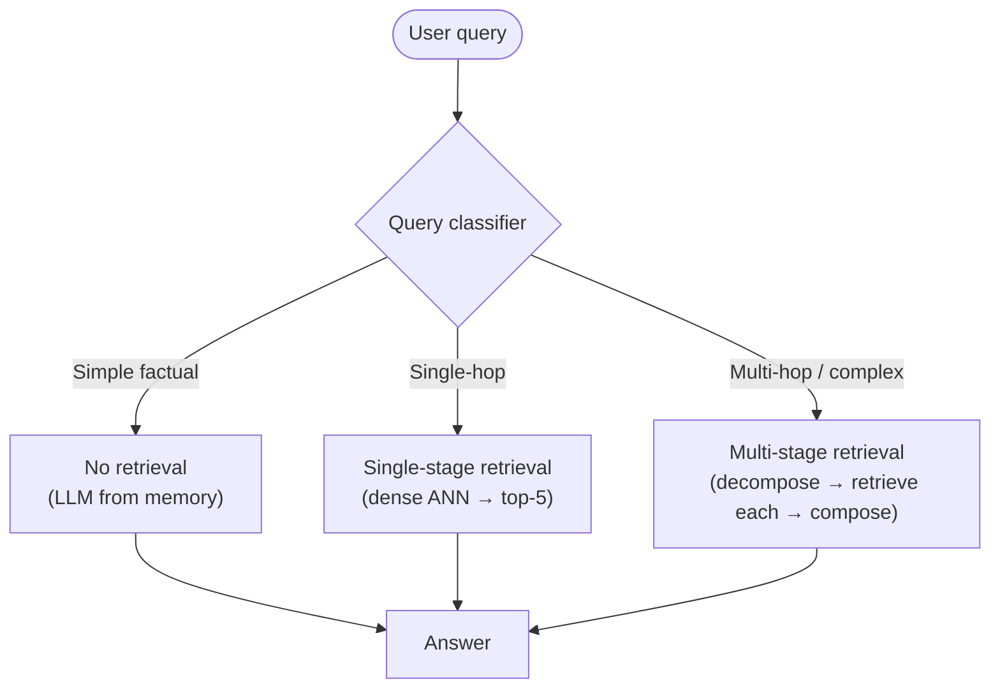
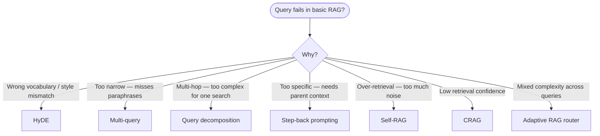

# Advanced RAG — Query Transformation Techniques

> Pipeline mechanics (chunking, hybrid retrieval, reranking) → `02_rag_pipeline.md`. This file owns the query-side intelligence layer: how to transform what the user asked before and after retrieval.

---

## Quick Reference

| Technique | Problem solved | Latency cost | When to use |
|-----------|---------------|-------------|-------------|
| Multi-query | Query too narrow → misses relevant chunks | +1 LLM call | Default upgrade from naive RAG |
| HyDE | Semantic gap between question style and document style | +1 LLM call | Technical docs, legal, financial |
| Query decomposition | Complex multi-hop question | +1-2 LLM calls | Research tasks, multi-entity questions |
| Step-back prompting | Hyper-specific query retrieves too narrowly | +1 LLM call | Specialized domain QA |
| Self-RAG | Over-retrieval wastes context and tokens | +judge LLM calls | Cost-sensitive production systems |
| CRAG | Retrieval confidence is unknowable without checking | +judge + optional web call | High-accuracy requirements |

---

## 1. Why Query Transformation Exists

Naive RAG embeds the user query directly and searches. The failure modes:

- User asks "what are the penalties?" — document says "consequences" → semantic gap
- User asks a complex multi-hop question → single vector captures neither sub-question
- User asks a very specific detail → embedding anchors to specific words, misses the broader passage that contains the answer
- Document corpus uses jargon the user doesn't → embeddings live in different regions of the space

Query transformation adds an intelligence layer *before* retrieval that makes the query harder to miss.

---

## 2. Multi-Query Retrieval

Generate N reformulations of the user query, retrieve for each, deduplicate, merge.

```
User query: "What documents do I need for a mortgage?"
    │
    LLM generates 3 variants:
    ├── "mortgage application required documentation"
    ├── "home loan paperwork checklist"
    └── "documents to submit for property financing"
    │
    Retrieve top-k for each → union → deduplicate by doc ID → rerank merged set
```

```python
from langchain.retrievers.multi_query import MultiQueryRetriever
from langchain_openai import ChatOpenAI

llm = ChatOpenAI(temperature=0)
retriever = MultiQueryRetriever.from_llm(
    retriever=vectorstore.as_retriever(search_kwargs={"k": 5}),
    llm=llm,
)
docs = retriever.get_relevant_documents("What documents do I need for a mortgage?")
```

**Typical lift:** +10-20% recall@5 vs single-query. Main cost: one extra LLM call per query.

---

## 3. HyDE — Hypothetical Document Embeddings

**Problem:** A user question and its answer live in different parts of embedding space. Questions look like questions; answers look like answers.

**Solution:** Ask the LLM to generate a hypothetical answer (without retrieval). Embed the hypothetical answer. Search for real documents similar to that hypothetical.

```
User: "What is the maximum LTV ratio for a first-time buyer mortgage?"
    │
    LLM generates hypothetical answer:
    "For first-time buyers, the maximum loan-to-value ratio is typically 95%
     under the Help to Buy scheme, requiring a 5% deposit..."
    │
    Embed the hypothetical answer → ANN search
    (The hypothetical answer is in document style → matches real documents better)
    │
    Return actual retrieved documents → LLM generates real answer
```

```python
from langchain.chains import HypotheticalDocumentEmbedder
from langchain_openai import OpenAIEmbeddings, ChatOpenAI

base_embeddings = OpenAIEmbeddings()
llm = ChatOpenAI()

embeddings = HypotheticalDocumentEmbedder.from_llm(
    llm=llm,
    base_embeddings=base_embeddings,
    custom_instructions="Generate a short passage that would answer the question:"
)
query_embedding = embeddings.embed_query("What is the max LTV for first-time buyers?")
```

**When HyDE wins:** Technical documentation, legal/financial text, academic papers — domains where question vocabulary diverges sharply from document vocabulary.

**When HyDE fails:** Short factual lookups (adds latency with no benefit), very small corpora (retrieval precision already high).

---

## 4. Query Decomposition

Break a complex multi-hop question into sub-questions. Retrieve and answer each independently. Compose the sub-answers into a final answer.

```
Complex: "Compare the capital requirements for retail banks vs investment banks under Basel III"
    │
    Decompose:
    ├── Sub-Q1: "Basel III capital requirements for retail banks"
    ├── Sub-Q2: "Basel III capital requirements for investment banks"
    └── Sub-Q3: "How do Basel III requirements differ by bank type?"
    │
    Retrieve + answer each sub-question
    │
    Compose: combine sub-answers with LLM
```

**Variants:**

| Variant | How | Best for |
|---------|-----|----------|
| Sequential | Answer Q1, inject answer into Q2 context | Dependent sub-questions |
| Parallel | Retrieve all sub-questions simultaneously | Independent sub-questions |
| Tree-of-queries | Hierarchical decomposition | Very complex research questions |

---

## 5. Step-Back Prompting

Take one step back from the specific query to retrieve the broader context first.

**Problem:** "What is the penalty rate on Al Rajhi's savings account for early withdrawal?" → retrieves only early withdrawal clauses, misses the general savings account terms that provide context.

**Solution:**

```
Specific: "What is the penalty rate on Al Rajhi savings early withdrawal?"
    │
    Step-back: "What are Al Rajhi savings account terms and conditions?"
    │
    Retrieve → LLM combines broader context with specific question
```

Particularly useful in financial and legal QA where answer requires understanding the parent context before the specific clause.

---

## 6. Self-RAG — Selective Retrieval with Reflection

**Problem:** Standard RAG always retrieves, whether or not the query needs external context. This wastes tokens and can introduce noise.

**Self-RAG trains the LLM to decide:**
1. Should I retrieve? (retrieve vs no-retrieve)
2. Is the retrieved passage relevant? (relevant / irrelevant / no-support)
3. Is my generation faithful to the passage? (fully supported / partially / not)
4. Is my generation a useful response? (utility: 1-5)

```
User query
    │
    LLM predicts: [Retrieve] or [No Retrieve]
    │
    If [Retrieve]: fetch top-k passages
    │
    For each passage: LLM predicts [Relevant] or [Irrelevant]
    │
    Generate with relevant passages: LLM predicts [Fully Supported] / [Not Supported]
    │
    Among supported outputs: LLM predicts utility score (1-5)
    │
    Return highest-utility, fully-supported output
```

**When to use:** Systems where over-retrieval is expensive (API cost, latency), or where factual precision is critical. Requires fine-tuning on the Self-RAG dataset or using a model trained with self-reflection.

---

## 7. CRAG — Corrective RAG

**Problem:** How do you know if your retrieved documents actually contain the answer? Most RAG systems don't check.

**CRAG adds a retrieval evaluator** that scores confidence in the retrieved documents:

```
Retrieve documents
    │
    Evaluator (small LLM/classifier): 
    ├── Confident → proceed to generation with retrieved docs
    ├── Ambiguous → refine: decompose query + re-retrieve
    └── Incorrect → web search → combine web + retrieved knowledge
    │
    Knowledge refinement: strip irrelevant sentences, keep relevant passages
    │
    Generate answer
```

**Key components:**
- Retrieval evaluator: lightweight classifier trained on (query, document, label) pairs
- Web search fallback: triggers only when confidence is low (Tavily / SerpAPI)
- Knowledge stripper: decomposes long documents into fine-grained knowledge strips, scores each for relevance

**When to use:** High-accuracy QA where "I don't know" is acceptable but hallucination is not. Domain-limited corpora where some queries fall outside.

---

## 8. Adaptive RAG

Route queries to different retrieval strategies based on query complexity:



Train a lightweight query classifier (or use an LLM prompt) to route:
- Simple factual (capital of France) → no retrieval needed
- Single-hop domain question → standard RAG
- Complex multi-entity / comparative question → iterative retrieval

---

## 9. Choosing a Technique



---

## 10. Interview Questions

**Q: What is HyDE and when does it help?**

HyDE (Hypothetical Document Embeddings) generates a hypothetical answer to the user's question, then embeds that hypothetical to search for real documents. It helps when the user's question and the document's answer use different vocabulary — the hypothetical bridges them. It's most effective in technical, legal, or financial domains where question style (natural language) diverges from document style (formal prose). Downside: adds one LLM call per query.

**Q: When should you use multi-query vs HyDE?**

Multi-query when the issue is vocabulary breadth — the user's phrasing is one of many valid ways to express the intent. HyDE when the issue is query-document style mismatch — the question looks like a question and documents look like answers. In practice, they're complementary and can be combined: generate 3 hypothetical answers, embed each, union the retrieved sets.

**Q: What is Self-RAG and how does it differ from standard RAG?**

Standard RAG always retrieves unconditionally. Self-RAG trains the model to emit special reflection tokens that decide: (1) whether to retrieve, (2) whether each retrieved passage is relevant, (3) whether the generation is supported by the passage, and (4) the utility of the output. This selective retrieval reduces noise and cost. It requires either a Self-RAG fine-tuned model or a judge-LLM prompting approach at inference time.

**Q: How does CRAG handle retrieval failure?**

CRAG adds a lightweight retrieval evaluator after the first retrieval pass. If confidence is high, it proceeds. If ambiguous, it refines the query and re-retrieves. If incorrect, it falls back to web search and combines the web result with any relevant parts of the original retrieval. The web fallback makes CRAG particularly robust for open-domain questions that fall outside the indexed corpus.

---

## Connections

| Topic | File |
|-------|------|
| Pipeline mechanics (chunking, hybrid retrieval, reranking) | [02_rag_pipeline.md](02_rag_pipeline.md) |
| RAG evaluation (RAGAS metrics) | [05_rag_evaluation.md](05_rag_evaluation.md) |
| Production RAG ops | [06_production_rag.md](06_production_rag.md) |
| Indirect prompt injection | [03_indirect_prompt_injection.md](03_indirect_prompt_injection.md) |
| LangGraph for stateful RAG agents | [../8.agents/04_langgraph_deep.md](../8.agents/04_langgraph_deep.md) |
| Agent memory (RAG as long-term memory) | [../8.agents/05_agent_memory.md](../8.agents/05_agent_memory.md) |
| LLM evaluation (RAGAS summary) | [../6.llms/04_evaluation.md](../6.llms/04_evaluation.md) |
| Production RAG ops depth | [../10.mlops/13_production_rag_ops.md](../10.mlops/13_production_rag_ops.md) |

---

## Code Practice

- `code_practice/07_rag/03_advanced_rag.py` — hybrid search + reranking + HyDE implementation
