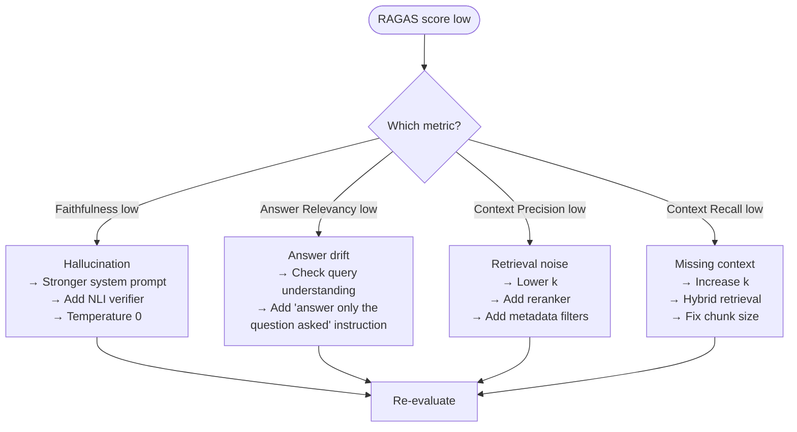

# RAG Evaluation Framework

> RAGAS summary in `../6.llms/04_evaluation.md`. This file is the SSOT for RAG-specific evaluation: RAGAS metrics in depth, retrieval-only eval, LLM-as-judge, dataset creation, and continuous eval in CI.

---

## Quick Reference

| What you're evaluating | Metric | Tool |
|-----------------------|--------|------|
| Full RAG pipeline quality | RAGAS (4 metrics) | `ragas` library |
| Retrieval quality alone | Recall@k, MRR, NDCG | `ranx` or custom |
| Generation quality vs ground truth | ROUGE-L, BERTScore | `evaluate` library |
| Answer quality (no ground truth) | LLM-as-judge | GPT-4 / Sonnet prompt |
| Consistency across runs | Variance of RAGAS scores | `ragas` with multiple runs |

---

## 1. Why RAG Evaluation Is Hard

Standard NLP metrics (BLEU, ROUGE) measure surface-form similarity. RAG answers are often correct but phrased differently from ground truth. The RAG pipeline has two failure points:

- **Retrieval failure:** relevant passages not retrieved → LLM can't answer correctly even if it tries
- **Generation failure:** relevant passages retrieved but LLM ignores them or hallucinates

You need separate metrics for each failure mode.

---

## 2. RAGAS — The Four Core Metrics

RAGAS (Retrieval Augmented Generation Assessment) evaluates end-to-end using only (question, answer, retrieved_contexts, ground_truth). No labeled relevance judgments needed.

### 2.1 Faithfulness

**"Does the answer follow from the retrieved context?"**

Detects hallucination. The LLM generates claims from the answer, then checks each claim against the context.

```
Answer: "The penalty rate is 2% per month compounded quarterly."
    │
    Claims extracted:
    1. "Penalty rate is 2% per month" → supported in context ✓
    2. "Compounded quarterly" → NOT in context ✗
    │
    Faithfulness = supported_claims / total_claims = 1/2 = 0.5
```

**Ideal score:** 1.0 (all claims grounded in context). If < 0.7, the LLM is hallucinating beyond its context.

### 2.2 Answer Relevancy

**"Does the answer actually address the question?"**

Detects incomplete or off-topic answers. The metric embeds the question and N reverse-engineered questions from the answer, computes cosine similarity.

```
Question: "What are the eligibility requirements for a home loan?"
Answer: "Here is how to apply for a home loan: step 1..." [explains process, not eligibility]
    │
    Reverse questions from answer:
    "How do I apply for a home loan?" → very different from original question
    │
    Answer Relevancy = cosine_sim(original_Q, reverse_Qs) → LOW
```

**Ideal score:** > 0.8. Low scores mean the answer drifted from what was asked.

### 2.3 Context Precision

**"Are the retrieved chunks actually relevant?"**

Measures retrieval precision: out of all retrieved chunks, what fraction are relevant to the question?

```
Retrieved: [chunk_1 (relevant), chunk_2 (irrelevant), chunk_3 (relevant), chunk_4 (irrelevant)]
    │
    Context Precision = (relevant chunks in top positions / total) with rank-weighting
    →  rewards relevant chunks appearing higher in the retrieved list
```

**Ideal score:** > 0.7. Low score means the retriever is pulling in noise.

### 2.4 Context Recall

**"Were all relevant chunks actually retrieved?"**

Measures retrieval recall against ground truth: are the facts in the ground truth answer found in the retrieved context?

```
Ground truth: "Penalty is 2% monthly. Must notify 30 days in advance."
    │
    Fact 1: "Penalty is 2% monthly" → found in retrieved context ✓
    Fact 2: "Must notify 30 days in advance" → NOT in retrieved context ✗
    │
    Context Recall = found_facts / total_ground_truth_facts = 1/2 = 0.5
```

**Ideal score:** > 0.8. Low score → increase k, try hybrid retrieval, or fix chunking.

### 2.5 Metric Summary

| Metric | Detects | Fixes when low |
|--------|---------|----------------|
| Faithfulness | Hallucination | Stronger system prompt, add NLI verifier |
| Answer Relevancy | Answer drift | Improve prompt, check query understanding |
| Context Precision | Retrieval noise | Lower k, add metadata filters, reranker |
| Context Recall | Missing context | Increase k, fix chunking, hybrid retrieval |

---

## 3. RAGAS in Code

```python
from ragas import evaluate
from ragas.metrics import (
    faithfulness,
    answer_relevancy,
    context_precision,
    context_recall,
)
from datasets import Dataset

# Build evaluation dataset
data = {
    "question": ["What is the maximum LTV ratio?"],
    "answer": ["The maximum LTV ratio is 95% for first-time buyers."],
    "contexts": [["...for first-time buyers the LTV shall not exceed 95%..."]],
    "ground_truth": ["The maximum LTV ratio for first-time buyers is 95%."],
}
dataset = Dataset.from_dict(data)

result = evaluate(
    dataset=dataset,
    metrics=[faithfulness, answer_relevancy, context_precision, context_recall],
)
print(result)
# → {'faithfulness': 1.0, 'answer_relevancy': 0.94, 'context_precision': 0.80, 'context_recall': 0.90}
```

---

## 4. Retrieval-Only Evaluation

Evaluate the retriever in isolation before adding the LLM. Requires a labeled test set of (query, relevant_doc_ids).

### Metrics

| Metric | Formula | What it measures |
|--------|---------|-----------------|
| Recall@k | `|relevant ∩ top-k| / |relevant|` | What fraction of relevant docs did you retrieve? |
| Precision@k | `|relevant ∩ top-k| / k` | How much of what you retrieved is relevant? |
| MRR (Mean Reciprocal Rank) | `mean(1 / rank_of_first_relevant)` | How high up is the first relevant result? |
| NDCG@k | Discounted cumulative gain | Rank-weighted relevance |

```python
from ranx import Qrels, Run, evaluate

qrels = Qrels({"q1": {"doc3": 1, "doc7": 1}})  # ground truth relevant docs
run = Run({"q1": {"doc3": 0.95, "doc1": 0.82, "doc7": 0.76}})  # retriever scores

results = evaluate(qrels, run, ["recall@5", "precision@5", "mrr", "ndcg@5"])
```

**Build the test set:** Use LLM-generated Q&A pairs from your documents (see Section 6), or harvest from user feedback logs (clicked → relevant, skipped → irrelevant).

---

## 5. LLM-as-Judge

When you have answers but no ground truth, use an LLM to evaluate quality.

```python
JUDGE_PROMPT = """
You are evaluating a RAG system answer. Score on three dimensions (1-5):
1. Correctness: Is the answer factually correct based on the context?
2. Completeness: Does the answer address all parts of the question?
3. Grounding: Is every claim in the answer supported by the provided context?

Question: {question}
Context: {context}
Answer: {answer}

Return JSON: {{"correctness": int, "completeness": int, "grounding": int, "reasoning": str}}
"""
```

**Key design decisions:**
- Use a stronger model as judge than the one being evaluated (GPT-4 / Claude Sonnet judging GPT-3.5)
- Always include the retrieved context in the judge prompt — judge should verify grounding, not recall from training
- Score on separate dimensions rather than a single number — easier to debug
- Run judge 3× and take the median to reduce variance

**Bias warning:** LLMs favor longer, more confident-sounding answers. Counteract by running positional swap tests (swap A/B order in comparative evaluation).

---

## 6. Building an Evaluation Dataset

Most teams don't have labeled QA pairs. Generate them from your own documents.

### Synthetic Q&A Generation

```python
GENERATE_QA_PROMPT = """
Read the following passage and generate {n} realistic questions that can be answered 
from this passage. Include the answer for each question.
Return JSON: [{{"question": str, "answer": str, "difficulty": "easy|medium|hard"}}]

Passage: {passage}
"""

# For each chunk in your corpus:
# 1. Generate 2-3 Q&A pairs
# 2. Manually review a 10% sample
# 3. Run RAGAS on the synthetic dataset as your baseline
```

**Tooling:** `ragas.testset.generate` (RAGAS testset generator) creates Q&A pairs with multi-hop questions and distractors automatically.

### Difficulty Distribution

| Difficulty | How | Why |
|------------|-----|-----|
| Easy | Answer is a single phrase in one chunk | Tests basic retrieval + extraction |
| Medium | Answer requires synthesizing 2 chunks | Tests multi-chunk reasoning |
| Hard | Answer requires inference, not extraction | Tests LLM reasoning quality |

Target: 40% easy / 40% medium / 20% hard.

---

## 7. Continuous Evaluation in CI

Run RAGAS on every deployment of the RAG pipeline (new model, new chunking, new index).

```yaml
# .github/workflows/rag_eval.yml
- name: Run RAG evaluation
  run: python eval/run_ragas.py --baseline results/baseline.json
  
- name: Gate on faithfulness
  run: python eval/check_gate.py --metric faithfulness --min 0.80
```

**Regression gate thresholds (starting points):**

| Metric | Min acceptable | Block deployment if |
|--------|---------------|---------------------|
| Faithfulness | 0.80 | < 0.75 |
| Answer Relevancy | 0.75 | < 0.70 |
| Context Recall | 0.70 | < 0.65 |
| Context Precision | 0.65 | < 0.60 |

---

## 8. Diagnostic Flowchart



---

## 9. Interview Questions

**Q: What are the four RAGAS metrics and what does each catch?**

Faithfulness checks whether the answer claims are grounded in retrieved context — catches hallucination. Answer Relevancy checks whether the answer addresses the question — catches answer drift. Context Precision checks whether retrieved chunks are actually relevant — catches retrieval noise. Context Recall checks whether all relevant facts made it into the retrieved context — catches retrieval gaps. Each metric isolates a different failure mode, so you know which part of the pipeline to fix.

**Q: How do you evaluate a RAG system without labeled data?**

Three approaches: (1) RAGAS — evaluates without pre-labeled relevance judgments using LLM-based metrics. (2) Synthetic Q&A generation — LLM generates (question, answer) pairs from your chunks; use as labeled test set. (3) LLM-as-judge — prompt a strong model to score correctness, completeness, and grounding. For retrieval alone, user click-through logs (clicked = relevant) are a weak but real signal.

**Q: A client asks "is our RAG better than not using RAG?" How do you prove it?**

A/B test: same questions answered by (1) LLM only, no context and (2) LLM + RAG. Measure faithfulness (RAG should be higher — grounded vs hallucinated), answer relevancy (should be similar or higher with RAG for domain queries), and optionally accuracy vs ground truth answers. Also measure user satisfaction if available. RAGAS faithfulness score of 0.9 (RAG) vs 0.5 (no RAG) is a compelling proof point.

---

## Connections

| Topic | File |
|-------|------|
| Advanced query techniques (HyDE, multi-query) | [04_advanced_rag.md](04_advanced_rag.md) |
| Production RAG ops (semantic cache, drift) | [06_production_rag.md](06_production_rag.md) |
| LLM evaluation (BLEU/ROUGE/BERTScore overview) | [../6.llms/04_evaluation.md](../6.llms/04_evaluation.md) |
| NLP evaluation metrics depth | [../4.nlp/04_applications/04_evaluation_metrics.md](../4.nlp/04_applications/04_evaluation_metrics.md) |
| Production RAG observability | [../10.mlops/13_production_rag_ops.md](../10.mlops/13_production_rag_ops.md) |

---

## Code Practice

- `code_practice/07_rag/04_rag_evaluation.py` — RAGAS pipeline + LLM-as-judge + synthetic dataset generation
