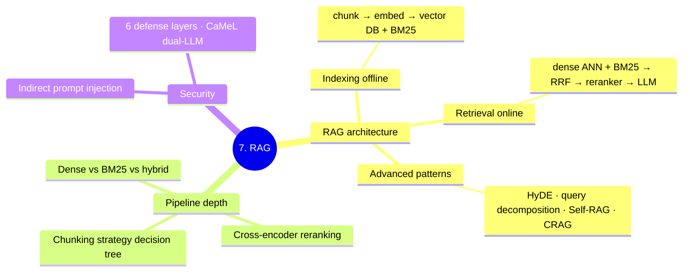

# 7. RAG

Scope: RAG-specific patterns, pipeline depth, threat models.



**Tier: 2 (Theory).** Embedder / retriever theory lives in [../4.nlp/02_embeddings/](../4.nlp/02_embeddings/); production RAG ops in [../10.mlops/13_production_rag_ops.md](../10.mlops/13_production_rag_ops.md); multi-tenant RAG system design in [../11.system_design/10_multi_tenant_rag.md](../11.system_design/10_multi_tenant_rag.md).

---

## Where This Sits

**The learning arc is `6.llms` → `7.rag` → `8.agents`.** This folder is the middle step: RAG is **one tool** an agent can call.

```
6.llms    the engine   — what ONE call does
7.rag     a tool       — retrieval, one capability          ← you are here
8.agents  the loop     — decides WHICH tool, and WHEN
```

**The decision that frames everything here** — RAG vs fine-tuning vs long-context:

| Need | Reach for |
|---|---|
| Knowledge that changes; source attribution; private data | **RAG** |
| Behaviour — format, style, persona, domain syntax | **Fine-tuning** ([../6.llms/02_finetuning.md](../6.llms/02_finetuning.md)) |
| Small corpus (< ~1M tokens), simplicity over cost | **Long context** — just paste it in |
| The model should decide *whether* to retrieve at all | **Agentic RAG** ([../8.agents/00_agent_stack_foundations.md](../8.agents/00_agent_stack_foundations.md) §7) |

Worked comparisons: [01b_rag_end_to_end.md](01b_rag_end_to_end.md) §9 (vs fine-tuning) and §13 (vs long-context).

---

## Reading Order

1. `01_rag.md` — conceptual RAG (architecture, chunking, retrieval, generation patterns)
2. `01b_rag_end_to_end.md` — worked example with numbers + RAGAS evaluation
3. `02_rag_pipeline.md` — pipeline depth: chunking decisions, hybrid retrieval (RRF), cross-encoder reranking
4. `03_indirect_prompt_injection.md` — threat model + 6 defense layers (the #1 RAG security concern)
5. `04_advanced_rag.md` — query transformation: HyDE, multi-query, Self-RAG, CRAG, Adaptive RAG
6. `05_rag_evaluation.md` — RAGAS 4 metrics in depth, retrieval eval, LLM-as-judge, synthetic datasets
7. `06_production_rag.md` — semantic cache, incremental indexing, cost model, A/B testing RAG versions

---

## Folder TOC

| File | Owns |
|------|------|
| `01_rag.md` | Conceptual RAG architecture + overview of advanced patterns |
| `01b_rag_end_to_end.md` | Worked example — chunking → embedding → retrieval → reranking → generation |
| `02_rag_pipeline.md` | SSOT: chunking strategies, hybrid retrieval (RRF code), cross-encoder reranking, embedding fine-tuning |
| `03_indirect_prompt_injection.md` | SSOT: Indirect prompt injection threat + 6 defense layers (capability isolation, structured outputs, CaMeL dual-LLM) |
| `04_advanced_rag.md` | SSOT: Query transformation — HyDE, multi-query, query decomposition, step-back, Self-RAG, CRAG, Adaptive RAG |
| `05_rag_evaluation.md` | SSOT: RAGAS 4 metrics in depth, retrieval-only eval (Recall@k / MRR), LLM-as-judge, synthetic dataset creation |
| `06_production_rag.md` | SSOT: Semantic cache (two-tier), incremental index freshness, cost model, A/B testing RAG versions |

---

## SSOT Topics Owned Here

- RAG conceptual architecture → `01_rag.md`
- RAG pipeline mechanics (chunking, RRF, reranking) → `02_rag_pipeline.md`
- Indirect prompt injection defenses → `03_indirect_prompt_injection.md`
- Query transformation (HyDE, multi-query, Self-RAG, CRAG) → `04_advanced_rag.md`
- RAG evaluation (RAGAS, LLM-as-judge, synthetic datasets) → `05_rag_evaluation.md`
- Production RAG (semantic cache, freshness, cost, A/B) → `06_production_rag.md`

---

## Connections

- **Modern embedders** (BGE / E5 / Nomic / jina-v3 / mxbai): `../4.nlp/02_embeddings/02_sentence_embeddings.md`
- **Hybrid retrieval** (BM25 + dense + RRF + reranker): `../4.nlp/02_embeddings/05_semantic_similarity.md`
- **Embedder training** (contrastive, hard negatives): `../4.nlp/02_embeddings/06_contrastive_training.md`
- **RAGAS / lm-eval-harness**: `../4.nlp/04_applications/04_evaluation_metrics.md`
- **Structured extraction** (Pydantic + Instructor): `../4.nlp/04_applications/03_information_extraction.md`
- **Constrained decoding** (defense layer 5): `../5.transformers/02_models/12_constrained_decoding.md`
- **Document AI + ColPali** (visual retrieval): `../9.multimodal/02_document_ai.md`
- **Production RAG ops** (drift, semantic cache, freshness): `../10.mlops/13_production_rag_ops.md`
- **LLM prompting** (calling site): `../6.llms/01_prompting.md`
- **Agents that use RAG**: `../8.agents/`
- **Multi-tenant RAG system design**: `../11.system_design/10_multi_tenant_rag.md`

---

## Practice

- RAG sessions (all ✅ Run) — [../code_practice/07_rag/](../code_practice/07_rag/)
  - `others/01_basic_rag.py` · `others/02_chunking_strategies.py` · `others/03_advanced_rag.py` · `others/04_rag_evaluation.py` · `05_production_rag/`
- **Portfolio project** — [../code_practice/07_rag/06_rulebook_rag/](../code_practice/07_rag/06_rulebook_rag/): BM25 + RRF + cross-encoder over a policy rulebook (see its `RESULTS.md`)
- Active resume project: `../archive/projects/rag_system/` — FastAPI + Streamlit + eval
