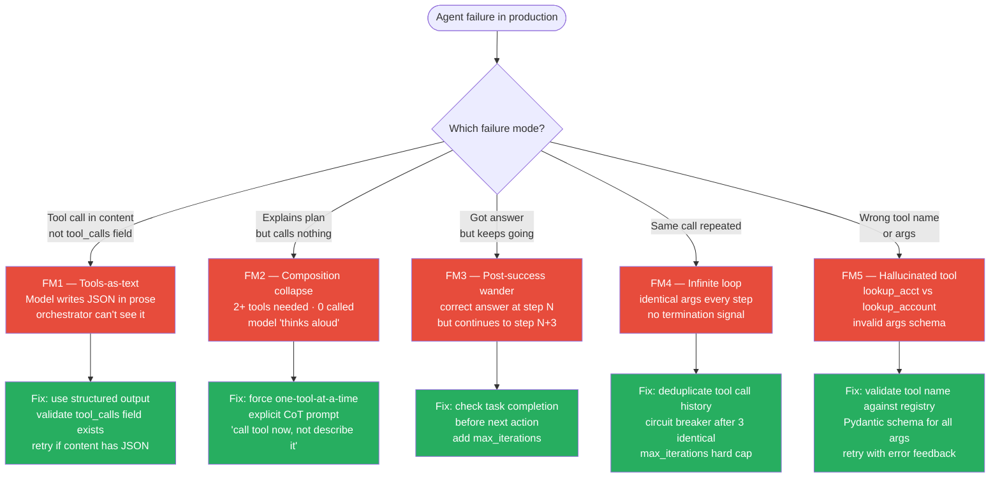

# Agent Reliability Patterns — Production Failure Modes + Fixes

> The 5 ways agents fail in production, and the code-level patterns that fix each. The difference between a demo and a deploy.

---

## Table of Contents

1. Objective
2. The 5 failure modes (observed in real systems)
3. Pattern library — fixes for each failure mode
4. Reliability scorecard for agents
5. Code / design sketch
6. When to graduate to multi-agent / replan
7. Interview questions (5)
8. Further reading

---

## 1. Objective

In Phase 3 Session 26 (function calling) and Session 27 (ReAct), measured failures emerged from a single model running real tasks. Those failures generalize across providers and models. This file catalogs them and the production patterns that fix each.

Senior interview Q: "What goes wrong with agents in production and how do you fix it?"

---



## 2. The 5 Failure Modes (Observed in Real Systems)

**FM1 — Tools-as-text**

Model emits the JSON tool call in the `content` field instead of using the structured `tool_calls` field. Orchestrator can't see it → tool is "called" but never executed.

Example (real, observed on Llama-3.1-8B):

```json
{
  "content": "I'll look that up for you. {\"name\": \"lookup_account\", \"arguments\": {\"account_id\": \"ACC-1001\"}}",
  "tool_calls": null
}
```

Triggers: weak fine-tuning for tool calling, ambiguous prompts, multi-tool questions where the model "explains its plan" instead of executing it.

**FM2 — Multi-tool composition collapse**

For a query needing 2+ tools, the model produces a beautiful prose plan describing both calls but emits ZERO actual tool calls. The model "thinks aloud" instead of acting.

**FM3 — Post-success wander**

The model GETS the right answer on iteration N, but the protocol (especially ReAct's "Action" slot) invites another action — so it takes one. Q3 in Phase 3 S27: a simple lookup ballooned to 6 tool calls when 1 was needed.

**FM4 — Infinite loop / no termination**

Same tool called repeatedly with identical args. Model can't recognize "I'm done." Particularly common on small models that don't reliably emit the `Finish` action.

**FM5 — Hallucinated tool name or args**

Model emits `lookup_acct` instead of `lookup_account`, or concatenates argument names (Phase 3 S26 1B: `principal_annual_rate_pct`). Calls the wrong tool or invalid args.

---

## 3. Pattern Library — Fixes for Each Failure Mode

### Pattern A — Tool result sanitization (fixes FM5, partially FM1)

Validate every tool call's NAME and ARGS against the registry before executing.

```python
def safe_invoke(tool_call):
    name = tool_call["name"]
    args = tool_call["arguments"]
    if name not in TOOL_REGISTRY:
        return {"error": f"unknown tool {name}", "valid": list(TOOL_REGISTRY)}
    try:
        validated = TOOL_REGISTRY[name].schema.validate(args)
    except ValidationError as e:
        return {"error": f"invalid args: {e}", "expected_schema": TOOL_REGISTRY[name].schema.json_schema()}
    return TOOL_REGISTRY[name].invoke(validated)
```

On unknown tools or invalid args, return a structured ERROR rather than crash. The model can correct on the next iteration.

### Pattern B — Iteration cap (fixes FM4)

```python
MAX_ITERS = 8
for iter_n in range(MAX_ITERS):
    response = run_loop_step(state)
    if response.is_finish:
        return response.answer
return "Agent exhausted iteration budget; partial state attached."
```

Critical: log to audit why it hit the cap. Telemetry on cap hits — identifies prompts that confuse the agent.

### Pattern C — Duplicate-call detection (fixes FM4, FM3)

Maintain a deduplication set of `(tool_name, args)` already invoked in this session:

```python
called_signatures = set()
def deduped_invoke(name, args):
    sig = (name, json.dumps(args, sort_keys=True))
    if sig in called_signatures:
        return {"info": "tool already called with these args this session",
                "previous_result": cached_results[sig]}
    called_signatures.add(sig)
    result = TOOL_REGISTRY[name].invoke(args)
    cached_results[sig] = result
    return result
```

The "already called" response signals the model to either use the cached result or call Finish.

### Pattern D — Planner / executor split (fixes FM2)

Phase 6 Session 6 in the coding sequence covers this. One LLM call produces the full plan up front; an executor runs each step. The planner doesn't get to mid-loop "wander" because it's only invoked once.

### Pattern E — Tool-call extraction from content (fixes FM1)

If the orchestrator sees an empty `tool_calls` field but the content contains JSON that LOOKS like a tool call, parse it:

```python
import json, re

def rescue_tool_call(content):
    match = re.search(r'\{s*"name"\s*:\s*"\w+"\s*,\s*"arguments"\s*:\s*\{.*?\}', content, re.DOTALL)
    if match:
        try:
            obj = json.loads(match.group(0))
            if "name" in obj and "arguments" in obj:
                return obj  # rescued tool call
        except json.JSONDecodeError:
            pass
    return None
```

Last-resort safety net. Better to fix the prompt or fine-tune for tool calling, but this catches the failure when it happens.

### Pattern F — Explicit Finish enforcement (fixes FM3, FM4)

At each iteration, check the answer-quality heuristically:

```python
def should_stop(state, last_response):
    # Heuristic: do we have enough info to answer the user query?
    if last_response.is_finish:
        return True
    if state.iteration > 1 and not state.has_new_information():
        return True  # nothing new this step → likely done or stuck
    return False
```

"Have new information" can be: did the latest tool return data NOT already in the state? If no new info, force `Finish`.

---

## 4. Reliability Scorecard for Agents

Evaluate every agent deployment on these 5 axes:

| Axis | Target | How to measure |
|------|--------|----------------|
| Task success | > 90% | Holdout eval set, judged by LLM or human |
| Tool-call accuracy | > 95% (correct tool emitted) | Trace logs vs expected |
| Efficiency | < 1.5× minimum tool count | tool_calls_per_task / optimal_count |
| Cost ceiling | < $0.10 per task average | sum of token cost per task |
| Safety failures | 0 (zero) | Authz violations, leaked secrets, write tools called without HITL |

Production agent monitoring tracks all 5 over time. Single-axis monitoring (just task success) misses the cost / efficiency degradation that kills profitability.

---

## 5. Code / Design Sketch

Production ReAct loop with all patterns combined:

```python
def production_agent(query, user_context, budget):
    state = AgentState(query=query, user_context=user_context)
    called_signatures = set()

    for iter_n in range(budget.max_iterations):
        # Budget check
        if state.tokens_used > budget.max_tokens:
            return finish(state, "budget exceeded")

        # LLM call
        response = llm.chat(state.messages, tools=TOOL_REGISTRY.schemas())

        # Pattern E — tools-as-text rescue
        if not response.tool_calls:
            rescued = rescue_tool_call(response.content)
            if rescued:
                response.tool_calls = [rescued]
            else:
                # No tool call → assume Finish
                return finish(state, response.content)

        for tc in response.tool_calls:
            # Pattern A — schema validation
            # Pattern C — dedup
            sig = (tc.name, json.dumps(tc.arguments, sort_keys=True))
            if sig in called_signatures:
                result = {"info": "tool already called", "cached_result": cache[sig]}
            else:
                result = safe_invoke(tc, user_context)
                called_signatures.add(sig)
                cache[sig] = result
            state.add_observation(tc, result)

        # Pattern F — should-stop check
        if should_stop(state, response):
            return finish(state, "explicit-stop")

    return finish(state, "max-iters")
```

This is what separates "agent works on the demo" from "agent works in production."

---

## 6. When to Graduate to Multi-Agent / Replan

The single-agent patterns above handle 80% of cases. For the rest:

- **Multi-step task requiring coordination** — planner/executor (Phase 6 S6)
- **Cross-domain expertise required** — multi-agent supervisor (Phase 6 S7)
- **Failed task with recoverable failure** — replan-on-error (LangGraph conditional edges)
- **High-stakes write action** — HITL pause (LangGraph checkpointing → human approval queue)

Always start with a single agent. Add complexity only when measurement shows a failure mode the single agent can't handle.

---

## 7. Interview Questions (5)

**Q1: Walk me through the 5 main failure modes of agents in production.**

Tools-as-text (JSON in content, not tool_calls), multi-tool composition collapse (plans in prose, calls nothing), post-success wander (right answer at step N, keeps calling), infinite loops, hallucinated tool names/args. Each has a specific fix pattern.

**Q2: How do you prevent an agent from looping forever?**

Three layers: hard iteration cap (e.g., 10), duplicate-call detection (same tool+args twice → return cached), explicit Finish enforcement (no new information this step → force stop). Combined, these catch nearly all loops. Telemetry on cap hits identifies prompts that need fixing.

**Q3: What's the planner/executor pattern and what does it fix?**

Split planning from execution. One LLM call produces the full plan up front (list of tool calls with placeholders for inter-step results). An executor runs each step deterministically. Fixes "multi-tool composition collapse" because the planner doesn't get a chance to mid-loop wander — its job is done after step 1.

**Q4: How do you ensure agents don't hallucinate tool names or args?**

Three defenses: (1) schema validation at the registry boundary (Pydantic); invalid calls return structured errors the model can correct on; (2) fine-tune the model for native tool calling instead of relying on in-context schemas (Phase 4.5); (3) constrained decoding (outlines / vLLM guided_decoding) so the model literally cannot emit invalid JSON tool calls.

**Q5: What 5 metrics do you monitor for a production agent?**

Task success rate, tool-call accuracy (right tool emitted), efficiency (tool calls per task vs minimum), cost ceiling (avg $ per task), and safety failures (authz violations, write tools called without HITL). Single-metric monitoring (just task success) misses cost / efficiency degradation that kills profitability.

---

## 8. Further Reading

- **ReAct** (Yao et al. 2022) — arXiv:2210.03629 — the foundation pattern
- **Toolformer** (Schick et al. 2023) — arXiv:2302.04761 — tool-call fine-tuning
- **Gorilla** (Patil et al. 2023) — arXiv:2305.15334 — tool-call FT at scale
- **LangGraph docs** — langchain-ai.github.io/langgraph — state machine orchestration
- **Anthropic Claude Tool Use** docs — production-grade tool calling patterns
- The `06_agents` folder in `code_practice/` has runnable code for every pattern above

---

## Code Practice — Wired by Phase 6

- `code_practice/06_agents/10_production_agents/` — budgets + timeouts + HITL + audit
