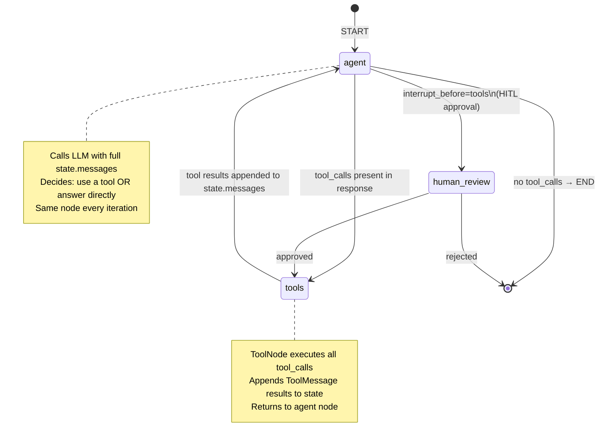

# LangGraph — Deep Dive

> Why this file exists: LangGraph is the production-default agent framework in 2024-2025 because it models agents as **explicit state machines** — replayable, debuggable, persistable. This file covers what makes that model work and how to build production agents with it.

---

## Quick Reference

| Concept | What it is |
|---------|-----------|
| State | A typed dict (TypedDict / Pydantic) carrying all data the graph needs across nodes |
| Node | A function `(state) → state-update`. Pure Python — can call LLMs, tools, anything |
| Edge | Static link between nodes; runs after a node completes |
| Conditional edge | Routes to one of N targets based on a function of state |
| Checkpointer | Persists state per step — resume / replay / time-travel |
| Interrupt | Pause graph mid-run for human approval (HITL) |
| Subgraph | A graph nested inside a node (for hierarchical agents) |
| Streaming | `.stream()` yields state updates as the graph executes |
| Sender | Built-in pattern for fan-out: one node sends to many in parallel |
| StateGraph / MessageGraph | Two main builders; MessageGraph is sugar for chat-style state |

---

## 1. Why Graphs Instead of Loops

Pre-LangGraph agents (`AgentExecutor`) ran a `while not done: think_act_observe()` loop. The problem: this loop is opaque. You can't easily: Add a retry branch for specific failures · Inject a human-approval step before a destructive action · Resume from a crash mid-execution · Time-travel back to a specific step and re-run with different inputs.

LangGraph models this same loop as an **explicit DAG with state**. Every step is a named node; every transition is an edge with optional condition. The state object is checkpointed at each node, so the whole run is replayable.

---

## 2. The Minimal Agent

```python
from typing import TypedDict, Annotated
from langgraph.graph import StateGraph, START, END
from langgraph.graph.message import add_messages
from langchain_core.messages import HumanMessage, AIMessage
from langchain_openai import ChatOpenAI

# 1. State schema — Annotated with reducers (how to merge updates)
class AgentState(TypedDict):
    messages: Annotated[list, add_messages]   # reducer appends

# 2. Nodes
model = ChatOpenAI(model="gpt-4o-mini")

def call_model(state: AgentState):
    response = model.invoke(state["messages"])
    return {"messages": [response]}   # reducer appends this to existing

# 3. Build graph
builder = StateGraph(AgentState)
builder.add_node("agent", call_model)
builder.add_edge(START, "agent")
builder.add_edge("agent", END)
graph = builder.compile()

# 4. Run
result = graph.invoke({"messages": [HumanMessage("Hi!")]})
print(result["messages"][-1].content)
```

The reducer pattern (`Annotated[list, add_messages]`) means nodes return only the **change** to state, not the full state. LangGraph merges via the reducer. This is critical for parallel branches that update the same key.

---

## 3. Tool Use — The Standard Pattern

```python
from langgraph.prebuilt import ToolNode, tools_condition
from langchain_core.tools import tool

@tool
def search_web(query: str) -> str:
    """Search the web for a query."""
    return f"Top search result for: {query}"

@tool
def calculator(expr: str) -> str:
    """Evaluate a math expression."""
    return str(eval(expr))

tools = [search_web, calculator]
model_with_tools = model.bind_tools(tools)

def call_model(state):
    return {"messages": [model_with_tools.invoke(state["messages"])]}

builder = StateGraph(AgentState)
builder.add_node("agent", call_model)
builder.add_node("tools", ToolNode(tools))  # built-in: executes tool calls

builder.add_edge(START, "agent")
builder.add_conditional_edges(
    "agent",
    tools_condition,   # built-in: routes to "tools" if tool_calls present, else END
)
builder.add_edge("tools", "agent")  # loop back after tool execution
graph = builder.compile()
```

This is the canonical ReAct-style loop:

```
START → agent —(tool_calls)→ tools → agent —(no tool_calls)→ END
```


> `human_review` is optional — add with `interrupt_before=["tools"]` to pause for approval before any tool executes.

The agent sees previous tool results in `state["messages"]` on each iteration and decides: call another tool, or answer.

---

## 4. Checkpointing — Persistence & Replay

Add a checkpointer to persist state per step:

```python
from langgraph.checkpoint.memory import MemorySaver
from langgraph.checkpoint.sqlite import SqliteSaver
# from langgraph.checkpoint.postgres import PostgresSaver  # production

checkpointer = MemorySaver()                                # dev / tests
# checkpointer = SqliteSaver.from_conn_string("agent.db")  # local persistence
# checkpointer = PostgresSaver.from_conn_string(...)        # production

graph = builder.compile(checkpointer=checkpointer)

config = {"configurable": {"thread_id": "user_42"}}
graph.invoke({"messages": [HumanMessage("Hi!")]}, config)
graph.invoke({"messages": [HumanMessage("What did I just say?")]}, config)
# → resumes from where the previous invocation left off; full history preserved
```

The `thread_id` is the persistence key — one per conversation / user session.

### Time Travel

```python
# Get history of all checkpoints for a thread
history = list(graph.get_state_history(config))
# Each entry has: state, next, config (incl. checkpoint_id)

# Re-run from a past checkpoint with a different input
past_checkpoint = history[5].config
graph.invoke({"messages": [HumanMessage("alternate prompt")]}, past_checkpoint)
# Forks history at that checkpoint
```

This is invaluable for debugging: "What if the model had taken a different path at step 5?"

---

## 5. Human-in-the-Loop (HITL)

Two patterns:

### Pattern A: Static interrupt before a node

```python
graph = builder.compile(
    checkpointer=checkpointer,
    interrupt_before=["tools"],   # pause any tool call
)

graph.invoke({"messages": [...]}, config)
# Graph runs until just before "tools" node, then returns

# Inspect what's about to run
state = graph.get_state(config)
print(state.next)                           # ("tools",)
print(state.values["messages"][-1].tool_calls)  # the pending tool calls

# Human approves → resume
graph.invoke(None, config)   # None = continue from interrupt
```

### Pattern B: Dynamic interrupt (LangGraph >= 0.2)

```python
from langgraph.types import interrupt, Command

def call_destructive_tool(state):
    decision = interrupt({                    # pauses graph; returns value to caller
        "question": "Approve deleting all records?",
        "args": state["pending_args"],
    })
    if decision == "approve":
        result = delete_records(state["pending_args"])
        return {"messages": [AIMessage(f"Deleted: {result}")]}
    else:
        return {"messages": [AIMessage("Cancelled by user.")]}

# Caller side
state_after_interrupt = graph.invoke(input, config)
# state_after_interrupt contains the interrupt payload
graph.invoke(Command(resume="approve"), config)   # human responds
```

HITL is mandatory for any agent with destructive capabilities (delete, send, pay).

---

## 6. Conditional Routing

```python
def route_after_planner(state) -> str:
    if state["plan_complexity"] == "simple":
        return "direct_answer"
    elif state["needs_web"]:
        return "web_search"
    else:
        return "rag_retrieve"

builder.add_conditional_edges(
    "planner",
    route_after_planner,
    {
        "direct_answer": "answer_node",
        "web_search": "search_node",
        "rag_retrieve": "rag_node",
    }
)
```

The function returns a string; the dict maps to target node names. This is more powerful than if/else because the graph topology is explicit and visualizable.

---

## 7. Parallel Branches (Sender / Send)

```python
from langgraph.types import Send

def fan_out(state) -> list[Send]:
    # Issue parallel queries to multiple sub-agents
    return [
        Send("specialist_agent", {"topic": t, "context": state["context"]})
        for t in state["topics"]
    ]

builder.add_conditional_edges("coordinator", fan_out, ["specialist_agent"])
```

Each `Send` runs `specialist_agent` in parallel with different input. Their outputs merge into state via the reducer.

Use case: a coordinator agent dispatches sub-questions to topic-specialist agents and waits for all to complete.

---

## 8. Subgraphs (Hierarchy)

```python
# Define a sub-agent as its own graph
researcher_builder = StateGraph(ResearcherState)
researcher_builder.add_node("plan", plan_research)
researcher_builder.add_node("retrieve", retrieve_docs)
researcher_builder.add_edge("plan", "retrieve")
researcher_subgraph = researcher_builder.compile()

# Use it as a node in the outer graph
def call_researcher(state: MainState):
    result = researcher_subgraph.invoke({"query": state["question"]})
    return {"research_output": result["docs"]}

builder.add_node("researcher", call_researcher)
```

Subgraphs let you compose agents hierarchically. Each subgraph has its own state schema; the outer graph passes only what's needed.

---

## 9. Streaming

```python
# Stream state updates as nodes complete
for update in graph.stream({"messages": [...]}, config):
    print(update)  # {node_name: state_change}

# Stream LLM tokens within a node
for chunk in graph.stream(input, config, stream_mode="messages"):
    for chunk in graph.stream(input, config, stream_mode="messages"):
        print(chunk[0].content, end="", flush=True)  # token-by-token

# Stream multiple modes
for chunk in graph.stream(input, config, stream_mode=["updates", "messages"]):
    ...
```

`stream_mode` options: `"values"` — full state after each step · `"updates"` — only the diff (most efficient) · `"messages"` — token stream from LLM nodes · `"debug"` — verbose internal events · `"custom"` — emit your own events via `get_stream_writer()`.

---

## 10. Production Patterns

### Postgres-backed checkpointer

```python
from langgraph.checkpoint.postgres import PostgresSaver

with PostgresSaver.from_conn_string("postgresql://...") as checkpointer:
    checkpointer.setup()   # create tables (first run only)
    graph = builder.compile(checkpointer=checkpointer)
    # Use graph...
```

Survives crashes, supports horizontal scaling (any worker can resume any thread).

### Retry with backoff

```python
from langgraph.pregel.retry import RetryPolicy

graph = builder.compile(
    checkpointer=checkpointer,
    # Per-node retry policy
)
builder.add_node("tools", ToolNode(tools), retry=RetryPolicy(
    max_attempts=3,
    initial_interval=1.0,
    backoff_factor=2.0,
    retry_on=(TimeoutError, ConnectionError),
))
```

### Iteration cap (prevent infinite loops)

```python
graph = builder.compile()
graph.invoke(input, {"recursion_limit": 25, **config})
# Raises GraphRecursionError if exceeded
```

### Tracing

LangSmith picks up runs automatically if `LANGCHAIN_TRACING_V2=true`. For self-hosted, LangFuse and Phoenix have LangGraph integrations.

---

## 11. When to Reach for LangGraph

| Situation | LangGraph? |
|-----------|-----------|
| Stateful conversation with memory | Yes — state + checkpointing |
| Tool-using agent (ReAct loop) | Yes — ToolNode + tools_condition |
| Multi-step pipeline w/ conditional routing | Yes |
| Human approval required mid-flow | Yes — interrupts |
| Multi-agent coordinator | Yes — Sender / subgraphs |
| Single LLM call, no tools, no state | No — just call the SDK |
| Pure data pipeline (no LLM) | No — Use Prefect / Dagster |
| Real-time streaming chat (no agent loop) | No — Direct streaming is fine |

---

## 12. Comparison vs Alternatives

| Framework | State model | Replay | HITL | Best for |
|-----------|------------|--------|------|----------|
| LangGraph | Explicit state graph | Native | Native | **Production agents (2025 default)** |
| LangChain AgentExecutor | Hidden loop | No | No | Legacy |
| CrewAI | Roles + tasks | No | Limited | Multi-agent collaboration |
| AutoGen | Message-passing | No | Limited | Research / multi-agent dialogue |
| OpenAI Swarm | Handoffs | No | Limited | Simple multi-agent on OpenAI |
| smolagents | Code-as-action | No | Limited | Code-execution-heavy tasks |
| Pydantic AI | Function-typed | No | Limited | Type-safe agents |
| Custom (no framework) | Whatever you build | ?? | ?? | When framework overhead matters |

See `07_multi_agent_orchestration.md` for the multi-agent frameworks in depth.

---

## 13. Gotchas

**Reducer mismatch.** If your state has `messages: list` without `Annotated[list, add_messages]`, the next node's update REPLACES the list instead of appending. You lose history silently.

**Async vs sync inconsistency.** Mixing sync and async nodes in the same graph requires care. Pick one mode and stick with it.

**Recursion limit silent traps.** Default `recursion_limit=25`. Long-running tool-heavy agents can hit this. Set explicitly per use case.

**Checkpointer + Postgres connection lifecycle.** Use context manager (`with PostgresSaver(...)`) or manual `.setup()` once. Forgetting setup → silent table missing.

**Sender / Send updates collision.** When two parallel branches update the same state key, the reducer must handle merging. Lists with `add_messages` are safe; arbitrary dicts need a custom reducer.

**Subgraph state isolation.** A subgraph has its own state — outer state isn't automatically visible. Pass through explicitly.

**Streaming + checkpointer.** Token streaming bypasses the checkpoint per token; only node-level updates are persisted. Don't expect mid-token resume.

---

## 14. Interview Q&A

**Q: Why use LangGraph instead of LangChain's `AgentExecutor`?**

`AgentExecutor` is a black-box `while not done: act()` loop. LangGraph models the same loop as an explicit state machine with named nodes and edges. Concrete benefits: (1) **Replayability** — checkpointer persists state per step; you can resume from a past checkpoint with different inputs (time travel). (2) **HITL** — interrupts let you pause mid-flow for human approval, then resume. (3) **Conditional routing** — explicit `add_conditional_edges()` instead of buried if/else inside the agent. (4) **Parallelism** — `Send` for fan-out to multiple sub-agents. (5) **Observability** — graph topology is visualizable; LangSmith / LangFuse trace LangGraph runs. For production agents in 2025, LangGraph is the default; `AgentExecutor` is legacy.

**Q: Explain the reducer pattern.**

A LangGraph node function returns only the **change** to state, not the full state — e.g. `return {"messages": [new_msg]}`. The graph engine merges that change into existing state using a reducer function defined per-key via `Annotated[type, reducer_fn]`. The most common reducer is `add_messages` which appends to a list. Without a reducer, the default is replacement — the new value overwrites the old. The reducer pattern matters most for parallel branches: when two nodes update the same key concurrently, the reducer decides how to merge. For `messages` with `add_messages`, both messages are appended in order. For a custom dict, you might write a reducer that merges keys.

**Q: How do you implement human-in-the-loop with LangGraph?**

Two patterns. **Static interrupt:** compile graph with `interrupt_before=["tool_node"]` — the graph pauses before reaching that node; you inspect state and call `graph.invoke(None, config)` to resume. **Dynamic interrupt:** call `interrupt({...})` inside a node — it pauses execution and returns the payload to the caller. The caller resumes with `graph.invoke(Command(resume=value), config)`. The `interrupt()` call inside the node returns the resume value. Both require a checkpointer (because state must persist across the pause). For destructive actions (delete, send, pay), HITL is mandatory in production.

**Q: What's the difference between `stream_mode="values"` and `"updates"`?**

`"values"` yields the full state after each node completes — useful for displaying current state in a UI. `"updates"` yields only the diff each node produced — much more efficient for bandwidth and cleaner for processing (you know exactly which node changed what). For LLM token streaming within a node, use `"messages"` mode. You can pass a list to subscribe to multiple modes simultaneously.

**Q: How do you prevent an agent from looping forever?**

Two layers: (1) **Built-in recursion limit** — set when invoking: `graph.invoke(input, {"recursion_limit": 25, ...})`. Raises `GraphRecursionError` if exceeded. (2) **Application-level loop detection** — track tool-call patterns in state; if the agent calls the same tool N times with same args → "I'm stuck" node that escalates or raises. See `02_agent_reliability_patterns.md`. The recursion limit is the safety net; loop detection is the smart layer.

---

## 15. Connections

| This file | Links to | Why |
|-----------|----------|-----|
| Agent fundamentals | `01_agents.md` | Conceptual background |
| Agent reliability patterns | `02_agent_reliability_patterns.md` | Retries, loop detection, structured outputs |
| Agent memory architectures | `05_agent_memory.md` | Long-term memory beyond LangGraph state |
| Planner-executor patterns | `06_planner_executor_patterns.md` | Plan-then-act variants |
| Multi-agent | `07_multi_agent_orchestration.md` | Multi-agent frameworks |
| Tool authorization | `../11.system_design/09_tool_authorization_patterns.md` | Capability isolation |
| LangChain primer | `03_langchain_primer.md` | LCEL chains used INSIDE LangGraph nodes |
| LLM observability | `../10.mlops/11_llm_observability.md` | Tracing LangGraph runs |
| Code practice | `code_practice/06_agents/03_langgraph/` | Hands-on |

---

## Key Takeaway

LangGraph turns agent loops into **explicit state machines**: nodes (functions), edges (transitions), reducer-merged state, persisted via checkpointer. The **four superpowers**: replay/time-travel, conditional routing, human-in-the-loop interrupts, parallel branches via `Send`. For production agents in 2025, LangGraph is the default. Use LCEL inside nodes for LLM chains; postgres-backed checkpointer in production; set a recursion limit as a safety net (with app-level loop detection on top).

---

## Code Practice — Wired by Phase 6

- `code_practice/06_agents/03_langgraph/` — state-machine orchestration
