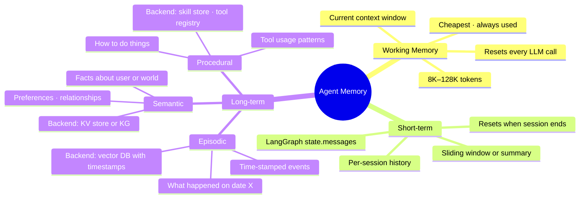

# Agent Memory Architectures

> Why this matters: An agent with no memory is a glorified function call. A useful agent remembers what was said, what was learned, what worked, what failed. The architecture of that memory determines whether the agent feels intelligent or amnesiac.

---

## Quick Reference

| Memory type | Lifespan | Where it lives | Example |
|-------------|----------|----------------|---------|
| Working memory | Single turn | LLM context window | Current input + last few messages |
| Short-term / conversational | Single session | Chat history in state | "What did I just ask?" |
| Long-term / persistent | Across sessions | Vector DB / KV store / KG | "User Alex prefers concise answers" |
| Episodic | Across sessions | Time-stamped events | "On 2026-05-10, user filed bug #42" |
| Semantic | Across sessions | Fact triples / knowledge graph | "Alex's manager is Sarah" |
| Procedural | Across sessions | Tool library / skill store | "When task is X, call tool Y" |

---

## 1. The Memory Hierarchy

```
Working Memory (~8K-128K tokens)
└── What the LLM literally sees this call. Cheap, but bounded by context window.

Short-term Memory (per-session)
└── Conversation history. Lives in agent state. Resets when session ends.

Long-term Memory (cross-session)
├── Episodic — "events that happened" - time-keyed
├── Semantic — "facts about the world / user" - structured
└── Procedural — "how to do things" - patterns / skills
```


> A production agent uses all three — working memory every call, short-term per session, long-term across sessions.

A production agent typically uses **all three** with different backends and write/read rules.

---

## 2. Short-Term: Conversation History

The simplest memory. Lives in agent state (LangGraph `state["messages"]`).

```python
# LangGraph default = full history in context every turn
class AgentState(TypedDict):
    messages: Annotated[list, add_messages]
```

**Cost:** every turn re-sends the entire history. With long sessions (50+ turns), you exhaust the context window and pay for redundant tokens.

### Compaction Strategies

| Strategy | Idea |
|---------|------|
| Sliding window | Keep last N messages; drop oldest |
| Token-budget window | Keep most recent messages fitting under K tokens |
| Summary buffer | Summarize old turns into a short paragraph; replace old messages with summary |
| Hierarchical summary | Summarize summaries (chunks → daily → weekly) |
| Selective retention | Keep all user messages + summarize assistant turns |

```python
def compact_messages(messages: list, max_tokens: int = 4000) -> list:
    """Sliding window with summary of dropped turns."""
    if estimate_tokens(messages) <= max_tokens:
        return messages
    # Keep last N that fit
    kept = []
    total = 0
    for msg in reversed(messages):
        t = estimate_tokens([msg])
        if total + t > max_tokens // 2:
            break
        kept.insert(0, msg)
        total += t
    # Summarize the rest
    dropped = messages[:-len(kept)] if kept else messages
    summary = summarizer_llm.invoke(f"Summarize: {dropped}")
    return [SystemMessage(f"Earlier summary: {summary}"), *kept]
```

---

## 3. Long-Term: The Three Subtypes

### Episodic — Events with Timestamps

Stores discrete events: "User said X at time T", "Tool returned Y at time T", "Outcome was Z."

```python
# Schema (vector DB or relational)
class Episode:
    timestamp: datetime
    session_id: str
    actor: str           # "user" | "agent" | "tool"
    content: str
    embedding: list[float]
    metadata: dict       # tool_used, success, etc.
```

**Retrieval:** by recency, by semantic similarity to current query, or both. Used for "what did we discuss last time?" or "find a past situation similar to this one."

### Semantic — Facts and Relationships

Stores structured assertions about the world / user / domain.

```
Triples:
(user_alex, prefers, "short responses")
(user_alex, employer, "XCE Data Services")
(user_alex, language_pref, "en")
(ticket_42, status, "open")
(ticket_42, owner, "alex")
```

Backend options: **Vector DB + key-value**: store facts as text + embedding; retrieve by similarity · **Knowledge graph** (Neo4j, MemGraph): true triple store with graph queries · **Hybrid** (modern): vector for retrieval, graph for traversal.

### Procedural — Skills and Patterns

Stores **what to do when**. Reusable patterns the agent learned.

```python
# Pattern store
class Skill:
    trigger_pattern: str       # e.g., "user asks about quarterly revenue"
    procedure: list[ToolCall]  # sequence of tool calls
    success_count: int
    failure_count: int
    last_used: datetime
```

Updated by self-reflection ("that approach worked; remember it") or distilled from successful agent traces. This is the rarest tier in production but powers self-improving agents.

---

## 4. Memory Operations: Write, Retrieve, Forget

**Write**

```
After each turn (or after a summary signal):
1. Decide if there's anything worth remembering
   (use LLM judge or rule-based filter)
2. Extract structured representation
   (facts via Pydantic schema; embedding for retrieval)
3. Write to appropriate store with metadata
   (source, timestamp, confidence, provenance)
```

**Retrieve**

```
Before each turn:
1. Form retrieval query from current state
   (last user message + recent context)
2. Query memory stores in parallel
   (vector similarity + metadata filter)
3. Rerank by relevance + recency + importance
4. Inject top-K into LLM context as "memory" block
```

**Forget (consolidation / eviction)**

```
Periodically (every N turns or on schedule):
1. Identify low-value memories
   (low retrieval frequency, low confidence, stale facts)
2. Compact: merge multiple similar facts into one
3. Decay: lower importance scores over time
4. Hard-delete or archive
```

Without forgetting, the memory store grows unboundedly and retrieval quality degrades. Forgetting is as important as remembering.

---

## 5. Production Backends (2024-2025)

| Tool | Type | Notes |
|------|------|-------|
| mem0 | Managed memory layer for agents | Vector + graph backends; popular Python SDK |
| Letta (formerly MemGPT) | OS-inspired memory hierarchy | Two-tier: in-context + recall (external); auto-paging |
| LangMem (LangChain) | Hooks into LangGraph state | Long-term memory via vector store; semantic / episodic / procedural |
| Zep | Long-term memory + session | Time-aware fact extraction; graph + vector hybrid |
| MotörHead (Metal) | Simple Redis-backed history + summary | Lightweight; good for chat history compaction |
| Custom: pgvector + Postgres | DIY | Full control; standard SQL ops + vector search |

```python
# mem0 example
from mem0 import Memory

m = Memory()

# Write
m.add("Alex prefers concise technical answers", user_id="user_42")

# Retrieve
related = m.search("How should I respond to Alex?", user_id="user_42")
# related: [{"memory": "Alex prefers concise technical answers", "score": 0.89, ...}]
```

---

## 6. Memory in LangGraph

```python
from langgraph.store.memory import InMemoryStore
from langgraph.store.postgres import PostgresStore  # production

store = InMemoryStore(index={"embed": embedder, "dims": 768})

# In a node, write to long-term memory
def remember_node(state, *, store: BaseStore):
    user_id = state["user_id"]
    namespace = (user_id, "facts")
    store.put(namespace, key="pref-1", value={"text": "Alex prefers Python over Go"})
    return {}

# In another node, retrieve memory
def retrieve_memory_node(state, *, store: BaseStore):
    user_id = state["user_id"]
    results = store.search((user_id, "facts"), query=state["messages"][-1].content, limit=5)
    return {"retrieved_memories": [r.value["text"] for r in results]}

graph = builder.compile(checkpointer=checkpointer, store=store)
```

LangGraph's `BaseStore` interface gives long-term memory parallel to short-term checkpointer state.

---

## 7. The Letta / MemGPT Pattern (Worth Knowing)

Letta treats agent memory like an operating system:

| In-context (RAM) | External (Disk) |
|-----------------|-----------------|
| System persona | Conversation archive |
| Working scratchpad ↔↔ | Episodic memory |
| Recent messages | Semantic / fact store |
|  | Tool result archive |

The agent has tools to **page memories in and out** of context — write to archive, search archive, recall a specific memory. Modeled after virtual memory.

Use case: very long-lived agents (customer support bot remembering 100s of past interactions per user) where everything-in-context isn't feasible.

---

## 8. Retrieval Quality Considerations

The retrieval quality of long-term memory is a recall problem just like RAG. The same principles apply:

| Concern | Mitigation |
|---------|-----------|
| Stale facts | Time-decay weighting; explicit expiration; periodic refresh from source |
| Conflicting facts | Confidence scoring; conflict-resolution policy (latest wins / source priority) |
| Low precision | Reranker over top-K (see `../4.nlp/02_embeddings/02_sentence_embeddings.md`) |
| Memory drift | Periodic consolidation; LLM-judge audit |
| PII / privacy | Tagged memories; per-user namespaces; right-to-be-forgotten support |

---

## 9. Common Patterns

### Pattern 1: Chat with persistent user prefs

```
Per turn:
  1. Retrieve user preferences from long-term store
  2. Inject as system context
  3. Run agent normally
After turn:
  4. Extract any new preferences expressed (LLM judge)
  5. Write to store with confidence + timestamp
```

### Pattern 2: Project / task agent

```
Persistent state:
  - Goals (semantic)
  - Past attempts and outcomes (episodic)
  - Effective tool patterns (procedural)
Per turn:
  - Retrieve relevant past attempts for similar sub-goal
  - Avoid repeating known failures
```

### Pattern 3: Multi-user team agent

```
Per user namespace:
  - User-specific facts and history
Shared namespace:
  - Team facts, decisions, glossary
Retrieval cascades: user namespace first, then shared.
```

### Pattern 4: Self-improving (procedural memory)

```
After successful task:
  1. Distill the trajectory into a reusable pattern
  2. Store as procedural memory
On next similar task:
  3. Retrieve matching pattern
  4. Use as scaffolding
```

---

## 10. Gotchas

**Naive append-only history blows context window.** Add compaction from day one — sliding window, summary buffer, or both.

**Embedding the wrong thing.** Embedding "user said: I prefer Python" with a generic embedder doesn't capture that this is a PREFERENCE. Embed the structured fact ("preference: language=Python") for cleaner retrieval.

**No source / provenance.** Memories without provenance are unaccountable. Always store (source, timestamp, confidence) alongside content.

**Memory leak across users.** Forgetting to namespace by `user_id` means User A's memories pollute User B's. Catastrophic for B2B / privacy. Always namespace.

**Hallucinated "memories".** If the LLM extracts facts to write, it may invent some. Validate extracted facts against the source text (or against retrieval) before persisting.

**Memory + injection.** Memories are retrieved into context; if an attacker plants content in retrievable sources, that content becomes "memory." See `../7.rag/03_indirect_prompt_injection.md`. Validate before writing.

**Forgetting nothing.** Stores that only grow degrade retrieval over time. Implement decay or eviction.

---

## 11. Interview Q&A

**Q: What types of memory does a production agent need?**

Three tiers. **Short-term**: in-session conversation history (lives in agent state). **Long-term, split into three subtypes**: (a) **episodic** — time-stamped events ("user said X on 2026-05-10"); (b) **semantic** — structured facts ("Alex prefers Python"); (c) **procedural** — patterns / skills the agent learned to reuse. Production backends: vector DB for semantic similarity retrieval, key-value for facts, optionally a graph DB for relationships. Per-user namespacing is mandatory for multi-user systems. Implement BOTH writing (with extraction + validation) AND forgetting (decay + consolidation) — stores that only grow degrade.

**Q: How do you decide what to write to long-term memory?**

Three filters. (1) **Information density** — does this message contain new factual / preference content, or is it just acknowledgement? Skip "ok thanks." (2) **LLM judge** — ask a small model "is this worth remembering and why?" with structured output (yes/no + justification + extracted fact). (3) **Confidence threshold** — only persist with confidence > 0.7. Production rule: write less than you think you need; you can always re-extract from session logs later. Writing too much pollutes retrieval — the signal-to-noise ratio of your memory store directly determines retrieval quality.

**Q: How does Letta / MemGPT handle long conversations beyond the context window?**

It treats the LLM context as RAM and external storage as disk. The agent has explicit tools (`recall_memory`, `archive_memory`, `search_archive`) to page memories in and out of context. When context fills up, it summarizes old messages, writes the originals to archive, and keeps the summary in context. When the user references something not in current context, the agent searches the archive and pulls it back. This OS-inspired model lets a single conversation effectively span millions of tokens worth of history while keeping any single LLM call bounded.

**Q: What's the difference between episodic and semantic memory?**

Episodic = events with timestamps: "user filed bug #42 on 2026-05-10". Semantic = de-tensed facts: "bug #42 is critical priority". The same observation can produce both — the event of filing AND the resulting fact. Episodic is what you query for narrative ("what happened last week?"); semantic is what you query for state ("what's the priority of #42?"). Production tip: store as episodic by default; extract semantic facts on a slower schedule (every N events or nightly) — this avoids polluting the fact store with transient observations.

**Q: How do you handle conflicting memories?**

Three policies, pick by use case. (1) **Latest wins** — most recent observation overrides older ones. Default for preferences. (2) **Source-priority** — facts from authoritative sources (DB, API) override LLM-extracted ones. Default for ground-truth data. (3) **Probabilistic** — keep both with confidence scores; surface conflict at retrieval time. Used for less-structured domains. Always log the conflict event for audit; agents can degrade silently when conflicts are resolved invisibly.

---

## 12. Connections

| This file | Links to | Why |
|-----------|----------|-----|
| Agent fundamentals | `01_agents.md` | What an agent is conceptually |
| LangGraph deep dive | `04_langgraph_deep.md` | Short-term memory = LangGraph state |
| Modern embedders + rerankers | `../4.nlp/02_embeddings/02_sentence_embeddings.md` | Long-term memory retrieval depth |
| Hybrid retrieval | `../4.nlp/02_embeddings/05_semantic_similarity.md` | BM25 + dense fusion for memory |
| RAG conceptual | `../7.rag/01_rag.md` | Long-term memory IS retrieval |
| Indirect injection (writes from untrusted sources) | `../7.rag/03_indirect_prompt_injection.md` | Memory poisoning threat |
| Multi-agent (shared memory) | `07_multi_agent_orchestration.md` | Memory as blackboard |
| Code practice | `code_practice/06_agents/05_memory/` | Hands-on |

---

## Key Takeaway

Production agent memory has **three tiers**: working (context window), short-term (session history), long-term (cross-session). Long-term splits into **episodic** (events), **semantic** (facts), **procedural** (skills). Operations are **write** (extract + validate + persist), **retrieve** (similarity + recency + rerank), **forget** (decay + consolidation). Always namespace by user, always store provenance, always validate extracted facts before persisting. Backends in 2025: **mem0 / Letta / LangMem / Zep** managed; **pgvector + Postgres** DIY. The hard part isn't storage — it's deciding what's worth remembering and forgetting what isn't.

---

## Code Practice — Wired by Phase 6

- `code_practice/06_agents/05_memory/` — short + working + long memory
