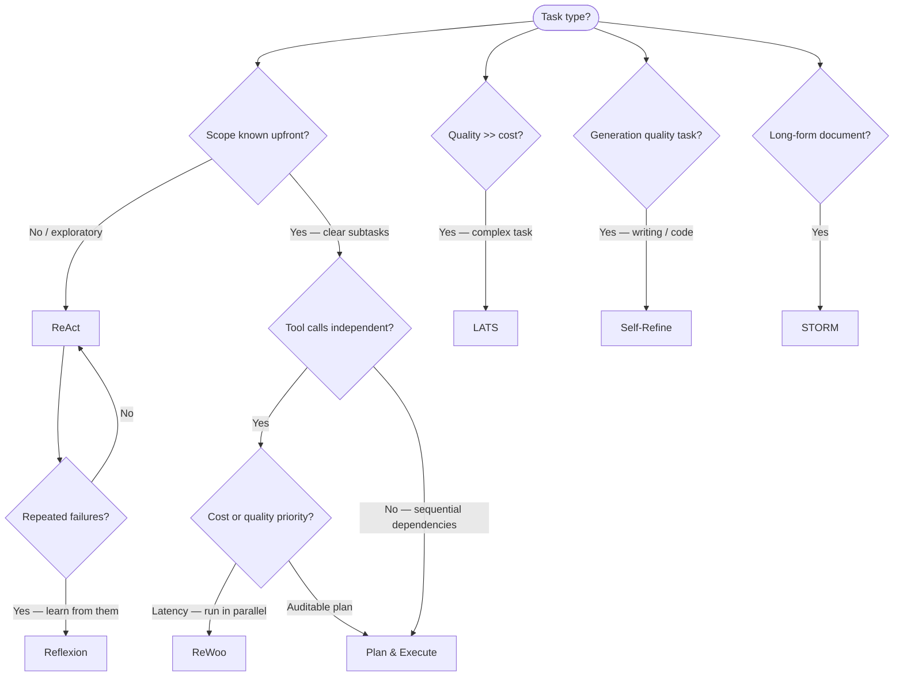

# Planner-Executor Patterns

> Agent fundamentals (ReAct basics, tool calling) → `01_agents.md`. This file is the SSOT for advanced planning strategies: how agents decide *what* to do across multiple steps, compare alternative plans, and recover from failure.

---

## Quick Reference

| Pattern | Planning style | Best for | Weakness |
|---------|---------------|----------|----------|
| ReAct | Interleaved think-act | General tool use, exploration | Can loop; no lookahead |
| Plan & Execute | Upfront plan → execute | Multi-step tasks with clear subtasks | Plan goes stale if environment changes |
| ReWoo | Tool calls extracted upfront | Parallel tool execution efficiency | Rigid — replanning is expensive |
| LATS (Tree Search) | Monte Carlo tree search over plans | Complex tasks where many paths exist | Expensive; overkill for simple tasks |
| Reflexion | Self-reflection on failure → retry | Tasks with clear success criteria | Risk of overconfidence; requires memory |
| Self-Refine | Iterative critique + edit | Generation quality tasks (code, writing) | Can diverge; needs stopping criterion |
| STORM | Hierarchical outline → expand | Long-form structured document generation | Single-domain only |
| ADaPT | Recursive task decomposition | Tasks too hard for single step | Hard to bound computation |

---

## 1. ReAct — Reason + Act

**Reference:** `01_agents.md` covers the loop in detail. This section focuses on its role as a *planning* strategy.

ReAct interleaves reasoning (Thought) with tool calls (Action) and tool outputs (Observation). Planning and execution are not separated — the plan emerges step by step.

```
Thought: I need to find the LTV ratio for first-time buyers. Let me search the policy document.
Action: search("LTV ratio first-time buyer mortgage policy")
Observation: "...first-time buyers may borrow up to 95% loan-to-value..."
Thought: Found it. The answer is 95%. I should also check if this applies to all property types.
Action: search("LTV ratio property type restrictions")
Observation: "...95% LTV is available for standard residential properties only..."
Thought: I have enough to answer. Final answer: 95% LTV for standard residential.
Answer: First-time buyers can borrow up to 95% LTV on standard residential properties.
```

**Strengths:** Adaptive to new information mid-execution. Simple to implement.

**Weaknesses:** Can loop (add max_iterations guard). No lookahead — commits to each action before seeing consequences. Poor at tasks requiring parallel sub-tasks.

**When to use:** Default starting point for any tool-using agent. Sufficient for most production use cases.

---

## 2. Plan & Execute

Separate planning from execution. The planner LLM creates a complete step-by-step plan upfront. The executor runs each step.

```mermaid
sequenceDiagram
    participant U as User
    participant P as Planner LLM
    participant E as Executor LLM
    participant T as Tools
    
    U->>P: "Analyze Q3 earnings of Apple, Google, and Microsoft"
    P->>P: Generate plan
    P-->>E: Step 1: Search Apple Q3 earnings
    E->>T: search("Apple Q3 2024 earnings")
    T-->>E: [results]
    E-->>P: Step 1 result
    P-->>E: Step 2: Search Google Q3 earnings
    E->>T: search("Google Q3 2024 earnings")
    ...
    E-->>P: All steps complete
    P->>U: Synthesize + return final answer
```

```python
from langchain_experimental.plan_and_execute import (
    PlanAndExecute, load_agent_executor, load_chat_planner
)
from langchain_openai import ChatOpenAI

planner = load_chat_planner(ChatOpenAI(model="gpt-4o"))
executor = load_agent_executor(ChatOpenAI(model="gpt-4o-mini"), tools)
agent = PlanAndExecute(planner=planner, executor=executor)
agent.invoke("Compare Q3 2024 earnings of Apple, Google, and Microsoft")
```

**Strengths:** Clear structure. Planner can use a stronger model; executor uses a cheaper model. Easy to log and debug.

**Weaknesses:** Plan goes stale if tool outputs reveal the plan was wrong. No replanning without a separate replanning step. Each step is sequential.

**When to use:** Well-scoped multi-step tasks (research reports, data gathering pipelines). Tasks where you want the plan visible/auditable.

---

## 3. ReWoo — Reasoning Without Observation

ReWoo separates tool calls from reasoning entirely. The planner lists all tool calls upfront (the "plan"), all tools are called (possibly in parallel), then reasoning uses all observations at once.

```
Phase 1 — PLAN (no tools run yet):
E1 = search("Apple Q3 2024 earnings")
E2 = search("Google Q3 2024 earnings")
E3 = search("Microsoft Q3 2024 earnings")
E4 = llm("Compare #E1, #E2, #E3 earnings")   ← depends on E1-E3

Phase 2 — EXECUTE (all independent tools run in parallel):
E1, E2, E3 executed simultaneously → results

Phase 3 — SOLVE:
E4 executed with E1, E2, E3 results inserted → final answer
```

**Strengths:** Independent tools run in parallel → significant latency reduction. Fewer LLM calls than ReAct (no interleaved reasoning).

**Weaknesses:** Rigid — if tool E1 returns unexpected output, there's no replanning. Requires variable substitution (`#E1`) to express dependencies. Not suitable for tasks requiring dynamic tool selection.

**When to use:** Tasks where you can enumerate all needed tool calls upfront. High-throughput systems where parallel execution matters.

---

## 4. LATS — Language Agent Tree Search

LATS applies Monte Carlo Tree Search (MCTS) to agent decision-making. Instead of committing to one action, the agent expands multiple branches and uses a value function (LLM self-evaluation) to decide which branch to explore.

```
Root: User query
    │
    ├── Action A1 (search strategy 1)
    │       ├── Expand → score with value function
    │       └── ...
    ├── Action A2 (search strategy 2)
    │       ├── Expand → score → best branch
    │       └── ...
    └── Action A3 (different approach)
            └── ...

Selection → Expansion → Simulation → Backpropagation (MCTS phases)
```

**Value function:** LLM evaluates each node: "How likely is this trajectory to lead to a correct answer? Score 0-1."

**Strengths:** Finds high-quality solutions for complex tasks. Can recover from dead ends by backtracking. Outperforms ReAct on HotpotQA, WebArena.

**Weaknesses:** Expensive — O(branches × depth) LLM calls. Overkill for straightforward tasks. Needs a reliable value function.

**When to use:** Complex research tasks, code debugging where multiple approaches exist, high-stakes tasks where quality matters more than cost.

---

## 5. Reflexion — Verbal Reinforcement Learning

Reflexion generates a verbal critique of the agent's failure, stores it in memory, and retries. No gradient updates — the "learning" is the reflection itself.

```
Attempt 1:
    Action → Result → Evaluate: FAIL (wrong answer)
    Reflection: "I searched for 'mortgage LTV' but the document uses 'loan-to-value 
    ratio'. I should use domain terminology next time."
    Store reflection in episodic memory

Attempt 2 (with reflection in context):
    Action → Result → Evaluate: SUCCESS
```

```python
REFLECT_PROMPT = """
You attempted this task and failed. Here is what happened:
Task: {task}
Your trajectory: {trajectory}
Expected outcome: {expected}
Actual outcome: {actual}

Write a concise reflection: what went wrong and what you should do differently.
"""

# Store reflection in memory
memory.add({"type": "reflection", "content": reflection, "task_type": task_type})

# Next attempt: retrieve relevant reflections and prepend to system prompt
past_reflections = memory.search(query=task)
system_prompt = f"Past learnings: {past_reflections}\n\n{base_system_prompt}"
```

**Strengths:** Improves on repeated similar tasks. Cheap — just text + memory. Works with any LLM without fine-tuning.

**Weaknesses:** Reflections can be wrong (LLM misdiagnoses failure). Memory grows unbounded. Risk of overconfidence if LLM generates an incorrect reflection.

**When to use:** Tasks that repeat with similar structure (same query patterns, same tools). Code generation with a test harness (run tests → reflect on failures → regenerate).

---

## 6. Self-Refine — Iterative Critique and Edit

The same LLM plays three roles: generator, critic, and refiner. No external feedback.

```
Generate(task) → draft_1
    │
    Critique(draft_1): "The summary omits the Q3 revenue figure. The tone is too formal."
    │
    Refine(draft_1, critique) → draft_2
    │
    Critique(draft_2): "Better. Minor: the growth rate calculation is wrong."
    │
    Refine(draft_2, critique) → draft_3
    │
    Stopping criterion: critique says "no significant issues" OR max iterations reached
    │
    Return draft_3
```

**Stopping criteria (important — prevents infinite loops):**
- Critique LLM outputs a `{"done": true}` signal
- Cosine similarity between successive drafts exceeds threshold (0.98 → converged)
- Max N iterations (3-5 is usually sufficient)

**When to use:** Code generation (critique = run tests), long-form writing (critique = style/completeness check), structured extraction (critique = schema validation).

---

## 7. STORM — Structured Output via Mind-mapping

STORM generates long-form structured documents (Wikipedia-style) by first building an outline, then expanding each section independently.

```
Phase 1 — Outline generation:
LLM generates hierarchical outline from the topic + retrieved knowledge

Phase 2 — Perspective generation:
LLM generates multiple "expert personas" to interview
Each persona asks different questions about the topic

Phase 3 — Content generation:
For each outline section:
  Retrieve relevant docs for that section
  Generate section content with citations
  
Phase 4 — Article assembly + polish
```

**When to use:** Long-form document generation tasks (policy documents, research summaries, technical reports). Requires a retrieval tool and significant compute.

---

## 8. ADaPT — As-Needed Decomposition and Planning with Trustworthy LLMs

ADaPT decomposes tasks recursively: if a sub-task is still too hard, decompose again. Stops when a sub-task is simple enough for the executor to handle directly.

```
Task: "Build a complete analysis of our Q3 financial performance"
    │
    Too complex → decompose:
    ├── Sub-task 1: "Summarize revenue" → simple → execute directly
    ├── Sub-task 2: "Compare to Q2" → simple → execute directly
    └── Sub-task 3: "Forecast Q4" → still complex → decompose again:
            ├── Sub-sub-task 3.1: "Extract Q1-Q3 trend" → execute
            └── Sub-sub-task 3.2: "Apply linear extrapolation" → execute
```

**When to use:** Tasks with unknown complexity upfront. Agents that need to handle both simple and complex subtasks in the same workflow.

---

## 9. Choosing a Pattern



---

## 10. LangGraph Implementation Guide

Most of these patterns are best implemented in LangGraph. → `04_langgraph_deep.md` for state machine details.

```python
from langgraph.graph import StateGraph, END
from typing import TypedDict, Annotated
import operator

class PlanExecuteState(TypedDict):
    task: str
    plan: list[str]
    current_step: int
    results: Annotated[list, operator.add]
    final_answer: str

def planner(state: PlanExecuteState) -> PlanExecuteState:
    plan = llm.invoke(f"Create a step-by-step plan for: {state['task']}")
    return {"plan": parse_plan(plan)}

def executor(state: PlanExecuteState) -> PlanExecuteState:
    step = state["plan"][state["current_step"]]
    result = tool_chain.invoke(step)
    return {"results": [result], "current_step": state["current_step"] + 1}

def should_continue(state: PlanExecuteState) -> str:
    if state["current_step"] >= len(state["plan"]):
        return "synthesize"
    return "execute"

graph = StateGraph(PlanExecuteState)
graph.add_node("plan", planner)
graph.add_node("execute", executor)
graph.add_node("synthesize", synthesizer)
graph.add_edge("plan", "execute")
graph.add_conditional_edges("execute", should_continue, {"execute": "execute", "synthesize": "synthesize"})
graph.add_edge("synthesize", END)
graph.set_entry_point("plan")
app = graph.compile()
```

---

## 11. Interview Questions

**Q: What is the difference between ReAct and Plan & Execute?**

ReAct interleaves reasoning and action — the plan emerges one step at a time, allowing adaptation to new tool outputs. Plan & Execute separates planning from execution — a planner LLM creates the full plan upfront, then an executor (possibly cheaper) runs each step. ReAct is more adaptive but can loop. Plan & Execute is more structured and auditable but goes stale if early steps return unexpected results. In practice: start with ReAct, upgrade to Plan & Execute when you need auditability or want to use a weaker executor model.

**Q: What is Reflexion and how is it different from few-shot prompting?**

Reflexion generates verbal self-critiques *after a failed attempt* and stores them in memory. Unlike few-shot prompting (static examples in the prompt), Reflexion's "examples" come from the agent's own trial-and-error. The reflection is written by the LLM analyzing its own failure trajectory — what action led to what wrong outcome and why. This makes it effective for tasks the LLM has never seen in training data. Downside: the reflection can be wrong, so repeated wrong reflections can degrade performance.

**Q: When would you use LATS over ReAct?**

LATS is Monte Carlo tree search over the action space — it explores multiple branches at each step and uses a value function to select the most promising path. Use it when: (1) The task is complex enough that the first-guess action path is likely wrong. (2) Correct answer quality matters more than cost. (3) There's a reliable way to evaluate intermediate states (a code interpreter, a test harness, a factual verifier). LATS is 10-50× more expensive than ReAct per query. For most production systems, ReAct with Reflexion is the right trade-off.

**Q: How do you prevent Self-Refine from running forever?**

Three stopping criteria: (1) The critic LLM signals "no significant issues" in a structured output (`{"done": true, "critique": "..."}`). (2) Cosine similarity between successive generated outputs exceeds a threshold (0.98 = converged, further refinement yields nothing). (3) Hard max iterations (3-5 is typical). Always implement all three as an OR condition. Monitoring: log the number of refinement rounds; high average round count signals the critic is too strict or the generator can't satisfy the critique.

---

## Connections

| Topic | File |
|-------|------|
| ReAct fundamentals + tool calling | [01_agents.md](01_agents.md) |
| LangGraph implementation (state machines, HITL) | [04_langgraph_deep.md](04_langgraph_deep.md) |
| Agent memory (storing reflections) | [05_agent_memory.md](05_agent_memory.md) |
| Multi-agent orchestration (supervisor/worker) | [07_multi_agent_orchestration.md](07_multi_agent_orchestration.md) |
| Agent reliability patterns (loop detection, max iterations) | [02_agent_reliability_patterns.md](02_agent_reliability_patterns.md) |
| Agent evaluation (success / trajectory metrics) | [09_agent_evaluation.md](09_agent_evaluation.md) |
| RAG as agent retrieval tool | [../7.rag/01_rag.md](../7.rag/01_rag.md) |

---

## Code Practice

- `code_practice/08_agents/01_react_agent.py` — ReAct from scratch
- `code_practice/08_agents/03_langgraph_agent/graph.py` — Plan & Execute in LangGraph
- `code_practice/08_agents/04_document_agent/agents.py` — Supervisor + specialist agents (ADaPT-style decomposition)
