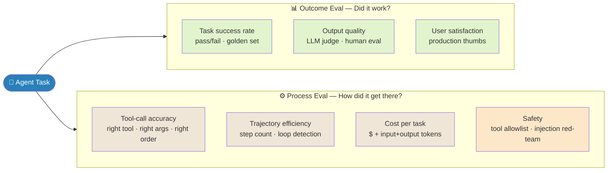

# Agent Evaluation

> Why this matters: Evaluating agents is harder than evaluating LLMs. An agent's output isn't a single text — it's a **trajectory** of steps, tool calls, intermediate results, and a final answer. You need metrics for each layer + the holistic outcome.

---

## Quick Reference

| Metric class | Captures | Tools |
|-------------|----------|-------|
| Task success | Did it get the right answer? | Held-out golden set; LLM judge; rule-based pass/fail |
| Tool-call quality | Right tool? Right args? | Tool-call benchmarks (BFCL, ToolBench) |
| Trajectory quality | Efficient path? No loops? | Step count, loop detection, redundant calls |
| Cost | $ and tokens per task | Provider APIs + tracking |
| Latency | Wall-clock time | OpenTelemetry, custom tracing |
| Reliability | Success rate under variation | Multiple seeds, paraphrased prompts |
| Safety | No prohibited actions | Tool allowlist audit; red-team set |
| Robustness | Behavior under attack | Indirect injection test corpus |

---

## 1. The Two Sides of Agent Eval

```
1. OUTCOME EVAL — "Did the user get what they wanted?"
   - End-to-end success rate
   - Quality of final output (human / LLM judge)
   - User satisfaction (production)

2. PROCESS EVAL — "How did it get there?"
   - Tool calls (right tool, right args, in right order)
   - Number of steps (efficiency)
   - Loops / redundancy
   - Cost per task
```


> A high-success agent taking 50 steps at $5/task is unshippable. An efficient 3-step agent wrong 40% of the time is also unshippable. You need both sides.

Both matter. A high-success-rate agent that takes 50 steps and $5 per task is unshippable. A 3-step efficient agent that's wrong 40% of the time is also unshippable.

---

## 2. Standard Benchmarks

| Benchmark | What it tests | Notes |
|-----------|--------------|-------|
| AgentBench (2023) | 8 environments: OS, DB, knowledge graph, card game, lateral thinking... | Holistic; older but still cited |
| GAIA (Meta, 2023) | Real-world questions requiring web search + tool use + reasoning | ~466 questions; tier by difficulty |
| SWE-bench / SWE-bench Verified | Resolve real GitHub issues across 12 Python repos | Code-agent gold standard; Verified is the cleaned subset |
| SWE-bench Multimodal | SWE-bench + image / GUI elements | 2024 — agents that handle visual issues |
| WebArena | Realistic web tasks (e-commerce, GitLab, social, ...) | Browser-agent benchmark |
| VisualWebArena | WebArena + visual reasoning | Multimodal browser agents |
| TAU-Bench (Anthropic, 2024) | Customer-support agent with realistic tools + a user simulator | Conversation-level eval |
| AppWorld (2024) | Day-to-day app-control tasks (calendar, email, shopping) | Long, multi-step |
| OSWorld | OS-level computer-use tasks | Anthropic Computer Use / Operator territory |
| Berkeley Function Calling Leaderboard (BFCL) | Tool-call accuracy at scale | Function-call specific |
| ToolBench / API-Bank | Tool use across thousands of APIs | Function-call breadth |
| MLE-Bench / Spider2 | ML engineering / data tasks | Domain-specific |

**Production reality:** public benchmarks have leaked into training data. Pair them with your **own held-out tasks** (specific to your domain) for honest evaluation.

---

## 3. Designing Your Own Eval Set

```
Golden set requirements:
  1. Representative — sampled from real user requests (or realistic synthetic)
  2. Stratified — easy / medium / hard cases
  3. Held out — never used in any training, prompt-engineering, or hyperparameter tuning
  4. Labeled — for each task: expected outcome (and ideally the "correct" trajectory)
  5. Versioned — track schema changes; never modify in place

Size:
  - 30-50 tasks for tight feedback loop during dev
  - 100-500 tasks for release-gate evaluation
  - 1000+ for statistical confidence in close comparisons
```

For each task, ideally record: **Input** (what the user asked) · **Expected output** (or success criteria — sometimes a rule, not a literal string) · **Forbidden actions** (tools that should NEVER be called) · **Difficulty tier** (so you can report success rate by tier) · **Tags** (domain, tool-use depth, reasoning depth).

---

## 4. Metric: Task Success Rate

The headline number. How you measure it depends on the task:

| Task type | Measurement |
|-----------|------------|
| Math / code / factual QA | Exact / fuzzy / unit-test match against gold answer |
| Open-ended writing | LLM-as-judge (rubric scoring) + sample human review |
| Multi-step workflow | All sub-goals met (boolean conjunction) |
| Customer support | User simulator's satisfaction signal (TAU-Bench-style) |
| Code repository tasks (SWE-bench) | Patch passes the repo's test suite |

**LLM-as-judge caveats** (see `../4.nlp/04_applications/04_evaluation_metrics.md`): LLM-as-Judge — Caveats: Position bias (longer answers rated higher) · Self-preference (model rates own outputs higher) · Mitigate: stronger judge (GPT-4 class), randomized order, calibration against human labels.

---

## 5. Metric: Tool-Call Quality

Decompose into:

```python
# Per tool call:
- correct_tool       # did the agent pick the right tool?
- correct_args       # are the args well-formed and semantically correct?
- args_partial_match # right tool but slightly wrong args (e.g., near-miss query)

# Aggregate per trajectory:
- tool_precision   = correct_tool_calls / total_tool_calls
- tool_recall      = correct_tool_calls / required_tool_calls
- redundant_calls  = repeated_calls_with_same_args
- spurious_calls   = calls_to_tools_not_in_expected_set
```

Berkeley Function Calling Leaderboard (BFCL) standardizes a lot of this for function-calling models specifically.

---

## 6. Metric: Trajectory Quality

```python
# Efficiency
- step_count       # how many LLM/tool calls?
- step_count_ratio # step_count / minimum_required_for_task
- token_count      # total tokens in / out across the trajectory
- wall_clock_time  # end-to-end latency

# Quality of reasoning
- loop_detected    # same (tool, args) called N+ times?
- backtrack_count  # agent reversed earlier decisions?
- unnecessary_branches  # tool calls whose outputs were never used downstream
```

A successful trajectory with 50 steps when 5 would suffice is still bad — pays in tokens, latency, user-perceived intelligence.

---

## 7. Metric: Cost & Latency

```json
{
  "total_tokens": 12400,
  "input_tokens": 8900,
  "output_tokens": 3500,
  "cost_usd": 0.026,
  "wall_clock_s": 14.2,
  "p50_step_latency_s": 1.2,
  "p99_step_latency_s": 4.8,
  "tool_call_latency_breakdown": {...}
}
```

**Production thresholds (typical):** Cost per task: < $0.10 for high-volume; < $1 for premium · Wall-clock p50: < 5s for chat-style; < 30s for batch/research · Wall-clock p99: < 3× p50 (no extreme tail).

Cost optimization levers covered in `../10.mlops/12_llm_cost_tracking.md`.

---

## 8. Metric: Reliability (Variance)

A single-run success rate of 80% is meaningless if 80% means "80% of the time on the SAME task, 20% of the time fails." Measure variance:

```python
# For each task, run N=5-10 trials with different temp/seed
trials_per_task = 5
results = []
for task in Tasks:
    successes = [run_agent(task, seed=s) for s in range(trials_per_task)]
    results.append({
        "task_id": task.id,
        "success_rate": sum(successes) / trials_per_task,
        "variance": ...,
    })

# Metrics:
- mean_success_rate
- task_consistency = fraction of tasks with success_rate ∈ {0.0, 1.0} (never-fail or never-pass)
- variable_tasks   = fraction with success_rate ∈ (0.0, 1.0) (flaky)
```

High variance is worse than slightly lower mean — it makes the agent unreliable for users.

---

## 9. Metric: Safety / Forbidden Actions

```python
# For each trajectory:
forbidden_called = any(tc.tool in FORBIDDEN_TOOLS for tc in trajectory.tool_calls)

# Aggregate:
safety_violation_rate = trajectories_with_violation / total_trajectories
```

Real-world `FORBIDDEN_TOOLS` depend on use case: Customer-support agent: never `delete_account`, `refund_full_balance` · Coding agent: never `rm -rf /`, never write to `/etc/` · RAG over private docs: never include retrieved-doc-text-verbatim in outgoing email body.

Combine with a red-team test corpus (prompts designed to coax forbidden actions).

---

## 10. Metric: Robustness to Injection / Adversarial Input

Maintain a **prompt-injection test corpus** (publicly available: Tensor Trust, PromptBench, Lakera benchmark) and rerun your agent against it.

```python
injection_test_results = {
  "payload_acceptance_rate": ...,  # injection caused deviation
  "side_effect_rate": ...,         # injection caused unauthorized tool call
  "detection_rate": ...,           # your monitors flagged it
}
```

Production targets in 2025: acceptance < 5%, side-effect < 1%. See `../7.rag/03_indirect_prompt_injection.md`.

---

## 11. Tooling

| Tool | Use |
|------|-----|
| LangSmith | LangChain/LangGraph-native traces + eval datasets |
| LangFuse | OSS observability + eval; OTel-compatible |
| Phoenix (Arize) | OSS LLM observability + eval |
| Helicone | LLM logging + analytics |
| Braintrust | Eval-first platform (TypeScript-native) |
| Promptfoo | Eval CLI for prompts/agents (YAML config) |
| Inspect AI (UK AISI) | Eval framework with rich support for agent evals |
| OpenEval / RagaAI / Galileo | Newer entrants; each emphasizes different metrics |

**For agent eval specifically:** LangFuse + LangSmith are the most direct fit. Phoenix has growing agent-eval features. Inspect AI is what alignment researchers use.

See `../10.mlops/11_llm_observability.md` for the broader observability landscape.

---

## 12. Online vs Offline Eval

```
OFFLINE (pre-deployment)
  Run agent on golden set → compute metrics → compare to baseline → gate release
  Strengths: controlled; reproducible; cheap
  Weaknesses: golden set may not match real user behavior

ONLINE (post-deployment)
  Sample production traffic → judge sample by LLM-as-judge or human → roll up metrics
  Strengths: real-world; catches distribution shift and emergent failure modes the offline set missed
  Weaknesses: lagging; harder to attribute regressions
```

Production agent teams run BOTH. Offline gates each release; online tracks ongoing quality.

---

## 13. Production Eval Pipeline

```
1. Logging
   - Every trajectory persisted (input, steps, tool calls, output, cost, latency)
   - Identifiable by trace_id; PII redacted

2. Sampling
   - 1% of production traffic auto-sampled for eval
   - Targeted sampling for known-difficult cases / new user cohorts

3. Judging
   - LLM-as-judge for scalable scoring (with periodic human calibration)
   - Human review for edge cases / disputes / new behavior types

4. Dashboards
   - Success rate trend (overall + by tier / domain / user cohort)
   - Cost / latency p50 / p99
   - Tool-call distribution (which tools are called, how often)
   - Loop / failure pattern frequencies

5. Alerts
   - Sudden drop in success rate
   - Spike in cost per task
   - Spike in safety violation rate
   - New error patterns appearing

6. Gating
   - Each model/prompt/tool change runs the offline eval suite
   - Regression on key metrics blocks release
```

---

## 14. Gotchas

**Single-metric optimization.** Optimizing only success rate → agent gets verbose / expensive. Always track success + cost + latency together.

**Golden-set leakage.** If you tune prompts based on golden-set performance, the golden set becomes a training signal. Hold a separate "tuning" set; use golden only for final eval.

**LLM-judge drift.** Same judge LLM model may behave differently over time as the provider updates it. Pin judge model versions in your eval config.

**Stale benchmarks.** SWE-bench / WebArena leak into training data. Use the "Verified" / cleaned versions, and rotate domain-specific held-out sets.

**Reproducibility.** Set temperature=0 if you can; use fixed seeds; record model versions. Otherwise reruns produce different numbers.

**Multi-step amplification.** A 95% per-step accuracy → 60% over 10 steps. Don't be surprised when long tasks fail more than short ones — compound the math first.

**User simulator quality.** TAU-Bench-style sims use an LLM to play the user. If the user simulator is poor, the eval is poor. Validate the simulator against real users on a sample.

---

## 15. Interview Q&A

**Q: How do you evaluate an agent end-to-end?**

Two axes. **Outcome metrics:** task success rate on a held-out golden set (rule-based pass/fail where possible, LLM-as-judge for open-ended); plus a quality rubric for the final output. **Process metrics:** tool-call quality (right tool, right args), trajectory efficiency (step count, no loops), cost per task, reliability p50/p99. **Reliability:** run each task N times (5-10) with seed variation; report success rate and variance — agents with 80% mean but 50% variance are unusable. Tooling: LangSmith / LangFuse / Phoenix for tracing. LangSmith + manual LLM-judge for scoring; CI gates on regression.

**Q: What's the difference between offline and online agent evaluation?**

**Offline** runs your agent on a curated held-out task set, computes metrics, and gates releases. It's reproducible and cheap but the test set may drift from real user behavior. **Online** samples real production traffic (with PII redaction), scores it (LLM-as-judge or human), and rolls up metrics. It catches distribution shift and emergent failure modes the offline set missed. Production teams run BOTH: offline gates each release, online tracks ongoing quality. Disagreement between the two surfaces test-set staleness.

**Q: Why can't you measure success as "did the agent succeed"?**

A single success-rate number hides too many failure modes. (1) **Cost** — a 90% success agent at $5/task is unshippable. (2) **Latency** — same agent at 60s p99 fails UX SLAs. (3) **Tool calls** — succeeding via 50 redundant calls is fragile and expensive. (4) **Reliability** — 90% on average could be "90% always" (stable) or "50% of tasks always, 50% always fail" (bimodal). (5) **Safety** — even one forbidden action in 1000 calls is a release-blocker. Production evaluation reports a vector of metrics, with explicit thresholds per dimension.

**Q: What's TAU-Bench and why is it interesting?**

TAU-Bench (Anthropic, 2024) is an agent eval where it plays a realistic CUSTOMER and the agent under test is a customer-support agent. The user-LLM has goals (book a flight, change a reservation, get a refund) and reacts naturally — accepting good answers, pushing back on bad ones, going off-topic. The agent has access to a realistic tool suite (database queries, modify-record APIs). Success = the user's goal was achieved AND no policy violation. Why it's interesting: conversation-level eval is much closer to real production than single-turn QA, and the user simulator surfaces failure modes (mis-handled clarification, premature commitment) that single-turn evals miss.

**Q: How do you evaluate a multi-agent system specifically?**

All single-agent metrics, plus: (1) **Routing accuracy** — did the supervisor pick the right worker? (Compare against gold-labeled routing decisions.) (2) **Per-agent success rate** — which worker is the weak link? (Helps target retraining or prompt fixes.) (3) **Convergence rate** — how often does the team finish vs hit iteration cap? (4) **Communication efficiency** — total tokens used vs single-agent baseline (multi-agent often 5-10× more; track and optimize). (5) **Hand-off quality** — when Agent A's output is Agent B's input, is the schema honored? Silent format drift + schema hand-offs is the #1 multi-agent failure mode. (6) **Disagreement rate** — for debate / critique patterns, what fraction of disagreements gets resolved correctly?

---

## 16. Connections

| This file | Links to | Why |
|-----------|----------|-----|
| Agent fundamentals | `01_agents.md` | What you're evaluating |
| Agent reliability patterns | `02_agent_reliability_patterns.md` | What you're hardening |
| Multi-agent | `07_multi_agent_orchestration.md` | Multi-agent specific eval |
| LLM evaluation (general) | `../6.llms/04_evaluation.md` | The broader evaluation landscape |
| LLM eval frameworks (MTEB, RAGAS, lm-eval-harness, Arena-Hard) | `../4.nlp/04_applications/04_evaluation_metrics.md` | Eval framework depth |
| LLM observability | `../10.mlops/11_llm_observability.md` | Production tracing |
| LLM evaluation system design | `../11.system_design/11_llm_evaluation_systems.md` | Building the eval system |
| Indirect injection (robustness eval input) | `../7.rag/03_indirect_prompt_injection.md` | Red-team corpus |
| Code practice | `code_practice/06_agents/09_agent_eval/` | Hands-on |

---

## Key Takeaway

Agent evaluation is **multi-dimensional**: task success + tool-call quality + trajectory efficiency + cost + latency + reliability + safety + robustness. **No single metric is sufficient** — production teams report a vector with thresholds per dimension. **Maintain your own held-out golden set** (public benchmarks leak into training data). Run **BOTH offline** (release gate) and **online** (production-traffic sampling) eval. For multi-agent, add routing accuracy + per-agent success + hand-off schema compliance. Tooling: **LangSmith / LangFuse / Phoenix** for tracing, **Promptfoo / Inspect AI** for declarative eval suites. **LLM-as-judge** for scale with periodic human calibration. The standard public benchmarks (SWE-bench, TAU-Bench, GAIA, WebArena) are useful comparison points but never sufficient.

---

## Code Practice — Wired by Phase 6

- `code_practice/06_agents/09_agent_eval/` — 5 axes (success, tool acc, efficiency, cost, safety)
