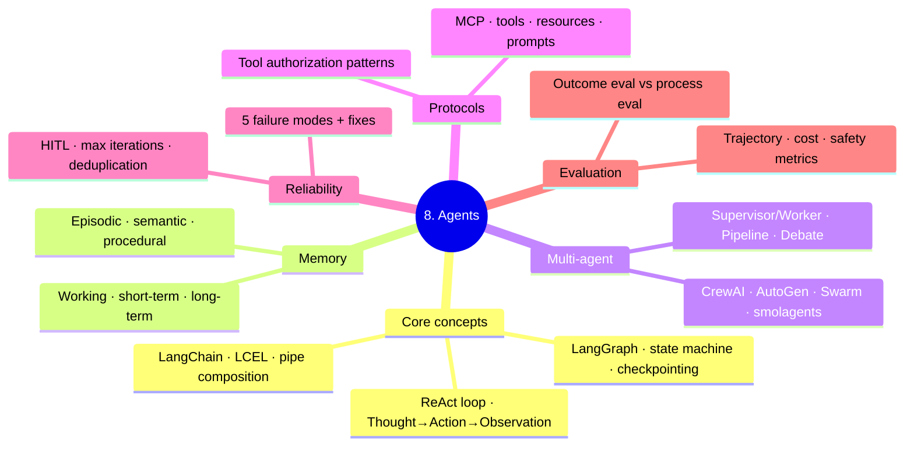

# 8. Agents

Scope: LLM agents — ReAct, tool use, frameworks (LangGraph / CrewAI / AutoGen / Swarm), memory, multi-agent, MCP, evaluation, reliability.



**Tier: 2 (Theory).** The most comprehensive part of the LLM stack — 11 files cover the full agent lifecycle.

---

## Where This Sits

**The learning arc is `6.llms` → `7.rag` → `8.agents`.** This folder is the last step.

```
6.llms    the engine   — what ONE call does
7.rag     a tool       — retrieval, one capability
8.agents  the loop     — decides WHICH tool, and WHEN      ← you are here
```

An agent is a loop around a single LLM call, and RAG is one of the tools it can reach for. Neither makes sense before those two. If `00_agent_stack_foundations.md` is the only file you read here, it is still the highest-value one — it owns the orientation for the entire arc, not just this folder.

---

## Reading Order

| If you're learning... | Read in order |
|----------------------|---------------|
| **Orientation (start here)** | `00_agent_stack_foundations` — what a model / runtime / host / format / SDK / framework / protocol each is, and workflows vs agents |
| Agent fundamentals | `01_agents` → `01b_agents_end_to_end` |
| Production reliability | `02_agent_reliability_patterns` (retries, loop detection, structured outputs, HITL, audit) |
| Frameworks | `03_langchain_primer` → `04_langgraph_deep` (the modern default) → `07_multi_agent_orchestration` |
| Memory | `05_agent_memory` (working / short / long-term split with subtypes) |
| Planning | `06_planner_executor_patterns` (ReAct / Plan&Execute / ReWoo / LATS / Reflexion) |
| Protocol layer | `08_mcp_protocol_deep` (Model Context Protocol) |
| Evaluation | `09_agent_evaluation` (success / tool-quality / trajectory / cost / safety) |

---

## Folder TOC

| File | Owns |
|------|------|
| `00_agent_stack_foundations.md` | SSOT: the 7-layer stack, wire-format comparison, product placement map, workflows vs agents + Anthropic's 5 workflow patterns, when to delete the framework |
| `01_agents.md` | Agent fundamentals — ReAct, tool calling, MCP overview |
| `01b_agents_end_to_end.md` | Worked example — agent loop with tool calls |
| `02_agent_reliability_patterns.md` | SSOT: production hardening (retries, loop detection, structured outputs, HITL, audit log) |
| `03_langchain_primer.md` | LCEL, Runnables, output parsers, when to use vs not |
| `04_langgraph_deep.md` | SSOT: state machines, checkpointing, HITL interrupts, parallel branches, subgraphs |
| `05_agent_memory.md` | SSOT: working / short / long-term (episodic / semantic / procedural) memory architectures |
| `06_planner_executor_patterns.md` | SSOT: ReAct / Plan&Execute / ReWoo / LATS / Reflexion / Self-Refine / STORM / ADaPT |
| `07_multi_agent_orchestration.md` | SSOT: CrewAI / AutoGen / OpenAI Swarm / smolagents / Pydantic AI / LangGraph multi-agent |
| `08_mcp_protocol_deep.md` | SSOT: MCP architecture, capabilities (tools/resources/prompts/sampling/roots), transports |
| `09_agent_evaluation.md` | SSOT: success / tool-call / trajectory / cost / reliability / safety metrics + benchmarks |

---

## SSOT Topics Owned Here

- Stack layers / wire formats / workflows vs agents → `00_agent_stack_foundations.md`
- Agent reliability patterns → `02_agent_reliability_patterns.md`
- LangGraph deep dive → `04_langgraph_deep.md`
- Agent memory architectures → `05_agent_memory.md`
- Planner-executor patterns → `06_planner_executor_patterns.md`
- Multi-agent orchestration → `07_multi_agent_orchestration.md`
- MCP protocol → `08_mcp_protocol_deep.md`
- Agent evaluation → `09_agent_evaluation.md`

---

## Connections

- **LLM core** (prompting, fine-tuning): `../6.llms/`
- **RAG** (often the retrieval tool used by agents): `../7.rag/`
- **Tool authorization patterns** (security depth): `../11.system_design/09_tool_authorization_patterns.md`
- **LLM evaluation systems** (incl. agent eval at system level): `../11.system_design/11_llm_evaluation_systems.md`
- **LLM observability** (LangFuse / LangSmith / Phoenix): `../10.mlops/11_llm_observability.md`
- **Structured outputs** (Pydantic + Instructor): `../4.nlp/04_applications/03_information_extraction.md`
- **Constrained decoding**: `../5.transformers/02_models/12_constrained_decoding.md`
- **Indirect prompt injection** (the #1 agent threat): `../7.rag/03_indirect_prompt_injection.md`
- **Agent system design** (capacity, multi-tenant, scaling): `../11.system_design/05_llm_agent_system_design.md`

---

## Practice

- Agents (4 sessions, all ✅ Run) → [../code_practice/08_agents/](../code_practice/08_agents/)
  - `01_react_agent.py` · `02_tool_calling.py` · `03_langgraph_agent/` · `04_document_agent/`
- Primitives ladder (the loop, one step at a time) → [../code_practice/12_agents_from_scratch/](../code_practice/12_agents_from_scratch/)
- **Not yet built:** dedicated sessions for MCP, long-term memory, agent eval, and production hardening.

## Interview Prep

- 4-day plan → [../code_practice/11_interview_drills/AGENTS_4DAY_PLAN.md](../code_practice/11_interview_drills/AGENTS_4DAY_PLAN.md)
- Question bank → [../code_practice/11_interview_drills/AGENTS_QA_BANK.md](../code_practice/11_interview_drills/AGENTS_QA_BANK.md)
