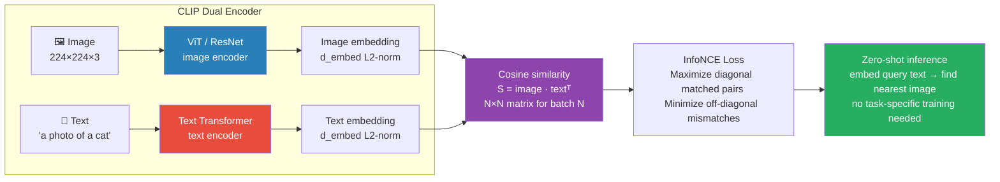

# 01 Vision-Language Models (CLIP, VLMs)

## Quick Reference

| Model | Architecture | Task | Key Innovation |
|---|---|---|---|
| CLIP | Dual encoder (ViT + text transformer) | Zero-shot classification, retrieval | Contrastive pretraining on image-text pairs |
| ALIGN | Dual encoder (EfficientNet + BERT) | Same as CLIP | Noisy web data at scale (1.8B pairs) |
| BLIP-2 | Frozen ViT + Q-Former + frozen LLM | VQA, captioning, reasoning | Q-Former bridges vision-language gap |
| LLaVA | CLIP visual encoder + LLM | Instruction-following VQA | Simple MLP projection, visual instruction tuning |
| GPT-4V | Proprietary multimodal | Any visual task | State-of-the-art understanding |
| Gemini | Unified multimodal transformer | Any visual task | Native multimodal (not add-on) |

---

## Core Concepts

### CLIP (Contrastive Language-Image Pretraining, OpenAI 2021)

Architecture:
```
Image = [ViT or ResNet] → image_embedding ∈ R^d
Text  = [Text Transformer] → text_embedding ∈ R^d
Both embeddings L2-normalized → dot product = cosine similarity
```


> 400M (image, text) pairs trained CLIP. At inference: embed any text → find nearest image by cosine similarity → zero-shot classification.

Contrastive Pretraining:
```
Training data: 400M (image, text) pairs scraped from the web
               "A photo of a dog" + [dog image]

For a batch of N pairs, construct N×N similarity matrix:
          text₁  text₂  text₃  ...  textₙ
image₁  [ S₁₁,  S₁₂,  S₁₃,  ...  S₁ₙ ]
image₂  [ S₂₁,  S₂₂,  S₂₃,  ...  S₂ₙ ]
...
imageₙ  [ Sₙ₁,  Sₙ₂,  Sₙ₃,  ...  Sₙₙ ]

Objective: maximize diagonal (matched pairs), minimize off-diagonal (mismatches)
InfoNCE loss (symmetric):
  L_img→txt = -1/N Σ log exp(Sᵢᵢ/τ) / Σ exp(Sᵢⱼ/τ)
  L_txt→img = -1/N Σ log exp(Sᵢᵢ/τ) / Σ exp(Sⱼᵢ/τ)
  L = (L_img→txt + L_txt→img) / 2

τ = temperature (learned, initialized to 0.07)
Large batch N = more negatives = harder training = better representations
```

```python
import torch
import torch.nn.functional as F

def clip_loss(image_embeddings, text_embeddings, temperature=0.07):
    """
    image_embeddings: [N, d] L2-normalized
    text_embeddings:  [N, d] L2-normalized
    """
    # Similarity matrix [N, N]
    logits = torch.matmul(image_embeddings, text_embeddings.T) / temperature

    # Targets: diagonal indices 0, 1, 2, ..., N-1
    labels = torch.arange(len(image_embeddings), device=image_embeddings.device)

    # Symmetric cross-entropy loss
    loss_i2t = F.cross_entropy(logits, labels)    # image → text
    loss_t2i = F.cross_entropy(logits.T, labels)  # text → image
    return (loss_i2t + loss_t2i) / 2
```

### Zero-Shot Classification

```python
from transformers import CLIPProcessor, CLIPModel
from PIL import Image
import torch

model = CLIPModel.from_pretrained("openai/clip-vit-large-patch14")
processor = CLIPProcessor.from_pretrained("openai/clip-vit-large-patch14")

image = Image.open("cat.jpg")
classes = ["a cat", "a dog", "a bird", "a car"]

# Create text prompts (prompt engineering matters!)
text_prompts = [f"a photo of {cls}" for cls in classes]

inputs = processor(
    text=text_prompts,
    images=image,
    return_tensors="pt",
    padding=True
)

with torch.no_grad():
    outputs = model(**inputs)
    logits_per_image = outputs.logits_per_image   # [1, num_classes]
    probs = logits_per_image.softmax(dim=-1)

print({cls: prob in zip(classes, probs[0])})
# "a cat": 0.91, "a dog": 0.05, "a bird": 0.02, "a car": 0.01
```

### Image-Text Retrieval

```python
# Embed a large corpus of images offline
image_embeddings = {}
for img in image_corpus:
    inputs = processor(images=img, return_tensors="pt")
    with torch.no_grad():
        emb = model.get_image_features(**inputs)
        emb = F.normalize(emb, dim=-1)
    image_embeddings.append(emb)

image_embeddings = torch.cat(image_embeddings)   # [N, 768]

# At query time: embed text query + find nearest images
query = "a dog playing in the snow"
text_inputs = processor(text=[query], return_tensors="pt", padding=True)
with torch.no_grad():
    text_emb = model.get_text_features(**text_inputs)
    text_emb = F.normalize(text_emb, dim=-1)

similarities = (text_emb @ image_embeddings.T).squeeze()
top_k = similarities.topk(5).indices
```

---

## BLIP-2 (Bootstrapped Language-Image Pretraining)

The problem BLIP-2 solves:
```
Challenge: align a powerful frozen vision encoder with a powerful frozen LLM.
Direct connection doesn't work: vision encoder outputs don't speak "LLM language".

Solution: Q-Former (Query Transformer) — a lightweight trainable bridge module

Architecture:
  Frozen ViT (image encoder)
    ↓ image features
  Q-Former (32 learnable query tokens)
    - Query tokens attend to image features via cross-attention
    - Query tokens also attend to each other (self-attention)
    - Queries extract the most language-relevant visual information
    ↓ 32 query embeddings → linear projection
  Frozen LLM (OPT, FlanT5, Llama)
    ↓ text output

Only Q-Former and projection layer are trained — ~188M params total
Vision encoder and LLM completely frozen during Q-Former training.
```

```python
from transformers import Blip2Processor, Blip2ForConditionalGeneration
from PIL import Image
import torch

processor = Blip2Processor.from_pretrained("Salesforce/blip2-opt-2.7b")
model = Blip2ForConditionalGeneration.from_pretrained(
    "Salesforce/blip2-opt-2.7b",
    torch_dtype=torch.float16,
    device_map="auto"
)

image = Image.open("chart.png")

# Visual Question Answering
question = "What is the trend shown in this chart?"
inputs = processor(image, question, return_tensors="pt").to("cuda", torch.float16)
generated_ids = model.generate(**inputs, max_new_tokens=100)
answer = processor.batch_decode(generated_ids, skip_special_tokens=True)[0].strip()

# Image captioning (no question)
inputs = processor(images=image, return_tensors="pt").to("cuda", torch.float16)
generated_ids = model.generate(**inputs, max_new_tokens=50)
caption = processor.batch_decode(generated_ids, skip_special_tokens=True)[0].strip()
```

---

## LLaVA (Large Language and Vision Assistant)

Architecture (LLaVA 1.5):
```
CLIP Visual Encoder (ViT-L/14@336px)
  ↓ visual features
MLP Projection Layer (2-layer MLP — trained, replaces Q-Former)
  ↓ visual tokens
Vicuna / LLaMA (frozen initially, then fine-tuned)

Visual instruction tuning (2 stages):
  Stage 1: train MLP projection on image-text alignment data (595K pairs)
  Stage 2: end-to-end fine-tune on visual instruction data (665K examples)
  Includes: VQA, reasoning, OCR, conversation
```

```python
from transformers import LlavaNextProcessor, LlavaNextForConditionalGeneration
from PIL import Image
import torch

processor = LlavaNextProcessor.from_pretrained("llava-hf/llava-1.6-mistral-7b-hf")
model = LlavaNextForConditionalGeneration.from_pretrained(
    "llava-hf/llava-1.6-mistral-7b-hf",
    torch_dtype=torch.float16,
    device_map="auto"
)

image = Image.open("invoice.png")

# Visual instruction format
conversation = [
    {
        "role": "user",
        "content": [
            {"type": "image"},
            {"type": "text", "text": "Extract the invoice number, date, and total amount from this invoice."}
        ],
    },
]

prompt = processor.apply_chat_template(conversation, add_generation_prompt=True)
inputs = processor(images=image, text=prompt, return_tensors="pt").to("cuda")

with torch.no_grad():
    output = model.generate(**inputs, max_new_tokens=200)
result = processor.decode(output[0], skip_special_tokens=True)
```

---

## CLIP for Downstream Tasks

### Linear Probe (few-shot classification)

```python
from sklearn.linear_model import LogisticRegression
from sklearn.preprocessing import LabelEncoder
import numpy as np

def extract_clip_features(images, model, processor):
    all_features = []
    for img in images:
        inputs = processor(images=img, return_tensors="pt")
        with torch.no_grad():
            features = model.get_image_features(**inputs)
            features = F.normalize(features, dim=-1)
        all_features.append(features.cpu().numpy())
    return np.vstack(all_features)

train_features = extract_clip_features(train_images, model, processor)
test_features  = extract_clip_features(test_images,  model, processor)

le = LabelEncoder()
train_labels = le.fit_transform(train_label_strings)
test_labels  = le.transform(test_label_strings)

clf = LogisticRegression(C=0.316, max_iter=1000, random_state=42)
clf.fit(train_features, train_labels)

accuracy = clf.score(test_features, test_labels)
print(f"Accuracy with {len(train_images)} examples: {accuracy:.3f}")
```

### CLIP for Anomaly Detection

```python
# "normal" vs "abnormal" — zero-shot with text prompts
normal_prompts  = ["a normal product", "a good quality item", "undamaged"]
anomaly_prompts = ["a defective product", "damaged", "broken", "anomalous"]

def anomaly_score(image, model, processor):
    normal_embs  = get_text_embeddings(normal_prompts,  model, processor)
    anomaly_embs = get_text_embeddings(anomaly_prompts, model, processor)

    img_inputs = processor(images=image, return_tensors="pt")
    with torch.no_grad():
        img_emb = F.normalize(model.get_image_features(**img_inputs), dim=-1)

    normal_sim  = (img_emb @ normal_embs.T).mean()
    anomaly_sim = (img_emb @ anomaly_embs.T).mean()
    # Higher = more anomalous
    return (anomaly_sim - normal_sim).item()
```

---

## When to Use What

| Task | Model | Notes |
|---|---|---|
| Zero-shot image classification | CLIP | No fine-tuning needed |
| Image-text retrieval | CLIP | Bi-encoder → ANN search |
| Visual QA + reasoning | LLaVA-1.6 or GPT-4V | LLaVA open-source; GPT-4V better |
| Document understanding | PaddleOCR + LLaVA or GPT-4V | See document_ai.md |
| Image captioning | BLIP-2 | Lightweight, frozen LLM |
| Few-shot classification | CLIP + linear probe | Strong baseline |
| Production VQA | GPT-4V API or Claude 3 | Best quality |

---

## Gotchas

**CLIP text encoder max length is 77 tokens.** Long text descriptions are truncated. Use the first 77 tokens or redesign prompts to be concise.

**Prompt engineering significantly affects CLIP zero-shot accuracy.** "a photo of a {class}" works better than just "{class}". OpenAI publishes optimal templates per dataset. Ensemble multiple prompt templates and average embeddings.

**CLIP embeddings are NOT interchangeable with sentence embeddings.** CLIP is trained for image-text alignment — its text embeddings work well for multimodal retrieval but are inferior to SBERT for text-only semantic similarity tasks.

**LLaVA hallucination on images.** VLMs often describe objects not in the image. For factual extraction (invoice data, document fields), always validate extracted values against expected formats (regex, type checks).

**Resolution matters for CLIP.** `clip-vit-base-patch32` uses 224×224; `clip-vit-large-patch14-336` uses 336×336. Higher resolution = better for detailed images. LLaVA-1.6 supports dynamic high resolution (up to 2240×2240 via tiling).

---

## Interview Q&A

**Q: Explain CLIP's contrastive pretraining. Why does it enable zero-shot classification?**
A: CLIP trains image and text encoders jointly on 400M image-text pairs using InfoNCE contrastive loss — matched pairs are pulled together in embedding space, mismatched pairs are pushed apart. This creates a shared embedding space where images and text are directly comparable via cosine similarity. Zero-shot classification works by encoding class names as text ("a photo of a dog") and finding which text embedding is most similar to the image embedding — no task-specific training needed. The key insight: the internet already provides implicit supervision in the form of image alt-text, captions, and descriptions.

**Q: What is the Q-Former in BLIP-2 and why is it needed?**
A: The Q-Former is a lightweight transformer that bridges a frozen vision encoder and a frozen LLM. The problem: vision encoder outputs dense visual features; LLMs expect text-like token sequences. Directly connecting them doesn't work because they were trained independently with different objectives. Q-Former has 32 learnable query tokens that attend to visual features via cross-attention, distilling the most language-relevant visual information into 32 fixed-length embeddings. Only Q-Former is trained, keeping both the vision encoder and LLM frozen. This makes BLIP-2 extremely efficient to train while leveraging powerful pretrained components.

**Q: How would you use CLIP for a custom classification task?**
A: Three approaches with increasing data requirements: (1) Zero-shot — just define class names as text prompts and compute similarities; works surprisingly well for common categories. (2) Linear probe — extract CLIP image features for labeled examples, train a logistic regression or small MLP on top; few-shot-efficient. (3) Full fine-tuning — update both CLIP encoder and classification head; use when domain shift is significant (e.g., medical images, satellite imagery). Always try zero-shot first; then linear probe. Fine-tune only if you have ≥1K labeled examples and domain shift is clear.

---

## Connections

- CNN Architectures (`CV/fundamentals/02`): ViT is CLIP's default image encoder — same patch embedding mechanism
- Transformer Architecture (`transformers/fundamentals/02`): Both image and text encoders are transformers
- Transfer Learning (`CV/applications/01`): CLIP features as backbone for few-shot tasks
- RAG (`5.llms/04`): CLIP embeddings for multimodal retrieval (image search from text queries)
- Document AI (`6.multimodal/03`): VLMs applied to document images

---

## Key Takeaway

CLIP = contrastive pretraining aligns image and text embeddings in shared space → enables zero-shot transfer. For zero-shot classification: encode class names as text, find nearest text to image. BLIP-2 bridges frozen ViT and frozen LLM with a Q-Former. LLaVA simplifies this with an MLP projection + visual instruction tuning — open-source and capable. For production visual understanding, GPT-4V or Claude 3 Vision. For open-source: LLaVA-1.6 with Mistral-7B backbone.
