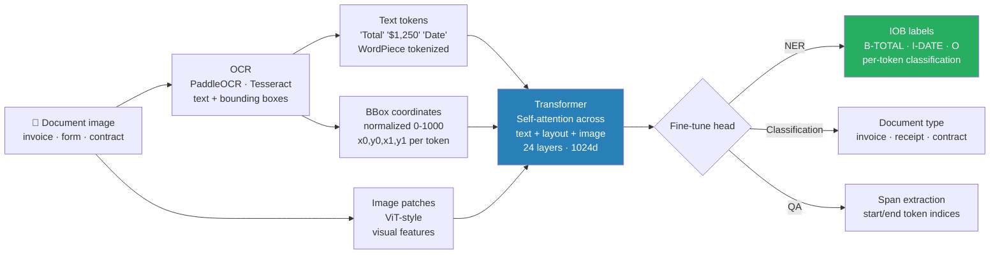

# 06 — LayoutLM v3 End-to-End: Worked Examples

> Complete dry-run of LayoutLM v3 from raw document → OCR → input encoding → forward pass → prediction → fine-tuning. Every step traced with concrete numbers.

---

## What LayoutLM v3 Actually Does

```
Problem: Given a document image (invoice, form, contract),
         extract structured fields (invoice_number, date, total_amount, vendor_name).

Standard NLP approach fails because:
  - Text alone loses spatial context ("Total" on left, "$1,250" on right)
  - Position on page is semantically meaningful (header vs footer, label vs value)

LayoutLM v3 solves this by combining 3 modalities in one transformer:


> Key: bbox normalization to [0, 1000] makes layout position-invariant to document resolution.
  1. Text tokens (from OCR)
  2. Bounding box coordinates for each token (layout)
  3. Image patches (visual features)

All 3 attend to each other via self-attention → model understands
"this text is at position X, it looks like Y, it reads Z"
```

---

## Part 1: Input Preparation — Dry Run

### Raw Document

```
Invoice image: 1000×800 pixels
OCR output (PaddleOCR):

Word             BBox [x0, y0, x1, y1]         Confidence
"INVOICE"        [50, 30, 180, 68]              0.99
"NUMBER:"        [185, 30, 310, 68]             0.98
"INV-2026-0432"  [315, 30, 500, 68]             0.97
"DATE:"          [50, 80, 120, 118]             0.99
"2026-03-14"     [125, 80, 270, 118]            0.98
"VENDOR:"        [50, 130, 140, 168]            0.98
"Acme"           [150, 130, 220, 168]           0.97
"Corp"           [225, 130, 295, 168]           0.97
"TOTAL:"         [50, 400, 130, 438]            0.99
"$1,250.00"      [400, 400, 500, 438]           0.98
```

### Step 1: Normalize Bounding Boxes to [0, 1000]

```
LayoutLM v3 normalizes all coordinates to [0, 1000] range.

Formula: x_norm = int(x / image_width × 1000)
         y_norm = int(y / image_height × 1000)

Image: 1000×800 pixels

"INVOICE":        [50,30,180,68]   → [50, 37, 180, 75]
"INV-2026-0432":  [315,30,500,68]  → [315, 37, 500, 75]
"DATE:":          [50,80,120,118]  → [50, 100, 120, 137]
"2026-03-14":     [125,80,270,118] → [125, 100, 270, 137]
"VENDOR:":        [50,130,140,168] → [50, 162, 140, 210]
"$1,250.00":      [400,400,500,438]→ [400, 500, 500, 537]

Each bounding box has 4 values: [x0_norm, y0_norm, x1_norm, y1_norm]
```

### Step 2: Tokenization

```
LayoutLM v3 uses RoBERTa tokenizer.
Words may be split into subword tokens; bbox repeated for each subword.

Word "INV-2026-0432" → tokens: ["INV", "##-20", "##-", "2026", "-", "04", "##32"]
Each subword token gets the same bbox as the parent word: [315, 37, 500, 75]

Final token sequence (simplified):
  [CLS] INVOICE NUMBER : INV - 2026 - 04 #0432 DATE : 2026 - 03 - 14
        VENDOR : Ac ##me Corp TOTAL : $1 , 250 . 00 [SEP]

Special tokens [CLS] and [SEP] get bbox = [0, 0, 0, 0]
```

### Step 3: Image Patches

```
LayoutLM v3 divides the document image into patches (like ViT):

Patch size: 16×16 pixels
Image size: 224×224 (resized from 1000×800)
Number of patches: (224/16) = 14 × 14 = 196 patches

Each patch becomes a visual token through a linear projection.
These 196 visual tokens are CONCATENATED with the text tokens.

Total input sequence:
  [CLS] + N_text_tokens + [SEP] + 196_image_patches
  = 1 + ~50 + 1 + 196 = ~248 tokens total

Max sequence length: 512 tokens
```

### Step 4: Embedding Computation

```
For each text token, 4 embeddings are summed:

1. Token embedding:    lookup in vocab table (vocab_size=50265, d_model=768)
2. Position embedding: 1D position in sequence [0, 1, 2, ...]
                       via nn.Embedding(1001, 768)
3. X embedding:        from bbox x0, x1 (via nn.Embedding(1001, 128))
4. Y embedding:        from bbox y0, y1 (via nn.Embedding(1001, 128))
5. Width/height emb:   x1-x0 and y1-y0 (via nn.Embedding(1001, 128))

Layout embeddings are projected from 128 → 768 and added to token embedding.

Final embedding for "2026-03-14":
  token_emb("2026") + pos_emb(13) + x_emb(125) + x_emb(270)
  + y_emb(100) + y_emb(137) + w_emb(145) + h_emb(37)
  → vector ∈ R^768
```

---

## Part 2: Forward Pass — Dry Run

### Architecture

```
LayoutLM v3 base:
  Layers: 12 transformer blocks
  Hidden size: 768
  Attention heads: 12
  Head dimension: 768 / 12 = 64
  FFN size: 3072
  Parameters: 133M (base), 368M (large)
```

### Self-Attention Trace (one head, simplified)

```
Input: sequence of 248 token embeddings, each ∈ R^768

For one attention head (head_dim = 64):
  Q = x · W_Q    (248×768) · (768×64) = (248×64)
  K = x · W_K    (248×768) · (768×64) = (248×64)
  V = x · W_V    (248×768) · (768×64) = (248×64)

Attention scores:
  A = QK^T / √64     (248×64) · (64×248) = (248×248)

Let's trace attention for "2026-03-14" (token index 13) attending to others:
  score(13, 0)  = Q[13] · K[0]  / 8  → "DATE:" label   → high weight
  score(13, 7)  = Q[13] · K[7]  / 8  → attending to invoice number (same row? No.)
  score(13, 14+) = Q[13] · K[7] / 8  → visual patches at same spatial location

After softmax: attention weights sum to 1.
High weight on "DATE:". Label → the date value attends to its label strongly.
```

### 12 Layers

```
Layer 1-3:   Token-level patterns (subword, punctuation)
Layer 4-6:   Syntactic patterns (label-value pairs, reading order)
Layer 7-9:   Layout patterns (tokens in same bounding region)
Layer 10-12: Task-specific patterns (which tokens are field values vs labels)

After 12 layers: each token has a contextual embedding ∈ R^768
that encodes: "what this token is, where it is, what's around it visually and textually"
```

---

## Part 3: Token Classification — NER Task

### Label Schema (IOB format)

```
B-INVOICE_NUM  = Beginning of invoice number
I-INVOICE_NUM  = Inside invoice number
B-DATE         = Beginning of date
I-DATE         = Inside date
B-VENDOR       = Beginning of vendor name
I-VENDOR       = Inside vendor name
B-TOTAL        = Beginning of total amount
I-TOTAL        = Inside total amount
O              = Outside (not a field)

9 labels total: O + 4 × (B-, I-)
```

### Classification Head

```
For each text token (NOT image patches):
  token_embedding ∈ R^768 → Linear(768, 9) → logits ∈ R^9 → softmax → probabilities

Example predictions:

Token           Logits (9 values)                   Predicted label   Confidence
"INVOICE"       [-2.1, 0.3, -1.2, ...]              O                 0.82
"NUMBER:"       [-0.1, 0.3, -8.9, ...]              O                 0.79
"INV"           [0.3, 9.8, -2.1, ...]               B-INVOICE_NUM     0.96
"-"             [-0.3, 0.7, 3.8, ...]               I-INVOICE_NUM     0.85
"2026"          [-0.3, 0.7, 3.8, ...]               I-INVOICE_NUM     0.84
"0432"          [-0.3, 0.5, 3.3, ...]               I-INVOICE_NUM     0.81
"DATE:"         [6.2, -1.5, -0.8, 3.9, ...]         O                 0.91
"2026"          [-0.3, -1.1, -0.6, 0.7, 3.3, ...]   I-DATE           0.89
"03"            [-0.2, -1.1, 0.4, 0.3, 3.3, ...]    I-DATE           0.88
"$1"            [-2.1, -1.0, -1.5, -0.9, -0.3, -0.2, 0.1, 4.1, -0.7]  B-TOTAL  0.91
"250"           [same pattern]                        I-TOTAL          0.89
".00"           [same pattern]                        I-TOTAL          0.87
```

### Post-processing: Collapse IOB to Fields

```python
def decode_predictions(tokens, predictions, id2label):
    fields = {}
    current_field = None
    current_tokens = []

    for token, pred_id in zip(tokens, predictions):
        label = id2label[pred_id]

        if label.startswith("B-"):
            # Save previous field
            if current_field:
                fields[current_field] = " ".join(current_tokens)
            # Start new field
            current_field = label[2:]  # strip "B-"
            current_tokens = [token]

        elif label.startswith("I-") and current_field == label[2:]:
            current_tokens.append(token)

        else:  # O or mismatched I-
            if current_field:
                fields[current_field] = " ".join(current_tokens)
                current_field = None
                current_tokens = []

    if current_field:
        fields[current_field] = " ".join(current_tokens)

    return fields

# Result:
# {
#   "INVOICE_NUM": "INV - 2026 - 0432",
#   "DATE": "2026 - 03 - 14",
#   "VENDOR": "Ac ##me Corp",
#   "TOTAL": "$1 , 250 . 00"
# }

# Then normalize:
# invoice_number = "INV-2026-0432"
# date = "2026-03-14"
# vendor = "Acme Corp"
# total = 1250.00
```

---

## Part 4: Loss Computation During Training

### Setup

```
Training data: 500 labeled invoice images
Each image: words + bboxes + IOB labels for each word

Loss function: Cross-entropy on text token predictions
  (image patch tokens are NOT classified)

For one training example (10 tokens for simplicity):

Token           True label      Predicted probs (9 classes)         Loss
"INVOICE"       O (class 0)     [0.82, 0.02, 0.03, ...]            -log(0.82) = 0.198
"INV"           B-INV (cl 1)    [0.03, 0.96, 0.00, 0.01, ...]      -log(0.96) = 0.042
"-"             I-INV (cl 2)    [0.05, 0.08, 0.87, ...]            -log(0.87) = 0.139
"DATE:"         O (class 0)     [0.79, 0.04, 0.05, ...]            -log(0.79) = 0.236
"2026"          B-DATE (cl 3)   [0.02, 0.03, 0.04, 0.91, ...]      -log(0.91) = 0.094

Average loss = (0.198 + 0.042 + 0.139 + 0.163 + 0.236 + 0.094) / 6 = 0.149

This is the loss for ONE document. SGD updates weights to minimize this.
```

### Training Parameters

```
Model:      microsoft/layoutlmv3-base (133M params)
Task:       Token classification (NER) on invoices
Dataset:    500 labeled invoices (FUNSD-style annotation)
Train split: 400 invoices, Val: 50, Test: 50

Hyperparameters:
  Learning rate: 5e-5 (with linear warmup for 10% of steps)
  Batch size: 4 (GPU memory constraint — large images)
  Epochs: 20 (small dataset + more epochs)
  Max length: 512 tokens
  FP16: True (halves memory)
  Warmup ratio: 0.1
  Weight decay: 0.01 (applied to all non-bias/norm params)

Training time: ~2 hours on A100 80GB for 20 epochs = 100 steps/epoch
```

### Training Curve (typical)

```
Epoch 1:   Train loss 1.82, Val F1 0.31  → random-ish, learning starts
Epoch 5:   Train loss 0.48, Val F1 0.71  → rapid improvement
Epoch 10:  Train loss 0.21, Val F1 0.84  → slowing down
Epoch 15:  Train loss 0.13, Val F1 0.88  → fine-tuning phase
Epoch 20:  Train loss 0.09, Val F1 0.89  → converged

Best model: Epoch 18, Val F1 = 0.891
Test F1: 0.886 (on held-out 50 invoices)
```

---

## Part 5: Complete Fine-Tuning Code

```python
from transformers import (
    LayoutLMv3Processor,
    LayoutLMv3ForTokenClassification,
    TrainingArguments,
    Trainer,
)
from datasets import Dataset
from PIL import Image
import torch
from seqeval.metrics import f1_score, classification_report

# — 1. Label schema ————————————————————————————
LABELS = ["O", "B-INVOICE_NUM", "I-INVOICE_NUM", "B-DATE", "I-DATE",
          "B-VENDOR", "I-VENDOR", "B-TOTAL", "I-TOTAL"]
label2id = {l: i for i, l in enumerate(LABELS)}
id2label = {i: l for i, l in enumerate(LABELS)}

# — 2. Load processor and model ————————————————
processor = LayoutLMv3Processor.from_pretrained(
    "microsoft/layoutlmv3-base",
    apply_ocr=False  # we provide our own OCR output
)

model = LayoutLMv3ForTokenClassification.from_pretrained(
    "microsoft/layoutlmv3-base",
    num_labels=len(LABELS),
    id2label=id2label,
    label2id=label2id,
)

# — 3. Dataset preprocessing ——————————————————
def prepare_example(example):
    """
    example = {
      "image": PIL.Image,
      "words": ["INVOICE", "NUMBER:", "INV-2026-0432", ...],
      "boxes": [[50,37,180,75], [185,37,310,75], ...],  # normalized [0,1000]
      "word_labels": ["O", "O", "B-INVOICE_NUM", ...]
    }
    """
    image = example["image"]
    words = example["words"]
    boxes = example["boxes"]
    word_labels = example["word_labels"]

    encoding = processor(
        image,
        words,
        boxes=boxes,
        word_labels=[label2id[l] for l in word_labels],
        truncation=True,
        padding="max_length",
        max_length=512,
        return_tensors="pt",
    )

    # Remove batch dimension added by processor
    return {k: v.squeeze(0) for k, v in encoding.items()}

# — 4. Training —————————————————————————————
def compute_metrics(eval_pred):
    logits, labels = eval_pred
    predictions = np.argmax(logits, axis=-1)

    true_labels, true_preds = [], []
    for pred_row, label_row in zip(predictions, labels):
        true_row_filtered, pred_row_filtered = [], []
        for p, l in zip(pred_row, label_row):
            if l != -100:  # -100 = padding / image tokens (ignored)
                true_row_filtered.append(id2label[l])
                pred_row_filtered.append(id2label[p])
        true_labels.append(true_row_filtered)
        true_preds.append(pred_row_filtered)

    return {"F1": f1_score(true_labels, true_preds)}

training_args = TrainingArguments(
    output_dir="./layoutlmv3-invoices",
    num_train_epochs=20,
    per_device_train_batch_size=4,
    per_device_eval_batch_size=4,
    learning_rate=5e-5,
    warmup_ratio=0.1,
    weight_decay=0.01,
    evaluation_strategy="epoch",
    save_strategy="epoch",
    load_best_model_at_end=True,
    metric_for_best_model="F1",
    logging_steps=10,
)

trainer = Trainer(
    model=model,
    args=training_args,
    train_dataset=train_dataset,
    eval_dataset=eval_dataset,
    tokenizer=processor,
    compute_metrics=compute_metrics,
)

trainer.train()

# — 5. Inference ——————————————————————————————
def extract_fields(image_path: str, ocr_words: list, ocr_boxes: list) -> dict:
    image = Image.open(image_path).convert("RGB")

    encoding = processor(
        image,
        ocr_words,
        boxes=ocr_boxes,
        truncation=True,
        padding="max_length",
        max_length=512,
        return_tensors="pt",
    ).to("cuda")

    with torch.no_grad():
        outputs = model(**encoding)

    predictions = outputs.logits.argmax(-1).squeeze().tolist()

    # Map predictions back to word-level (handle subword tokens)
    word_ids = encoding.word_ids(batch_index=0)

    word_predictions = {}
    prev_word_id = None
    for idx, word_id in enumerate(word_ids):
        if word_id is None or word_id == prev_word_id:
            continue
        word_predictions[word_id] = id2label[predictions[idx]]
        prev_word_id = word_id

    # Decode IOB to field values
    return decode_predictions(ocr_words,
                              [word_predictions.get(i, "O") for i in range(len(ocr_words))],
                              id2label)
```

---

## Part 6: LayoutLM v3 vs v1 vs v2

| Version | Released | Key Innovation | Params |
|---|---|---|---|
| v1 | 2020 | Text + 2D position embeddings. No image, just layout-aware BERT | 113M |
| v2 | 2021 | + Image features (ResNeXt backbone). + Spatial-aware self-attention. Text and image via cross-attention | 200M |
| v3 | 2022 | Unified multimodal pre-training + MIM (Masked Image Modeling) + Word-patch alignment objective. Same self-attention for text AND image (no separate cross-attention). Simpler, more effective, smaller | 133M (base) 368M (large) |

```
v3 beats v2 despite fewer params because:
  - Unified attention (text patches + image patches together)
  - MIM pre-training learns better visual features
  - Word-patch alignment: model learns spatial correspondence
```

---

## Part 7: Pre-training Objectives (What Makes v3 Work)

```
LayoutLM v3 is pre-trained with 3 objectives simultaneously:

1. MLM (Masked Language Modeling) — same as BERT
   Mask 15% of text tokens → predict original token
   Forces model to use context (text + layout + image) to recover masked text

2. MIM (Masked Image Modeling) — like BEIT/MAE
   Mask 40% of image patches → predict discrete visual tokens
   Visual tokens come from a discrete VAE (dVAE) trained on ImageNet
   Forces model to understand visual content spatially

3. WPA (Word-Patch Alignment)
   Binary classification: does this text token align with this image patch?
   Positive: text token bbox overlaps with image patch location
   Negative: random mismatches
   Forces model to learn text-image spatial correspondence

Pre-training data:
  IIT-CDIP: 11M scanned document images (business documents)
  Common Crawl PDFs: web documents
  Total: ~30M documents, pre-trained for 200K steps with batch 2048
```

---

## Part 8: Common Interview Questions

**Q: How does LayoutLM v3 handle a token that spans a long phrase — e.g., a vendor name across multiple words?**

Each word from OCR gets its own bounding box. Subword tokens from tokenization inherit their parent word's bbox. So "Acme Corp Ltd" → 3 bboxes (one per word). During fine-tuning, the model labels each subword token separately. Post-processing collapses consecutive B/I- tokens of the same type into one field.

---

**Q: What's the difference between LayoutLM v3 and a pure vision approach like Donut?**

LayoutLM v3 = OCR first + text tokens + layout + transformer.
- Fast (text extraction is cheap, transformer on text sequence)
- Accurate when OCR is reliable
- OCR errors cascade into model input
- Can't handle handwriting or complex visual elements without OCR

Donut = image → Swin encoder + decoder generates structured text.
- No OCR dependency (end-to-end)
- Better on handwriting, complex layouts, noisy scans
- Slower (vision encoder processes whole image)
- Needs more training data to match LayoutLM on clean documents

Rule of thumb: Clean, typed documents at scale → LayoutLM v3. Noisy, varied, handwritten, or low training data → Donut or GPT-4V.

---

**Q: How would you build a dataset for fine-tuning LayoutLM v3?**

Annotation process:
1. Collect real documents (invoices, contracts) — 500+ per doc type
2. Run OCR (PaddleOCR or Tesseract) → get words + bboxes
3. Annotate each word with IOB labels using Label Studio or Prodigy (click on "Invoice number" field, draw or select tokens)
4. Export: `{"words": [...], "boxes": [...], "labels": [...], "image": path}`

Weak supervision shortcut: Use regex to auto-label easy patterns:
- `invoice_number: r"INV-\d{4}-\d{4}" → B-INVOICE_NUM + I-...`
- `date: r"\d{4}-\d{2}-\d{2}" → B-DATE + I-...`
- `amount: r"\$[\d,]+\.\d{2}" → B-TOTAL + I-...`
Human review only on ambiguous cases → 10× faster than full annotation.

Active learning: train on 100 examples → unlabeled pool → find lowest-confidence examples → annotate those → retrain. Achieves 90% of full-data performance with 30% of the labels.

---

**Q: How would you evaluate a LayoutLM fine-tuned model in production?**

Offline metrics:
- Token-level F1 per entity type (seqeval):
  - B-INVOICE_NUM F1: 0.94
  - B-DATE F1:        0.96
  - B-TOTAL F1:       0.93
  - B-VENDOR F1:      0.87  ← weakest (vendor names vary most)
  - Macro avg F1:     0.925
- Field-level exact match:
  - invoice_number exact match: 91% (post-normalization)
  - date exact match:           96%
  - total_amount exact match:   93%

Production monitoring:
- Model confidence histogram (watch for distribution shift)
- Human review rate (if > 20%, model has degraded)
- Per-vendor accuracy (new vendors → lower accuracy → domain shift signal)
- Sample 1% for human spot-check weekly

---

## Key Takeaway

```
LayoutLM v3 = text tokens + bounding boxes + image patches → unified transformer

Input:  OCR words + normalized boxes [0,1000] + document image (224×224 → 196 patches)
Encode: token_emb + position_emb + x_emb(x0,x1) + y_emb(y0,y1) + h/w embeddings
Fuse:   12-layer self-attention → text tokens and image patches attend to each other
Output: contextual embedding per token → IOB label probabilities

Training: Cross-entropy on IOB labels, only text tokens (image patches ignored)
  5e-5 LR, 20 epochs, batch 4, ~2 hours on A100 for 500 docs
  Results: F1 ~0.88 on invoices with 500 labeled examples

v3 improvements over v2:
  - Unified attention (no separate cross-attention)
  - MIM pre-training (better visual features)
  - Word-patch alignment (spatial correspondence)
  - Fewer params (133M vs 200M), better F1

When to use: clean documents, reliable OCR, high volume, cost-sensitive
When not to: handwriting, noisy scans, low training data → use Donut or GPT-4V
```
