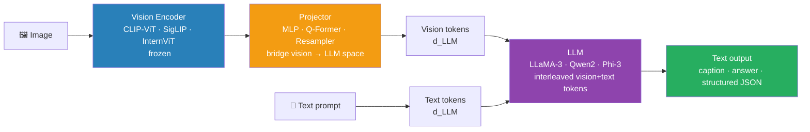

# 07 — Modern VLMs: 2024-2025 Landscape

> Florence-2, Qwen-VL, PaliGemma 2, Phi-3-Vision, MM1, Idefics3. The post-LLaVA-1.5 generation. What each is for.

---

## Table of Contents

1. Objective
2. The VLM architecture in 2024-2025
3. Open-weight VLMs — comparison table
4. Closed-weight frontier VLMs
5. When to use which
6. Failure modes
7. Interview questions (5)
8. Further reading

---

## 1. Objective

LLaVA-1.5 (2023) was the open-source VLM baseline for a year. By mid-2024, half a dozen significantly stronger open VLMs emerged. Senior interview Q: "Which VLM would you use for document AI vs general chat vs edge deployment?"

The user's Document AI background makes this a high-leverage topic — modern VLMs are reshaping how documents are processed.

---

## 2. The VLM Architecture in 2024-2025

The dominant pattern: **frozen vision encoder + projector + LLM**.

```
Image (224×224 or larger)
  ↓
Vision Encoder (ViT or convolutional — typically frozen)
  ↓ patch embeddings (N × 768 or similar)
  ↓
Projector (small MLP or Q-Former)
  ↓ "vision tokens" in LLM embedding space (M = d_LLM)
  ↓
LLM (e.g., LLama-3, Qwen2, Phi-3)
  ↓ text tokens (interleaved with vision tokens)
  ↓
Output text
```



| Model | Vision Encoder | Projector | LLM | Best for |
|-------|---------------|-----------|-----|----------|
| LLaVA-1.5 | CLIP-ViT-L | 2-layer MLP | Vicuna/LLaMA | General VQA baseline |
| PaliGemma 2 | SigLIP-So400m | Linear | Gemma 2 2B-28B | Dense prediction, doc AI |
| Qwen-VL-Max | InternViT-6B | Resampler | Qwen2-72B | Document + multilingual |
| Florence-2 | DaViT | MLP | Florence LLM | Zero-shot detection/grounding |
| Phi-3-Vision | CLIP-ViT-L | MLP | Phi-3 3.8B | Edge/mobile deployment |
| InternVL2.5 | InternViT-6B | MLP | InternLM2.5 | SOTA open benchmark |

### Vision encoder choices

- **CLIP-ViT** — most common (LLaVA, MM1)
- **SigLIP** — replaces CLIP's softmax loss with sigmoid; cheaper, sometimes better (PaliGemma, Idefics2)
- **InternViT** — custom ViT trained at scale (InternVL series)
- **DaViT / Custom ConvNeXt** — Florence-2 uses a hybrid

### Projector choices

- **Linear / 2-layer MLP** — LLaVA-style; simple, works
- **Q-Former** — Blip-2 invented; small transformer; produces fewer vision tokens (faster)
- **Resampler** — Flamingo / Idefics; perceiver-style

### LLM choice matters

- Smaller LLM (1-3B) → more efficient VLM (Phi-3-Vision, PaliGemma)
- Larger LLM (7-70B) → stronger reasoning over images (LLaVA-NeXT-72B, Qwen-VL-Max)

### Training recipe

1. **Pretrain** the projector on image-caption pairs (LAION, CC3M, custom)
2. **SFT** on visual instruction data (LLaVA-Instruct, M3IT, custom)
3. Some models add **DPO/RLHF** for safety + helpfulness

---

## 3. Open-Weight VLMs — Comparison Table

As of mid-2025, the practical open VLM landscape:

| Model | Maker | LLM size | Strengths | Weaknesses |
|---|---|---|---|---|
| LLaVA-1.5 / 1.6 | UW + others | 7B-34B | Mature, well-documented | Plateaued in 2024 |
| LLaVA-OneVision | Bytedance | 7B-72B | Video support, multi-image | Heavy |
| Qwen-VL / Qwen2.5-VL | Alibaba | 7B-72B | Strong on Chinese + English, document understanding | Heavy |
| InternVL 2.5 | Shanghai AI Lab | 1B-78B | Top open-source VLM on most benchmarks (2024-25) | Various sizes available |
| MiniCPM-V 2.6 | OpenBMB | 8B | Strong for size; good at OCR + multilingual | Smaller community |
| Phi-3-Vision | Microsoft | 4.2B | Edge-friendly; runs on smaller hardware | Less general than larger models |
| PaliGemma 2 | Google | 3B / 10B / 28B | Strong document/chart understanding; SigLIP encoder | Less for general chat |
| Florence-2 | Microsoft | 0.23B / 0.77B | TINY (sub-1B); strong on detection, OCR, captioning | Limited "chat" capability |
| Idefics3 | HuggingFace | 8B | Open recipe, transparent training | Behind frontier |
| MM1 | Apple | 3B-30B | Apple's open VLM family | Less community uptake |

### Specialty notes

- **Florence-2**: not a chat model. It's a task-prompted vision model — give it `""` prompt and it extracts text; `""` for object detection. Lighter than alternatives. For document AI: serious contender.
- **PaliGemma 2**: explicit "vision-language model for specific tasks" — not designed for open chat. Excellent for fine-tuning on document understanding.
- **InternVL 2.5**: closest to closed-source frontier (GPT-4V, Claude 3.5 Sonnet) on standard benchmarks. 7B version genuinely strong.
- **Qwen2.5-VL**: best Chinese + English combo. Strong at document understanding. Recently added bounding-box localization.

---

## 4. Closed-Weight Frontier VLMs

| Model | Provider | Strengths |
|---|---|---|
| GPT-4V / GPT-4o | OpenAI | General reasoning, math, code generation from screenshots |
| Claude 3.5 Sonnet / Opus | Anthropic | Document understanding, chart reasoning, complex multi-image |
| Gemini 2.0 Flash / Pro | Google | Long video, multimodal-native (audio, video, image, text in one model) |
| GPT-4o-mini, Claude Haiku | OpenAI / Anthropic | Cost-optimized; ~10× cheaper than flagship |

In 2025, closed frontier > open frontier by ~5-15% on hard benchmarks. Gap closing but real.

---

## 5. When to Use Which

| Use case | Recommendation |
|---|---|
| Document understanding (your domain) | Qwen2.5-VL or PaliGemma 2 fine-tuned, or Florence-2 for specific tasks |
| Receipt / invoice extraction | Donut still strong; new: PaliGemma 2 + structured output |
| OCR specifically | Florence-2 `<OCR>` prompt; or Tesseract + VLM verifier |
| Chart understanding | Claude 3.5 (closed), Qwen2.5-VL (open) |
| Edge deployment | Phi-3-Vision, MiniCPM-V 2.6 |
| Multi-image / video | LLaVA-OneVision, Gemini 2.0 |
| Cost-optimized chat | GPT-4o-mini, Claude Haiku |
| Maximum quality regardless of cost | Claude 3.5 Sonnet or GPT-4o |
| Fine-tuning for narrow task | PaliGemma 2 (designed for it) or Idefics3 (transparent recipe) |
| Chinese + multilingual | Qwen2.5-VL |
| Detection + captioning + OCR in one | Florence-2 (multi-task pretrained) |

---

## 6. Failure Modes

1. **VLM hallucination** — particularly bad at counting objects, reading numbers off charts, parsing tables. Always validate VLM outputs against rules (e.g., extracted invoice total = sum of line items).

2. **Resolution loss** — most VLMs use 336×336 or 448×448 input. Fine print is lost. Solution: high-res variants (LLaVA-NeXT, Qwen2.5-VL support up to 4K) or crop-then-process strategy.

3. **Multi-image OOM** — feeding 10 images = 10× vision tokens. Quickly blows context window. Use frame-sampling or sparse attention.

4. **Domain mismatch** — model trained on natural images underperforms on X-rays, financial docs. Either fine-tune (PaliGemma 2 is designed for this) or pick a domain-specific model.

5. **Latency at high resolution** — high-res VLMs are 2-5× slower than text-only LLMs. Plan for this in real-time use cases.

6. **Inconsistent output format** — VLMs hallucinate field formats. Pair with constrained decoding (outlines) or JSON schema validation.

---

## 7. Interview Questions (5)

**Q1: How does a modern VLM architecture work?**

Three components: (1) vision encoder (typically frozen ViT — CLIP or SigLIP — extracting patch embeddings), (2) projector (small MLP or Q-Former mapping vision tokens to the LLM's embedding space), (3) LLM (decoder-only — Llama, Qwen, Phi) that processes interleaved vision and text tokens. Training: pretrain projector on image-caption pairs, SFT on visual instruction data.

---

**Q2: For your Document AI use case, which VLM would you pick and why?**

PaliGemma 2 if I'm fine-tuning for a specific extraction task (designed for fine-tuning on narrow tasks, SigLIP encoder excellent for document layouts). Qwen2.5-VL if I need strong general document understanding out of the box (handles tables, charts, multilingual). Florence-2 if its pure OCR / detection — much smaller and faster for those specific tasks. Florence-2's task-prompted design is often a better fit than chat-style.

---

**Q3: What's the difference between Florence-2 and LLaVA?**

LLaVA is a chat-style VLM: ask any question, get a text answer. Florence-2 is a task-prompted vision model: special tokens like `<OCR>`, `<OD>` (object detection), `<CAPTION>` switch behavior. Florence-2 is much smaller (< 1B params vs 7B+ for LLaVA), excellent for those specific tasks, but doesn't do open chat. For document AI pipelines, Florence-2's task-prompted design is often a better fit than chat-style.

---

**Q4: When would you choose a closed-weight VLM (GPT-4o, Claude) over an open one?**

When you need top quality for hard tasks (chart understanding, complex multi-image reasoning, code from screenshots); don't have GPU infrastructure, or need fast iteration. Use open VLMs when cost matters (10-100× cheaper per token), latency is critical (no API round-trip), you need to fine-tune, or data privacy requires local deployment.

---

**Q5: How do you fine-tune a VLM for document extraction?**

Start with PaliGemma 2 or Donut (designed for fine-tuning). Prepare (image, extracted_json) pairs — typically 1K-10K examples. Fine-tune with LoRA on the LLM portion (freeze the vision encoder usually). Add structured output via constrained decoding for guaranteed schema. Eval: extraction accuracy on a held-out set + faithfulness check against rules (totals add up, fields have valid formats).

---

## 8. Further Reading

- LLaVA (Liu et al. 2023) — arXiv:2304.08485 — the foundation
- PaliGemma (Google 2024) — arXiv:2407.07726
- Florence-2 (Microsoft 2023) — arXiv:2311.06242
- Qwen-VL series (Alibaba) — arXiv:2308.12966
- InternVL 2.5 (Shanghai AI Lab) — arXiv:2412.05271
- Phi-3-Vision (Microsoft) — phi-3 family release notes
- Idefics3 (HuggingFace 2024) — arXiv:2408.12637
- SigLIP (Zhai et al. 2023) — arXiv:2303.15343 — the dominant vision encoder
