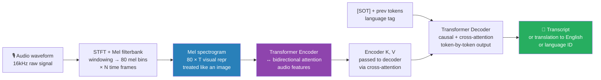

# 08 — Audio Multimodal: Whisper, Audio LLMs, Native Audio Models

> Speech recognition, audio understanding, and audio-aware LLMs. The 2024-2025 frontier.

---

## Table of Contents

1. Objective
2. Whisper — speech recognition baseline
3. Audio LLMs — Qwen-Audio, AudioGPT, etc.
4. Native multimodal — Gemini audio, GPT-4o
5. Text-to-speech (briefly)
6. Failure modes
7. Interview questions (5)
8. Further reading

---

## 1. Objective

Audio is the third modality after text and vision. Most "multimodal" coverage focuses on vision; audio is underrepresented despite massive production use (call center analysis, voice assistants, transcription).

Senior interview Q for AI Engineer roles: "How would you build a speech-to-action pipeline?" or "What's Whisper and where does it fail?"

---

## 2. Whisper — Speech Recognition Baseline

OpenAI's Whisper (Radford et al. 2022) is the de-facto open speech recognition model.

### Architecture

Transformer encoder-decoder. Audio is preprocessed into a mel spectrogram (visual representation of frequencies over time), then treated like an image-to-text problem.

```
Audio waveform (16kHz)
  ↓ (windowing + STFT)
Mel spectrogram (80 mel bins × N time frames)
  ↓
Transformer Encoder (audio → audio features)
  ↓
Transformer Decoder (audio features + text tokens, with cross-attention)
  ↓
Transcript text
```


> Whisper treats audio as an image-to-text problem. The mel spectrogram is the "image"; rest is standard encoder-decoder transformer.

### Sizes

- tiny (39M), base (74M), small (244M), medium (769M), large (1.5B), large-v3 (1.5B improved)
- Quality: large > medium > small > base > tiny
- Speed: tiny ~30× real-time, large ~3-5× real-time on consumer GPU

### Training Data

680K hours of weakly supervised multilingual audio scraped from the web. The scale + diversity is what made Whisper robust.

### Tasks Whisper Does

- **Transcription** (audio → text in same language)
- **Translation** (any audio → English text)
- **Language identification**
- **Voice activity detection** (implicit)
- **Timestamps** (word-level in v3)

### Limitations

- Hallucinations on silence — sometimes generates plausible-sounding text from background noise
- Speaker diarization is NOT built in (use pyannote separately)
- Quality varies by language — top-tier on English/major European languages, weaker on low-resource
- Real-time streaming requires careful engineering (Whisper is batch-oriented)

### Faster Alternatives in 2024

- **Distil-Whisper** — distilled, 5-10× faster, slightly lower quality
- **WhisperX** — adds word-level timestamps + speaker diarization
- **Faster-Whisper** (CTranslate2-based) — 4-10× faster inference

In 2024+, Whisper is the production speech recognition baseline. Distil-Whisper or Faster-Whisper for cost optimization.

---

## 3. Audio LLMs — Qwen-Audio, AudioGPT, etc.

Beyond transcription, "audio LLMs" can reason about audio: classify music genre, detect emotions, describe environmental sounds, answer questions about a podcast.

### Qwen-Audio / Qwen2-Audio (Alibaba)

Architecture: Whisper-like audio encoder + projector + Qwen LLM. Trained on audio QA datasets.
Capabilities: transcription, audio QA, sound classification, music understanding. Open weights.

### AudioGPT (Shen et al. 2023)

Multi-model orchestration: uses LLM as router that calls specialized models (ASR, TTS, audio classification). Not a single model.

### MERaLiON (Singapore) and Others

Region-specific audio LLMs. Most are research projects with limited production deployment.

### Production Reality (2025)

Most production systems use: **Whisper** for transcription + **LLM** to reason about the transcript.

The "true audio LLM" path (skip transcription, reason directly on audio) is research-frontier — quality not yet superior to ASR + LLM for most tasks.

---

## 4. Native Multimodal — Gemini Audio, GPT-4o

The 2024 shift: models trained from scratch to handle audio AS A NATIVE MODALITY (not as a tacked-on ASR layer).

### Gemini 2.0 Flash / Pro (Google)

Native multimodal — audio, video, image, text all in one model. Audio in, audio out (the model can produce speech directly). Audio understanding (no transcription step). Real-time conversation latency (sub-second). Multilingual audio.

### GPT-4o (OpenAI 2024)

"omni" — native multimodal. Real-time voice mode with very low latency (≈ 320ms). Can interrupt, change tone, respond in voice. Uses speech tokens directly — not a transcript intermediate step.

### Why "Native" Matters

Traditional pipeline: speech → ASR (loses info) → text LLM (no audio understanding) → TTS (constructs speech). Native: speech → model (sees audio directly) → response (can be speech or text).

Benefits:
- Lower latency (no waiting for full transcript)
- Preserves prosody, emotion, intonation in input understanding
- Can generate natural speech with appropriate pauses/tone

### Open Alternatives (as of 2025)

Limited. Most open VLMs and audio LLMs still use transcript-intermediate pipelines. Native multimodal training requires massive audio datasets and compute that mostly exists in closed labs.

---

## 5. Text-to-Speech (Briefly)

For completeness — TTS is the inverse direction.

### Open-Source Landscape

- **XTTS (Coqui)** — voice cloning, multilingual, real-time
- **ElevenLabs** (closed API) — currently best quality for English
- **Bark (Suno)** — generative TTS with emotions, sound effects
- **OpenAI TTS** (API) — production-quality, multi-voice
- **F5-TTS** (open source 2024) — flow-matching TTS, strong quality

For production deployments in 2025, closed APIs (ElevenLabs, OpenAI TTS) dominate on quality; XTTS / F5-TTS catch up on open-source side.

---

## 6. Failure Modes

1. **Whisper hallucination on silence/noise** — generates plausible "transcripts" from background hum. Mitigation: VAD (voice activity detection) pre-filter; threshold on logprob to detect uncertainty.

2. **No speaker diarization in Whisper** — can't tell speakers apart. Pair with pyannote.audio for diarization, or use WhisperX.

3. **Real-time latency** — Whisper is batch-oriented. For real-time streaming, you need streaming-capable variants (Faster-Whisper with VAD, or commercial APIs).

4. **Domain-specific vocabulary** — medical terms, brand names, proper nouns get mis-transcribed. Fine-tune Whisper on domain audio, or post-process with LLM-based name correction.

5. **Code-switching** (speakers switching languages mid-sentence) — Whisper's `language` param needs to be set; auto-detection can flap.

6. **TTS hallucination** — generative TTS (Bark) can hallucinate words. Production TTS (ElevenLabs, XTTS) is more deterministic.

---

## 7. Interview Questions (5)

**Q1: How does Whisper work?**

Transformer encoder-decoder. Audio is preprocessed to a mel spectrogram (frequencies over time). Encoder processes audio features; decoder generates text tokens with cross-attention to encoder outputs. Trained on 680K hours of multilingual web audio. Comes in multiple sizes (tiny to large-v3); large is the production default for accuracy.

---

**Q2: How would you build a customer call analysis pipeline?**

(1) Speech-to-text with Whisper or Faster-Whisper (production: large-v3 model). (2) Speaker diarization with pyannote.audio (who said what). (3) LLM analysis of the transcript: sentiment per speaker, key topics, action items, compliance issues. (4) Vector search over historical calls for similar cases. (5) Store transcripts with timestamps for replay. Faster-Whisper for cost; cloud Whisper API for prototyping.

---

**Q3: When would you use a native multimodal audio model (Gemini, GPT-4o) over Whisper + LLM?**

When latency matters (real-time voice conversation — native gives ~300ms; pipeline gives 2-3s). When prosody / emotion / intonation matters (native generates speech directly, transcription drops it). When the user expects voice output (native generates speech directly). For batch transcription + analysis, Whisper + LLM is cheaper and usually sufficient.

---

**Q4: What are Whisper's main failure modes in production?**

(1) Hallucination on silence/noise — generates fake transcripts; mitigate with VAD pre-filter. (2) No built-in diarization — pair with pyannote. (3) Domain vocabulary mistakes (medical, names) — fine-tune on domain audio or post-process with LLM-correct after. (4) Batch-oriented — for real-time streaming, need streaming-capable alternatives.

---

**Q5: What's the difference between Whisper and a true "audio LLM"?**

Whisper does audio-to-text (ASR). True audio LLMs (Qwen-Audio, native Gemini/GPT-4o) reason about audio directly — they can answer "what genre is this music?" or "is the speaker calm?" without needing to first transcribe. The transcription-intermediate pipeline loses information (emotion, prosody) before reasoning on it. In 2025, most production uses Whisper + LLM; native audio is frontier for low-latency voice applications.

---

## 8. Further Reading

- Whisper (Radford et al. 2022) — arXiv:2212.04356
- Faster-Whisper — github.com/SYSTRAN/faster-whisper
- Distil-Whisper (Hugging Face) — arXiv:2311.00430
- WhisperX — adds diarization to Whisper — arXiv:2303.00747
- Qwen-Audio (Alibaba 2023) — arXiv:2311.07919
- GPT-4o blog — openai.com/index/hello-gpt-4o/
- pyannote.audio — speaker diarization library
- F5-TTS (Chen et al. 2024) — modern open TTS
